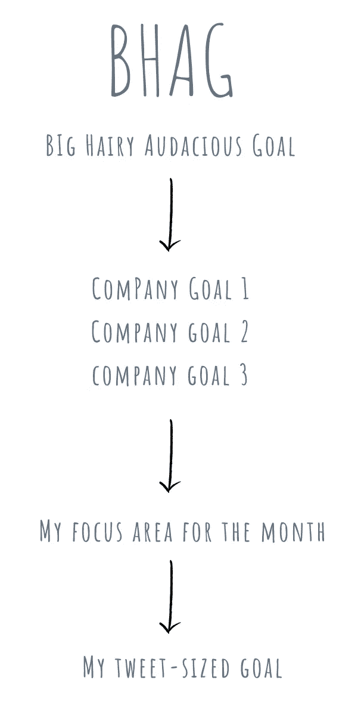
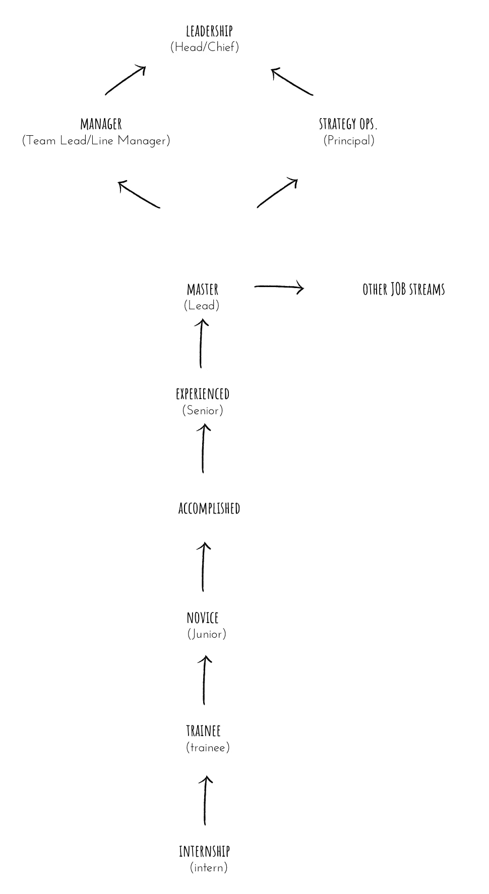

# 人先于产品

> 原文：<https://betterprogramming.pub/people-before-product-36c01469c414>

## 首先培养你的员工，然后产品才会增长

图片来源:作者

增长是大多数组织的生命线。要么成长，要么死亡。指数增长是梦想的东西。还有噩梦。创业公司需要它。投资者要求如此。技术员工必须崇拜它。但是是什么让我们如此渴望成长呢？达到？线索？应用下载？会员资格？月活跃用户？订阅？定期订阅？美元，美钞？

大部分增长集中在产品牵引上。拼命想把你向投资者承诺的曲棍球棒曲线变成现实。但是你真的能独自做到吗？也许你可以，但是你是一只没有腿的孤独的企鹅。反正我也不相信你。

所以你需要人(或者企鹅，任何能让你成长的东西)。好人。而优秀的人需要什么？你猜对了——成长。个人和职业成长。如果你不给他们这些，他们将会挨饿——感到不被认可，经常不满，并且不会发挥出最佳水平。或者干脆离开，另寻出路。因此，你的产品增长将停滞或死亡。

因此，这里有五个步骤来创建一个以人为本的产品增长组织。

# 1.忘了 OKRs 吧

OKRs 可以工作。在绩效驱动的组织中，目标和关键结果方法可以推动增长。但它不是银弹。这需要重大的文化变革。将 OKRs 改造成一个已经建立了 KPI 文化、年中和年终绩效评估以及薪资和晋升谈判的组织，是一项艰巨的任务。还有其他类似但更受欢迎的方式来推动增长。

OKRs，但不是

## 第一步。BHAG

为你的公司设定一个大胆的目标。不是一个模糊的愿景声明，而是一个有形的，可衡量的目标。让你的灵魂燃烧的东西。你知道你能做到，但前提是你真的敢做。如果你做到了，向每个员工承诺一定比例的加薪。

## 第二步。翻译 BHAG

作为一家公司，今年你需要做哪三件事才能让你离 BHAG 更近一步(或九步)？把这些写下来。保持简单。如此简单，以至于每个员工在被问到的时候都应该能够背出这些问题。

## 第三步。影响、主动性和成长

在你的团队或组织中工作的每个人都需要有影响力，表现出主动性，并花时间投资于他们自己的技能，以不断增加价值。所以给每个人一个这样做的机会。每个月，要求每个人选择一个重点领域:影响、主动性或成长。

**影响:**做一些对公司年度前景有直接可见影响的事情。

**主动性:**发现需要改进的人或事，并采取措施去实现。

**成长:**学习新的东西或者投入时间和精力发展新技能。

每个人选择的焦点区域必须与他们前一个月选择的不同，每个人必须每三个月循环一次。为什么？因为增长总是退居二线。总有无数的事情需要你立即关注。成长于是变成了一种“美好的享受”因此，确保每三个月，组织中的每个人都花时间反思并投资于自己的发展。

在这个重点领域内，每个人都可以为自己定义一个目标。保持推特大小。这个想法是使这个过程尽可能精益，并在整个组织中保持对年度视野和 BHAG 的关注。

就是这样。一个全公司范围的 BHAG 转化为三个公司年度范围，并进一步分解为每月的个人重点领域。

但这与个人绩效评估和晋升有什么关系呢？我们继续吧。

# 2.废黜老板

你不是我的老板

忘掉直线经理吧。给你团队或组织中的每个人一个教练。教练意味着这个人不是来管理你的，而是来帮助你学习和成长的。给予教练足够的权力和自主权，以积极影响员工的表现，但剥夺任何对其成长产生负面影响的权力。通过让绩效成为同行评审的过程来做到这一点。

作为选择每月重点领域(影响力、主动性或成长)和定义一个 tweet 大小的目标的一部分，每个人还必须选择两到三个同事，在月底向他们提供进度反馈。教练的角色是帮助他们实现目标——建立联系，引导资源，集思广益，消除障碍。在月末，教练收集来自被提名同事的反馈，并进行回顾，然后帮助他们的直接下属选择新的重点领域和定义新的目标。

你可以在教练和他们的直接下属之间添加一个季度或半年回顾。这是每个人反思自己在过去几个月的表现并从同事那里获得更全面反馈的机会。在这里，教练还可以讨论个人的发展抱负，并制定具体的计划来帮助他们的直接下属提升到下一个级别。

好极了。现在，在我们谈论晋升之前，我们先来谈谈成长之路。在一个组织内的提升首先需要一个清晰的成长层级。

# 3.建立等级制度，但要公平竞争

每个集体都需要某种形式的等级制度来有效运作。但是,*等级*这个词充满了负面含义。你真正需要的是增长水平。有些武术有腰带。这在一家科技公司可能不太管用，但学徒级别确实管用。

学徒级别和职称描述符

如果你认为合适，你可以添加更多的级别。最重要的是，每个级别都应该有明确定义的技能、期望和责任。同样的标准应该适用于你组织中的每个人，不管他们是在市场营销、产品、设计还是工程部门工作。这可能是一个困难的推销，因为通常特定的技术技能很难获得，所以你可能更看重它们。但这个值是主观的。是的，如果没有优秀的软件工程师，你就无法构建一个好的、可扩展的技术产品。但是，如果没有好的产品宣传员，你也无法销售技术产品。产品增长需要这两种技能。所以要创造公平的竞争环境，如果你雇佣了一个营销人员，那么就要学会像对待本地开发人员一样重视他们。

一旦你创建了这个增长层次，让它变得透明和有形。你组织中的每个人都应该知道他们的水平，以及他们需要做些什么来提升或毕业到下一个水平。例如，一个软件工程师新手如果学习了 Java，如何处理错误和编写单元测试，就可以进步到熟练。如果一个成功的产品经理能够展示出用简单的商业语言向一系列利益相关者表达技术概念的能力，他就可以晋升为有经验的产品经理。

不管别人怎么说，职称很重要。它们指的是决策权并授予地位。人们关心他们的职称。所以给每个级别附加一个职位描述符是个好主意。

你看到你做了什么吗？你为组织中的每一个人创造了成长的道路。给自己一个鼓励。现在让我们继续沿着这条黄砖路走下去。

# 4.基于提名提升

那么，一个人实际上是如何得到提升的，或者在我们的情况下，是如何从一个级别升到另一个级别的呢？在传统的组织中，你可以每六个月或者一年进行一次绩效评估。这是一次令人恐惧的经历，没有人会感到特别开心。因此，如果我们有每月的个人重点领域和推文大小的目标，由同行评审，以及每月的回顾，也分享来自同行的反馈…你明白我的意思了。

任何人都可以提名他们的任何同龄人晋级下一级。另外两个人必须支持这一提名。就是这样。被提名者晋升并获得一个新的职位和一个自动的、预先设定的加薪。接下来我们讨论后者。

# 5.停止所有薪资谈判

谈判有利于自信、善于表达的人，他们知道如何辩论和改变措辞。毫无疑问，这些都是很好的技能，但是当涉及到薪水谈判时，这意味着安静的成功者往往会抽到短稻草。此外，性别起着重要作用，导致了显著的性别薪酬差距，尤其是在科技行业。所以让我们停止工资谈判，用一个公平的工资公式来代替。

用上面的公式计算每个新员工的工资。*基数*是您根据您所在地区的负担能力和需求决定的起薪。*价值观*是指你要雇佣的人的信念和行为与你所在组织的宗旨和价值观有多一致。一般来说，雇佣符合价值观和文化的人。创建一个简短的调查，要求每个面试候选人的人填写他们对候选人价值观契合度的看法。在你的公平薪酬公式中使用平均分数。对于*的精通程度也是如此。*

精通水平表明新员工在你的组织中的水平——从实习生到领导。这个最终值应该是公式中唯一可以协商的部分。如果候选人对你根据这个公式给出的提议不满意，那么允许他们说服你他们的*掌握水平。这使得讨论的是他们是否适合这份工作，而不是他们的实得工资。大多数人在谈判这个问题时会轻松得多。*

前面的所有步骤都清楚地表明，与您的核心价值观和目标一致的绩效是您组织中每个人的期望。如果有人表现不佳，他们的同事应该也将会追究他们的责任。这意味着，只要你的组织继续发展，所有员工的年度加薪都应该是有保证的，无需协商。为了公平起见，设定一个适用于组织中每个人的预定义百分比。如果一个表现不佳的人仍然坚持你的组织价值观，并努力实现其目标，那么他们通常应该得到第二次机会。否则，分道扬镳。

# 摘要

图片来源:作者

你的产品的成长与你的员工的成长和成功有着内在的联系。一个促进成长和发展的组织将培养出茁壮成长、迎接挑战并相互负责的个人。这创造了一个普通人可以成就非凡的环境。

1.  设定一个公司 BHAG 和几个简短的、令人难忘的年度目标。将这些转化为每月同行评审的个人重点领域和推特规模的目标。
2.  给每个人一个教练，帮助他们在你的组织中成长和进步。
3.  创建学徒级别，并明确每个级别的期望。
4.  让晋升建立在同事提名的基础上。
5.  根据公平的薪酬方案设定薪酬，协商适合工作的薪酬，而不是实得薪酬。

就是这样。我知道不容易，但领导很少是这样的。如果很容易，每个人都会去做。

从一个人到另一个人，感谢阅读。很情绪化。图片来源:作者

感谢 Pieter Waller 和 Gideon van Dijk，他们帮助形成了上面的许多想法。为我们不小的实验继续成功干杯！