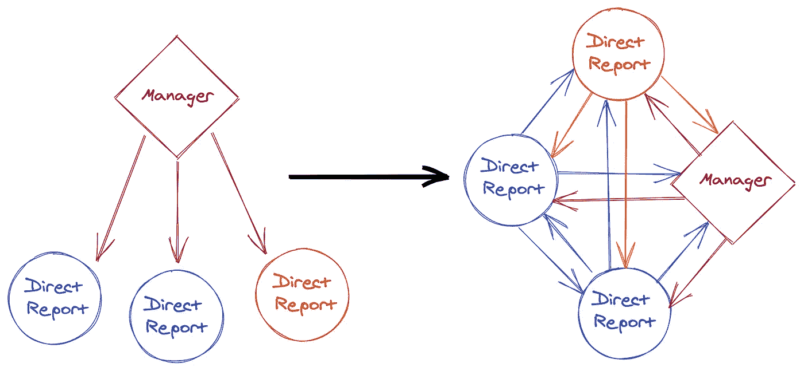

# 个人用户手册——好的、坏的和模板

> 原文：<https://betterprogramming.pub/personal-user-manuals-the-good-the-bad-and-the-template-7b80db5044ea>

## 什么是个人用户手册，它如何帮助改善你的团队？

在 [Unsplash](https://unsplash.com?utm_source=medium&utm_medium=referral) 上由 [Russ Ward](https://unsplash.com/@rssemfam?utm_source=medium&utm_medium=referral) 拍摄的照片。

人生的三分之一是和同事一起度过的。编写个人用户手册是一项小小的时间投资，可以为你的团队带来巨大的回报——更不用说它是一个自我反思的好工具。

如果你已经确定要写一本个人用户手册，那太好了！这里有一个[模板](https://github.com/camin-mccluskey/Personal-User-Manual-Template)你可以使用，它是在阅读了许多这样的文档后由你的真诚精心制作的。

您可以根据自己的需要对其进行调整，并按照说明将其作为网页发布给全世界！查看一个[示例](https://camin.xyz/personal-user-manual/)。

如果你不知道什么是个人用户手册，或者你正在犹豫是否要写一本，那么这篇文章就是为你准备的。

# 背景

一段时间以来，管理人员编写个人用户手册或自述文件并提供给他们的直接下属的概念一直存在。这个想法是，新加入者可以通过接受一个关于他们经理个性各个方面的指导方针而迅速加入。常见部分包括工作时间、首选联系方式、一对一指导和个性怪癖。

然而，只有*的*经理编写这样的文档存在问题:

1.  它将适应性的负担放在了直接下属身上。理想情况下，管理者应该适应他们所管理的人的个性。
2.  如果直接下属误解了他们经理的自述，或者自述不准确，由于关系中固有的权力动态，受害的可能是直接下属。
3.  它像组织图一样模拟交互。事实上，团队中的每个人都有一种双向关系，这种关系是有价值的，值得培养。

当每个人都分享他们自己的偏好、动机和工作方式时，团队中每个人之间的关系就会变得更好。

在我们更进一步之前，我想说“用户手册”这个术语感觉有点机械和不近人情，而“自述文件”只有在你理解对自述文件编程的引用时才有意义。如果你对这种类型的文档应该叫什么有更好的建议，请在评论中告诉我！

# 每个人的个人用户手册

考虑到以上几点，如果经理和他们管理的人愿意，他们没有理由不写个人用户手册。这样做，我们就能获得只有经理们能表达自己的利益。

*   我们将经理和直接下属之间的关系视为双向的(事实如此)。
*   我们将适应性的负担转移回直线经理身上。
*   我们尊重*所有*员工之间的关系与直线经理和他们的直接下属之间的关系一样重要。

# 这一切对我来说似乎有点太私人了

这是我第一次听到这个想法时的确切反应。我并不特别热衷于写一篇纯粹关于我自己的文档！

做完这件事之后，我可以说我发现它作为一种自我反省的工具比其他任何东西都更有帮助。我现在更好地理解了我工作的动机，我如何以及何时做得最好，以及我的盲点是什么。与我的经理和同事分享它只是一个额外的奖励(你不一定*需要*迈出这一步)。

然而，我想提出一个平衡的论点，因为在你的团队中编写个人用户手册可能会适得其反。出于这个原因，我借用了开源软件库中的一个想法，即创作者为他们的产品提供一个推介和一个反推介。

# 球场

## 1.这是让新员工加入团队的好方法

当有人加入团队时，总是需要一些时间去了解他们。他们工作风格的某些方面可能相当明显(比如他们每天需要什么时候离开办公室，或者他们是否喜欢独自工作，而不是和整个团队一起围着白板工作)。其他事情可能需要更长的时间才能弄清楚——如果你能弄清楚的话。例如，他们正在做的工作的动机是什么，或者他们如何处理压力或冲突。

个人用户手册简化了这一过程。为什么要等几个月才知道莎拉更希望你让她放松一下，而不是到她办公桌前讨论即将做出的决定的利弊呢？另一方面，对于加入的人来说，阅读每个人的用户手册是一个很好的方式来了解每个人是谁，是什么让他们这样做的。

## 2.他们设定期望

没有“正确”的工作方式。有些人喜欢在晚上工作，而不是在早上，或者更喜欢一个松散的线程。个人用户手册让你明确地陈述你的偏好，帮助他人理解你喜欢如何工作。此外，他们可以给你一个解释你偏好背后的“为什么”的机会，帮助每个人更好地相互理解。

## 3.他们提供了一个分享你个性特征的机会

这通常是不明确的。了解一个人主要是一个试错的过程。分享你的性格特征可以帮助别人理解为什么你会以某种方式行事或表现出对某种工作方式的偏好。这也给了人们他们需要的信息来适应你这个人。

## 4.它们是自我反省的工具

在撰写个人用户手册时，你应该尽可能诚实地展现自己的个性。自我反省并问问自己是否真的符合你对自己的期望是很好的。即使你从来没有和任何人分享过这个文档，仅仅因为这个原因，写作的过程也是非常有益的。

## 5.他们有助于提高球队的心理安全水平

根据艾米·埃德蒙森(Amy Edmondson)的说法，心理安全“指的是个人对承担人际风险的后果的看法，或者在被视为无知、无能、消极或破坏性的情况下，团队承担风险是安全的。”最有效的团队是心理安全水平高的团队。

个人用户手册让每个人都有机会解释什么最适合他们，并表达他们的独特之处。你的可以是私人的，也可以是正式的，只要你觉得舒服。然而，让它变得更加个人化，而不仅仅是表达对 Slack 而不是电子邮件的偏好，会让每个人都有机会更深入地了解你。增加团队中的理解水平增加了每个人感受到的心理安全感。

# 反沥青

## 1.如果你写的不准确，可能会对人际关系有害

如果你以一种特定的方式描绘自己，然后以一种与此不一致的方式行动，或者以一种与你写的一致的方式对待你的人，你的用户手册伤害了你的关系——而不是帮助它。

说明这一点的一个常见例子是，A 写道他们*总是*乐于接受反馈。如果当 B 给了他们负面的反馈时，他们表现得很冷淡或者反应不好，那么这个人就失去了再次接受 B 反馈的机会，并且在这个过程中破坏了关系。

我知道我在自己的用户手册中写了这句话。事实是负面反馈仍然有点刺痛。为自己的能力和工作辩护是很自然的。所以我仔细研究了一下。现在我说，“我愿意接受直接的、建设性的批评和反馈。”这可能有时仍会刺痛，但总的来说，我知道我对提高的渴望超过了对自己能力的不安全感，我可以一直努力减少负面反馈。

## 2.它们可以被用作总是以特定方式行动的借口

人类行为太过复杂，无法在 A4 纸的一面上进行编纂。这取决于你是否在早上喝了一杯咖啡，一个截止日期是否快到了，以及一大堆其他的事情。随着你的学习和成长，它也在不断变化。如果你在网上搜索经理里姆斯，你会发现很多类似“我永远不会”和“我总是会”的例子。这两种说法都远没有作者想象的真实，也没有给情境因素留下多少空间。没有人每次的行为都是一样的。

虽然写下你的个性和行为的绝对价值可能很诱人，但试着在它们周围添加一些警告或背景的细节。

同样，行为或怪癖通常是可以改进的——尤其是那些不太“令人满意”的行为，比如“有时候，我很健忘”你仍然可以努力克服健忘的怪癖。你不必写下来，然后得出结论，现在每个人都意识到你可能忘记了什么。

## 3.期望有人阅读我写的关于我自己的文件是不是有点浮夸？

回避谈论自己是很自然的。毫无疑问，你的个人用户手册绝对应该突出你个性的所有优点。但是，请记住:

*   如果你觉得不舒服，可以不分享。你还可以考虑是否愿意只与你的经理(或直接下属)分享，而不与其他人分享。
*   如果你写了一个并与人分享，你就有义务阅读你团队中任何选择写这个的人的用户手册。如果你要求别人为你做出调整，你有礼貌为他们做出调整，这才公平。

## 4.它们是有抱负的，而不是准确的

人们*希望*如何行动和他们*实际上*如何行动是有区别的。当你自我反省的时候，往往更接近前者。这是一个不幸的事实，你唯一能做的就是尽可能诚实直率地面对自己。你也可以考虑把它分享给你信任的人，让他们给出坦诚的意见。

## 5.像所有文件一样，它们已经过时了

人会变的。例如，在面对生活事件时，个人性格会发生很大的变化，但首选的工作习惯会发生很大的变化。如果您致力于这份文档，那么保持它的更新是非常重要的。

# 结论

如果你选择写一本个人用户手册，希望这已经概述了个人用户手册的好处，同时提供了对常见陷阱的公平评估。

同样，如果您想创建自己的模板，您可以使用这个[模板](https://github.com/camin-mccluskey/Personal-User-Manual-Template)开始，甚至可以将其作为一个网页，方便地与现在和未来的同事分享！你可以看看[矿](https://camin.xyz/personal-user-manual/)找点灵感。