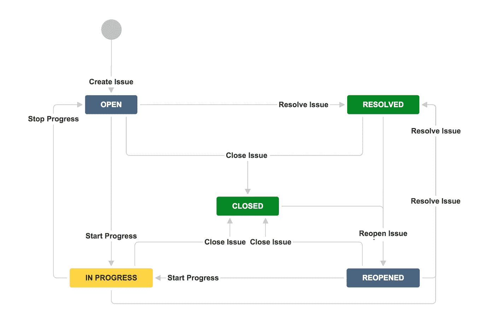
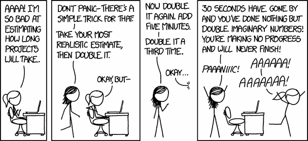

# 问题跟踪透视

> 原文：<https://betterprogramming.pub/perspectives-on-issue-tracking-5d001e1b6583>

## 分析问题在软件工程中的作用

潘卡杰·帕特尔在 [Unsplash](https://unsplash.com?utm_source=medium&utm_medium=referral) 上的照片

bug、问题、标签:它们有许多名字，但服务于同一个目的——跟踪需要完成的任务。这是科技行业项目管理的生命线，没有任何事情是不被跟踪的。而且，像大多数发明的概念一样，它只是我们思考任务的固有方式的形式化。

自从我们开始一起狩猎以来，人类可能一直试图量化工作。但是现代项目管理可以追溯到 1911 年，当时弗雷德里克·泰勒出版了[科学管理原则](https://www.marxists.org/reference/subject/economics/taylor/principles/)，旨在将个体工人的工作系统化，以最大化企业的产出。

泰勒的目标是美国钢铁行业的工人，基于他们没有满负荷工作的信念。他促进了时间研究在不同的工作方式上的应用，比如敲打热铁。如果有一种特殊的罢工方式比其他方式更快，每个工人都会被指示这样做。他声称这提高了公司的整体生产率，导致了工人工资的增加。

同样，今天的问题追踪者试图通过将工作原子化为可追踪的问题，将创建软件的有机过程转变为结构化的、可管理的科学。有很多工具可以帮助你跟踪这些问题:JIRA、Github 问题、Bugzilla 和 Asana 等等。如果你喜欢，你甚至可以使用普通的旧便笺条。

在寻求开拓市场份额的过程中，这些工具的多样性出现了爆炸式增长。然而，基础结构基本上保持不变。

# 问题的基本原理

为了理解这个问题的特征，让我们看看问题跟踪者是如何建模的。

*   发布跟踪**唯一**工作项目，许多跟踪程序支持显式重复数据删除[操作](https://help.github.com/en/articles/about-duplicate-issues-and-pull-requests)。
*   问题往往有明确的**归属**责任；跟踪器有时支持多个[角色](https://confluence.atlassian.com/adminjiracloud/managing-project-roles-776636382.html)。
*   追踪器允许你通过将问题分成组件、热点列表、冲刺、发布、积压等等来组织问题。
*   问题也可以彼此**关联**，就像显示依赖关系的阻塞关系。或者父子关系，这可以用来创建工作项的[层次](https://www.atlassian.com/agile/project-management/epics-stories-themes)。
*   问题经历一系列的**状态转换**，从最初创建时的*打开*，到完成或不再相关时的*关闭*。一些追踪器甚至允许你定义定制的[工作流](https://confluence.atlassian.com/adminjiracloud/issue-workflows-844500760.html)来管理这个生命周期。

问题生命周期

管理这个生命周期的过程很大程度上是由团队遵循的软件开发方法决定的。如果你在 2019 年读到这篇文章，很有可能你的团队遵循了某种敏捷[方法的变体。浏览 LinkedIn 上的热门标题会告诉你，现在是进入认证 scrum masters 的好时机。](http://agilemanifesto.org/)

尽管追踪器的数据模型基于这个简单的结构，但是他们会根据意图改变呈现给用户的方式。在不断增长的用户需求和基本市场力量的推动下，问题跟踪器已经发展成为复杂的工具，通常有多种用途。

# 作为规划工具的问题

从建造奢华的纪念碑到日常通勤，规划在人类活动中无处不在。当开始实现一个目标时，我们本能地预测未来，并准备一个行动计划。沿着这些思路，跟踪预期工作的问题可以被看作是在开始执行之前帮助划分问题空间的工具。

方法论的选择在很大程度上决定了规划的方法。由于敏捷鼓励软件开发的迭代方法，问题更多地是按需产生的，并且具有相对较短的生命周期。建议团队保持灵活性，并快速响应反馈。由于计划容易改变，进一步充实任务的细节就没什么用了。

问题通常有一个专门的字段来存储任务工作量的估计，比如[故事点](https://www.mountaingoatsoftware.com/blog/what-are-story-points)。该字段中的值代表一名**理想**工程师完成任务所需的不间断工作的大致时间。问题和评估提供了一个有助于资源分配和跟踪项目进度的概述。没有什么比燃尽图更能给平淡无奇的高管状况报告增添趣味了。

然而，精确的估计是一项棘手的工作。行为科学早就知道[计划谬误](http://web.mit.edu/curhan/www/docs/Articles/biases/67_J_Personality_and_Social_Psychology_366,_1994.pdf)，即我们往往会大大低估我们的任务完成时间。也许不出所料，社会科学家在我们的预测中发现了演员和观察者的不同。在估计别人的完成时间时，我们倾向于保守得多。下次你做评估时，让你的队友保持诚实可能是个好主意。

人们也很容易陷入沉迷于评估准确性的陷阱，而忽略了他们最终服务的目的。

相关 [XKCD](https://xkcd.com/1658/)

# 作为任务列表的问题

到了执行的时候，给人们一个整洁的任务列表来开始工作是很方便的。将问题分配给某人会让他们对进展负责。然而，一个人通常会有多个任务分配给他们，选择正确的任务是一个两难的选择。

并非所有的工作都是平等的，有些任务肯定比其他任务更重要。为了表明这一点，跟踪器允许您指定问题的优先级，并按排序顺序显示问题。科技行业的大多数人都熟悉分类的过程:根据重要性对 bug 进行排序。它在很大程度上借鉴了医疗分流的过程，这一过程可以追溯到拿破仑在埃及和叙利亚的失败战役。

在此之前，军官的资历通常决定了医务人员如何对待他们。面对资源的极度紧张，“拿破仑分流”优先处理那些可以被送回战场的士兵。这后来演变成一种系统，根据病情的严重程度而不是病人的等级来分配医疗资源。

虽然 bug 分类的后果不那么严重，但同样的原则也适用。应该根据客观的严重性度量来区分问题的优先级，而不是主观的价值判断。

# 作为交流媒介的问题

尽管普遍认为所有的技术人员都是厌世者，但是日常的软件工程是非常社会化的。在我们居住的高度专业化的世界里，分享信息对我们的工作至关重要。随着时间的推移，普通员工可用的通信工具数量稳步增长。

当谈到分享一项任务的发现或进展更新时，选择正确的渠道和确定适当的目标受众可能是一个挑战。还有分散的问题，这使得对某个特定任务的讨论更难集中。为了帮助解决这个问题，追踪者支持对问题进行评论。

从表面上看，这似乎只是通过增加可能的选择来加剧问题，但还有更深层次的东西在起作用。博弈论者研究协调博弈，在这种博弈中，参与者通过选择相同的行动来最大化他们的收益。他们观察到，没有先前历史的玩家倾向于围绕[谢林点](https://mindyourdecisions.com/blog/2008/04/01/focal-points-or-schelling-points-how-we-naturally-organize-in-games-of-coordination/)聚集他们的选择，这是语义突出的选项。一个问题提供了一个焦点，不协调的参与者可以将他们关于正在进行的任务的讨论锚定在这个焦点上。

# 作为知识库的问题

为与任务相关的事物提供一个集中的协调场所也简化了搜索信息的过程。其他工具，如版本控制系统，通常与问题跟踪器集成在一起，并将它们的事务对象(如代码更改)链接到问题。与一个问题有关的评论和其他项目的综合记录构成了一个组织记忆的组成部分。

关于一个问题的行动年表也为连贯的[叙述](https://www.communicationtheory.org/the-narrative-paradigm/)提供了基础，围绕一个任务编织一个故事。这些故事让我们能够通过事件和情境化的决策来进行游戏。这在验尸时特别有用。在此类调查中，问题历史对于追踪元凶和找出问题的确切原因是非常宝贵的。

# 作为未偿债务发行

当一个问题被创建时，有一个隐含的期望，即潜在的任务将在未来完成。因此，思考问题的另一种方式是承诺在某个时候交付某些东西。这听起来非常类似于任何持有信用卡的人都必须熟悉的一个概念——债务。

就像本金的利息一样，发行时间越长，成本就越大。例如，如果问题跟踪了代码健康状况的改善，那么使用代码库的开发人员就要支付在进行更改时必须处理坏代码的运行成本。

不过，我们必须小心不要把这个类比延伸得太远。有人曾经告诉我，有一个团队有太多开放的 bug，决定宣布 *bug 破产——*关闭所有未分配的 bug。起初这似乎是一个很棒的主意，但是在几个星期内，他们有几乎和以前一样多的错误。仅仅解决症状并不能治愈真正的疾病！

问题从来不在于虫子本身；它们仅仅代表了软件与理想状态的对比。在没有修改理想状态的情况下关闭 bug 不会改变所需的工作量；它只是暂时抹去了人们为规划实现理想的步骤所付出的努力。

# 凡事适可而止

问题跟踪是一个方便的工具，但也容易被过度使用。我们必须记住，大多数指导人类努力的尝试都赞同对人性的一种略微对立的观点。有一个潜在的假设，人们不会做正确的事情，直到他们被明确指示，这不一定是真的。

> 个人和交互胜过过程和工具。
> ——**敏捷宣言**

科学管理也带有强烈的现代主义思想的暗流，即相信所有的自然过程都可以通过技术来优化。正如詹姆斯·斯科特在他的书[看起来像一个状态](https://yalebooks.yale.edu/book/9780300078152/seeing-state)中所说，对于专注于优化的规划者来说，我们有机做事方式的微妙之处并不总是显而易见的。

在一个靠出售技术解决问题来支付账单的行业工作时，记住这一点尤其重要。过度规定员工应该如何度过他们的时间剥夺了他们的自主权，增加了他们的单调感。有时候，相信人们在没有过多监督的情况下完成他们的工作并不是一个糟糕的想法。