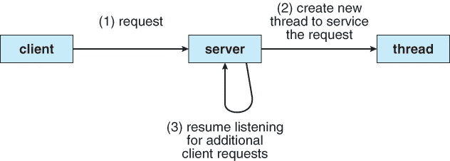
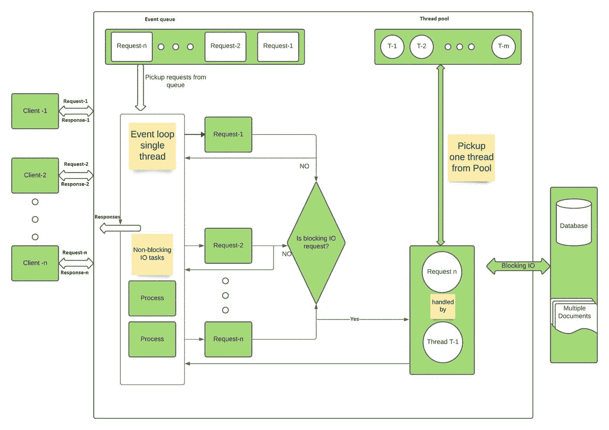
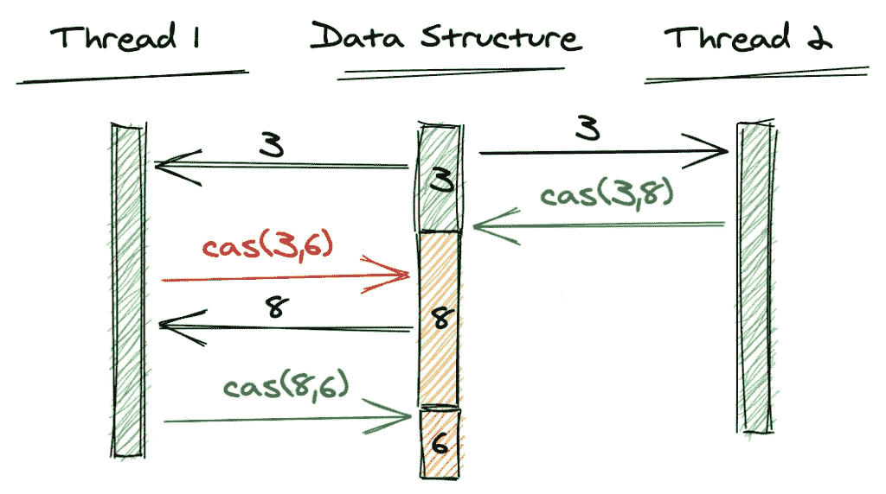
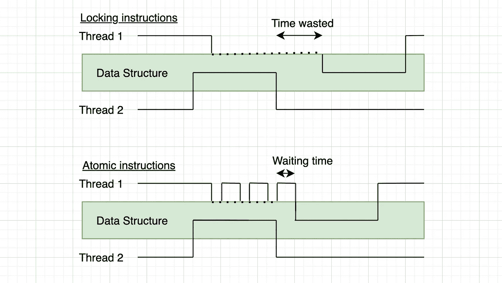

# 多线程程序的陷阱和使用 Golang 实现线程安全

> 原文：<https://betterprogramming.pub/pitfalls-of-multithreaded-programs-and-achieving-thread-safety-using-go-1ac80c8d8106>

## 有没有想过为什么 Node.js 单线程？并发与并行、竞争条件、死锁、饥饿、锁定(互斥)、信号量、原子、比较和交换 CAS 等等。


约翰·安维克在 [Unsplash](https://unsplash.com?utm_source=medium&utm_medium=referral) 上的照片

# 什么是多线程？

*(为了更好地理解，我推荐从本文中快速回顾一下什么是线程和进程:* [*进程和线程的区别*](https://truongnmt.medium.com/difference-between-process-and-thread-479986d15bb6) *)*

线程是进程中最小的执行单位。每个进程从一个线程开始，通常称为主线程，但是可以从任何线程创建其他线程。


多线程进程在单个进程中有多个线程，每个线程都有自己的程序计数器、堆栈和一组寄存器，但共享公共代码、数据和打开的文件。

## 使用多线程进程的动机

在现代编程中，每当一个进程有多个任务要独立执行时，线程就非常有用。当任务之一可能被阻塞，并且希望允许其他任务继续进行而不被阻塞时，尤其如此。

例如 web 服务器，多线程允许同时处理多个请求，而不必按顺序处理请求或为每个传入的请求分配单独的进程。(后者是在开发线程概念之前这类事情是如何完成的)。守护进程将在一个端口上监听，为每个要处理的传入请求分出一个子进程，然后返回监听该端口)。



多线程服务器架构

## 利益

*   **响应能力**
    当其他线程被阻塞或忙于处理密集型计算时，一个线程仍然可以继续运行。
*   **资源共享**
*   创建和管理线程(以及它们之间的上下文切换)比为进程执行相同的任务要快得多。
*   **可扩展性，即多处理器架构的利用** 一个单线程进程只能在一个 CPU 上运行，无论有多少个可用的 CPU，而多线程应用的执行可以在可用的处理器之间拆分。

# 并发性与并行性

对于多线程进程，它是并发运行还是并行运行？
要回答这个问题，首先我们来了解一下这两个术语的区别。

例如，我们有一个复杂的问题，并把它分解成更小的部分。同时执行那些较小的问题*就是并行。*

*另一方面，并发是指同时处理(而不是做)许多事情的能力。这是我们*构建*的方式，将问题分解成独立的组件，这使得它能够*潜在地*并行运行。一旦我们分解了问题，我们就可以使用或不使用 并行来执行那些问题 ***。并行不是并发的目标，并发的目标是一个好的结构。****

*如果你运行一个操作系统，它可能有一个鼠标驱动程序或键盘驱动程序，显示驱动程序，网络驱动程序，或其他任何东西。这些都是由操作系统作为内核中独立的东西来管理的。但是这些是同时发生的事情，它们不一定是平行的。如果你的 CPU 只有一个处理器，那么每次只有一个处理器在运行。*

*单个处理器上的多线程给人以并行运行的错觉。事实上，处理器通过使用调度算法在线程之间切换执行，从而导致并发执行。在给定的时间，只有一个线程正在取得进展。线程之间的切换发生得足够快，以至于线程可能*看起来*同时运行。*

> *…这种上下文切换通常发生得足够频繁，以至于用户认为线程或任务是并行运行的(对于流行的服务器/桌面操作系统，当其他线程正在等待时，一个线程的最大时间片通常限制在 100-200 毫秒)。
> (线程(计算)——[维基百科](https://en.wikipedia.org/wiki/Thread_(computing)#Single-_vs_multi-processor_systems))*

*在多处理器环境中的同一个多线程进程中，每个线程可以在一个单独的处理器上并发运行，导致并行执行，这是真正的同时执行。当线程数量小于或等于可用处理器数量时，操作系统会确保每个线程运行在不同的处理器上。*

**

*并发性与并行性—由 [Baeldung](https://www.baeldung.com/cs/concurrency-vs-parallelism) 制作的图像*

***后续问题:** node . js 如何用单线程处理并发请求？*

*让我们退后一点，问问我们自己。尽管多线程有这么多好处，为什么 Node.js 使用单线程，而且一次只处理一个请求呢？*

*首先，我们应该了解大多数 web 应用程序/服务是做什么的。对于带有数据库的典型 web 应用程序，处理请求的流程如下所示:*

```
*user do an action
       │
       v
 application start processing action
   └──> make database request
          └──> do nothing until request completes
 request complete
   └──> send result to user*
```

*需要主动注意的部分称为 CPU 活动时间，因为它需要 CPU 主动花时间思考和计算结果。它需要一个线程来处理。*

*不需要主动关注的部分被称为 IO(输入输出)，因为它需要等待其他东西提供输入或发送输出。IO 的例子包括等待从文件系统中读取文件，等待向另一个服务器发出网络请求，甚至只是等待时间过去。*

*想象一下，在一个多线程的 web 服务器中，我们有 100 个并发请求，web 服务器为每个请求产生 100 个线程。虽然这些线程可能必须等待来自数据库的 100 个回复，但是 CPU 活动时间为零。IO 的并行性不受线程的限制，因此 100 个线程与 1 个线程一样高效。相反，IO 并行性受到 IO 设备的限制，例如:网卡的数量。因此，如果我们增加线程数量，性能可能不会像我们预期的那样提高。*

*Node.js 所做的是，当请求等待 IO 时，它通过切换到处理其他请求来节省时间。这就是 Node.js 所说的非阻塞 IO。Node.js 在处理所有其他请求之前不会等待一个请求完成。这意味着默认情况下 Node.js 中的所有请求都是并发的，它们不会等待其他请求完成。*

*IO 部分呢？你可能会问。Node.js 的内部库`libuv`将处理 IO。在这个引擎盖下，`libub`实际上是一个线程池，每个 IO 请求都由线程池中的一个线程处理。*

**

*Node.js app/server 单线程事件循环模型—图片由 [GeeksforGeeks](https://www.geeksforgeeks.org/why-node-js-is-a-single-threaded-language/) 提供*

*总之，选择一个 web 服务器应该取决于我们正在处理什么样的请求。不进行 CPU 密集型操作的单线程 Node.js 服务器可以运行数千个并发连接，性能优于基于线程的服务器(每个请求一个线程)。*

# *多线程程序的问题*

*对于多线程程序，多个线程可以并发或并行运行同一段代码。它可以以“线程安全”或“非线程安全”的方式运行。接下来，我们将弄清楚这些问题是什么，以及如何避免它们。*

## *线程安全*

*线程安全是一个概念，意味着不同的线程可以访问相同的资源，而不会产生不可预知的结果，如竞争条件或死锁。*

*让我们看一个例子，我们希望在初始化数据库连接时实现一个单例模式。简而言之，只需初始化一次数据库连接对象，并在需要与数据库交互时使用该对象。*

*没有线程安全*

## *竞赛条件*

*临界区是指有可能被多个线程同时执行并共享应用程序使用的数据或资源的任何一段代码。上面的代码工作正常，但是在第 10 行有一个竞争条件。*

*假设多个线程同时在第 10 行上运行，线程“竞争”读取`instance`变量，它在那时做 nil，然后多个线程初始化与数据库的连接，这可能会消耗数据库的所有连接池。*

*竞争条件下的输出难以预测且不一致。*

## *锁定(互斥)*

*有几种方法可以避免争用情况，从而实现线程安全。第一种方法是锁定或互斥。*

*互斥如名 **Mut** ual **ex** clusion，只有一个线程拥有独占访问权限，并阻止其他线程访问该资源。它允许所有线程都能够使用资源，但一次只允许一个进程使用。*

*使用互斥的线程安全。*

*例如，线程 A 运行在第 12 行，它尝试并成功获取了一个锁，然后它运行在第 17 行并创建了一个单独的数据库连接对象。同时，当线程 B 运行在第 12 行时，它必须等待获取锁，因为线程 A 持有锁。线程 A 在第 20 行返回后，在第 13 行释放获取的锁(`defer`关键字将把语句的执行移动到函数的最末尾)。*

*在此之前，线程 B 可以成功获取第 12 行的锁，并检查`instance`变量是否为`nil`，由于它已经被线程 A 赋值，所以它不会再次初始化 singleton 对象。然后它释放获得的锁。*

*在 Golang 有一种更干净的方式，那就是使用`sync.Once`库:*

*另见:[同步。一旦实现](https://go.dev/src/sync/once.go)
当读到他们为什么不做比较和交换(CAS)来检查动作是否已经完成时，我发现非常有趣。关于 CAS 我们将在下面讨论。*

## *僵局*

*当获取锁时，我们必须仔细考虑是否会发生死锁。*

*当两个或多个线程无法取得任何进展时，就会发生死锁，因为第一个线程所需的资源被第二个线程占用，而第二个线程所需的资源被第一个线程占用。*

*例如，一个多线程程序需要写入两个资源。线程 1 正在写入资源 1，它阻止其他线程写入资源 1，然后它想要写入资源 2，但它被线程 2 阻止。同时，线程 2 正在等待资源 1 被释放，但是线程 1 正在等待资源 2 被释放，死锁正在发生。*

**

*进程 1 持有资源 1 并等待由进程 2 获取的资源 2 —图片由 [GeeksforGeeks](https://www.geeksforgeeks.org/introduction-of-deadlock-in-operating-system/)*

*为了检测和避免死锁，操作系统必须事先获得关于进程在其生命周期内将请求和使用哪些资源的附加信息。死锁避免算法通过检查如果请求的资源被分配，则在将来没有死锁发生的可能性来分析每个请求。*

## *资源匮乏*

*除了死锁之外，程序线程还会经历饥饿，在这种情况下，它永远无法访问所需的资源来处理它的工作。饥饿可能是由时间安排上的错误造成的。例如，如果一个(设计糟糕的)多任务系统总是在前两个任务之间切换，而第三个任务从来没有运行过，那么第三个任务就缺乏 CPU 时间。*

## *旗语*

*避免竞争条件的第二种方法是信号量。*

*假设一个图书馆有 10 间相同的自习室，每次供一名学生使用。如果学生想使用自习室，他们必须向前台申请一个房间。如果没有空房间，学生们就在桌前等候，直到有人让出房间。当学生使用完一个房间后，学生必须回到课桌前，并指出一个房间已经空了。*

*在最简单的实现中，前台的职员只知道可用的空闲房间的数量，他/她只有在所有学生都使用房间并在他们用完时归还房间时才正确知道。当一个学生要求一个房间，职员减少这个数字。当一个学生腾出一个房间时，职员会增加这个数字。*

*在这个例子中，前台代表一个计数信号量，房间代表资源，学生代表进程/线程。这个例子中信号量的值最初是 10，所有房间都是空的。限于值 0 和 1(或锁定/解锁、不可用/可用)的信号量称为二元信号量。*

*为了避免饥饿，信号量可以实现一个 FIFO 队列。当进程/线程具有不同的优先级时，可以按照优先级对队列进行排序，从而首先从队列中取出优先级最高的进程。*

*参见:[信号量与互斥量](https://en.wikipedia.org/wiki/Semaphore_(programming)#Semaphores_vs._mutexes)*

***给你后续问题:** *互斥 vs 二元信号量？**

## *原子操作*

*“Atom”来源于极客“atomos”=“不可切割”，意思是“不可分割的最小单位”。在操作系统中，原子操作是指有效地同时发生或根本不发生的操作。它不能中途停下来，留下不一致的状态。在操作完成之前，原子操作的副作用是不可见的。*

*在并发编程中，原子性等同于线性化，线性化有一个额外的特性，即在它完成之前，它的任何效果都是不可见的。也就是说，其他线程看不到中间状态。(在数据库系统中，该属性被单独归类为“隔离”。)由多个线程运行的原子操作将总是一个接一个地顺序出现。*

## *比较和交换*

*大多数处理器都提供原子比较和交换(CAS)指令，该指令从内存位置读取数据，将该值与用户提供的“预期”值进行比较，如果两者匹配，则写出“新”值，返回更新是否成功。*

*这里是一个快速游乐场:[https://go.dev/play/p/RTEv3UtGBYx](https://go.dev/play/p/RTEv3UtGBYx)*

*对于成功将`atomicinz`变量从 0 交换到 1 的线程，只有该线程可以创建 singleton，其他线程交换变量失败，然后它继续在循环中运行，直到 singleton 可用。*

**

*比较和交换(CAS)操作—来自 [baeldung](https://www.baeldung.com/lock-free-programming) 的图像。*

*除了 CAS，我们还可以使用 Load 和 Store 指针值。
参见:[同步/原子文档](https://pkg.go.dev/sync/atomic@go1.18.4)。*

## *阻塞/锁定与非阻塞/无锁定算法*

*根据上一篇关于进程/线程的文章，一个线程被允许在 CPU 中计算一段时间，然后它暂停并从 CPU 中换出，让另一个线程来完成它的工作。*

*对于操作系统级别的锁定操作，在一个线程获得锁定后，如果该线程的 CPU 时间已到，并且它被挂起，会发生什么情况？好吧，所有其他线程将只是坐在那里，等待锁被释放，虽然事实上，获得锁的线程没有取得进展，因为它被调度。此外，我们不知道 CPU 将何时调度线程运行。*

*另一个问题是，当线程被换入/换出执行时，存在重新加载/保存线程状态的上下文切换开销。*

*相反，执行原子操作的线程不会等待并不断尝试直到成功，没有上下文切换开销。如果操作系统暂停一个线程，其他线程仍然可以继续运行，当线程恢复时，它只是加载新的值并再次尝试原子操作。*

**

*操作系统级阻塞操作与原子操作*

*一般来说，如果线程之间的争用足够低，原子操作会更快，如果您曾经使用锁定操作，请确保知道您正在使用哪种类型的锁。最好不要使用操作系统级锁定，或者使用 CAS 锁定(上面的代码示例)，这样线程就不会被挂起。*

*另请参见:[来自 ByteByteGo](https://blog.bytebytego.com/i/62209561/blocking-vs-non-blocking-queue) 的阻塞与非阻塞队列。*

**

*无阻塞队列设计—图片来自 ByteByteGo*

# *结论*

*在本文中，我们讨论了许多多线程主题:*

*   *多线程程序的利与弊*
*   *并发和并行的区别，
    加上 Node.js 是单线程的原因*
*   *多线程程序的问题:竞争条件、死锁、饥饿*
*   *如何实现线程安全:锁定(互斥)、信号量、原子操作，例如比较和交换(CAS)*
*   *阻塞/锁定与非阻塞/无锁定算法*

*如果你到了这一步，感谢你的阅读。希望你发现这是有帮助的，你学到了新的东西！*

# *参考*

*   *罗布·派克【youtube.com 【并发不是并行】*
*   *[多线程概念](https://docs.oracle.com/cd/E19253-01/816-5137/mtintro-25092/index.html)(docs.oracle.com)*
*   *Abraham Silberschatz、Greg Gagne 和 Peter Baer Galvin 的“操作系统概念”*
*   *[非阻塞 I/O 以及节点如何使用它:阻塞与异步 IO，CPU 与 IO](https://youtu.be/wB9tIg209-8)(youtube.com)*
*   *[死锁](https://en.wikipedia.org/wiki/Deadlock)(en.wikipedia.org)*
*   *[旗语(编程)](https://en.wikipedia.org/wiki/Semaphore_(programming))(en.wikipedia.org)*
*   *[无锁同步](https://youtu.be/5sZo3SrLrGA?t=3972)(youtube.com)*
*   *[单例模式如何与 Golang 一起工作](https://medium.com/golang-issue/how-singleton-pattern-works-with-golang-2fdd61cd5a7f)(medium.com)*

**感谢阅读本文！如果您有任何问题或反馈，请留下您的评论。如果你觉得这篇文章有帮助，请按住鼓掌按钮，让其他人也能发现。请务必在下面注册我的时事通讯，或者在 Medium 上关注我，以获得更多类似的文章。* ☝️👏 🤗*