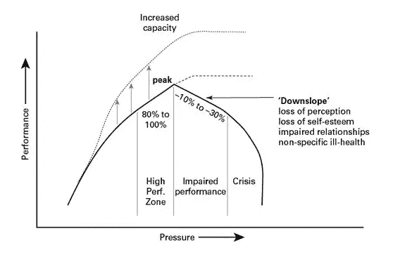

# 从个人贡献者转变为技术经理的陷阱

> 原文：<https://betterprogramming.pub/pitfalls-when-transitioning-from-an-individual-contributor-to-a-technical-manager-5c160ca803d9>

## 晋升为经理时要避免的常见问题

希图安·horvath⁵摄于 Pexels

从个人贡献者到管理者的转变并不总是一帆风顺的，这是一个充满不确定性的经历。即使你的组织有培训项目，有好的导师，并且你对你想要达到的目标有一个好的想法，理论和实际应用之间的差异仍然会令人望而生畏。在这篇文章中，我将概述我经历过或观察到的一些问题，这些问题会使问题复杂化，并使新经理陷入恶性循环，破坏管理体验。这些问题包括责任病毒，不承认不同系统上的管理工作，以及欣赏群体动态。

# 责任病毒

在艾伦·沃特金斯的《4D 领导力》一书中，他引用了罗杰·马丁(2003 年)关于“责任病毒”的著作。责任病毒是一种现象，当某人被提升到领导职位，试图改善结果，参与到本应被委派的工作中。这种现象的病毒方面是这种行动对所有参与方的影响。

想象以下场景:你从程序员晋升为技术经理。您面临着一个截止日期，这个截止日期关系到只有您能够在目标截止日期内交付的系统区域的更新。然后，您介入，为团队全面交付变更。你被上层管理人员誉为英雄。该项目被认为是成功的，团队继续处理下一个问题。不幸的是，这是技术经理实践“过度负责”的开始。

如果过多的责任只影响到实践它的经理，这在短期内是可以接受的。然而，这种现象的病毒方面是团队可能变得自满，非正式地决定系统的区域不是他们所关心的，或者认为他们在系统的那个区域的工作是不被信任的。上述任何一种可能性都可能导致团队成员在下一次需要类似的变更时不太可能承担责任。

如果过度负责的做法得不到解决，经理会发现自己在实际责任之外还要处理更多的问题，导致沃特金斯压力绩效曲线中强调的影响:

压力性能曲线(来源:沃特金斯)

压力表现曲线显示，尽管经理可能会发现自己比以往任何时候都更有效率——他们英勇的表现不仅带来了成功，还强化了他们在技术上仍然拥有“它”——但最终经理会变得过度劳累和不知所措。更令人担忧的是，这种行为可能会受到高层管理人员的鼓励，因为这表明技术经理“超越”了职责要求。

如果要避免责任病毒，管理者必须避免屈服于企业的要求，而是协商一个更现实的时间表，通过这个时间表可以实现对团队的指导和培训，使他们自己完成活动。留出时间进行培训和交接应该是将个人贡献者转变为经理的自然过程。团队也可能意识到他们实际上缺乏资源，需要雇用一名新的工程师。识别此类问题并在更广泛的组织内进行讨论将有助于突出可能阻碍团队满足组织期望的能力的约束，理想的结果是获得组织的支持以克服所述约束。

# 识别不同系统上的管理工作

在雷·戴洛的《原则》一书中，他写道:

> 伟大的管理者不是哲学家、演员、实干家或艺术家。他们是工程师。他们将组织视为机器，并努力维护和改进它们。

如果你以前是一名软件工程师，可能很难意识到你实际上是在做与经理相同的工作，只是使用了不同的系统和工具。实现心态转变有两个方面。首先，作为一名技术经理，尽管您仍然负责交付系统变更，但您不再通过提交代码来实现它。第二，作为一个技术经理，你仍然可以实践工程，但是，你现在正在设计一个强大的交付团队，而不是一个健壮的软件系统。

要把你的团队理解为一台机器，我发现从技术经理的经理的角度来看会有所帮助。一般来说，你的经理想要的是委派一项任务，然后在商定的时间和质量内完成这项任务。因此，对于经理的经理来说，团队就像一个黑匣子，输入是任务，输出是软件特性。作为一名技术经理，这个角色的一个关键部分是设计一个团队，在给定组织已经到位的资源和约束的情况下，该团队可以实现期望的结果。

跟踪结果、资源和约束都是工程实践的一部分。正如在编写代码时，您希望知道您正在处理的需求、平台、编程语言和系统资源约束，在管理环境中，您需要知道组织的期望对于您所拥有的团队是否现实。例如，如果组织希望团队使用基础架构作为代码来构建新服务的在线基础架构，并且您的团队中充满了前端开发人员，那么您的工作就是请求具有基础架构供应经验的资源，或者强调与培训您的团队以实现预期目标相关的风险。

除了外部利益相关者，还应满足内部考虑和要求。如果你的团队成员想进入管理层，将他们视为你的副手并给予指导会很有用。这将让你可以休假，而不必担心谁将接替你的工作，同时满足团队成员的职业发展需求。理解什么激励你的团队是确保工作关系长久的关键，这可以通过有效、定期的一对一来实现；这个话题我会留到以后的文章中讨论。

通过认识到组织内团队的系统性目标，更重要的是，不断确保团队结构符合目标，可以避免组织和团队之间的期望错位。根据我的经验，不一致的期望可以表现为组织对团队表现的不满；通常基于不公平的看法。相反，团队可能会对组织的要求不合理感到沮丧，导致承诺和士气下降。负面情绪一旦形成，要让它们再次变得积极起来就不容易了，这就是为什么从长远来看，尽早强调这些迹象并解决它会节省很多时间。

# 欣赏群体动力

群体动力学是一个广义的术语，用来描述一群人如何一起工作。一个被忽视的关键因素是不同性格的角色及其对团队绩效的影响。温斯伯勒和 Chamorro-Premuzic⁴写道:

> 考虑具有正确技能和个性组合的团队的一个有用方法是考虑每个人在工作组中扮演的两个角色:基于他们的正式职位和技术技能的职能角色，以及基于他们是什么样的人的心理角色。

一般来说，作为一名技术经理，您应该非常了解团队成员的功能性能力。然而，如上所述，如果你想实现某种团队文化，理解每个团队成员扮演的心理角色同样重要。温斯伯勒和 Chamorro-Premuzic⁴提供了以下人格类别样本:结果导向型、关系型、过程和规则型、创新型和颠覆型思考者，或者只是务实型。

在团队层面，如果你的目标是建立一个以结果为导向的团队，但你的团队成员大多是流程和规则的追随者，你很可能会遇到困难。在个人层面上，如果你把项目管理的责任分配给一个创新的和破坏性的思考者，你可能会以一个变化是不受欢迎的常数的项目而告终。这些例子都是人为设计的，因为大多数人并不是单一地属于一个类别，而是具有多种特征。因此，不良的个性和角色匹配可能需要一段时间才能变得明显，此时它已经表现为团队成员的不感兴趣或出乎意料的糟糕表现。

群体动力学的另一个方面是人际关系的作用。如果你的团队有基于技术或意识形态的派系或基于社会团体的小团体，它会影响团队合作的好坏。当现有的关系结构与一个一直在招聘的成长中的组织相结合时，也许团队内部会有一些自然的变动，这意味着理解团队所处的位置需要持续的观察。一般来说，这不是一个在任何正式评审中出现的话题，可能不会公开讨论，但那些关注的人很容易理解。

有时，公司试图通过团队建设练习来改善团队动态，但如果活动不是团队成员可以真正团结起来的事情，结果可能不总是如预期的那样。我观察到的一个更具挑战性但更有效的方法是，通过允许他们更经常地一起工作来培养自然的社交圈，或者有目的地确保日常工作需要不断混合的团队。根据组织的不同，这两种方式各有利弊。作为一名试图打造高效团队的经理，你需要决定是让团队在办公室内外和睦相处、享受彼此的相处，还是让枯燥但专业的关系成为常态。

# 结论

在这篇文章中，我概述了一些我发现在一个新经理试图了解他们的方向时很危险的陷阱。所有这些问题的共同主题是，如果没有对这些问题的认识，它们可能会产生类似于技术债务的影响。也就是说，如果得不到解决，关于授权不力、资源不足和团队组成不当的问题会使技术经理的工作变得不必要的困难。通过对管理实践中出现的挑战保持警惕和好奇，希望你能发现潜在的紧张，并在它们成为真正的问题之前解决它们。期望的结果是确保尽可能多的管理时间用于帮助您的团队和组织实现长期的积极变革。

# 参考

1: Alan Watkins，2016，4D 领导力:通过垂直领导力发展获得竞争优势。[https://www . Amazon . com/4D-领导-竞争-优势-发展-电子书/dp/B018IV01MY](https://www.amazon.com/4D-Leadership-Competitive-Advantage-Development-ebook/dp/B018IV01MY)

2: Ray Dailo，2017，《原则:生活与工作》。[https://www . Amazon . com/Principles-Life-Work-Ray-Dalio-ebook/DP/b 071 ctk 28d/](https://www.amazon.com/Principles-Life-Work-Ray-Dalio-ebook/dp/B071CTK28D/)

3:维基百科，群体动力学。【https://en.wikipedia.org/wiki/Group_dynamics 

4:温斯伯勒&查莫罗-普雷姆兹奇，2017 年。伟大的团队是关于个性，而不仅仅是技能。[https://HBR . org/2017/01/great-teams-about-personality-than-just-skills](https://hbr.org/2017/01/great-teams-are-about-personalities-not-just-skills)

图 5: Histuan 霍瓦特，在米色混凝土墙上跳跃的人。[https://www . pexels . com/photo/person-jumping-on-beige-concrete-wall-2244829/](https://www.pexels.com/photo/person-jumping-on-beige-concrete-wall-2244829/)