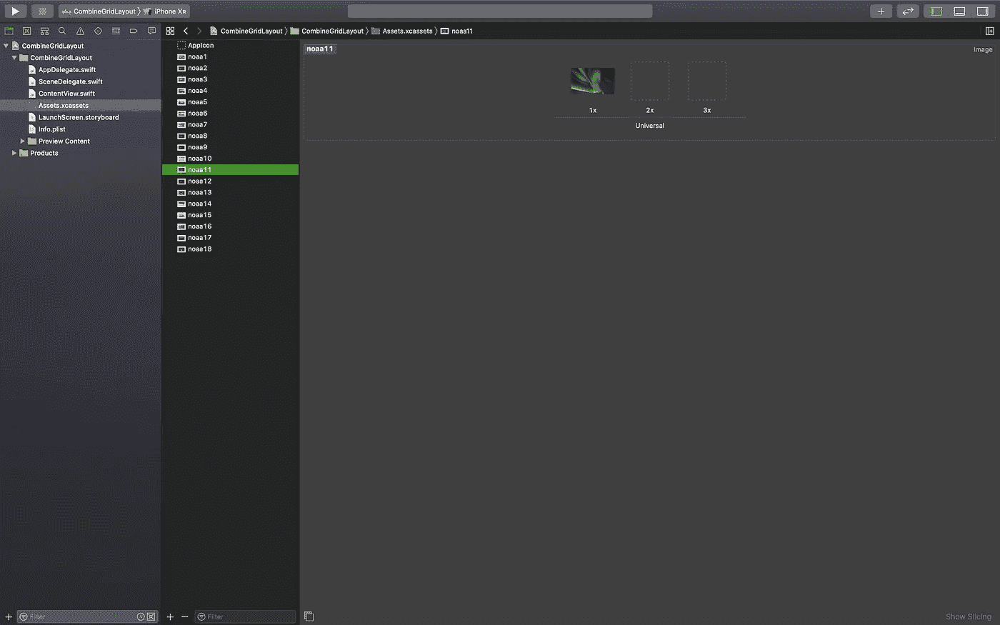
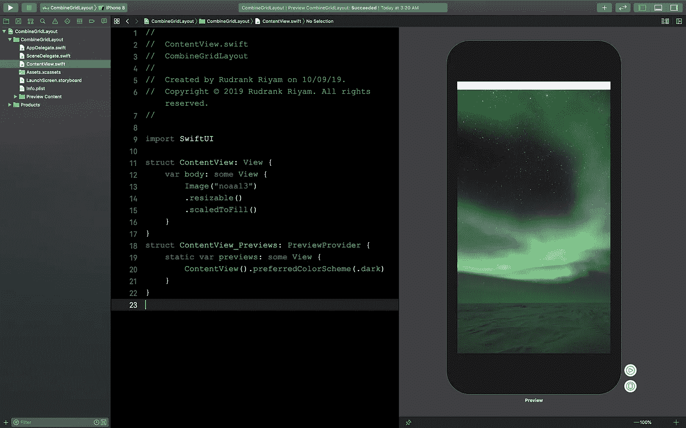
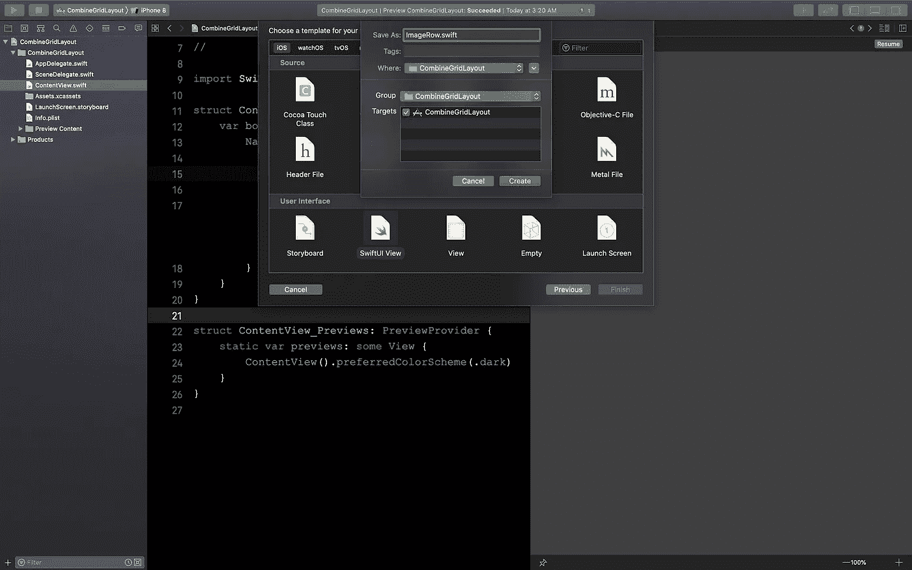
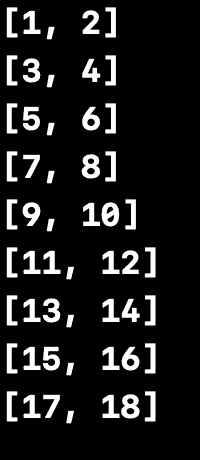
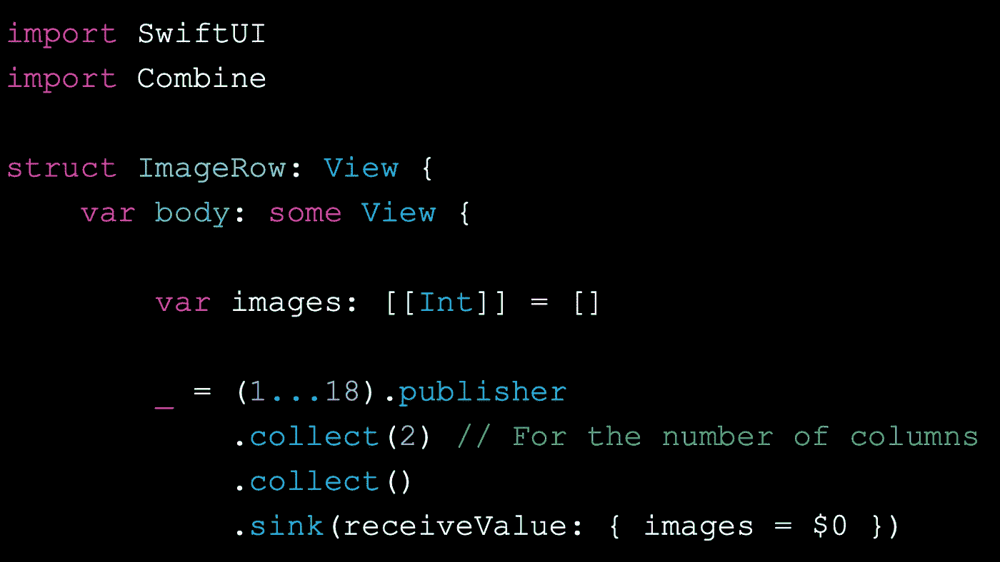
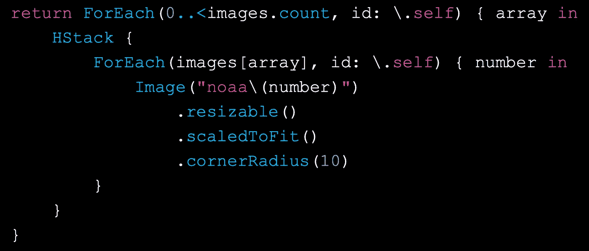
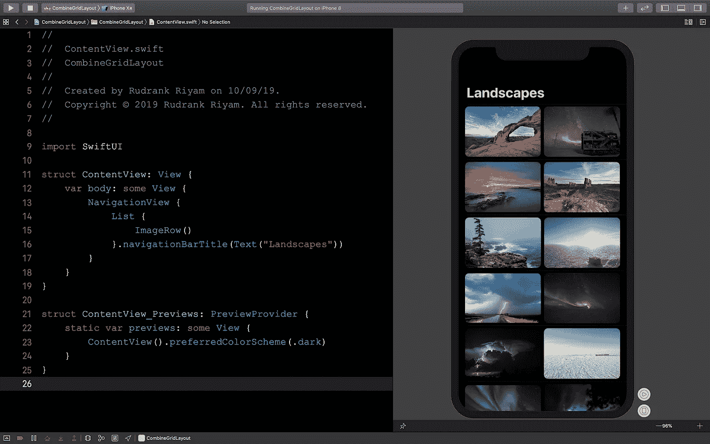

# 使用 Combine:swift ui 中的网格布局

> 原文：<https://betterprogramming.pub/playing-with-combine-grid-layout-in-swiftui-42e652d6462e>

## 用 Combine 在 SwiftUI 中实现网格的基本方法


由[https://mockuper.net](https://mockuper.net)生成的实体模型

您可能已经意识到 SwiftUI 只支持列表，但本身并不支持`collectionView`。我一直在学习联合，并试图实现类似的想法。

下面是开始的[演示项目](https://github.com/rudrankriyam/GridLayoutCombine)。

打开项目，去探索那 18 个赏心悦目的景观，为了简单起见，命名为`noaa[number]` 。



为这些美丽的照片向美国国家海洋和大气管理局大声喊出来。

打开`ContentView.swift`。你会看到一幅令人惊叹的南极光图像。

让我们开始使用 Combine 设计网格布局的旅程吧！



首先，我们将为网格创建另一个`View`。创建一个名为`ImageRow`的新文件，类型为 *SwiftUI View* 。



是时候理解网格背后的逻辑了。

*   我们将有一个针对列的`ForEach`循环，在其中，我们将有另一个针对行的循环。把它想象成一个 2D 阵列。
*   例如，我们有一个数字序列，1，2，3，4，5，6。我们想把数字分成两列，这样 1 和 2 在一行，3 和 4 在另一行，5 和 6 在最后一行。
*   所以，我们将*划分*数字序列，我们得到它们的*块* 。

# 编码

是时候编码了。

序列可以是任何东西，从图像名称到普通文本。这里，我们考虑 NOAA 图像的整数。

我们将创建一个空的 2D 数组来存储分块的值。

```
var images: [[Int]] = []
```

然后，创建一个整数发布器。在这种情况下，我们有 18 个图像，所以:

```
_ = (1...18).publisher
```

逻辑的魔力来了。我们将使用`collect()` 实例方法。引用苹果的文档:

> "收集所有收到的元素，并在上游发布者完成时发出集合的单个数组."

您可以指定希望集合限制的值的数量，我们将使用它来指定列的数量。这给了我们一个数组块流。

```
.collect(2) // Creating two columns
```



这两列

现在，我们需要将这些行的数组放在一个 2D 数组中。我们将使用另一个 collect() 方法来获取单个流中的所有值。

```
.collect()
```


单个 2D 数组中的流

注意:`collect()`使用无限量的内存来存储接收到的值。

使用`sink(receiveValue:)`订阅者从发布者那里获得整个 2D 数组。将订阅存储在 images 变量中。

```
.sink(receiveValue: { images = $0 })
```

整个代码应该如下所示:



该写嵌套的`ForLoop`实现了。从现在开始就很简单了。

首先，我们将有一个针对行数的`ForEach`循环。从零迭代到图像中子阵列的数量，即行数。

```
return ForEach(0..<images.count, id: \.self) { array in
```

然后，在循环内部，为行元素添加一个`HStack`。遍历每个子数组给我们图像的编号

```
HStack { ForEach(images[array], id: \.self) { number in
```

根据你的喜好修改图像。

```
Image(“noaa\(number)”) .resizable() .scaledToFit() .cornerRadius(10)
```

最后，您的代码应该如下所示:



在`ContentView.swift`、**、**中，用修改器移除图像，并在一个带有`navigationView`的`List`中添加`ImageRow`，得到一个漂亮的标题栏。

```
NavigationView { List { ImageRow() }.navigationBarTitle(Text("Landscapes"))}
```

运行这个项目给出了一个美丽的景观网格。

