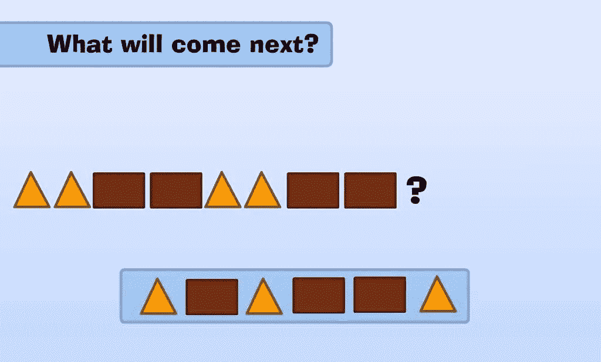
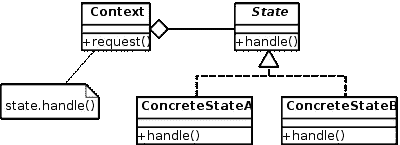
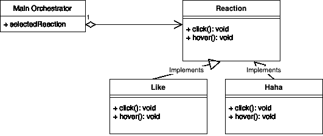

# 诗歌和编程之间的相似之处

> 原文：<https://betterprogramming.pub/poetry-programming-parallels-9a5f4a03aab0>

## 设计模式与比喻

由 [Unsplash](https://unsplash.com/s/photos/poetry?utm_source=unsplash&utm_medium=referral&utm_content=creditCopyText) 上的[信托“Tru”kat sande](https://unsplash.com/@iamtru?utm_source=unsplash&utm_medium=referral&utm_content=creditCopyText)拍摄的照片

我是一名程序员。我是个诗人。由于我主要涉足这两个看似对立的学科(诗歌和编程)，我不禁注意到它们之间有许多相似之处。我曾在[网站 https://medium . com/analytics-vid hya/poem-and-programming-5205844 a02fb](https://medium.com/analytics-vidhya/poetry-and-programming-5205844a02fb)写过一篇类似的文章

今天我写的是设计模式与修辞的对比。

快速免责声明:我要表现得像一辆客运列车，它在所有可能的车站停下来迎合所有的乘客。对于今天的旅程，我们有两个主要站点:诗歌和编程。如果你碰巧以前去过某个地方，如果你发现某个旅游景点重复而且描述非常外行，请原谅我。

接下来会发生什么？(图片来源:[杰米·戴维斯](https://www.tes.com/lessons/HwWOHvwen2Mg0A/copy-of-patterns)复制的图案)

# 设计模式

再来说模式。

模式是可重复的(以可预测的方式)。在上图中，你知道问号将被一个三角形代替，因为你观察到每两个矩形后面有一个三角形(或两个三角形)。

模式给了你一种行为，你可以在类似的情况下模仿它来解决问题。如果有人给你东西或为你做了什么，你说:“谢谢！”这是作为礼仪吸收到我们身上的一种模式。

**设计模式**是你用来设计东西的模式。把它看作是花瓣的模板。通过使用模板绘制多个花瓣，您可以制作一朵美丽的花。

用于形成花朵的花瓣模板(图片来源: [ClipartMax](https://www.clipartmax.com/)

类似地，在计算机科学中，设计模式是软件设计中常见问题的可重复解决方案。它就像一个模板或模板，用来指导如何解决问题。使用设计模式使你的软件变得美观，可维护，可扩展，可读。让我们来了解如何。

不同的问题有不同的模式。出于本文的目的，我将使用 State 模式。对此，我们举个软件的例子。

例如，假设您要为脸书的“喜欢”按钮编写代码。当你点击按钮时，它喜欢这篇文章。所以你写了类似下面这样的东西(非程序员只是看到代码标题中提到的描述/行号):

LikeButton onClick 方法——“喜欢帖子”

您应该为调用编写以下代码:

注意:按照惯例，我们在 Java 中没有像`onClick`这样的方法名。这里混合了更多的 Javascript 类型的约定，以方便非程序员阅读。

假设脸书也想通过“喜欢”按钮给用户其他反应。“喜欢”按钮现在的行为是什么？你悬停在它上面，它会以表情符号的形式给你多个反应选项。

图片来源:脸书

如果你选择了你的反应，这个反应会通过 like 按钮发送给帖子。

对一个帖子的悲伤反应

现在，您的代码会变成这样:

OnClick 方法—第 12–20 行

您会看到放在`onClick`函数中的`if`语句。如果你将鼠标悬停在这些反应上，你会看到它是用来做什么的(“喜欢”、“爱”、“哈哈”等等)。)，所以你的`onHover`功能也需要改变:

现有方法的变更——第 10-17 行

现在，您可以看到这里的问题:两个功能之间存在重复。如果你改变了一个功能中的某些东西，你必须记住把那个改变也复制到另一个功能中——这是软件的一个特点。如果脸书引入了双击的行为，你必须写另一个函数，再次复制同一个块。它不可维护。

此外，许多`if`分支机构已经使代码不可读。现在，我们已经忽略了当你点击一个已经喜欢的帖子时会发生什么(它会删除你的反应)。想象一下`if`块也来到这里。它会让我们的代码变得一团糟。

它也不可扩展。例如，如果脸书想出了另一个反应，(就像在《新冠肺炎时报》上，它想出了一个‘关心’反应)，你将不得不改变点击和悬停功能，添加另一个分支`if`条件。

拯救我们的是国家模式。如果我们仔细观察这个问题，我们会发现我们依赖于`selectedReaction`。按钮状态改变时`LikeButton`的行为也会改变(基于`selectedReaction`)。状态模式允许对象在其状态改变时表现不同(无论是变成`ConcreateStateA`还是`ConcreteStateB`)。每个人都将按照自己的`handle()`方法定义的方式行事。

状态模式 UML

应用同样的原则，我们可以重构我们的软件:

我们软件的状态模式 UML

个别类别—第 5 行–第 20 行

看到代码变得多么优雅了吗？现在添加另一个反应非常容易。你只需要添加另一个类。这些反应自己知道它们应该做什么。这段代码可读性、可理解性、可维护性和可扩展性更强——总而言之，它看起来很漂亮。

# 修辞格

类似于设计模式，诗歌中的修辞格是让你的诗歌变得美丽的工具。有各种修辞格。出于本文的目的，我将使用一个非常基本的方法，头韵。让我们看一个例子:

*从第四这两个敌人的致命的腰部；一对不幸的恋人结束了他们的生命。*

(《罗密欧与朱丽叶》第一幕的序言，威廉·莎士比亚)

请注意，在第一行中，你不得不重复地发 *f* 音。头韵是在相邻或紧密相连的词的开头出现相同的字母或声音。这里，莎士比亚在、*到*、*致命*和*敌人*的*音中使用了头韵；他还在*掐腰*、*恋人*、*人生*中押韵 *l* 音。*

在印地语中一个非常著名的例子是诗人 Maithilisharan Gupt 的诗句:

*चारुचंद्र की चंचल किरणें，खेल रहीं हैं जल थल में，*

我相信所有其他语言都会有类似的东西。在诗歌朗诵会上背诵这样的词非常令人宽慰。它们有助于创造诗歌的节奏。这也让我们把注意力集中在那些单词上，附带的结果是它们很容易记住。

另一个基本的修辞格是明喻，用*作为*、*像*等词语进行美丽的对比。比如:“你像狮子一样勇敢。他们吵得不可开交。*还是比喻，这里有一种含蓄的比较。它增加了你的诗的深度。例如:“整个世界是一个舞台，所有的男男女女不过是演员。”*

# *类似*

*那么设计模式和修辞格有什么相似之处呢？*

*你会说两者都使他们各自的作品(代码或诗歌)变得美丽。但是还有一点是相似的，那就是他们是如何被虐待的。读入[第二部分](https://medium.com/swlh/poetry-programming-parallels-74d09d4b5f57)*