# 👆React 中的指针事件—原因、方式和内容

> 原文：<https://betterprogramming.pub/pointer-events-with-react-the-why-how-what-617a5b51dbb2>

# 我们来谈谈事件，更具体地说是指针事件。

## 什么是指针事件？

> [指针事件](https://developers.google.com/web/updates/2016/11/nic55#pointer-events)提供了处理所有输入事件的统一方式。

在过去美好的日子里，我们只有一个鼠标，监听事件很简单。web 内容假设用户的定点设备是鼠标。

如今，我们有许多与鼠标无关的设备，比如带触摸屏的手机或笔。

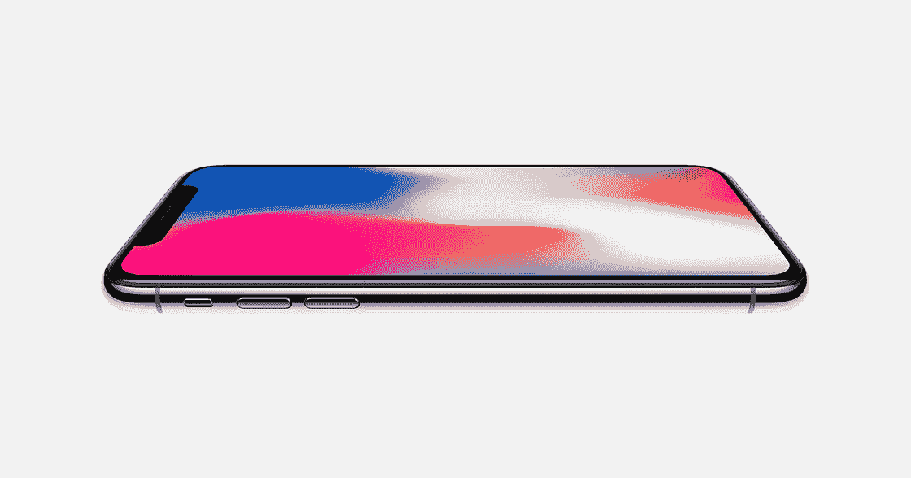

如果用户没有鼠标，我们如何监听事件？

## [触摸事件](https://developer.mozilla.org/en-US/docs/Web/API/Touch_events)来救援！

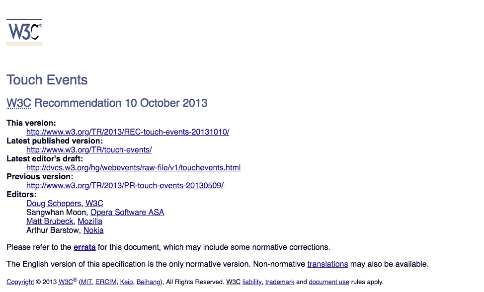

[https://www.w3.org/TR/touch-events/](https://www.w3.org/TR/touch-events/)

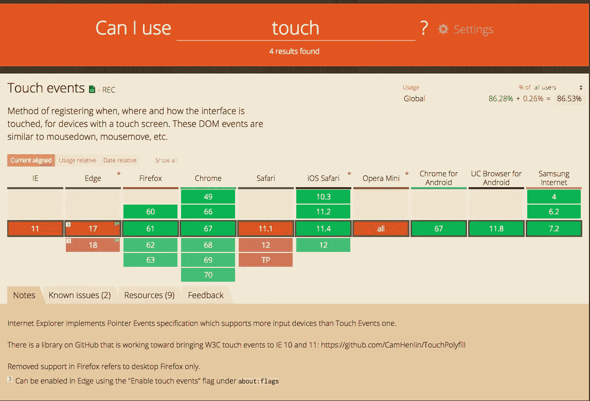

[https://caniuse.com/#search=touch](https://caniuse.com/#search=touch)

触摸事件的接口是相对低级的 API，可用于支持特定于应用的多点触摸交互，例如双指手势。

当手指(或触笔)第一次触摸接触面时，多点触摸交互开始。其他手指可以随后触摸该表面，并且可选地在触摸表面上移动。当手指从表面移开时，交互结束。在该交互期间，应用在开始、移动和结束阶段接收触摸事件。

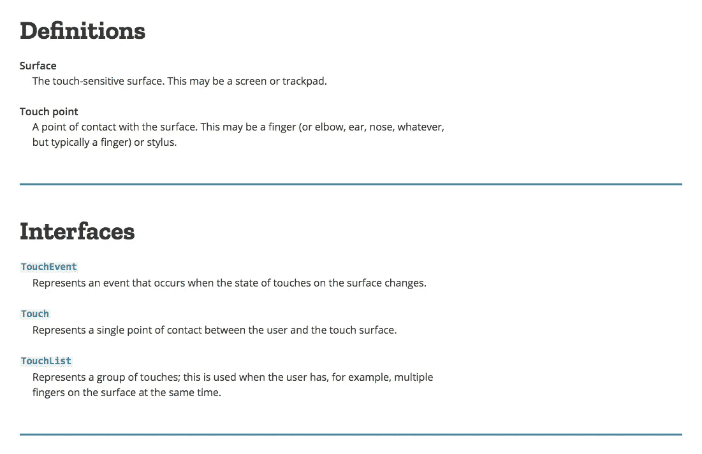

[https://developer . Mozilla . org/en-US/docs/Web/API/Pointer _ events](https://developer.mozilla.org/en-US/docs/Web/API/Pointer_events)

添加触摸事件监听器相当简单，但是您必须同时支持`touch`和`mouse`:

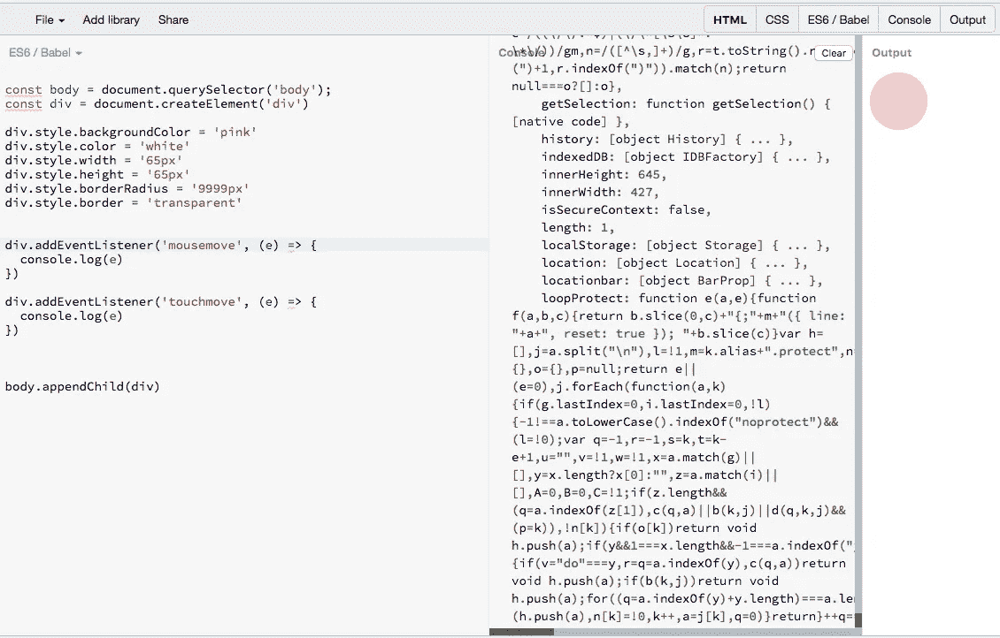

[http://jsbin.com/libayejike/edit?js,console,output](http://jsbin.com/libayejike/edit?js,console,output)

在你的手机上尝试这个例子，并尝试在桌面版本上使用它来分割屏幕，然后检查`console.log` 输出。

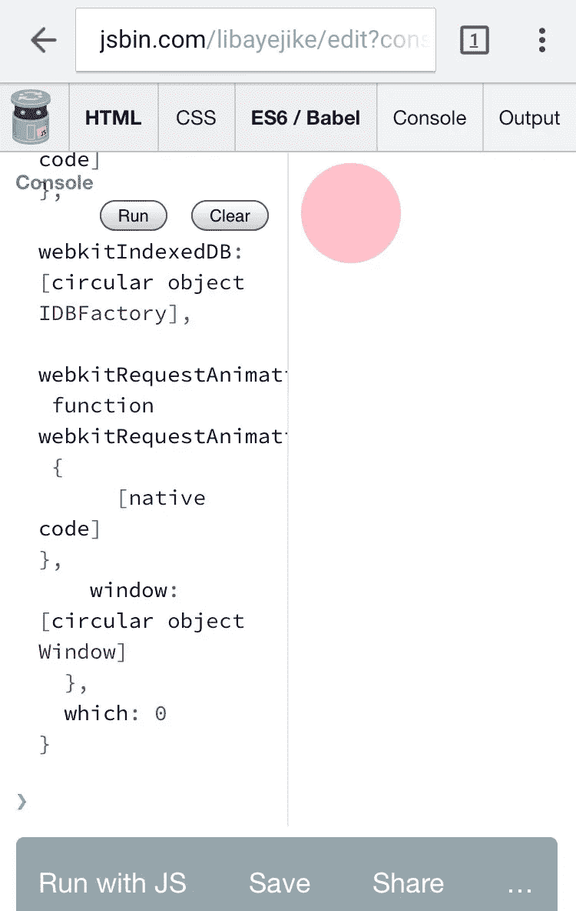

测试 iPhone 上的触摸事件

支持`touch`和`mouse`事件会变得非常臃肿和难以维护，因为你必须为不同的设备编写事件代码。

## 指针事件到救援！

[https://w3c.github.io/pointerevents/](https://w3c.github.io/pointerevents/)

看看 jQuery 团队的这个令人惊叹的多填充符,它支持大多数浏览器上的指针事件

还记得上面的例子吗，我们有两个事件监听器——一个用于鼠标，一个用于触摸？

好吧，我们可以简单地将其中一个改为`pointermove`并删除其余的，而不是编写两个事件监听器。

**pointermove** 支持触摸和鼠标

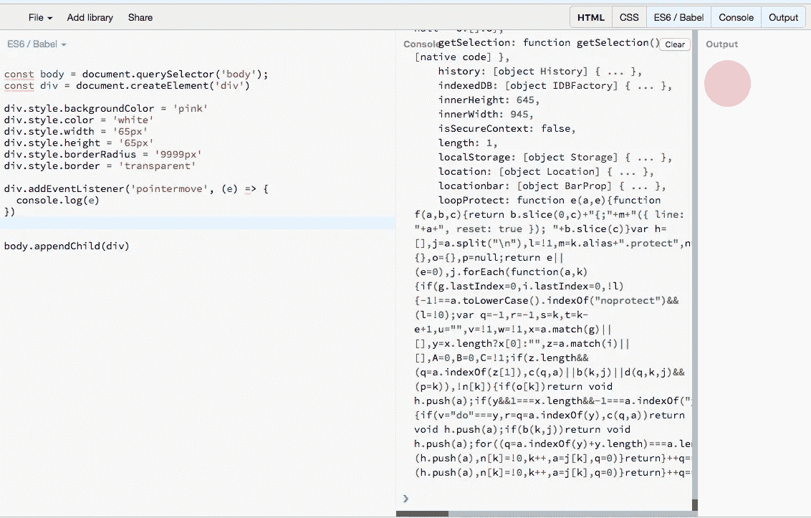

[http://jsbin.com/xexotimade/edit?js,console,output](http://jsbin.com/xexotimade/edit?js,console,output)

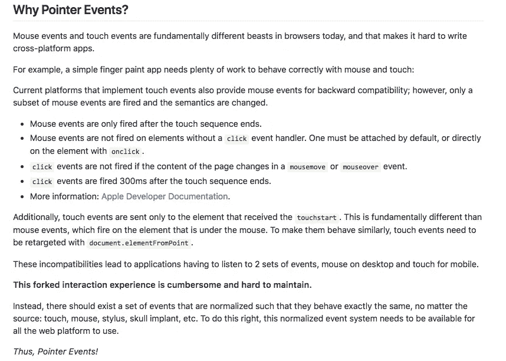

[https://github.com/jquery/PEP/blob/master/README.md](https://github.com/jquery/PEP/blob/master/README.md)

今天浏览器能做的事情太神奇了！但愿有一天我们能在浏览器中拥有完全原生的体验。

[https://developer . Mozilla . org/en-US/docs/Web/API/Pointer _ events](https://developer.mozilla.org/en-US/docs/Web/API/Pointer_events)

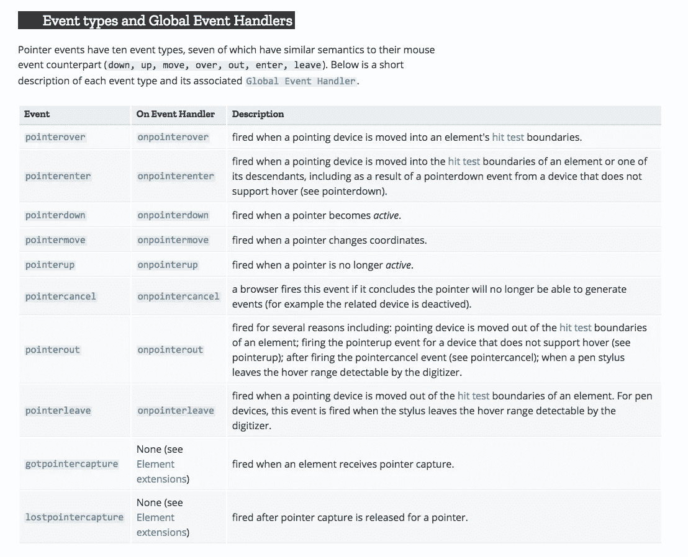

React 最近推出了 16.4 版本，支持原生指针事件。

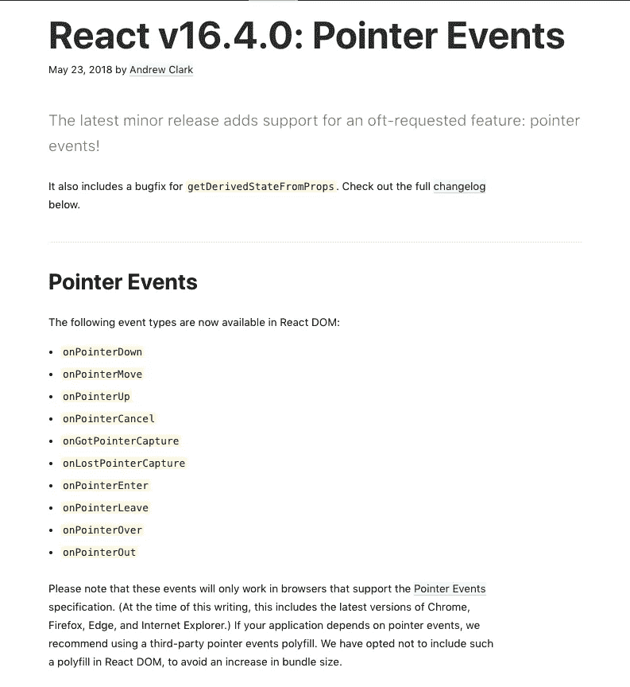

让我们创建一个快速反应项目，并尝试这些新的漂亮的事件。更新到最新的`[create-react-version](https://www.npmjs.com/package/create-react-app)`，启动项目。

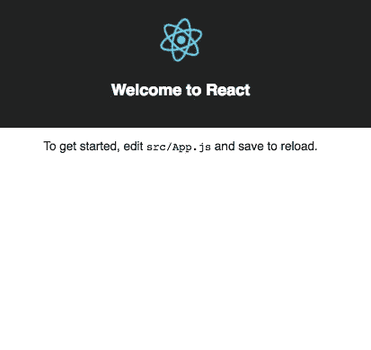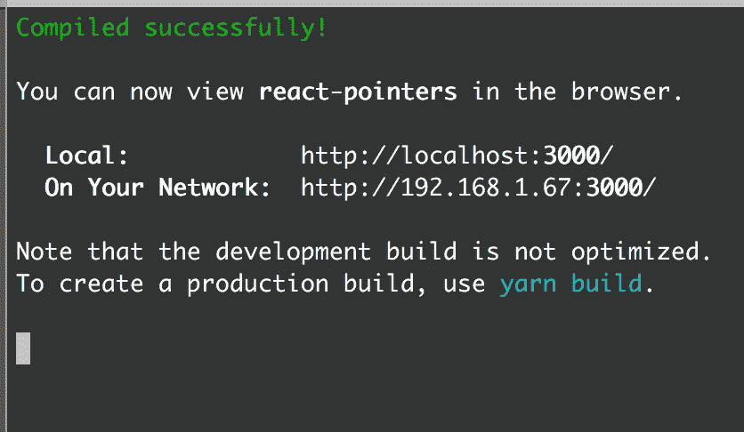

由于指针事件支持触摸事件，我们也想在手机上测试它。用 via `on your network: http://xxx.xxx.x.xx:3000/`网址打开手机上的应用。

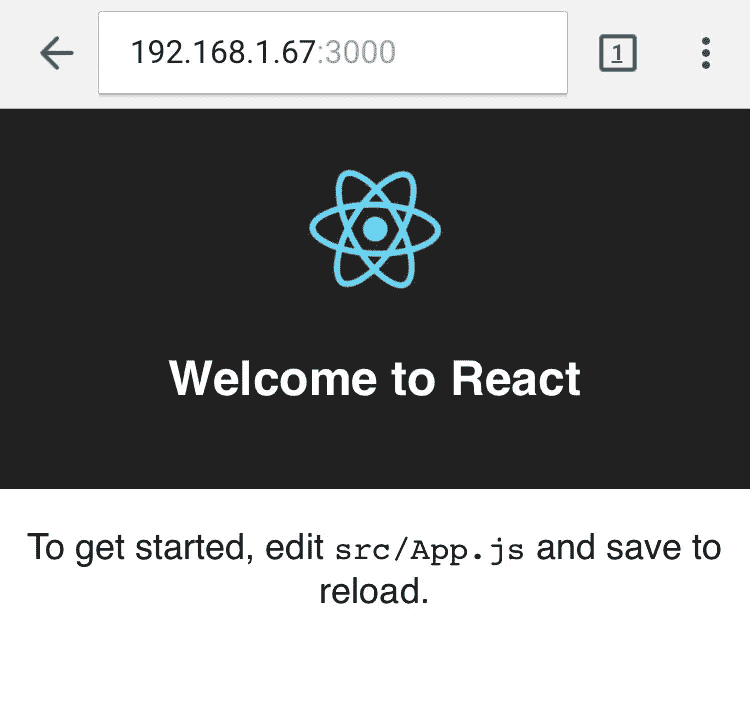

用手机打开 react 应用程序

我们首先创建同一个圆，并声明一个名为`hasCapture`的状态:

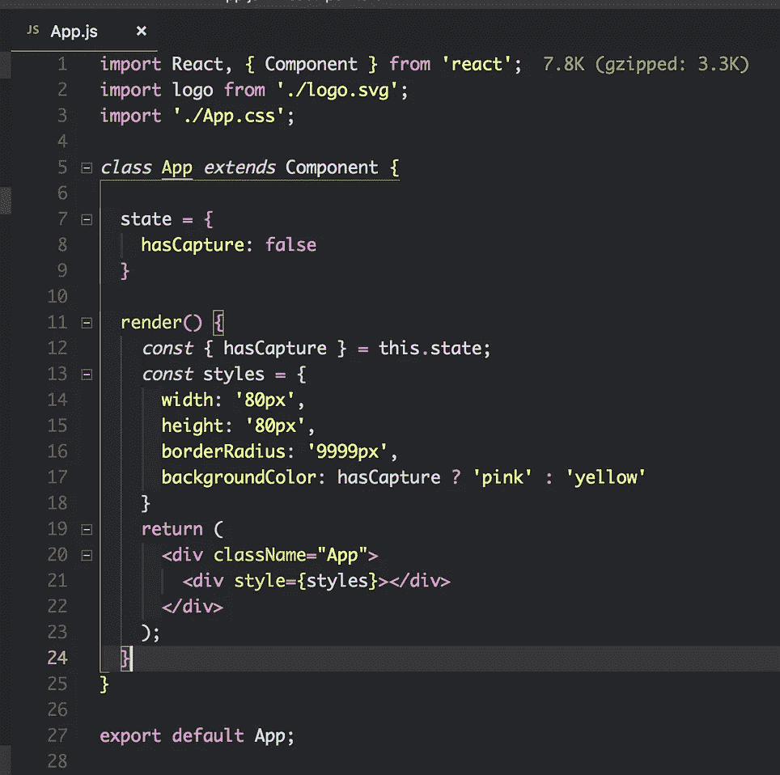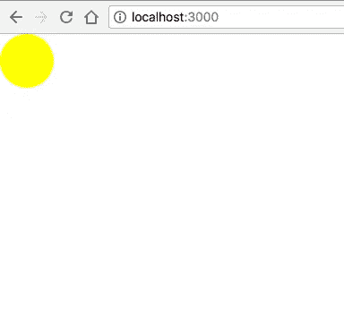

接下来，让我们添加`onPointerEnter`和`onPointerLeave`——当你将鼠标悬停在元素上时，听起来就是这样。

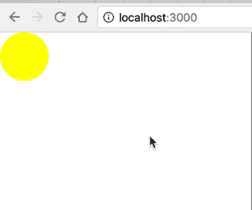

**on pointer 输入**和 **onPointerLeave**

但是`onPointerEnter`和`onMouseEnter`有什么区别呢？

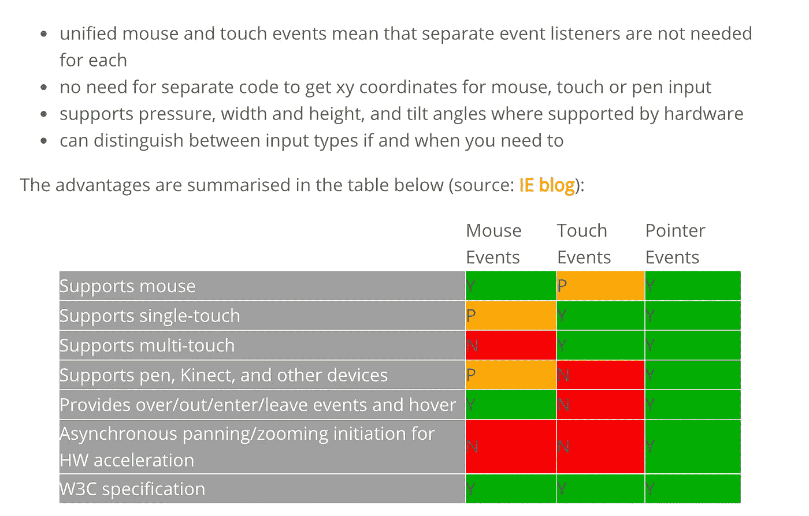

来源:[https://mobi forge . com/design-development/html 5-pointer-events-API-combining-touch-mouse-and-pen](https://mobiforge.com/design-development/html5-pointer-events-api-combining-touch-mouse-and-pen)

简而言之，通过使用指针事件，我们支持更多的设备。这可能是未来的活动方式。

如果你想让你的 JavaScript 能力更上一层楼，我推荐阅读“ [*你不知道的 JS*](https://amzn.to/2LSDpG6) ”系列丛书。

## 感谢阅读，保持敬畏！❤