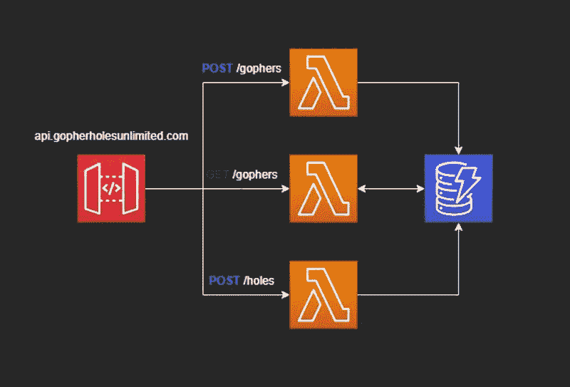
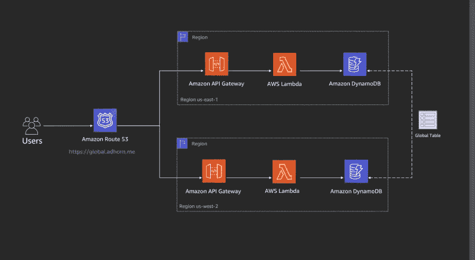

# 为满意的客户优化您的无服务器 API

> 原文：<https://betterprogramming.pub/power-tune-your-serverless-api-for-happy-customers-289e83e3938f>

## 采用新技术和最佳实践，为客户提供最佳体验

由[迈克·弗林](https://pixabay.com/users/trapezemike-5061639/?utm_source=link-attribution&amp;utm_medium=referral&amp;utm_campaign=image&amp;utm_content=3018425)在 [Pixabay](https://pixabay.com/?utm_source=link-attribution&amp;utm_medium=referral&amp;utm_campaign=image&amp;utm_content=3018425) 上拍摄的照片。

API 是数字货币。

现代软件通过使用 API 而存在。这就是今天的情况。

并非所有的 API 都是平等的。仅仅拥有一个 API 不会给你带来满意的客户。拥有一个高质量、有意义的 API 是你走向成功的基础。但是如何增加你的 API 的价值呢？什么使得 API 高质量？

老实说，这取决于你看问题的角度。可以说，你看待你的 API 的最重要的方式是通过客户的眼睛。

无论他们是使用基于你的 API 之上的 UI，还是集成者，你的 API 的质量都会很快给人留下印象。

# 对消费者来说什么是高质量？

你还记得上一次你在一个网站上，点击一个按钮，你的光标只是旋转和旋转吗？似乎过了很久(但实际上只有 4-5 秒)，页面加载完毕，你继续做你正在做的事情。

那没有留下一个非常好的印象，不是吗？

尤其是如果这是你在那个网站上做的第一件事。你的 API 需要很快。一贯的快。如果一个 API 不到半秒就返回，感觉很正常。在半秒到一秒之间，你的消费者会注意到。超过一秒钟，你的消费者就会开始坐立不安。

速度对消费者来说是最重要的因素。

新场景:还记得上一次你去一个网站，点击一个按钮，然后被导航到一个“哎呀，出错了”的页面吗？希望页面上有一些可爱的东西，就像亚马逊在出错时做的那样:

*友好的亚马逊错误页面*

你点击后退按钮再试一次。这次成功了。

你的经历并不可靠。你希望它*只是工作*，然而你得到了一个错误页面，不得不返回并重新做你的任务。

如果这种情况发生不止一次，你就要开始重新考虑使用这个网站的选择了。你想要一个 API 一遍又一遍地执行同样的操作。

对消费者来说，一致性是第二重要的因素。

# 如何识别优化

每个开发者都听过。你的产品负责人问你，“客户使用最多的功能是什么？”

传统上，这种事情可以通过在控制器中添加侵入性工具来跟踪命中次数和延迟来完成。你要么购买第三方许可证来收集数据并提供见解，要么从头开始构建，而不是增强产品。

了解您最常用的功能对于满意的客户来说至关重要。产品所有者总是问这个问题是有原因的。

它告诉你应该把精力放在哪里，帮助你找出用户界面中最常用的页面，并识别出可能需要删除的功能。

有了无服务器，你可以免费获得这些见解。以下面我的假业务但真实的无服务器 API 的架构图为例:

*一个简单的无服务器 API 的示意图*

每个端点都与一个单独的功能相关联。每次调用端点时，像 [AWS CloudWatch](https://aws.amazon.com/cloudwatch/) 或 [Azure Monitor](https://azure.microsoft.com/en-us/services/monitor/) 这样的服务将记录调用次数和执行时间等指标。

内置分析不仅告诉您调用和执行时间，还告诉您并发执行、限制尝试和 HTTP 状态代码等指标。通过将这些指标分解到端点级别，您可以看到哪些功能在高流量时得到了突发执行。此外，通过查看成功与失败的状态代码，您可以了解您的函数处理突发事件的能力。

因此，这些托管服务可以告诉您*如何识别*您的 API 中哪些特性是最常用的。最常用的功能应该得到最多的关注和增强。任何移动缓慢、经常使用的端点会直接移动到优先级列表的顶部。

但是在你确定了你的优化*应该在哪里*之后，你怎么知道要做什么改变呢？

# 加速慢速端点

我们已经建立了满意客户 API 的两个主要特征:速度和可靠性。无服务器为开发人员提供了构建具有无与伦比的延迟和一致性的 API 的工具。说到速度，有几种不同的方法。

## 增加资源分配

与其他架构相比，无服务器为开发人员提供了难以置信的细粒度控制。可以为每个端点配置设置，这意味着一旦您确定了运行缓慢的功能，您就可以分配特定的资源来加速它们。

例如，以 [Gopher Holes Unlimited](https://github.com/allenheltondev/gopher-holes-unlimited) 及其一些端点为例。

如果 POST/gophers 端点很慢，一个简单的解决方法是增加为支持它的函数分配的内存。使用 AWS，您可以显式地声明每个函数在运行时允许使用多少内存。将默认的 128 MB 提升到健康的 768 MB 将确保该功能运行更快。

当然，您总是可以在代码中寻找优化来加速它，但是不管您的实现如何，这都是真的。无服务器在端点级而不是控制器级获得资源分配的优势。

## 更改集成类型

无服务器还为您提供集成选项。这意味着你的 API 甚至不需要使用函数。让你的 API 网关[直接查询你的数据库](https://medium.com/@amorenom/how-to-build-a-serverless-api-in-aws-without-using-a-single-lambda-522ce43a6fb6)并完全绕过代码是可能的。

如果您的端点就像“从数据库加载并转换数据形状”一样简单，那么直接代理到数据库可以节省大量的时间([更不用说成本了！](https://medium.com/better-programming/5-steps-to-making-a-predictable-cost-model-for-aws-serverless-projects-78d78909bb82))。

直接进入数据库将防止冷启动，减少执行端点所需的服务数量，并消除额外的代码。代码行越少，出现缺陷的机会就越少。

从代码的角度来看，如果没有中间人(一个函数)，您的端点不能变得更快。数据验证在您的[开放 API 规范](https://www.openapis.org)中完成，转换直接在您的 API 网关中完成。

您的 API 可以是直接连接到数据库的端点、使用函数的端点和调用其他端点的端点的混合。有了无服务器，就无所谓了。您控制 API 中每一项的实现。

# 提高关键端点的可靠性

让客户满意的另一个主要因素是可靠性。您希望 API 日复一日地执行相同的操作。无论你有一个活跃用户还是一百万，你都希望体验是一样的。

你不希望 Reddit 的死亡拥抱让你的网站或 API 崩溃。

同样，无服务器为我们提供了几种不同的途径来帮助建立可靠的性能。

## 配置调配的并发

[Provisioned concurrency](https://aws.amazon.com/about-aws/whats-new/2019/12/aws-lambda-announces-provisioned-concurrency/) 是“确保我的函数在任何时候都是热的”的一种奇特说法在许多情况下，冷启动时间是不可接受的，并且会对用户造成严重损害。

借助无服务器 API，任何关键端点都可以被配置为随时准备就绪。有了供应的并发性，您就可以保证您已经准备好了功能。

它甚至是可自动扩展的，这意味着如果有长时间的流量冲击您的 API，您可以保持大量的函数预热/准备好满足请求。当流量减少时，它会缩小规模以满足较低的需求。

毫无疑问，您的 API 中会有一些端点比其他端点使用得更多。80/20 法则规定，你的 20%的功能会在 80%的时间里被使用。为了让客户满意，请务必调整您的终端，以便在必要时支持调配的并发性。保持回复的爽快、快速和可靠。

## 设置容错

对于像 CAD(计算机辅助调度)这样的系统，紧急服务*必须在几毫秒内连接并准备就绪，停机时间是不可容忍的。如果系统瘫痪，人们的生命就会受到威胁。*

对于无法关闭的关键端点，如安排紧急车辆的路线，无服务器提供了一种轻松构建容错的方式。如果您的云提供商的某个区域出现故障，您可以将您的无服务器解决方案配置为[自动故障转移到不同的区域](https://d1.awsstatic.com/events/reinvent/2019/REPEAT_1_Best_practices_for_building_multi-region,_active-active_serverless_applications_SVS337-R1.pdf)。

标准故障转移配置实际上不是无服务器独有的。您可以将 API 部署到多个区域，并配置 DNS 设置，以根据地理位置或从健康检查端点 ping 路由到适当的区域。

*DNS 多区域故障转移图*

将 API 直接从 API 网关代理到数据库的另一个原因是消除影响您的停机机会。如果去掉中间的 AWS Lambda 或 Azure 功能块，那么当托管服务出现故障时，API 仍然可以工作。

运动部件越少，速度和可靠性就越好。

# 开始

如果您还没有，请访问您的云提供商的监控服务，构建一个仪表板来查看您的 API 分析。找出 API 中最常用的端点。确定你的焦点应该在哪里。

识别应用程序中的慢区域。你能通过分配更多的资源来加速他们吗？你能完全去掉这个功能吗？

特定端点是否需要一直保持温暖？API 的哪个部分接收的突发流量最多？

你可以选择提供最好的体验。归根结底，我们真正想要的是快乐的顾客，对吗？

磨砺资源，构建容错，并尽可能少地涉及服务。如果你能做到这一点，你将拥有一个漂亮的、经过功率调整的 API，它将带给你快乐的客户。