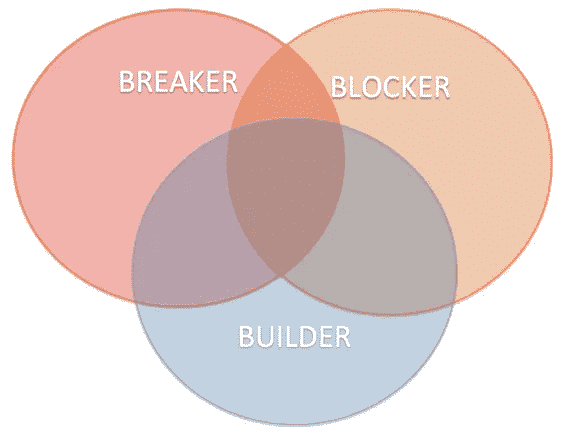
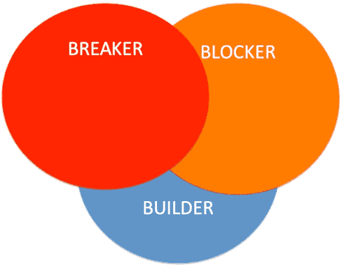
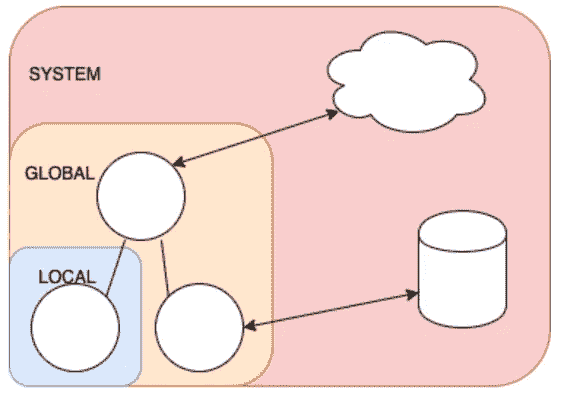
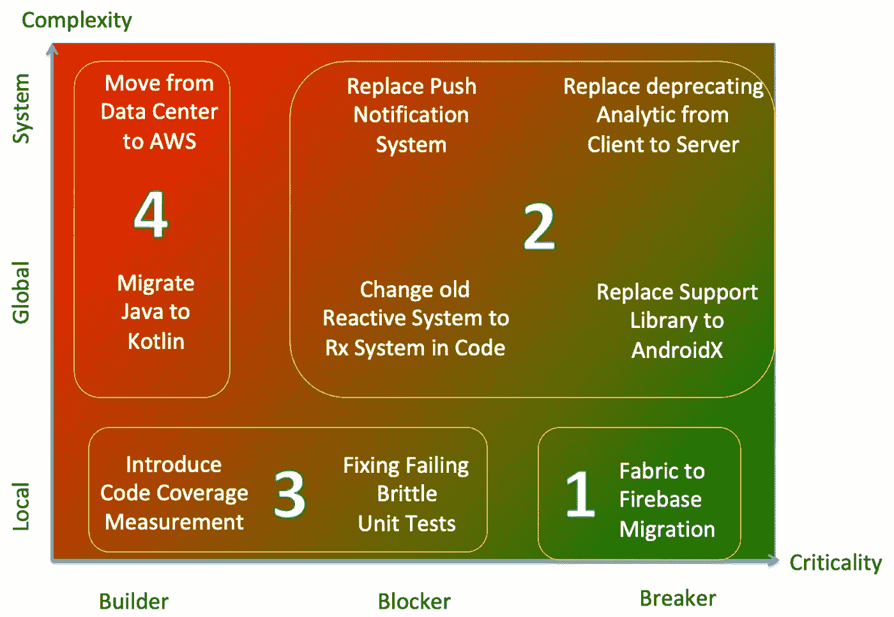

# 实用技术债务优先级

> 原文：<https://betterprogramming.pub/practical-tech-debts-prioritization-443aa7c43e21>

## 并非所有的科技债务都可以等待。并非所有的科技债务都必须解决

莎伦·麦卡琴在 [Unsplash](https://unsplash.com?utm_source=medium&utm_medium=referral) 上的照片

技术债务是所有软件开发都有的必要之恶。要么我们在开始时故意留下债务，以加速我们的开发，要么我们不知不觉地创建了它们，要么它们随着软件的老化而增长。

如果你忽略技术债务，它们会缩短你软件的寿命。很快，软件将处于不再可扩展的阶段，需要完全重写。

但是如果我们虔诚而积极地处理技术债务，我们的特性交付生产力将会受到阻碍。在我们意识到之前，比赛就已经开始了。

拥有一种对技术债务进行分类和优先排序的方法将是有益的，尤其是从业务和技术的角度来看。下面是我如何从技术角度对它们进行分类和优先级排序。

# 技术债务关键程度分类

您可以根据对产品的影响来使用这三个类别，而不是仅仅有一桶技术债务。

## 1.**断路器**

如果你不处理它，很快你的软件就不能用了。这种类型的技术债务通常是时间关键的，例如，您正在使用的依赖关系已经过时，或者您正在依赖的服务即将终止。

## **2。拦截器**

如果你不处理技术债务，你的软件仍然可以使用。然而，如果你不处理它们，你就不能进一步增强你的软件，例如，你正在使用一个不再受支持的旧库。

## **3。建造者**

构建器技术债务会降低您的工作效率，降低代码的可维护性，或者阻止添加一些可以增强您的工作或提高性能的新功能，例如，需要重构的重复功能。

从上面可以明显看出，顺序是破坏程序，然后是阻止程序，最后是构建程序。

## 清楚地将它们分类

如果你要仔细评估技术债务，你会注意到它们中的一些属于不止一个类别，如下文的文氏图所示。

图片由作者提供

例如，假设您的软件正在使用一个旧的 CI 工具，该工具依赖于一台很旧的机器，而这台机器很快就要坏了，并且 CI 在运行时显示出有希望的改进。这种类型的科技债务可以归入上述任何一类。

然而，在所有三个类别中都有科技债务会使优先排序变得复杂，所以最好通过将它放入其中一个类别来使它与众不同。

做到这一点的方法是，始终将科技债务归类到最重要的类别中。也就是说，如果任何科技债务是破坏者，将其归类为破坏者，不管它是否也是阻挡者。类似地，阻断器和建设者技术债务被归类为阻断器。其他人都是建筑工人。

下图清楚地显示了这一点(不再有重叠)。

图片由作者提供

## 技术债务演变

即使我们已经对技术债务进行了分类，也需要不时地对其进行审查，因为随着时间的推移，债务可能会演变成另一个类别。

一个例子:

iOS 引入了一种新语言(即 Swift)。从目标 C 转移到 Swift 会很好，但目前不是必需的。这现在是建筑商的技术债务。

然而，如果有一天苹果决定放弃对 Objective C 的支持，并且未来的 UI 库不再能与 Objective C 代码一起工作，这种技术债务现在应该被提升为一个阻止程序。

为了让这个故事更加残酷，假设苹果有一天决定不支持用 Objective C 编码的应用程序，科技债务现在是一个断路器。如果我们不移动，应用程序的寿命将会缩短。

向另一个方向移动(即从破坏者到破坏者再到建设者)也是可能的，尽管可能性较小。

上述分类没有考虑业务(即货币)影响。这是为了简化分类并给出技术人员的观点。

例如，可能会有这样的情况，与受构建者技术债务影响的功能相比，拦截器功能没有那么重要。需要考虑时，产品经理和交付主管应该决定进行哪一项工作。

# 技术债务复杂性分类

除了关键程度分类之外，要考虑的方面是技术复杂性分类。这种分类通常与处理技术债务所需的工作密切相关。这个想法来自博客"[以敏捷的方式优先处理技术债务](https://www.panaya.com/blog/modern-alm/technical-debt-agile-way/)。

**简而言之，我们可以将技术债务分为以下几类:**

****当地**。这是局限在类或模块中的技术债务。更改它对它处理的其他类或模块的影响很小或没有影响。它是相对本地化的，例如，日志系统的替换或 CI 步骤的改进。这是最简单的工作。**

****全局**。修复这一技术债务将涉及整个软件，例如，将代码库从 Java 更改为 Kotlin 或引入全局架构更改。但是，一些这样的变化可以被划分为局部变化。**

****系统**。这种变化超出了您的软件，并涉及您的外部依赖性的变化，例如，一个移动应用程序的整个分析系统从基于客户端到基于服务器的改造，其中的变化涉及客户端和服务器。这是最复杂的工作。**

****

**图片由作者提供**

# **根据关键程度和复杂性确定优先级**

**有了这两种分类方式，我们可以很容易地形成一个二维视图，将它们组合成下面的图表。**

****

**图片由作者提供**

**技术债务越靠右，解决它就越重要，越靠上，就越复杂。**

**利用上面的方法，我们可以相应地对工作进行优先级排序。**

****

**图片由作者提供**

## **1.关键的低挂水果**

**有些东西很快就会坏掉，解决起来并不复杂。让我们尽快开始这项工作。事实上，这里不应该引入明确的技术债务，因为这项工作应该在项目工作期间就已经解决了。只有由于技术淘汰而引入的技术债务，我们才会看到这种技术债务的引入，或者在下一个软件版本中需要永久补丁的错误的快速修复期间。**

## **2.批判但乏味**

**这种技术债务很重要，有时很紧迫，但由于其复杂性，不能立即着手处理。我们将需要尽快着手这项工作，并调查工作准备情况，以便使我们能够在尽可能短的时间内安排一个可能的解决方案。坐在上面就像坐在一个定时炸弹上，当它即将爆炸时，我们再也无法停止。**

## **3.不重要，但足够简单**

**这是一类值得每隔一个星期五解决的技术性债务。百分之十的工作应该在常规的基础上继续这项任务，以避免这些债务随着时间的推移变得更加关键或复杂。这些还不复杂，因此不需要太多的准备工作。有时候这里的工作很有成就感；没有时间压力，工作也有回报。**

## **4.好工作技术债务**

**有三种方法可以处理这些问题:**

*   **如果它们变得更加重要，那么我们应该开始调查它们。希望这不会很快发生。**
*   **我们可以将它们分解成更小的部分，并使它们成为第 3 类任务，在正常分配的 10%时间内处理(例如，对于 Java 到 Kotlin，我们可以选择更小的类来一点一点地进行转换)。**
*   **如果我们的时间或资源有限，也许我们可以让这些技术债务保持原样。有时，这里的技术债务可能会随着时间的推移自行解决，或者在功能或软件的生命周期结束之前永远不会引起麻烦。在这些债务上花费明确的时间可能不是最好的投资。**

**与 bug 类似，并不是所有的科技债务都可以等待。与此同时，并非所有的科技债务都必须得到解决。因此，重要的是要有一些好的机制来优先处理技术债务，并确保时间最好地花在重要的事情上。**

**如果这篇文章对你有帮助，你可能会有兴趣阅读下面的 bug 分类。**

** [## 区分软件害虫和 Bug

### 当我们发现一个软件错误时，我们知道它是有害的还是无害的吗？这将有助于确定错误的优先级…

medium.com](https://medium.com/swlh/differentiating-software-pest-from-bug-ab261e454e19)**