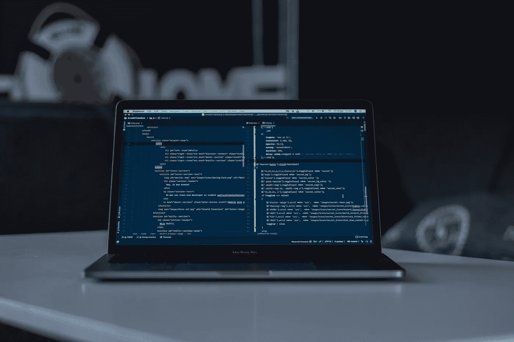

# 作为一名开发人员，实践使我的生产率提高了一倍

> 原文：<https://betterprogramming.pub/practices-that-doubled-my-productivity-as-a-developer-70375a5f0c33>

## 列个清单。工作列表

在 [Unsplash](https://unsplash.com/s/photos/rocket?utm_source=unsplash&utm_medium=referral&utm_content=creditCopyText) 上由 [SpaceX](https://unsplash.com/@spacex?utm_source=unsplash&utm_medium=referral&utm_content=creditCopyText) 拍摄的照片。

做一名开发人员是很难的——尤其是当你在职业生涯的早期发现自己的流程时。我还在经历。富有成效？那就更难了。

作为一名开发人员，你不得不忍受冗长的会议，这些会议消耗了你本可以花在编写代码上的时间，管理层花了太长时间做决策，验收标准模糊不清，等等。这些都是时间吸盘，我们几乎不承认他们最糟糕的:我们的习惯和做法。

这些习惯和做法让我把浪费的时间减到最少，把产出最大化。

# 为每一天设定一个容易定义的、具体的终点

我通常会发现自己在一天当中偷懒。我会每分钟写很多行代码，但过一会儿就会发现自己在看摩托车评论。有一天，我不得不在一天结束前修复一个严重的错误，因为它影响了大量的客户。那一天，我比以往任何时候都工作得更好、更快、更清晰，原因很简单:我有一个具体且易于理解的目标。

我现在知道，当我没有在应该的时候创造出解决方案时，很可能是因为不知道我的目标是什么。一旦我有了一天的目标，可以用一两行文字写出来，我就很有效率。

部分原因是[蔡加尼克效应](https://en.wikipedia.org/wiki/Zeigarnik_effect)，简单来说，该效应认为人类是“寻求封闭的动物”换句话说，我们讨厌开始事情却不去完成它。当你有了明确的标准，你就知道下一步该怎么做了。

这里有一个我如何使用它的例子。当我选择要实现的新功能时，我会写下一个简单的单行目标。我用过的真实例子包括:

*   "更新持久化代码，以便它使用 AndroidX 房间库."
*   "重构特性 X(或者它的一部分),使它使用 MVVM 模式."
*   "为用户 journey X 创建前两个 UI 屏幕."

没有终点线，没有完成，就没有进步。

# 首先创建一个 MVP，然后充实需要的东西

当谈到我的代码看起来和运行时，我总是尽可能的浮华。我每天会花几个小时痴迷于一段十行代码，因为它没有按照我喜欢的方式运行。这种工作方式给我带来的结果与我的初衷完全相反。我不仅工作得更慢，而且我的代码与许多 god 对象纠缠在一起，而且没有解耦，因此更难测试。

相反，我意识到我所要做的就是交付一些有用的东西 MVP(最小可行产品)。这听起来很明显。当然，你应该交付一些有用的东西！但我会忘记的是，这是我必须要做的一切:能完成工作的事情。不多不少。

特别是作为一名初级开发人员，我有时会感到压力，需要使用新奇的组件和库，让我的同事们惊叹不已。但是这会导致过度思考，如果你花太多时间消耗冲刺时间，会影响你当前的任务和未来的任务。

那么我怎么知道什么时候停止工作呢？当一切都…正常的时候。

显然，需要满足一些标准，但我需要的只是这些问题的答案:

*   代码是否遵循正确的架构？
*   bug 是否保持在最低水平？
*   其他人能理解发生了什么吗？
*   是否涵盖了所有用例？

阿诺·弗朗西斯卡在 [Unsplash](https://unsplash.com/s/photos/code?utm_source=unsplash&utm_medium=referral&utm_content=creditCopyText) 上拍摄的照片。

# 尽可能在不同的分支上工作

作为开发人员，您承担的任务越复杂，就越有可能引入致命的错误。致命错误的本质是，它们可能不会出现，直到你的工作被合并到主分支中，并被彻底测试。

当我得到我的第一个主要开发任务时，我很兴奋:重构一个特性以使用 MVVM 并用 Kotlin 编写。然而，我没有足够的经验来知道如何正确地测试我自己的代码，所以当它错误百出时，我把它送到 master 中。几天后，我团队中的测试人员非常愤怒，连续两周我都有大量的 bug 需要修复。我拖了团队的后腿，因为我太懒了，没有正确地测试我的工作，而且由于我所有的变更都被合并了，下一个版本很有可能会被推迟。

然后我意识到，如果我使用一个单独的特性分支，然后把它交给测试人员，我会为自己和团队节省大量的精力和时间。总是尽可能长时间地将新代码放在一个单独的分支上，直到它被彻底测试过。这将允许您更快地进行修复，并从产品构建中隔离致命的错误。

# 永远不要接定义不好的任务

无论何时任何人开始新事物，有一件事是不变的:惯性。我们都以多种方式经历它。当我们需要起床时，我们的身体就像一团没有反应的斑点。当我们想学习新的东西时，我们不能让自己加入一门课程。当我们想节食时，我们会陷入应该吃什么、多久吃一次等细节问题中。

在软件开发中，开始创建新功能所涉及的惰性/阻力通常以多种方式表现出来:必须阅读冗长的 SDK 文档，理解确切的业务需求，或者甚至试图找出需要哪些依赖项。

我不知道你怎么想，但是作为一个开发者，我想做的就是开发。我不想追逐产品所有者，检查 UI 副本/元素，重写验收标准，不停地向后端团队询问 API 等。

我只想发展。

所以每当我接一个任务时，我只在它符合以下标准时才这样做:

*   是否所有的依赖关系都已布局并交付？
*   UI 是否已完成并获得批准？
*   我能轻易地找到负责这项功能的人吗？
*   接受标准有意义吗，如果我在喝醉时阅读它们，我能理解它们吗？
*   如果需要，工具/SDK 是否可以与许可证一起使用？

# 关键要点

*   设定易于定义的任务，不能再进一步分解。这将有助于明确你需要做什么。
*   不要费事做太复杂太花哨的东西。它只需要工作。
*   在不同的分支上工作——尤其是在开发一个新特性时——尽量减少对产品构建的干扰。
*   只接受一个已经准备好所有非代码交付成果的任务。否则，与相关人员交流，使任务处于适合开发的状态。

感谢阅读！我希望这些能帮到你。