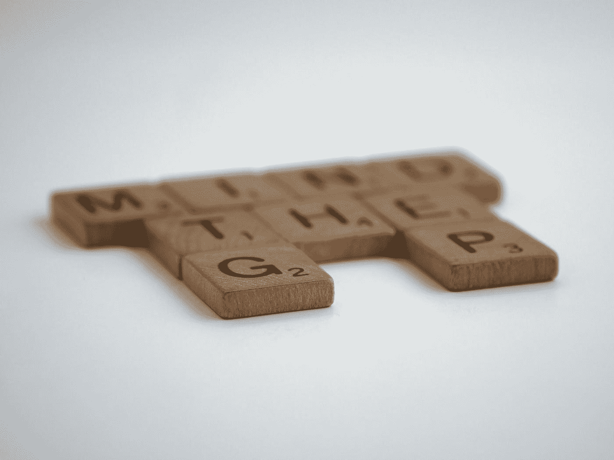
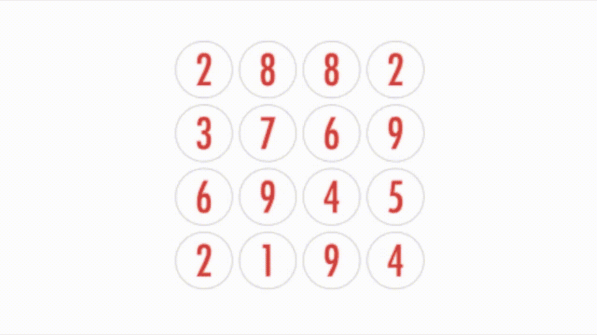

# SwiftUI 中的首选项

> 原文：<https://betterprogramming.pub/preferences-in-swiftui-17b9f1df2b8b>

## 构建一个捉人游戏来演示它们的用法



由[布雷特·乔丹](https://unsplash.com/@brett_jordan?utm_source=medium&utm_medium=referral)在 [Unsplash](https://unsplash.com?utm_source=medium&utm_medium=referral) 上拍摄的照片

我上周写了一篇关于使用拖拽手势的论文。我很高兴地说，它很受欢迎，我决定做一个后续的作品。

现在，我用一个小应用程序来结束它(实际上是标题)，这个小应用程序使用可观察的对象来存储两个视图的坐标，正如你在这里看到的。这些信息被用来制作他们互动的动画。心随着进入对方的空间而微微褪色。


我想在这篇文章中扩展我所做的来构建一个简单的游戏。但更重要的是，我还想看看我在编码时犯的一些错误，并完成一些修复。请继续读下去。

# 介绍

案情摘要

如果你正在写一个简单的棋盘游戏，它很有可能是某种基于磁贴的应用。它将有简单的规则来拖动瓷砖超过对方很像动画 gif 中的两颗心。我想要实现的规则是这个游戏几乎是一样的——只是动作有点不同。我有十六块瓷砖，上面都有数字。当我将一个图块拖过另一个图块时，它会将传入图块上显示的值添加到被拖过的图块上。简单。

但是等等…在我们开始编码之前，让我们更客观地看待这个问题。我需要一个瓷砖网格。我需要能够识别每个瓷砖，并根据需要修改其表现形式。很明显，我需要使用类似几何阅读器的东西来把我的拖拽动作和棋盘放在一起。最终结果应该是这样的:



好吧，在很大程度上，这是相当直接的代码，但有一个讨厌的陷阱。为了存储圆的坐标，我使用了`.onAppear`视图修改器。这就像你看到的那样工作——但是只有当它所基于的界面没有任何可选的视图在移动元素时出现或消失。而且，只有当你的用户不改变设备的方向，任何一个事件都会破坏代码。

所以利用。`onAppear`更新坐标不是正确的解决方案。

## SwiftUI 首选项

但这是正确的解决方法。事实上，这是您需要使用首选项协议全面存储坐标的最终方式。通过这种方式，您可以将附加信息与 SwiftUI 视图相关联。一种协议，通过它可以关联自定义结构。一个协议，我们可以使用它来保存我们的 CGRect，并在情况发生变化时再次查询它(也就是设备的方向或进入帧的另一个视图)。

# 操作方法

真的很简单。我们需要使用两个修饰符，第一个是在构建网格时将坐标保存到一个结构中，第二个是在情况发生变化时更新坐标。显然，我们需要用一个`GeometryReader`的领域来调用它们，以获得我们需要的值。我还使用自定义坐标空间来确保网格和拖动动作网格都映射到同一个空间。

若要编码，请先执行结构:

```
struct CirclePreferenceData: Equatable {
  static func == (lhs: CirclePreferenceData, rhs:   CirclePreferenceData) -> Bool {
  return lhs.viewTag == rhs.viewTag
}
  let viewTag: Int
  let viewBounds: Anchor<CGRect>
}
```

然后将其链接到首选项协议:

```
struct CirclePreferenceKey: PreferenceKey {
  typealias Value = [CirclePreferenceData]
  static var defaultValue: [CirclePreferenceData] = []
  static func reduce(value: inout [CirclePreferenceData], nextValue: () -> [CirclePreferenceData]) {
  value.append(contentsOf: nextValue())}
}
```

最后，我刚刚描述了使用它的代码:

```
.anchorPreference(key: CirclePreferenceKey.self, value: .bounds, transform: { [CirclePreferenceData(viewTag: self.identify, viewBounds: $0)] })}
.onPreferenceChange(CirclePreferenceKey.self) { preferences in
  let p = preferences.first(where: { $0.viewTag == identify })
  let bounds:CGRect = geo[p!.viewBounds]
  newRange[identify] = bounds
}
```

所有这些使我想到了本文的结尾。我包括了两个完整的应用程序副本。第一个用`.onAppear`。第二个例子使用了`.preferences`协议和`view` 修改器。

如您所见，它们本质上是相同的代码，只有少量的更改。注意`Combine` 框架发布者只显示了一次，尽管它在两个部分中都被使用。

代码如下:

使用首选项协议的更改版本如下:

至此，我将结束这一小段。我希望你觉得这篇文章很有用——并且像我写这篇文章一样喜欢阅读它。

祝你愉快。