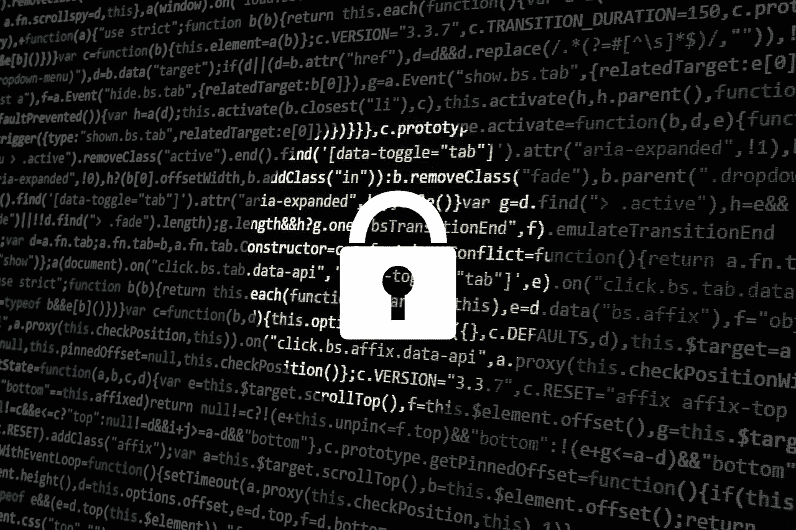

# 隐私和数据保护

> 原文：<https://betterprogramming.pub/privacy-and-data-protection-c4f38678c639>

## 作为开发人员，您可以做些什么来保护您的数据

图片由 [Darwin Laganzon](https://pixabay.com/nl/users/typographyimages-3575871/?utm_source=link-attribution&utm_medium=referral&utm_campaign=image&utm_content=1944688) 通过 [Pixabay](https://pixabay.com/nl/?utm_source=link-attribution&utm_medium=referral&utm_campaign=image&utm_content=1944688) 拍摄

作为一名开发人员，你不仅要确保为你正在构建的应用程序开发正确的功能，还要考虑功能性和非功能性需求。应用程序必须安全，能够快速扩展，具有快速响应时间，并且在负载达到峰值时不会崩溃。在我们生活的这个时代，隐私和数据保护也不可避免地出现在需求列表中。

作为一名开发人员，如果你真的很幸运，你的公司已经雇佣了一名隐私工程师为你做隐私和数据保护工作。但是大部分时候还是要自己动手。了解良好的隐私实践是每个工程师都应该拥有的工具。

> 隐私工程是至少在软件或信息系统领域内的新兴学科，其旨在提供方法、工具和技术，使得工程系统提供可接受的隐私级别。
> 
> [来源:维基百科](https://en.wikipedia.org/wiki/Privacy_engineering)

在本文中，我将从开发人员的角度向您展示如何应对隐私和数据保护。但在我们开始之前，我会给你一个简单的介绍，隐私景观是如何变化的。

# 不断变化的隐私景观

在这个时代，数据在我们的日常生活中发挥着巨大的作用，表现在许多显而易见的方面——例如，当我们在网上购物和下单时输入我们的姓名和地址。

但是数据收集也可能不太明显。

数据经纪人专门为广告商创建个人的深度档案。个人资料可以包含性取向、浏览历史、政治倾向甚至医疗记录等数据。

这给人权带来了挑战。一个挑战与公司使用我们数据的方式有关。互联网的商业模式依赖于人们分享他们的数据，以换取对内容、服务和社交媒体平台的访问。虽然你可能不需要预先支付任何费用就可以上社交媒体平台，但他们仍然通过向广告商出售你的个人信息来赚钱。通过点击服务条款中的“我同意”，用户在技术上同意这种模式。但众所周知，网络上最大的谎言是:“我理解了服务条款”。没有人真正知道他们签署了什么，这就为滥用创造了机会。

随着隐私领域的不断变化，开发人员的任务清单已经扩大。数百万用户的数据被盗。数据泄露时不时会成为新闻。作为开发人员，防止这种情况发生是您的任务。这需要一些措施。

# 对数据透明

对于存储什么数据、存储多长时间以及用于什么目的，保持透明非常重要。提供隐私政策的链接，告诉用户收集的数据会发生什么，这样用户就知道他们在哪里注册了。

我们以一个健康 app 为例。用户可能会对智能手表收集他们的心跳和位置等数据感到高兴。他们可能很乐意分享这些信息，以获得更多关于他们身体健康的信息。然而，如果这些数据在没有得到他们明确同意的情况下被卖给一家跑鞋公司，他们可能不会同意。

在欧洲，公司必须遵守[通用数据保护法规](https://en.wikipedia.org/wiki/General_Data_Protection_Regulation) (GDPR)。该规定于 2018 年 5 月 25 日出台。所有公司，无论属于哪个行业，如果从员工、客户或欧盟其他人员处收集数据，都必须遵守 GDPR。这包括音频和视频，以及文本。

GDPR 给予个人更多的隐私权，应该更好地保护人们的数据。不仅是作为消费者，也是作为平民和雇员。

在美国，这种做法略有不同。隐私的处理因行业而异。例如，医疗保健行业有[健康保险流通与责任法案](https://en.wikipedia.org/wiki/Health_Insurance_Portability_and_Accountability_Act) (HIPAA)保密法律，该行业的公司需要遵守这些法律。

HIPAA 由五个部分组成，也称为标题。标题一和标题二最重要。标题一是关于医疗保健的可获得性、可携带性和可再生性。从开发者的角度来看，标题二是最有趣的。第二章是关于防止医疗欺诈和滥用，行政简化和医疗责任改革。本标题涵盖了数据保护。

这个标题中的规则之一是“隐私规则”。这在很大程度上看起来与 GDPR 规则相同——例如，它赋予个人要求自己的信息或数据以纠正错误的权利。

# 让用户控制他们的数据

收集的数据通常用于向用户提供个性化体验或广告。这些数据可用于创建独特的交互，更紧密地符合用户的兴趣和需求。

让您的用户选择他们的偏好，这样他们就可以选择是否要共享某些信息。以个人资料页面为例。一些用户希望每个人都能看到他们的出生日期。其他人只希望他们的朋友能看到它。让用户控制他们的数据，尊重他们的喜好！

# 如何保护您的数据

作为开发人员，您可以做一些事情来防止敏感数据泄露。在保护数据时，您应该考虑以下五点。

## 区别对待敏感信息

在整个组织内自由共享基本业务数据可能是有意义的，但是对包含个人信息的数据的访问应该区别对待。敏感数据应受到严密保护。这包括访问初看起来不容易被滥用的数据，如客户或用户的姓名和地址。

## 交叉环境数据

不要在其他环境中使用生产数据库中的数据。这包括不在您的本地环境中使用它！保护生产环境中的敏感数据已经够难的了。通过在其他环境中使用生产数据，事情变得不必要的复杂。

如果贵公司必须适用 GDPR ( [通用数据保护条例](https://en.wikipedia.org/wiki/General_Data_Protection_Regulation))，则不允许在生产环境之外的任何其他环境中使用生产数据。

## 加密备份

加密所有备份是一种很好的做法。备份包含大量敏感信息。如果由于某种原因备份遭到破坏，解密备份文件仍然需要很大的努力。可能是太多的努力，以至于已经拿到备份的人都懒得去管了。

您应该足够频繁地进行备份，以确保您可以恢复应用程序而不会丢失大量数据。您的应用程序越重要，您的备份存储方法中就应该包含越多的冗余。

## 限制访问

如果你想保护你的数据，你应该只让授权用户访问数据。这意味着您应该限制对服务器的访问。为每个人创建一个新用户。不要让一个用户被多人共享。确保您授予他们访问他们需要访问的文件夹的权限。不要授予用户不必要的权限。

您还需要确保限制对所有网站环境的访问。您不希望某个随机的人偶然访问测试或验收环境，因为有人错误地配置了 robots.txt 文件。像这样简单的事情被认为是数据泄露。

使用基本的 HTTP 身份验证可以非常容易地限制访问。这需要用户填写用户名和密码才能访问网站。这样你的数据就不会被随机的人窃取。

## 保持软件包和库是最新的

让您的软件包和库保持最新对于确保您的应用程序安全至关重要。过时的软件包和库会造成很多危害。当黑客发现一个漏洞时，他们很乐意滥用这个漏洞，而且会很快做到。永远要尽快修补漏洞！

如果你使用的是第三方软件，比如 CMS，比如 Wordpress，你应该认真对待这个问题。不要等待应用安全补丁。由于大量使用第三方软件，黑客会制造漏洞，试图攻击易受攻击的应用程序。大多数第三方都有详细说明安全问题的邮件列表或 RSS 提要。利用这一点。

开发人员经常使用的管理软件依赖关系的其他流行工具有 Composer、npm 和 yarn。出现在您依赖但没有注意的包中的安全漏洞是最容易被发现的方法之一。确保您的依赖关系保持最新。

## 只收集你需要的数据

这似乎是显而易见的，但我不止一次地看到收集额外的数据，以防添加需要这些数据的新功能。您不收集的数据是您不必保护的数据！不要收集不必要的数据。

一旦您开始收集数据，定期评估您收集的数据被认为是一种良好的做法。如果收集的数据没有被使用，您应该删除这些数据。