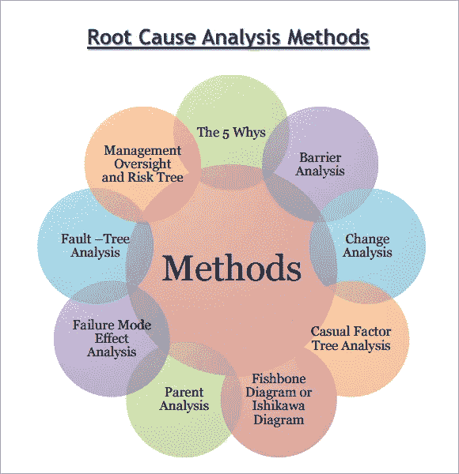

# 像专家一样解决编码问题的 3 个技巧

> 原文：<https://betterprogramming.pub/problem-solving-techniques-b1ed8b4c729f>

## [软件工程](https://rakiabensassi.medium.com/list/software-engineering-7a179a23ebfd)T2&个人发展

## 提出问题，进行根本原因分析，等等

照片由[丹尼斯·詹斯](https://unsplash.com/@dmjdenise?utm_source=medium&utm_medium=referral)在 [Unsplash](https://unsplash.com?utm_source=medium&utm_medium=referral) 拍摄

*“我怎样才能更好地解决问题？我现在理解*[*JavaScript*](/javascript-history-and-future-71b0ceb737aa)*，但是我不能真正解决问题或者理解任何复杂的* [*JavaScript 代码*](/typescript-new-release-19f1238c6a68) *，*最近在我的联系人列表中问我年轻的开发者。

解决问题是我们职业生涯中的一个关键因素，因为编写伟大的代码是一种创造性的艺术，要成为一名伟大的开发人员，你需要成为一名创造性的问题解决者。

> “我看到新程序员犯的最大错误是专注于学习语法，而不是学习如何解决问题。”——v·安东·斯普尔

有时候，当面对困难的挑战时，我们会害怕或不舒服，希望它会消失。我们可能会觉得我们必须想出一个答案，当我们不确定如何找到它时，我们会感到沮丧。

面对问题是提升自己的机会，而不是问题本身。虽然我知道这种技能需要时间和练习，但我也坚信我们不需要等待多年才能掌握它。我和许多初级开发人员一起工作过，他们比他们的前辈更善于解决问题。

幸运的是，有很多方法可以解决我们遇到的任何困难。在本文中，我将分解三种技术，帮助我们像专家一样解决任何复杂问题。但是在我们开始之前，让我们看看专家和新手处理问题的不同之处。

# 专家思维与新手思维

> “大多数人回避问题或随意处理问题。伟大的思想家和领导者会寻找问题，并拥有帮助他们更好地解决问题的框架。”迈克尔·西蒙斯

在他的文章“[思想](https://www.britannica.com/topic/thought)”中，罗伯特·J·斯滕伯格教授解释了这个秘密——根据美国心理学家司马贺、罗伯特·格拉泽和米凯琳·池等人的研究——这使得专家在解决问题的努力中比新手更有效。

## 专家

1.  他们有大量丰富的图式，对事物或事件的有组织的描述，引导人们的思想和行动。这些模式在某种程度上是高度相互关联的，检索一条信息很容易导致检索另一条信息。
2.  他们使用一种**工作推进策略**。
3.  他们**仔细监控他们解决问题的过程**。
4.  他们在特定领域拥有更丰富的知识。
5.  他们分配更多的时间来决定如何表现一个问题— **解决问题的准备阶段**——而花更少的时间来执行解决方案。
6.  他们的思想揭示了问题的更复杂和更精密的表现。
7.  他们更容易达成适当的解决方案。

## 新手

1.  他们使用逆向工作策略:他们从关注目标开始。
2.  他们没有认真监控自己解决问题的情况。
3.  他们花更多的时间来执行解决方案。
4.  他们在达成适当的解决方案方面不太成功。

> “……逆向工作的方法是直接从假设开始。如果你的问题是提高盈利能力，你可能会决定想办法增加收入。因为增加收入可以带来更高的盈利能力。好吧。但是降低成本呢？在决定实现目标的方式之前，你难道不应该了解实现目标的各种方式吗？”—阿诺·谢瓦利埃，“[在解决问题中前进，而不是后退](https://powerful-problem-solving.com/work-forward-in-solving-problems-not-backward/)”

下面是专家们使用的一些技术，这些技术有一个好的问题定义，并有效地应用一个向前工作的策略来解决它。

# 1.问问题

如果你以前尝试过这种方法，那么你可能会注意到，有时问题不是问题本身，而是缺少正确的问题。

在她的书《万物的架构》中，作者 Lenedra J. Carroll 介绍了一个简单的技巧，叫做“12 个其他的”,用来解决问题:

当头脑风暴解决方案时，问自己一个问题，并对该问题产生 12 个答案。然后取一个答案，把它变成一个问题，再生成 12 个答案。重复，直到你可以看到一个清晰的解决方案。

通过这种方式，您可以生成一个问答图，这有助于测试您的假设并构建如何解决复杂问题:

解决问题:问题-答案地图来测试你的假设(图片来源:[强大的解决问题能力](https://powerful-problem-solving.com/case-study-cables-negotiation-part-48-test-your-hypotheses/)

让我们来练习一下，看看有哪些引人注目的问题可以帮助你找到正确的解决方案:

1.  **问题:**我的 web app 有[性能差](/angular-onpush-change-detection-f629cbce0bfa)。
    → **问题 1:** 为什么？答:因为捆的尺寸大。
    → **问题二:**如果捆绑包的大小是原因，那么为什么我部署 app 并开始运行之后性能就直接不可怕了，而不是用了几个小时之后？回答:更有可能是别的原因。这可能是内存泄漏和垃圾收集问题。
    → **问题 2:** 我的 app 哪个部分对这些内存泄露负责？回答:我们用 [Chrome DevTools](/build-me-an-angular-app-with-memory-leaks-please-36302184e658) 来了解一下吧。
2.  **问题:**我没有进行日常锻炼。
    → **问题 1:** 为什么？回答:这是因为我的全职工作压力很大，找不到时间做这件事。
    → **问题二:**如果我的工作是原因，那我为什么不在周末和节假日做？回答:原因是拖延，不是时间不够。
    → **问题 3:** 我如何克服拖延症？
3.  **问题:**我想拥有高度的自尊。
    → **问题:***高自尊会帮助你达到什么目标？如果你突然有了超级高的自尊心，你能做什么(或者做得更好)？我问这个问题是因为，归根结底，培养高度自尊的最好方法是表现得好像你已经拥有了一样。*——[尼克·维格纳尔，建立高度自尊的 7 种方法](https://nickwignall.com/high-self-esteem/)

# 2.根本原因分析

在开始解决问题之前，我们需要先了解问题的根源。我们经常在多次试验后发现原因与我们预期的不同。

通过消除错误的原因，我们将对我们的问题有一个更好的定义，并更接近解决方案。根本原因分析方法有助于避免浪费时间和精力在错误的地方进行修复。

根本原因分析法(图片来源:[问题解决&根本原因分析](http://www.sardarsolutions.com/el-panamericano)

根本原因分析方法的例子(图片来源:[维基共享资源](https://en.wikipedia.org/wiki/Root_cause_analysis#/media/File:Root_Cause_Analysis_Tree_Diagram.jpg)

在编程中，当我们必须修复一个 bug 时，我们使用以下实践作为根本原因分析:

*   确定问题是在哪个环境中发现的——您可能需要询问最终用户——并尝试在相同和不同的环境中再现该问题，以便更好地理解它。
*   交互式调试。
*   日志文件分析。
*   单元和集成测试。
*   [分析捆绑文件](/frontend-architecture-376e6323ef9b)如果问题与网页性能有关。

# 3.用谱思维代替二元思维

二元思维总是把事情放在两个通常相互排斥的选项中。有时这是有效的；但在其他时候，这是一种错误的简化。

二元思维([图片来源](https://medium.com/change-your-mind/binary-vs-spectrum-thinking-f9b8226d922))

二元思维的对立面是*谱思维*。它考虑了多种选择、替代方案和可能性。它允许我们从非此即彼的状态转换到两者皆有、两者之间、两者皆有或两者皆无的状态。

光谱思维([图片来源](https://medium.com/change-your-mind/binary-vs-spectrum-thinking-f9b8226d922))

通过培养自己的光谱思维，你会更有创造力，并且你会惊讶于你可以应用的不同方法和解决方案的数量，来修复一个 bug，一个冲突，或者拿出满足最终客户的实现或设计。

这里有一个例子:

*   **二进制:**我必须打开一个对话框或一个带有箭头返回的新页面，以显示更新订单的视图。
*   **Spectrum (other):** 我可以在一个新的标签页中打开视图，允许用户更新订单，而无需关闭显示整个订单列表的视图。
*   **Spectrum(两个& other):** 我可以实现一个具有 3 种布局风格的动态模板，并让用户可以配置它，选择他们是否想在对话框中打开更新视图，一个带向后箭头的新页面，或一个新标签。(下面是这个解决方案的一个实现:[如何构建一个有 3 种布局风格的应用](/angular-dynamic-layout-with-ngtemplate-8b6faa995a8f)

二元思维和谱思维各有利弊，可以配对在一起。关于这两种模式的更多细节和关于如何应用它们的许多例子可以在本文中找到:“[谱思维如何提高我们的沟通、决策和解决问题的技能](https://medium.com/change-your-mind/binary-vs-spectrum-thinking-f9b8226d922)”

# 最终想法

解决问题是一个超越了软件开发的狭隘范畴的问题。这项技能高度依赖于我们的心态和态度，要想做得更好，首先要对我们面临的挑战保持更多的好奇而不是沮丧。

> “问题就像路上的一个弯道。好好把握，你会发现自己在接下来的直道中状态很好。走得太快，你的身材可能就没那么好了。”— [蒂姆·希克斯](https://www.mediate.com/articles/thicks.cfm)

劳拉·巴里在 [Unsplash](https://unsplash.com?utm_source=medium&utm_medium=referral) 上拍摄的照片

🧠💡感谢阅读！我为一群聪明、好奇的人写关于工程、技术和领导力的文章。 [**加入我的免费电子邮件简讯，独家获取**](https://rakiabensassi.substack.com/) 或在此注册媒体[。](https://rakiabensassi.medium.com/membership)