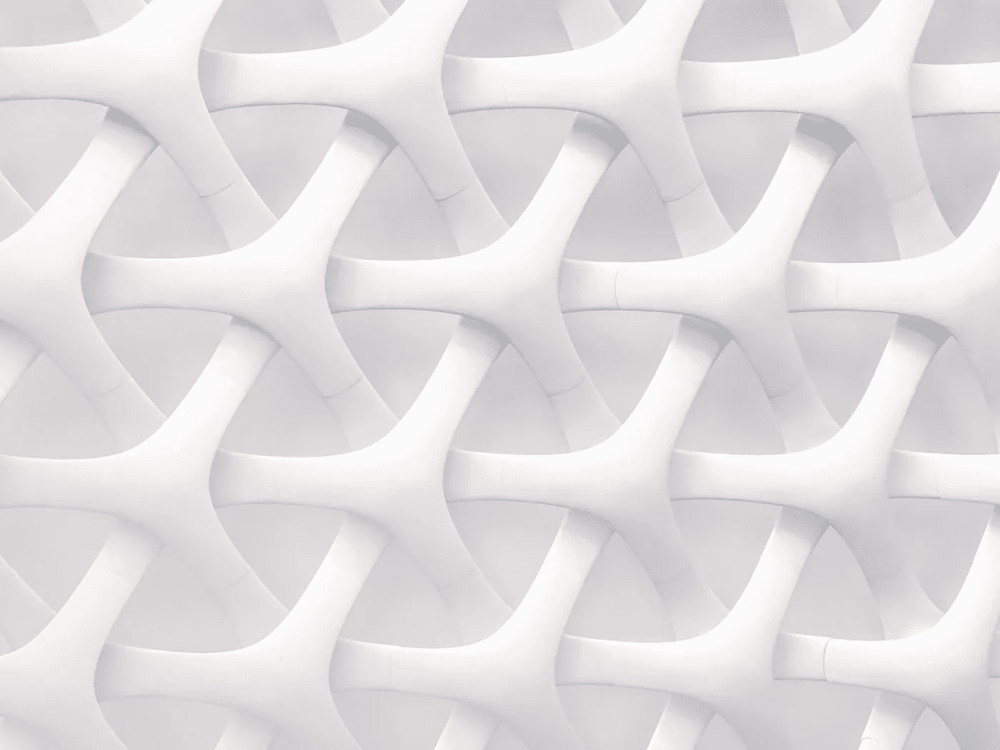

# 什么是代理设计模式？

> 原文：<https://betterprogramming.pub/proxy-design-pattern-and-how-to-use-it-acd0f11e5330>

## 代理控制对对象的访问，并可以在使用对象之前或之后执行各种操作

照片由 [JJ 英](https://unsplash.com/@jjying?utm_source=unsplash&utm_medium=referral&utm_content=creditCopyText)在 [Unsplash](https://unsplash.com/s/photos/pattern?utm_source=unsplash&utm_medium=referral&utm_content=creditCopyText) 上拍摄

这可能是一个无需更改类本身就能扩展其功能的解决方案。代理与原始类共享相同的接口，因此它们可以互换使用。它给了我们很大的灵活性，并且不会产生紧耦合。

代理对于以下任务非常有用:

*   记录
*   捕捉异常
*   贮藏
*   在调用某个方法之前或之后调度事件
*   访问验证

假设我们有一个允许对文件进行基本操作的系统。

为了简单起见，每个方法都不返回任何东西(甚至`get`)。我们的实现将只记录每个方法调用。

一切都运行良好，但我们的系统缺乏验证。我们希望只允许选定的登录用户访问文件。我们可以修改`FileProvider`并添加验证，或者保持它的简单并将该逻辑移到另一个类中。这是代理模式的一个很好的用例。

它将使用一个单独的类来负责验证。这种方法将使我们的代码更加符合单一责任原则(SRP)。

在代码中直接使用超级全局变量并不是一个好的做法，但是我们希望这个例子尽可能的简单和简短，并且在没有任何中介的情况下使用`$_SESSION`。

一切似乎都被设定好了。为了测试我们的应用程序，我们还需要一个简单的组件来帮助我们授权用户。

现在让我们看看我们的应用程序在运行。

我们的文件很安全。一切都如预期的那样工作。我们的代理模式包含以下元素:

*   Subject ( `File`):为我们真正的 Subject 和 Proxy 定义公共接口
*   真实主语(`FileProvider`):实现主语
*   Proxy ( `AuthFile`):保存对真实主题的引用，并共享主题接口

# 优势

*   允许在不修改对象的情况下扩展其功能
*   促进职责分离
*   您可以根据用例为一个对象创建多个代理，并在运行时附加它们

# 资源

完整的源代码和其他一些模式可以在这里找到:

 [## jkapuscik 2/设计-模式-php

### 这个项目是一组在现实世界中使用不同设计模式的简单例子。每个人都有一个…

github.com](https://github.com/jkapuscik2/design-patterns-php) 

如果您想了解一些更有用的设计模式，您可以在以下文章中找到它们:

*   [工厂方法](https://medium.com/@j.kapuscik2/getting-started-with-design-patterns-in-php-4d451ccdfb71)
*   [创作模式](https://medium.com/@j.kapuscik2/creational-design-patterns-in-php-db365d3245ce)
*   [观察者](https://medium.com/@j.kapuscik2/observer-pattern-in-php-2ba240f89fb2)
*   [迭代器](https://medium.com/@j.kapuscik2/iterator-pattern-in-php-b7624f6bdbcf)
*   [状态&策略](https://medium.com/@j.kapuscik2/state-strategy-design-patterns-by-example-f57ebd7b6211)
*   [模板方法](https://medium.com/@j.kapuscik2/template-method-pattern-in-php-6116fd7e8ccc?source=friends_link&sk=ac4c483446bd5a5323c09a662bd54116)
*   [飞锤](https://medium.com/swlh/flyweight-design-pattern-in-php-edcda0486fb0?source=friends_link&sk=a0fa3083d5afd7e41af8a4f7a1df05f1)
*   [装饰者](https://medium.com/better-programming/decorator-c04fae63dfff)
*   [依赖注入](https://medium.com/better-programming/dependency-injection-8f09a93ec995)
*   [复合](https://medium.com/swlh/composite-908878748d0e)
*   [适配器](https://medium.com/swlh/building-cloud-storage-application-with-adapter-design-pattern-8b0105a1bda7)
*   [立面](https://medium.com/better-programming/what-is-facade-design-pattern-67cb09ce35d4)
*   [桥](https://medium.com/better-programming/what-is-bridge-design-pattern-89bfa581fbd3)
*   [责任链](https://medium.com/@j.kapuscik2/what-is-chain-of-responsibility-design-pattern-ff4d22abd124)
*   [来访者](https://medium.com/@j.kapuscik2/what-is-visitor-design-pattern-8451fb75876)
*   [命令](https://medium.com/@j.kapuscik2/what-is-cqrs-command-design-pattern-5d400fd9f93a)
*   [空对象](https://medium.com/@j.kapuscik2/what-is-null-object-design-pattern-f3b4d3d28636)
*   [流畅的界面](https://medium.com/@j.kapuscik2/what-is-the-fluent-interface-design-pattern-2797645b2a2e)
*   [规格](https://medium.com/@j.kapuscik2/what-is-the-specification-design-pattern-4051dd9e71c3)