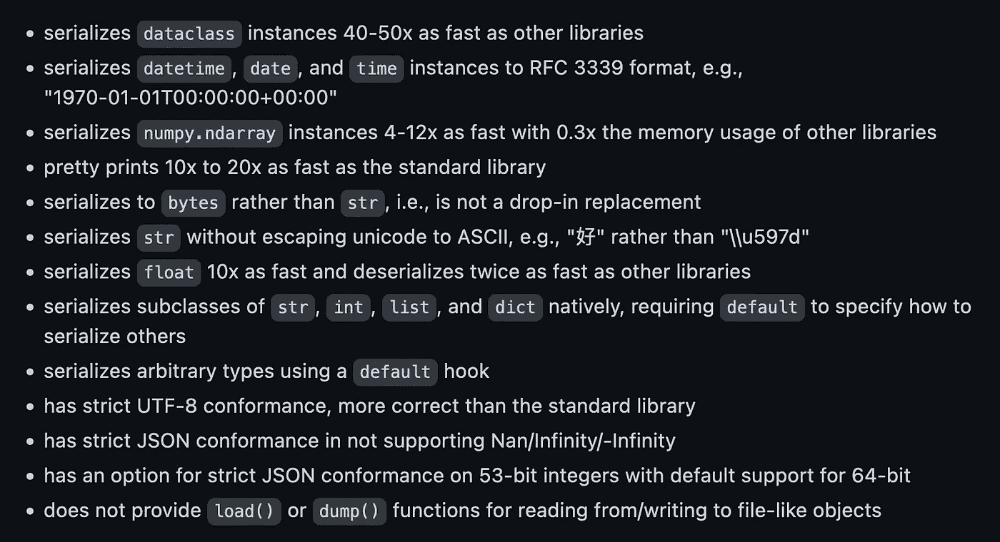

# Python 模块使得处理 JSON 更快

> 原文：<https://betterprogramming.pub/python-modules-that-make-handling-json-even-faster-f577d8948a5>

## 不仅仅是普通的 JSON 库


照片由[费伦茨·阿尔马西](https://unsplash.com/@flowforfrank?utm_source=unsplash&utm_medium=referral&utm_content=creditCopyText)在 [Unsplash](https://unsplash.com/s/photos/json?utm_source=unsplash&utm_medium=referral&utm_content=creditCopyText) 上拍摄

解析 JSON 是软件开发的必然之恶。如果你正在与一个 API 交互，在主机之间发送消息或者抓取数据，那么它可能在 JSON 中。Python 附带了标准的`json`库，在大多数情况下，这已经足够了，但是对于某些场景，您可能想要更灵活、更快一些的东西。

如果您正在构建一个需要大量 JSON 的应用程序或库，那么投资一个更健壮的模块是值得的。在这篇文章中，我们将看到一些杰出的模块，它们可以让你以普通模块无法想象的方式分割 JSON。这些模块中的一些在速度上也比标准的`json`库有了显著的提高。

## 1.[奥逊](https://github.com/ijl/orjson#install)

[](https://github.com/ijl/orjson) [## GitHub - ijl/orjson:快速、正确的 Python JSON 库，支持 dataclasses、datetimes 和 numpy

### orjson 是一个快速、正确的 Python JSON 库。它作为 JSON 最快的 Python 库进行了基准测试，并且更…

github.com](https://github.com/ijl/orjson) 

如果你要处理大量复杂的 JSON 对象，并且需要事情发生得*超快*，那么`orjson`模块就是为你准备的。这个模块比默认的 Python `json`库更快，并且能够处理许多不同的数据类型(包括 NumPy)。

这个库的主要好处是速度和效率，它有一些令人印象深刻的统计数据:



[来源](https://github.com/ijl/orjson)。

虽然这不是默认的`json`模块的直接替代，但速度和效率的好处使它对数据管道特别有吸引力。如果您正在与解析瓶颈作斗争，那么这可能是您的模块圣杯。

## 2.[玉米饼](https://github.com/tortilla/tortilla)

[](https://github.com/tortilla/tortilla) [## GitHub - tortilla/tortilla:轻松包装 web APIs。

### 包装 web APIs 变得容易。通过 pip 安装:PIP 安装玉米粉圆饼快速使用概述:玉米粉圆饼使用一点…

github.com](https://github.com/tortilla/tortilla) 

玉米粉圆饼太棒了，它会让你说:“*我的一生都在哪里！？*”。这个模块将接受几乎所有的 API，并对其进行包装，这样您就可以像使用一组普通的 Python 方法一样使用它。最好的一点是，结果被存储为普通属性，这样您就可以访问它们，而不必将任何原始的 JSON 放入适当的位置。

这个模块很神奇。如果你一直在一遍又一遍地手工构建自己的客户端 API 解析逻辑，那么停下来，后退一步，现在就尝试这个模块。

查看一个例子，了解玉米饼如何轻松地与 [JSONPlaceholder API](https://jsonplaceholder.typicode.com/) 一起工作:

```
import tortillaapi = tortilla.wrap('https://jsonplaceholder.typicode.com')todo = api.todos(1).get()print(todo)>>> {'userId': 1, 'id': 1, 'title': 'delectus aut autem', 'completed': False}
```

你所需要做的就是提供玉米粉圆饼的基本网址，它会自动为你包装好。就像真的玉米饼一样！

## 3. [jsonpickle](https://github.com/jsonpickle/jsonpickle)

[](https://github.com/jsonpickle/jsonpickle) [## GitHub-JSON pickle/JSON pickle:Python 库，用于将任意对象图序列化为…

### Python 库，用于将任意对象图序列化为 JSON。它可以接受几乎任何 Python 对象，并把…

github.com](https://github.com/jsonpickle/jsonpickle) 

这个模块真的很酷，让 pickling Python 对象更具可读性。大多数其他 pickle 库将以不可读的格式存储序列化数据。打开其中一个文件，你会看到随机的垃圾。

`jsonpickle`模块将以人类可读的 JSON 格式存储相同的 pickled Python 对象。您将能够打开序列化的对象并实际读取它们，而不仅仅是看到乱码。

例如，假设我们创建了以下类和对象:

```
class Foo:
    self.bar = 1foo = Foo()
```

如果我们想将这个基本对象序列化为 JSON，我们可以使用`jsonpickle`很容易地做到这一点:

```
import jsonpicklejsonpickle.dumps(foo)>>> '{"py/object": "__main__.Foo", "bar": 1}'
```

如果您想序列化对象，但让它们继续被一些外部进程、索引器或人读取，这是非常方便的。

## 4. [jsondiff](https://github.com/xlwings/jsondiff)

[](https://github.com/xlwings/jsondiff) [## GitHub-XL wings/JSON Diff:Python 中的 Diff JSON 和类 JSON 结构

### Python 中的 Diff JSON 和类 JSON 结构。在…上创建一个帐户，为 xlwings/jsondiff 的开发做出贡献

github.com](https://github.com/xlwings/jsondiff) 

假设你正在和一大堆 JSON 争论。假设你需要找出这个斑点和你刚刚收集的另一个斑点有什么不同。你可以自己浏览内容，试着找出变化，或者你可以采取更明智的方法:使用`jsondiff`模块。

这个模块为您提供了快速区分两个不同 JSON 对象的能力。假设您有以下 JSON blobs:

```
blob_1 = {'one': 1, 'two': 2, 'three': 3}
blob_2 = {'one': 1, 'two': 22, 'three': 3}
```

我知道发现差异很容易，但是让`jsondiff`模块为我们找到它:

```
import jsondiffjsondiff.diff(blob_1, blob_2)>>> {'two': 22}
```

想象一下用一个包含数千个字符和大量嵌套对象的 blob 来做这件事。没有`jsondiff`就像大海捞针。使用这个模块的另一个好处是，您可以以编程方式寻找差异，并在 API 错误进入生产环境之前捕获它们。

## 5.[根森](https://github.com/wolverdude/GenSON)

[](https://github.com/wolverdude/GenSON) [## GitHub-wolverdude/GenSON:GenSON 是一个强大的、用户友好的 JSON 模式生成器，内置于…

### GenSON 是一个强大的、用户友好的 JSON 模式生成器，内置于 Python 中。GenSON 的核心功能是把 JSON…

github.com](https://github.com/wolverdude/GenSON) 

当您处理大量 JSON 数据时，您可能还想为 JSON blobs 设置特定的格式和类型。实现这一点的方法之一是生成一个 JSON 模式。使用模式，您可以为整个 JSON 结构指定字段类型、需求和其他属性。

用 Python 生成 JSON 模式的一个很好的库是 [GenSON](https://github.com/wolverdude/GenSON) 模块。该模块允许您使用非常简单的构建器语法生成 JSON 模式。现在让我们构建一个简单的模式:

```
from genson import SchemaBuilderschema_builder = SchemaBuilder()
schema_builder.add_schema({"type": "object", "properties": {}})
schema_builder.add_object({"my_obj": 123})schema_builder.to_schema()>>> {'$schema': '[http://json-schema.org/schema#'](http://json-schema.org/schema#'), 'type': 'object', 'properties': {'my_obj': {'type': 'integer'}}, 'required': ['my_obj']}
```

在这里，我们构建了一个非常小的模式，但仍然是一个模式。它包含一些基本信息，如模式引用和相关对象的类型信息。

构建一个 JSON 模式会变得非常复杂。有关类型和其他模式约定的更多细节，请查看官方 JSON 模式文档。

感谢阅读！如果你喜欢这篇文章，请[关注](https://tateg.medium.com/follow)和[订阅](https://tateg.medium.com/subscribe)了解更多内容。在你离开之前，看看我下面的其他一些帖子:

*   [*5 你应该使用的云 API 开发工具*](https://medium.com/geekculture/5-cloud-api-development-tools-you-should-use-a3f89d8a6076)
*   [*如何使用 Python 轮询套接字*](/how-to-poll-sockets-using-python-3e1af3b047)
*   [*5 个让日常编码更简单的 Python 库*](https://medium.com/geekculture/5-python-libraries-that-make-everyday-coding-simpler-a04064c305c)