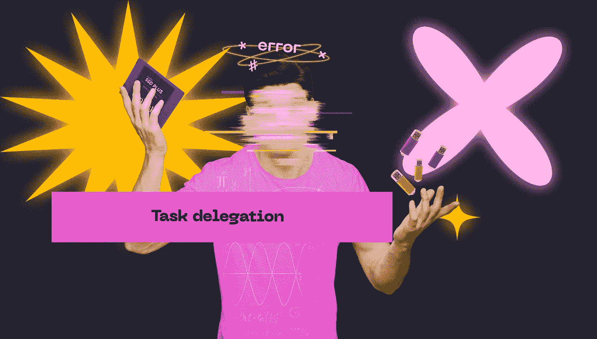
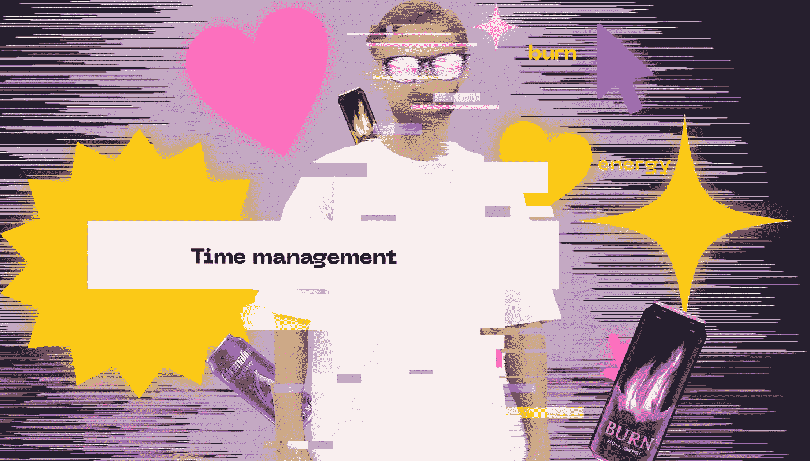

# 一个 QA 领导的急救包来治疗小疼痛

> 原文：<https://betterprogramming.pub/qa-leads-first-aid-kit-little-pains-and-how-to-cure-them-ba94342b0dd4>

## 请继续阅读，以避免这些伤害

茱莉亚·扎布洛娃在 [Unsplash](https://unsplash.com?utm_source=medium&utm_medium=referral) 上的照片

想象一下——你在一个阳光明媚的早晨醒来，意识到你终于变成了它。不，不是蟑螂(就像卡夫卡的故事里那样)。然而，情况可能更糟。你已经成为领导了。

领导有痛苦，可以用不同的方式对待。最常见的是经验和糟糕的工作。虽然第一个选项相当慢，但第二个选项相当令人不快。总之你要么走长，要么经历痛苦。我会尽量缩短你的路径，并分享一些帮助我解决问题和日常领导痛苦的技巧。

# 痛苦 1:接下来是什么？

所有图片由作者提供

*“嗯，祝你好运。那支队伍现在是你的了。让我握握你的手！”*——老板在离开之前对夕阳说。

平静地呼吸，不要表现出恐惧(他们会感觉到的)。假装你刚刚赢得了魁地奇杯。你要做的是:

你开始了一个新项目和一个新团队。你的第一步也是最重要的一步是会见你的员工。最好的解决方案是举行一对一的会议，找出你的员工的能力:他们的目标、兴趣和优势。根据会议的结果，你可以制作员工档案。

会见老板和客户。重要的是一开始就要弄清楚:你负责什么，客户如何看待这项工作，以及最终的结果。这很重要，因为每一方对正在发生的事情的理解可能是不同的。这就是为什么需要找到共同点。

了解关于产品和项目的一切。如果项目中有几个产品，你需要确定优先级、关键度量、指标和团队成员。

处理技术输入:测试数量、自动测试及其要求，以及质量标准。当然，你需要修补过程:项目进行得怎么样了；如何设定新任务；是否与开发团队进行了沟通，沟通是如何进行的；如何提交报告(是否有报告，是否有必要等。)

分析团队。重要的是要看阵容和技术组合。有时候还得加固。如果没有足够的人，你需要雇佣更多的人，进行招聘过程。同时，不要忘记——最好把 80%的时间投入到那些带来 80%成果的员工身上，发展他们，并把他们引向正确的方向。

管理风险。有一种东西我们称之为公车因素，在你的团队中消除它是非常重要的。这里有一个例子:一个人退出了这个过程，一切都停滞了。在人与人之间分配责任是非常重要的。换句话说，就是把它系统地“传播”给人民。此外，给人们不同复杂程度的任务也很好。这将有助于避免例行公事和无聊的工作，如果他们突然决定离开，你也不必在他们背后哭泣。

# 痛苦 2:招聘

对于销售线索来说，一个相当严重的痛苦是招聘，因为很少有人知道如何在不犯错的情况下聘用一个人。他们不知道面试时该问什么，也不知道一般该找什么。这很难，因为在短短的一两个小时里，你要了解候选人是否适合这个团队，他们是否能和其他人一起工作，他们是什么样的人。除此之外，你还需要测试他们的软硬技。

## 做什么

我必须马上说，我不知道一个通用的解决方案。很可能，根本就不存在。我认为每个人都有自己的方法。我将分享我独特的“轻松招聘”秘诀:

## 1.创建候选人简介

写下他们应该具备什么样的性格来适应公司的氛围，以及他们应该具备什么样的硬技能来加入这个项目(尤其是如果你像我一样在外包公司工作)。

## 2.写一份问题清单

即兴发挥是好的，但我还是强烈建议你根据具体的成绩提前给考生列一个问题清单:理论、工具、实际任务。在这些问题的帮助下，你需要检查的不是一个人刚刚记住了什么，而是在什么情况下他们可以制定解决方案，以及他们通常是如何思考的。因此，你会立即切断那些只是为了钱或飞来“加入 IT 圈”

## 3.观察候选人

在面试过程中，看着对方很重要:他们是否打开或关闭了摄像头，他们如何回答问题和构思。如果他们紧张或自信。很明显，每个人在面试时都会有点紧张，但尽管如此，通过观察候选人，你可以了解他们是什么样的人，他们有什么软技能(至少，他们是否足够)。

还有一点:你需要相信你的直觉。如果一个人看起来很奇怪，那么最大的可能(90%)，不仅仅是看起来。他们可能会在未来表现出他们的真实本性，制造一些愚蠢的情况。

# 痛苦 3:一对一会议

与你的团队建立信任关系是非常重要的，因为这可以增加动力，从而影响工作效率和产品质量。这就是为什么一对一的会议非常有用，但许多人不知道如何(以及为什么)举行会议。

## 做什么

这件事最重要的是规律性。如果做了一次就放弃了，那就不行了。最好是每月举行一次这样的会议(或者在有新员工的情况下更频繁)。

## 如何举行会议

大多数时间，员工不得不发言，而不是领导。你需要和员工讨论重要的问题:他们的动机和消极，喜欢和不喜欢，等等。这里最重要的事情不是谈论项目，而是谈论困难和解决困难的方法。你可以问一些尴尬的问题，这些问题可能会揭示一些困难而重要的话题。

你需要为会议做准备。就你们讨论的内容写下一个计划和一些行动要点。你也可以谈论职业发展、薪水、前景、为员工制定个人发展计划等。

总结:会议是掌握在好手中的很酷的工具。

# 痛苦 4:任务委派

在十之八九的情况下，专家在成为高级主管后会成为主管。因此，他们很难从他们需要管理和分配任务，而不是执行任务的事实中抽象出来。

许多人不知道如何“分离”自己:“如果我是做这件事的最佳人选，我怎么能委派这项任务呢？”

## 做什么

这是最好的解决方案:相信你的团队，然后…就这样。培养员工的更多能力和硬技能。请记住，领导的任务是管理。例如，如果一个人是新来的，你只需要在他们身后安排一个导师来帮助监督他们的工作。

有必要定期举行会议来监测进展情况。当然，在开始时，你不能简单地把他们放在发布和关键模块上，但是随着时间的推移，你必须增加他们在项目中的参与。只要检查结果，看看他们做什么。以后，你就不会害怕给他们困难的任务了。

如果一个人不是新来的，你需要分配任务。这就是卡(我上面提到的)派上用场的地方。他们清楚地表明每个人能做什么和他们的潜力。例如，如果一个人在移动电话方面很强，他们需要接受移动测试，如果他们想在自动测试方面有所发展，那么就给他们自动测试。

# 痛苦 5:时间管理

嗯，也许这不是一个痛苦，但是当团队外包，项目很多的时候，这是一件相当重要的事情。关于人员流动、团队激励、招聘、发展路径和其他一切问题都需要时间和适当的时间管理。而你一天还是只有八个小时:)。

## 做什么

就在目前的情况下工作。例如，不要试图做一项需要四个人却只有三个人的工作。尽可能专注于招聘。去社会服务中心继续寻找这个人。如果有人要累垮了，你得让他们振作起来——提升这个员工，改变任务，等等。

但是如果一些项目停滞不前，你可能需要看一看过程——检查它们是否工作。思考什么需要改进，并向客户提供您的愿景:“在这里，我们将把流程发送到费率任务或提前下班，这样质量和速度就会提高。”要记住的主要事情是，你总是可以改进、发明或纠正某些东西。最重要的是明智地管理你的时间。

# 今天最后的痛苦:人为因素

这可能有点老套，但我能做什么？我们都只是人类。即使是你。这是一件需要记住的事情。总会有人搞砸了，没抓到什么，失败了，这是可以的(如果不是反复发生的话。在这种情况下，我们返回到本文开头，再通读一遍)。我还没有见过一个团队像钟表一样运转。

你必须为此做好准备。否则，神经系统将无法生存，有一天你会发现自己进入森林，为海狸建造大坝，收集球果。

*感谢阅读。敬请关注更多内容。*