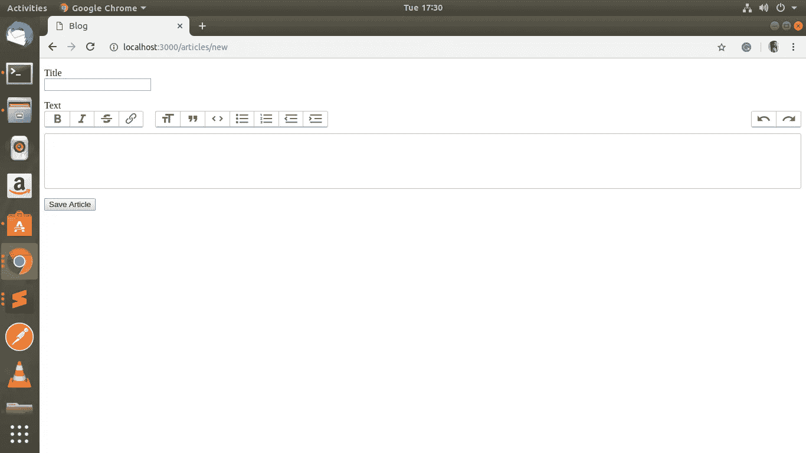
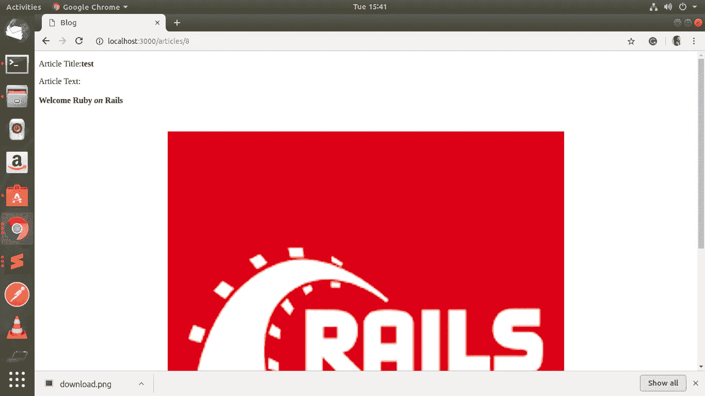

# 快速浏览 Rails 6.0 的操作文本

> 原文：<https://betterprogramming.pub/quick-look-at-action-text-in-rails-6-0-12a8f9f7597f>

## 将富文本内容和编辑引入 Rails

[Rails 6.0](https://weblog.rubyonrails.org/) 来了！稳定版于 4 月 30 日发布。Rails 6.0 beta1 于 1 月 15 日发布。Rails 6.0 版本是一个动作包，Rails 版本总是如此。新推出的有两大框架:[动作邮箱](https://weblog.rubyonrails.org/2018/12/13/introducing-action-mailbox-for-rails-6/)和[动作文本](https://weblog.rubyonrails.org/2018/10/3/introducing-action-text-for-rails-6/)。在这篇文章中，让我们通过在一个小应用程序中使用动作文本来快速浏览一下。


礼貌:维基百科

## 行动文本

动作文本让我们可以将丰富的文本内容和编辑功能引入 Rails。这意味着我们可以执行格式化文本、嵌入图像、格式化链接、向文本字段添加列表和其他类似编辑器的功能。

这是通过在框架中包含 [Trix 编辑器](https://github.com/basecamp/trix)来实现的。Trix 编辑器生成的 RichText 内容保存在它自己的 RichText 模型中，该模型与应用程序中任何现有的活动记录模型相关联。使用[活动存储器自动存储所有嵌入的图像或其他附件。](https://edgeguides.rubyonrails.org/active_storage_overview.html)

让我们开始构建我们的 Rails 应用程序，这将是一个博客应用程序。该应用程序是在 Rails 6.0 中创建的，因此 ruby 版本必须大于 2.5。

在终端类型中:

```
rails new blog --edge
```

`-- edge`标志获取最新的 rails 版本或 rails 的 edge 版本。

操作文本要求安装 web packer 和 ActiveStorage。Rails 应用程序中已经存在活动存储。因此，我们需要在 gem 文件中包含以下内容:

```
gem “image_processing”, “~> 1.2” #uncomment from Gemfile
gem ‘webpacker’
```

现在运行:

```
bundleinstall**.**
```

接下来，我们需要创建一个 config/webpacker.yml:

```
bundle exec rails webpacker:install
```

现在让我们启动我们的 Rails 服务器。


很好，现在让我们快速构建我们的应用程序。它将只有一个模型文章。

让我们为文章创建一个控制器:

```
rails g controller Articles index new create show edit update destroy — no-helper — no-test-frameworks
```

然后配置我们的路线:

```
Rails.application.routes.draw do
 resources :articles
end
```

接下来，我们需要创建我们的模型。我们的文章模型将有两个字段:**标题**和**文本**。文本必须是接受 rtf 格式的字段。所以在迁移中，我们只需要添加标题字段。文本字段将由 ActionText 处理。

让我们生成模型:

```
rails g model Articles title:string — no-test-framework
```

然后运行迁移:

```
rails db:migrate
```

现在让我们添加 ActionText 部分。第一次运行:

```
rails action_text:install
```

这将添加操作文本所需的所有依赖项。最值得注意的是，它添加了一个新文件**JavaScript/packs/application . js**和两个动作存储迁移。


使用以下命令再次运行迁移

```
rails db:migrate
```


现在我们可以添加模型的文本部分。进入 **app/models/article.rb** 添加下面一行

`has_rich_text **:text**`

`text`是我们提供的字段名称。它可以是任何东西，如正文或内容等。

现在我们的模型变成了:

```
class Article < ApplicationRecord
 has_rich_text :text
end
```

在构建表单之前，让我们为创建文章创建控制器逻辑:

```
class ArticlesController < ApplicationController

 def create
   @article = Article.new(article_params)
   @article.save
   redirect_to @article
 end private
 def article_params
   params.require(:article).permit(:title, :text)
 endend
```

我们现在可以为博客创建表单了。在**app/views/articles/new . Rb**中添加如下表单代码:

```
<%= form_with scope: :article, url: articles_path, local: true do |form| %><p>
    <%= form.label :title %><br>
    <%= form.text_field :title %>
  </p>

  <p>
    <%= form.label :text %><br>
    <%= form.rich_text_area :text %>
  </p>

  <p>
    <%= form.submit %>
  </p>
<% end %>
```

注意，对于文本字段，我们使用的是由动作文本提供的 **form.rich_text_area** ，。

让我们呈现我们的页面:



厉害！

我们现在有一个文本编辑器来创建我们的文章。

在我们开始使用编辑器之前，让我们快速实现博客的 **show** 功能，这样我们就可以看到我们创建的文章。

在**app/controllers/articles _ controller . Rb**中增加以下功能:

```
 def show
   @article = Article.find(params[:id])
 end
```

我们需要为此创建一个视图。创建文件**app/views/articles/show . html . erb**并添加以下代码:

```
<p>Article Title:<strong><%= @article.title %></strong></p>
<p>Article Text:<strong><%= @article.text %></strong></p><%= link_to ‘Create new’,new_article_path %>
```

就这样，我们的应用程序完成了。现在让我们检查 ActionText 提供的文本编辑器中的各种可用功能:


我们可以看到，ActionText 提供了普通富文本编辑器的几乎所有功能——将文本格式化为粗体、斜体、添加删除线、引号、链接、拖放图像等。

保存后，我们可以在显示页面看到保存的文章:



太好了！

这是一个展示 ActionText 潜力的小例子。我希望这有所帮助——试一试吧！

绝大多数 web 应用程序都以某种方式处理丰富的内容，所以我相信 Rails 的这一新功能可以让许多开发人员的生活变得更加轻松。

向 DHH 和所有幕后的牛人致敬。

[https://github.com/amkurian/Rails-6.0_action_text_demo](https://github.com/amkurian/Rails-6.0_action_text_demo)

一些有用的链接:

[](https://edgeguides.rubyonrails.org/action_text_overview.html) [## 动作文本概述- Ruby on Rails 指南

### 操作文本概述本指南为您提供了开始处理富文本内容所需的全部内容。之后…

edgeguides.rubyonrails.org](https://edgeguides.rubyonrails.org/action_text_overview.html)