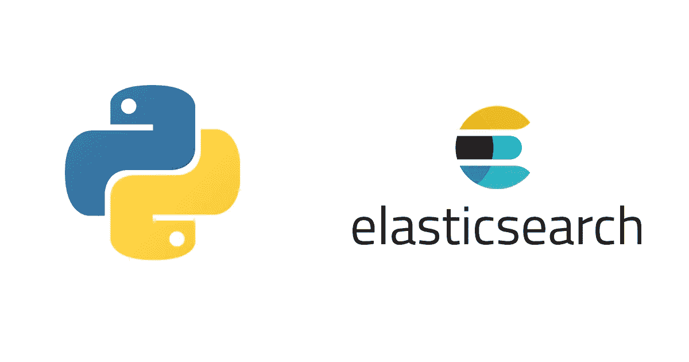

# 快速入门:使用 Python 进行弹性搜索

> 原文：<https://betterprogramming.pub/quick-start-elasticsearch-with-python-7756ea45d815>

## 使用 ElasticsearchDSL 在 Python 中高效地构建和执行 Elasticsearch 查询



照片来自 [Tryolabs](https://tryolabs.com/blog/images/blog/social/python+elastic.cef3cbd7.png) 。

在开发任何后端 API 时，您可能会面临大量数据库操作开销的问题。在本文中，我将讨论使用 [Elasticsearch](https://www.elastic.co/elasticsearch/) 对那些“长数据库操作”的补救措施。如果你不熟悉 Elasticsearch 这个术语，也不用担心。我会试着从头开始。

# 什么是 Elasticsearch？

Elasticsearch (ES)的核心是一个 NoSQL 分布式全文数据库。由于 NoSQL，它不需要任何结构化数据，也不使用任何标准的结构化查询语言进行搜索。基本上，ES 是一个开源搜索引擎，它以闪电般的速度存储和索引数据并检索数据！

因为它是建立在 Lucene 引擎和 HTTP 接口之上的，所以它是分布式的，并且非常容易扩展。它不仅仅是一个数据库。它是一个搜索引擎，并提供搜索引擎功能，如分析引擎和其他相关功能。它可以让你几乎在实时地快速存储、搜索和分析大量数据。

# 我为什么要用它？

弹性搜索在各种应用中都很有用。许多流行的应用程序利用其实时搜索功能，如网飞、Tinder 等。在这里，我将描述一些重要的用例:

## 博客存储引擎

考虑这样一个场景，您希望您的博客可以被搜索到。ES 非常适合这一点，因为大多数博客都有搜索字段，理想情况下，搜索功能会产生最相关的查询结果。传统的 SQL 不会及时给你有效的结果。

## 文档库

当您拥有具有各种属性或不可预知模式的文档时，您也可以将 ES 用作文档存储库。ES 的无模式特性当然有好处。此外，您仍然可以轻松、快速地搜索它们，并能够找到趋势。

# 弹性研究的基本概念

对 es 的基本部分有一个概念是很好的。

Elasticsearch 执行 NRT(近实时)搜索，主要使用以下组件:

*   集群:集群是一个或多个服务器(节点)的集合，这些服务器一起保存数据。它提供了跨所有服务器的联合索引和搜索功能。从关系数据库的角度来看，它就像 DB 实例一样。每个分类都有一个唯一的名称，默认分类名为 elasticsearch。
*   节点:节点是作为集群一部分的单个服务器，存储数据，并参与集群的索引和搜索功能。就像集群一样，默认情况下，节点由一个随机的通用唯一标识符(UUID)来标识。
*   索引:索引是具有相似特征的文档的集合。例如，我们可以为客户数据建立一个索引，为销售额建立另一个索引。当执行索引以及搜索、更新和删除操作时，索引由引用该索引的唯一名称来标识。
*   文档:文档是可以被索引的基本信息单元。例如，您可以拥有每个客户的客户数据和相关文档的索引。它是以 JSON 格式演示的，这使得它的适应性更强。
*   碎片:碎片是索引文档的子集。Elasticsearch 提供了将索引细分为多个片段(称为碎片)的能力。每个碎片本身都是一个功能齐全且独立的*索引*，可以托管在集群中的任何节点上。

显然，还有其他组件，如副本、类型等。，但出于基本的理解，我只列出了重要的组件。

# 设置环境

在本地设置 Elasticsearch 非常简单。你只需要[下载](https://www.elastic.co/downloads/elasticsearch)它并根据你的系统运行可执行文件。确保您的机器上安装了 Java(Lucene 引擎是用 Java 构建的)。

一旦你设置了本地环境，你可以通过点击浏览器中的`http://localhost:9200`或者通过 cURL 来验证它是否工作。它应该会给出如下 JSON 响应:

# 让我们 Pythonize 化吧！

Elasticsearch 提供了 ResT APIs 来管理数据，但是为了高效地将 ES 与 Python 结合使用，有一个名为 [elasticsearch](https://pypi.org/project/elasticsearch/) 的官方库。

只需点击以下命令来安装它:

```
pip install elasticsearch
```

现在在 Python 中，我们可以使用这个库连接到运行在 [http://localhost:9200/](http://localhost:9200/) 上的 ES 实例:

```
# make sure ES is up and runningfrom elasticsearch import Elasticsearch
es = Elasticsearch([{'host': 'localhost', 'port': 9200}])
```

使用`es`实例，您可以轻松地进行基本的 CRUD 操作。

现在来玩一些虚拟数据，让我们先插入一些来自 JSON 的数据。在这里，我将添加一些由银行持有的虚拟客户详细信息。您可以从 [JSON 生成器](https://www.json-generator.com/)中生成您选择的虚拟 JSON。

通过执行这个函数，ES 实例首先创建一个名为`my-index`的索引(如果它还不存在的话),并逐个添加每个`dictionary`。由于数据是相同的，ES 自动处理索引创建。要列出所有可用的索引，您可以做`print(es.indices.get_alias("*"))`。

查询用于检索数据，就像 SQL 一样。我们可以通过将查询写成`dict`的形式来直接执行它:

```
body = {**'query'**: {**'bool'**: {**'must'**: [{**'match'**: {**'gender'**: **'male'**}},
                                 {**'range'**: {**'age'**: {**'gte'**: 25}}}]}}}
res = es.search(index=**'my-index'**, body=body)
pprint(res)
```

这里我们简单的告诉 ES 取`my-index`的插入数据，其中`gender`为`male`且`age`大于等于 25:

在生成长时间的动态查询时，使用这种方法查询数据可能会变得复杂。对 Python 来说幸运的是，我们可以使用 [Elasticsearch DSL](https://pypi.org/project/elasticsearch-dsl/) 来简化它。

Elasticsearch DSL 是一个构建在官方低级客户端之上的高级库。我们可以用更 Pythonic 化的方式重写上面的查询:

```
query = Q(**'match'**, gender=**'male'**) & Q(**'range'**, age={**'gte'**: 25})
s = Search(using=es, index=**'my-index'**).query(query)
response = s.execute()
for hit in response:
    pprint(hit.name)
```

如您所见，该库提供了一种更方便、更习惯的方式来编写和操作查询。它接近于 Elasticsearch JSON DSL，反映了它的术语和结构。

图书馆负责:

*   通过名称创建适当的`Query`对象(即“匹配”、“范围”)。
*   将查询组成一个复合的`bool`查询。
*   提供对响应数据的方便访问。
*   删除不必要的花括号或方括号。

这只是简单介绍一下。您可以在[文档](https://elasticsearch-dsl.readthedocs.io/en/latest/)中了解更多关于 Elasticsearch DSL 的信息。当我在寻找生成复杂的动态查询的替代方法时，我了解了这个库，它确实让我受益匪浅。希望你觉得有用！