# 使用 Kotlin 和 gRPC 服务器构建微服务

> 原文：<https://betterprogramming.pub/quick-start-microservices-kotlin-grpc-2c4e4f94483a>

## 第 1 部分 Kotlin 中的 gRPC 服务器和 Android 客户端

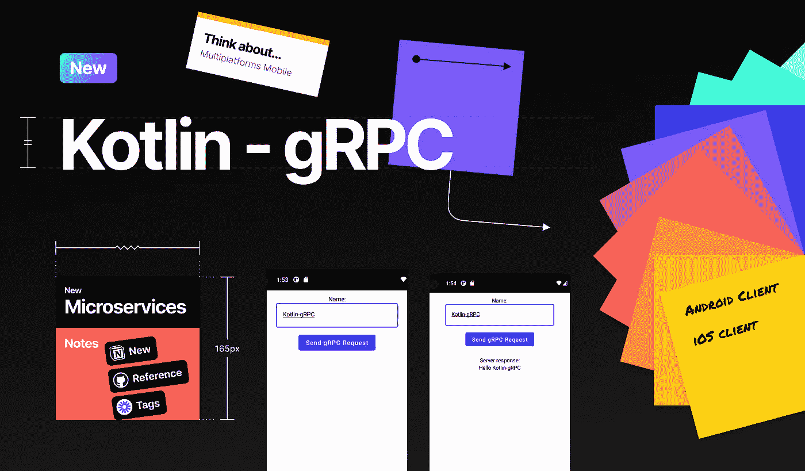

如果你以前从未了解过 Kotlin 和 Grpc 中的微服务，我建议你在网上搜索一下“Grpc”和“Kotlin ”,然后先查看一些可以帮助你理解它们的文档。随后，本文将逐步展示如何使用 Kotlin 和 gRPC 构建微服务。

我将这篇文章分为两部分:

第一部分:

*   构建 1 台 gRPC 服务器
*   构建 Android 客户端

第二部分:

*   在同一个项目中构建多个 gRPC 服务器
*   构建 iOS 客户端

现在，让我们开始吧。

我将使用 Android Studio，并为这个项目安装 Kotlin 多平台移动设备。

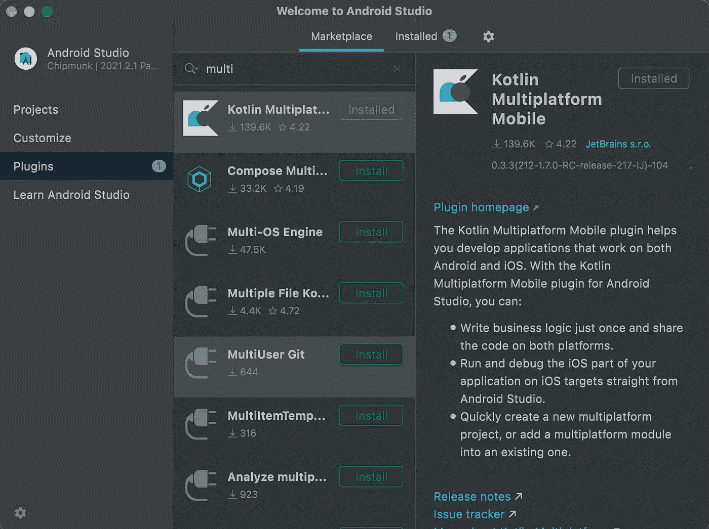

安装插件后，创建一个新项目，选择“Kotlin 多平台应用”->“下一步”->将项目命名为`KotlinGrpc`


注意:如果没有给出相同的包名`dandelion.net.kotlingrpc`，每次复制粘贴我的代码时，请注意自己的包名，因为很容易出错。


`KotlinGrpc` 项目结构如下图所示。

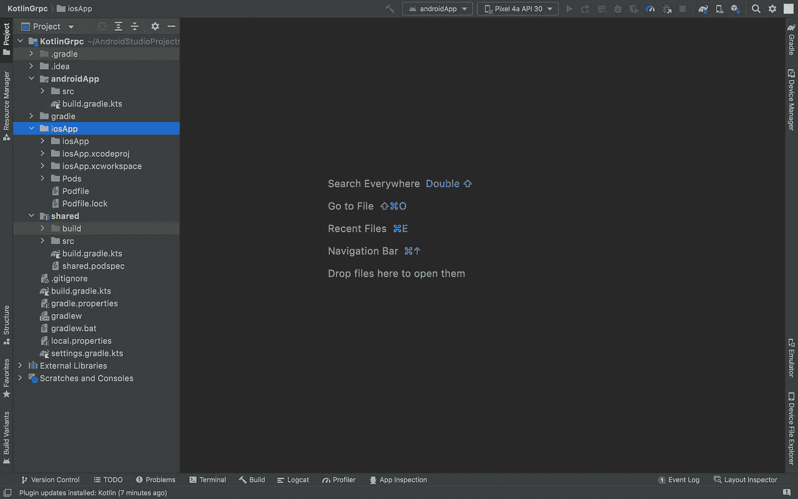

1.  **构建 gRPC 服务器**

a.配置`build.gradle`项目。

转到`KotlinGrpc/build.gradle.kts` (build.gradle 项目)

```
plugins {
    id("com.google.protobuf") version "0.8.15" apply false
    kotlin("jvm") version "1.5.31" apply false
    id("com.android.application") version "7.2.1" apply false
    id("org.jetbrains.kotlin.android") version "1.5.31" apply false
}

ext["grpcVersion"] = "1.46.0"
ext["grpcKotlinVersion"] = "1.3.0" // CURRENT_GRPC_KOTLIN_VERSION
ext["protobufVersion"] = "3.20.1"

allprojects {
    repositories {
        mavenLocal()
        mavenCentral()
        google()
    }
}
```

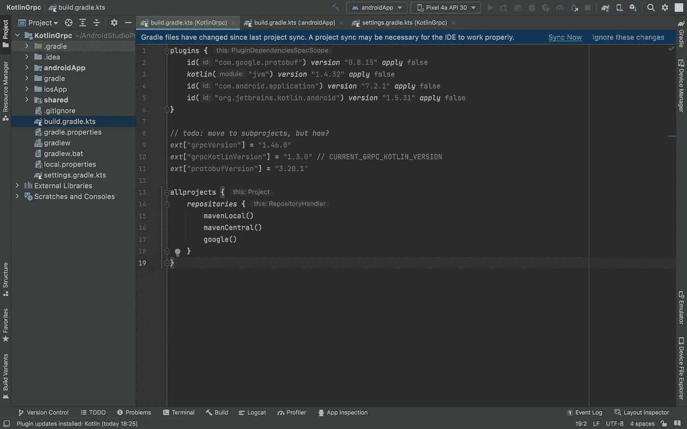

**注:**在`gradle.build.kts`中编辑完某个内容后，您需要点击**【立即同步】**(右上角通知)

b.添加新模块`PROTOS`

右键单击根文件夹(KotlinGrpc 文件夹)->新建->模块


选择“Java 或 Kotlin 库”->命名库为**`protos`**

****

**可以删除一些多余的文件比如`MyClass`**

**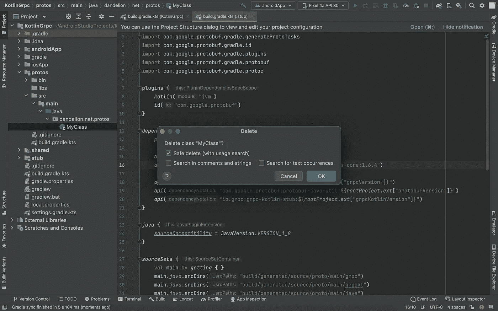**

**转到`protos/build.gradle.kts`，添加配置，然后点击“立即同步”**

```
plugins {
    `java-library`
}
java {
    sourceSets.getByName("main").resources.srcDir("src/main/java")
}
```

****

**接下来，转到`protos/src/main/java/dandelion.net.protos`，添加一个新文件并命名为`hello_service.proto`**

****

**我们将从 gRPC 文档中获得一个示例 HelloWorldService，它包括来自客户端的 1 个请求和来自服务器的 1 个响应。**

**这是一个原型文件的定义:**

**序列化数据在称为 proto 文件的配置文件中定义。proto)。称为消息的配置将存储在这些文件中。编译原型文件会生成用户编程语言的代码。**

```
syntax = "proto3";

option java_multiple_files = true;
option java_package = "dandelion.net.protos";
option java_outer_classname = "HelloWorldService";

// The greeting service definition.
service Greeter {
  // Sends a greeting
  rpc SayHello (HelloRequest) returns (HelloReply) {}
}

// The request message containing the user's name.
message HelloRequest {
  string name = 1;
}

// The response message containing the greetings
message HelloReply {
  string message = 1;
  bool received = 2;
}
```

****

***c .添加新的模块存根***

**右击根文件夹(KotlinGrpc 文件夹)->新建->模块->选择“Java 或 Kotlin 库”->命名库`stub`**

****

**这一步是 gRPC 的一个强大之处，当我们运行项目时，google 会为我们生成代码，并将它们存储到`stub`模块中。我们去:**

**`stub/build.gradle.kts`:**

**配置 API 依赖关系并设置`sourceSets` (文件在哪里自动生成)**

```
import com.google.protobuf.gradle.generateProtoTasks
import com.google.protobuf.gradle.id
import com.google.protobuf.gradle.plugins
import com.google.protobuf.gradle.protobuf
import com.google.protobuf.gradle.protoc

plugins {
    kotlin("jvm")
    id("com.google.protobuf")
}

dependencies {
    protobuf(project(":protos"))

    api(kotlin("stdlib"))
    api("org.jetbrains.kotlinx:kotlinx-coroutines-core:1.6.2")

    api("io.grpc:grpc-protobuf:${rootProject.ext["grpcVersion"]}")
    api("com.google.protobuf:protobuf-java-util:${rootProject.ext["protobufVersion"]}")
    api("io.grpc:grpc-kotlin-stub:${rootProject.ext["grpcKotlinVersion"]}")
}

java {
    sourceCompatibility = JavaVersion.VERSION_1_8
}

sourceSets {
    val main by getting { }
    main.java.srcDirs("build/generated/source/proto/main/grpc")
    main.java.srcDirs("build/generated/source/proto/main/grpckt")
    main.java.srcDirs("build/generated/source/proto/main/java")
}

protobuf {
    protoc {
        artifact = "com.google.protobuf:protoc:${rootProject.ext["protobufVersion"]}"
    }
    plugins {
        id("grpc") {
            artifact = "io.grpc:protoc-gen-grpc-java:${rootProject.ext["grpcVersion"]}"
        }
        id("grpckt") {
            artifact = "io.grpc:protoc-gen-grpc-kotlin:0.2.0:jdk7@jar"
        }
    }
    generateProtoTasks {
        all().forEach {
            it.plugins {
                id("grpc")
                id("grpckt")
            }
        }
    }
}
```

**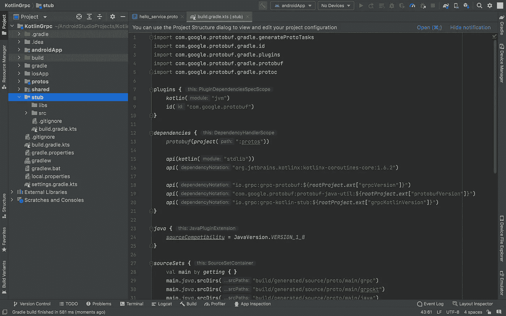**

**现在，当我们还没有构建项目时，看看“存根”模块。**

**然后，点击构建项目或点击顶部的“锤子”图标来构建应用程序，之后我们将有我们想要的文件。**

**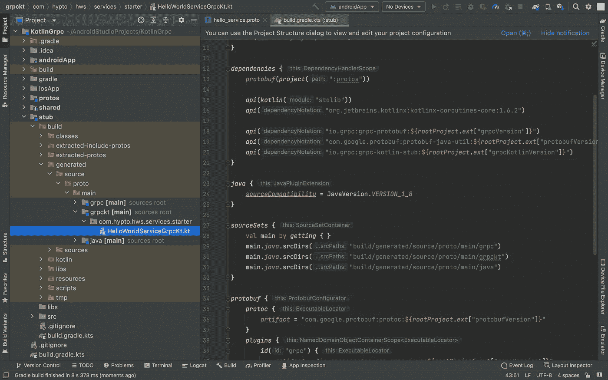**

***d .添加新模块服务器***

**右击根文件夹(KotlinGrpc 文件夹)->新建->模块->选择“Java 或 Kotlin 库”->命名库`Server`**

****

**像上面的这些步骤一样，我们将向`build.gradle.kts`添加配置**

**转到`server/build.gradle.kts`:**

```
plugins {
    application
    kotlin("jvm")
}

dependencies {
    implementation(project(":stub"))
    implementation("androidx.concurrent:concurrent-futures-ktx:1.1.0")
    implementation("org.jetbrains.kotlinx", "kotlinx-coroutines-core", "1.5.2")
    runtimeOnly("io.grpc:grpc-netty:${rootProject.ext["grpcVersion"]}")
}

tasks.register<JavaExec>("HelloServer") {
    dependsOn("classes")
    classpath = sourceSets["main"].runtimeClasspath
    mainClass.set("dandelion.net.server.HelloServerKt")
}

val helloServerStartScripts = tasks.register<CreateStartScripts>("helloServerStartScripts") {
    mainClass.set("dandelion.net.server.HelloServerKt")
    applicationName = "hello-server"
    outputDir = tasks.named<CreateStartScripts>("startScripts").get().outputDir
    classpath = tasks.named<CreateStartScripts>("startScripts").get().classpath
}

tasks.named("startScripts") {
    dependsOn(helloServerStartScripts)
}

tasks.withType<org.jetbrains.kotlin.gradle.tasks.KotlinCompile> {
    kotlinOptions {
        freeCompilerArgs += "-Xopt-in=kotlin.RequiresOptIn"
    }
}
```

**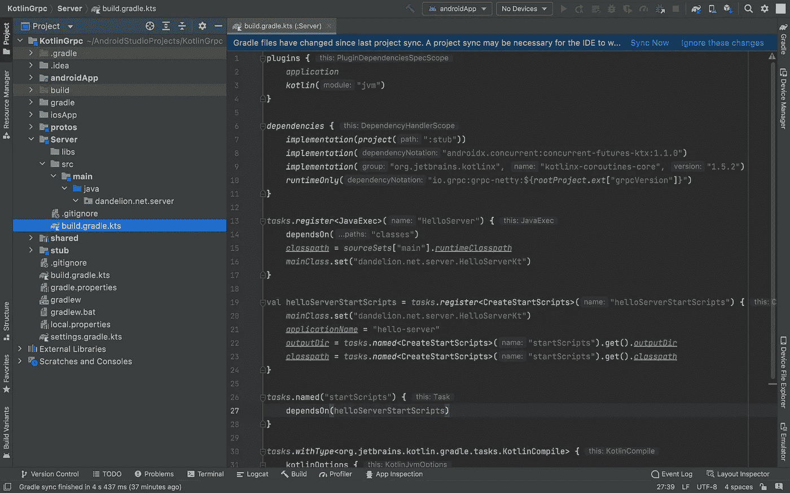**

**接下来，转到`server/src/main/java/dandelion/net/server` **，**添加一个新的 Kotlin 文件，命名为`HelloServer.kt`。注意，可以删除一些像`MyClass`这样的冗余文件**

**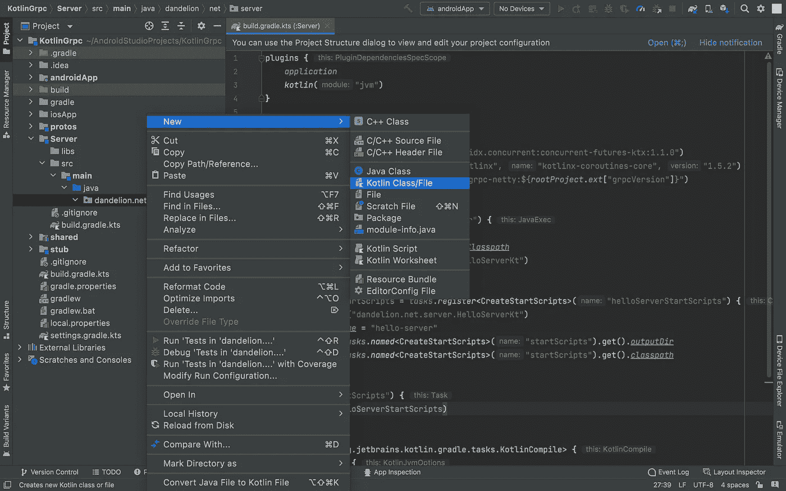****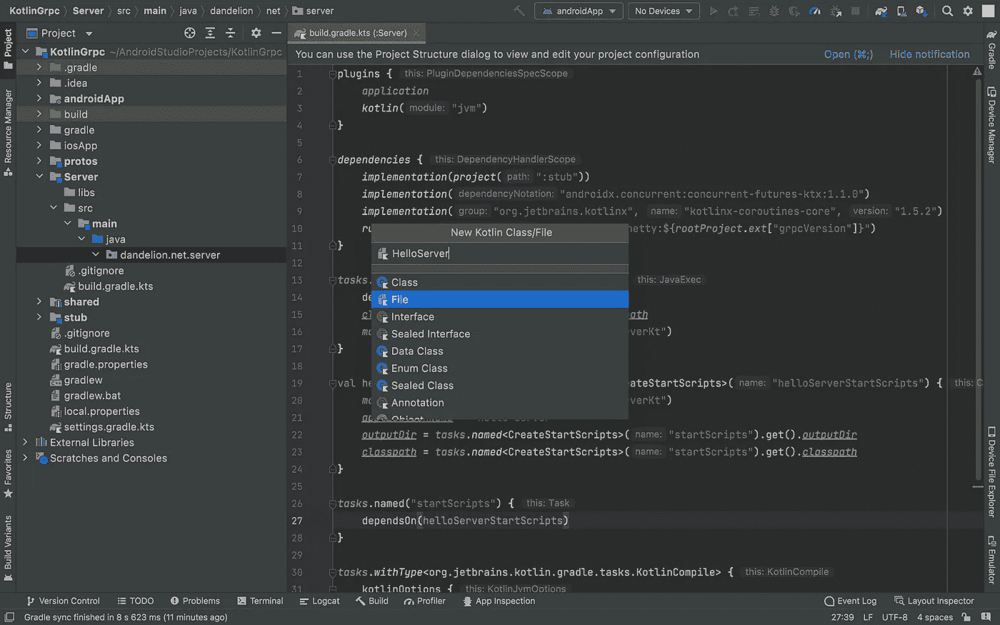**

```
package dandelion.net.server

import dandelion.net.protos.GreeterGrpcKt
import dandelion.net.protos.HelloReply
import dandelion.net.protos.HelloRequest
import io.grpc.Server
import io.grpc.ServerBuilder
import kotlinx.coroutines.asCoroutineDispatcher
import java.util.concurrent.Executors

class HelloServer(private val port: Int) {
    val server: Server = ServerBuilder
        .forPort(port)
        .addService(HelloService())
        .build()

    fun start() {
        server.start()
        println("Server started, listening on $port")
        Runtime.getRuntime().addShutdownHook(
            Thread {
                this@HelloServer.stop()
                println("*** server shut down")
            }
        )
    }

    private fun stop() {
        server.shutdown()
    }
    fun blockUntilShutdown() {
        server.awaitTermination()
    }

    private class HelloService : GreeterGrpcKt.GreeterCoroutineImplBase(
        coroutineContext = Executors.newFixedThreadPool(
            1
        ).asCoroutineDispatcher()) {
        override suspend fun sayHello(request: HelloRequest) : HelloReply {
            return HelloReply.newBuilder()
                .setMessage("Hello " + request.name)
                .build()
        }
    }

}

fun main() {
    val port = System.getenv("PORT")?.toInt() ?: 8080
    val server = HelloServer(port)
    server.start()
    server.blockUntilShutdown()
}
```

**解释:**

*   **`class HelloServer(private val port: Int)` — >这个类构建端口服务器。**
*   **这个类使用 Kotlin-Coroutine 来调用我们在 proto 文件中创建的函数。`GreeterGrpcKt` 是 google 在`stub`模块内部为我们生成的一个类。**

**现在，单击“运行按钮”运行服务器，我们将看到服务器在端口 8080 启动。**

****

****2。构建 Android 客户端****

**让我们将依赖项添加到`androidApp/build.gradle.kts`文件，我们将在这里定义我们想要从服务器连接的 IP 地址(`serverUrl`**

```
plugins {
    id("com.android.application")
    id("org.jetbrains.kotlin.android")
}

android {

    sourceSets["main"].java.srcDir("src/main/java")

    compileOptions {
        sourceCompatibility = JavaVersion.VERSION_1_8
        targetCompatibility = JavaVersion.VERSION_1_8
    }
    buildFeatures {
        compose = true
    }
    kotlinOptions {
        jvmTarget = "1.8"
    }

    composeOptions {
        kotlinCompilerExtensionVersion = composeVersion
    }

    packagingOptions {
        resources.excludes += "META-INF/kotlinx_coroutines_core.version"
    }

    compileSdk = 32

    defaultConfig {
        applicationId = "dandelion.mobile.android"
        minSdk = 21
        targetSdk = 32
        versionCode = 1
        versionName = "1.0"

        val serverUrl: String? by project
        if (serverUrl != null) {
            resValue("string", "server_url", serverUrl!!)
        } else {
            resValue("string", "server_url", "http://10.0.2.2:8080/")
        }

        testInstrumentationRunner = "android.support.test.runner.AndroidJUnitRunner"

        testInstrumentationRunner = "android.support.test.runner.AndroidJUnitRunner"
    }

    buildTypes {
        release {
            isMinifyEnabled = false
            proguardFiles(
                getDefaultProguardFile("proguard-android-optimize.txt"),
                "proguard-rules.pro"
            )
        }
    }
    compileOptions {
        sourceCompatibility = JavaVersion.VERSION_1_8
        targetCompatibility = JavaVersion.VERSION_1_8
    }
    kotlinOptions {
        jvmTarget = "1.8"
    }
}

val composeVersion = "1.1.0"

dependencies {

    implementation(project(":stub"))
    implementation(kotlin("stdlib"))
    implementation("androidx.activity:activity-compose:1.5.1")
    implementation("androidx.appcompat:appcompat:1.4.2")
    implementation ("org.jetbrains.kotlinx:kotlinx-coroutines-android:1.6.2")
    implementation("androidx.compose.foundation:foundation-layout:$composeVersion")
    implementation("androidx.compose.material:material:$composeVersion")
    implementation("androidx.compose.runtime:runtime:$composeVersion")
    implementation("androidx.compose.ui:ui:$composeVersion")
    runtimeOnly("io.grpc:grpc-okhttp:${rootProject.ext["grpcVersion"]}")

}
```

****

**接下来，我们开始用`@Composable`构建 UI，所以我们不需要`layout`，并删除`androidApp/src/main/res`中的`layout`文件夹**

**转到`androidApp/src/main/res/values/styles.xml`**

```
<?xml version="1.0" encoding="utf-8"?>
<resources>
    <string name="name_hint">Name:</string>
    <string name="send_request">Send gRPC Request</string>
    <string name="app_label">gRPC Kotlin Android</string>
    <string name="server_response">Server response: </string>
</resources>
```

****

**进入`androidApp/src/main/AndroidManifest.xml` 添加`INTERNET`权限**

```
<?xml version="1.0" encoding="utf-8"?>
<manifest xmlns:android="http://schemas.android.com/apk/res/android"
    xmlns:tools="http://schemas.android.com/tools"
    package="dandelion.net.kotlingrpc.android">

    <uses-permission android:name="android.permission.INTERNET"/>

    <application
        android:allowBackup="true"
        android:fullBackupContent="true"
        android:icon="@android:drawable/btn_star"
        android:label="@string/app_label">
        <activity
            android:theme="@style/Theme.AppCompat.NoActionBar"
            android:name=".MainActivity"
            android:exported="true">
            <intent-filter>
                <action android:name="android.intent.action.MAIN"/>
                <category android:name="android.intent.category.LAUNCHER"/>
            </intent-filter>
        </activity>
    </application>

</manifest>
```

**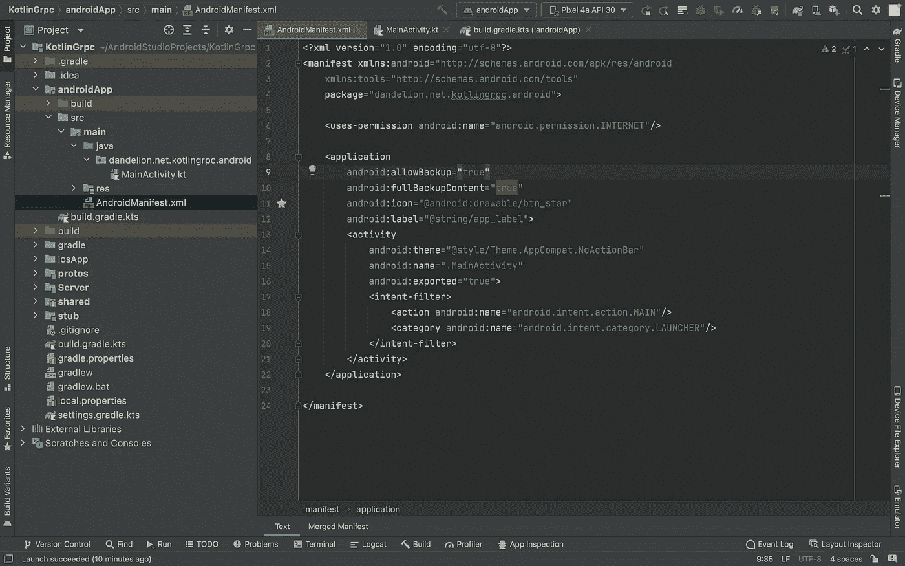**

**最后，转到`androidApp/src/main/java/dandelion/net/kotlingrpc/android/MainActivity.kt`:**

```
package dandelion.net.kotlingrpc.android
import android.net.Uri
import android.os.Bundle
import androidx.activity.compose.setContent
import androidx.appcompat.app.AppCompatActivity
import androidx.compose.foundation.layout.Arrangement
import androidx.compose.foundation.layout.Column
import androidx.compose.foundation.layout.fillMaxHeight
import androidx.compose.foundation.layout.fillMaxWidth
import androidx.compose.foundation.layout.padding
import androidx.compose.material.Button
import androidx.compose.material.MaterialTheme
import androidx.compose.material.OutlinedTextField
import androidx.compose.material.Surface
import androidx.compose.material.Text
import androidx.compose.runtime.Composable
import androidx.compose.runtime.mutableStateOf
import androidx.compose.runtime.remember
import androidx.compose.runtime.rememberCoroutineScope
import androidx.compose.ui.Alignment
import androidx.compose.ui.Modifier
import androidx.compose.ui.res.stringResource
import androidx.compose.ui.text.input.TextFieldValue
import androidx.compose.ui.unit.dp
import dandelion.net.kotlingrpc.android.R
import dandelion.net.protos.GreeterGrpcKt
import dandelion.net.protos.HelloRequest
import io.grpc.ManagedChannelBuilder
import kotlinx.coroutines.Dispatchers
import kotlinx.coroutines.asExecutor
import kotlinx.coroutines.launch
import java.io.Closeable

class MainActivity : AppCompatActivity() {
    private val uri by lazy { Uri.parse((resources.getString(R.string.server_url))) }
    private val greeterService by lazy { GreeterRCP(uri) }
    override fun onCreate(savedInstanceState: Bundle?) {
        super.onCreate(savedInstanceState)
        setContent {
            Surface(color = MaterialTheme.colors.background) {
                Greeter(greeterService)
            }
        }
    }
    override fun onDestroy() {
        super.onDestroy()
        greeterService.close()
    }
}

class GreeterRCP(uri: Uri) : Closeable {
    val responseState = mutableStateOf("")

    private val channel = let {
        println("Connecting to ${uri.host}:${uri.port}")
        val builder = ManagedChannelBuilder.forAddress(uri.host, uri.port)
        if (uri.scheme == "https") {
            builder.useTransportSecurity()
        } else {
            builder.usePlaintext()
        }
        builder.executor(Dispatchers.IO.asExecutor()).build()
    }

    private val greeter = GreeterGrpcKt.GreeterCoroutineStub(channel)
    suspend fun sayHello(name: String) {
        try {
            val request = HelloRequest.newBuilder().setName(name).build()
            val response = greeter.sayHello(request)
            responseState.value = response.message
        } catch (e: Exception) {
            responseState.value = e.message ?: "Unknown Error"
            e.printStackTrace()
        }
    }
    override fun close() {
        channel.shutdownNow()
    }
}

@Composable
fun Greeter(greeterRCP: GreeterRCP) {
    val scope = rememberCoroutineScope()
    val nameState = remember { mutableStateOf(TextFieldValue()) }
    Column(Modifier.fillMaxWidth().fillMaxHeight(), Arrangement.Top, Alignment.CenterHorizontally) {
        Text(stringResource(R.string.name_hint), modifier = Modifier.padding(top = 10.dp))
        OutlinedTextField(nameState.value, { nameState.value = it })
        Button({ scope.launch { greeterRCP.sayHello(nameState.value.text) } }, Modifier.padding(10.dp)) {
            Text(stringResource(R.string.send_request))
        }
        if (greeterRCP.responseState.value.isNotEmpty()) {
            Text(stringResource(R.string.server_response), modifier = Modifier.padding(top = 10.dp))
            Text(greeterRCP.responseState.value)
        }
    }
}
```

**解释:**

*   **`class GreeterRCP(uri: Uri): Closeable` — >这个类是构建一个`channel`来连接服务器的 IP 地址，并调用`stub`模块内部的`GreeterGrpcKt` 类。**
*   **`fun Greeter(greeterRCP: GreeterRCP)` — >此功能用于为 android 应用构建`[@Composable](http://twitter.com/Composable)` UI。**

**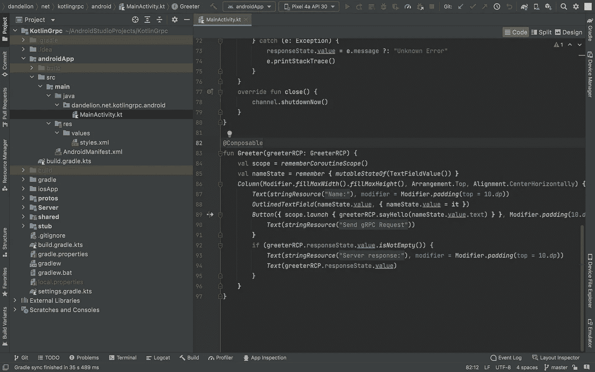**

**现在，享受我们所做的。**

**先运行`HelloServer`，再运行 Android 客户端。**

****

**如果你在我的代码中遗漏了什么，这个 GitHub 库是为你准备的:**

**[](https://github.com/Wynne-Tran/Kotlin-Grpc) [## GitHub - Wynne-Tran/Kotlin-Grpc

### 屏幕。recording . 2022-07-31 . at . 22 . 03 . 35 . mov 第一部分(主分支)Grpc 服务器 Android 客户端第二部分(即将推出...)…

github.com](https://github.com/Wynne-Tran/Kotlin-Grpc) 

一些对你有用的资源:

*   grpc❤·科特林
*   [科特林多平台](https://kotlinlang.org/docs/multiplatform.html)
*   [gRPC-Kotlin-Android](https://github.com/grpc/grpc-kotlin)

[第 2 部分:面向 Android 的多 gRPC 服务器& iOS 客户端](https://medium.com/@WynneTran/build-microservices-with-kotlin-and-grpc-server-ea483a9eedb5)**