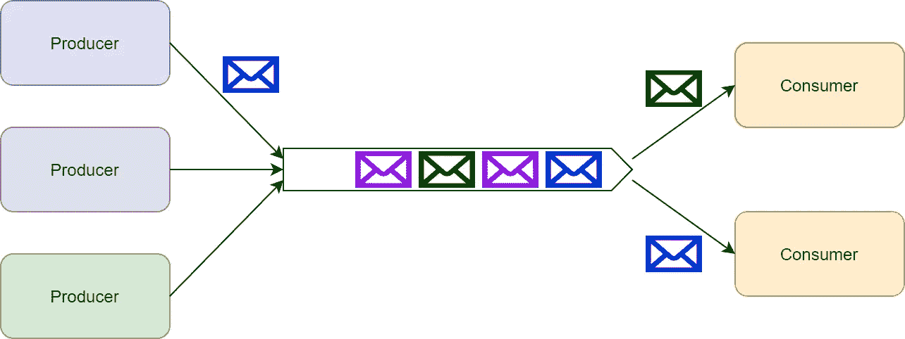
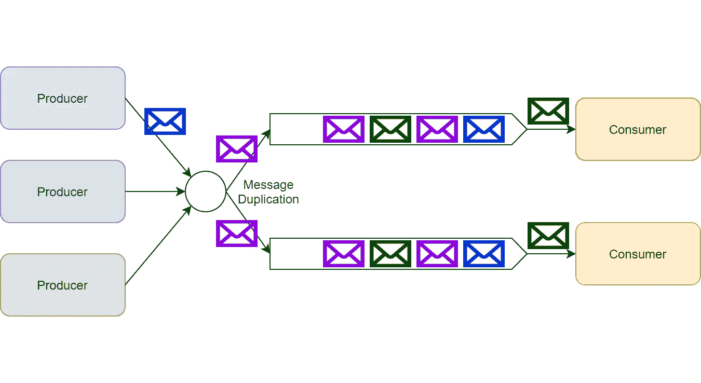
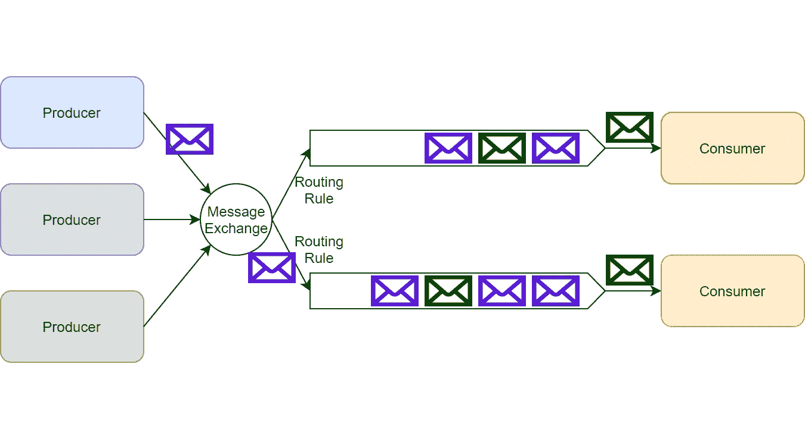
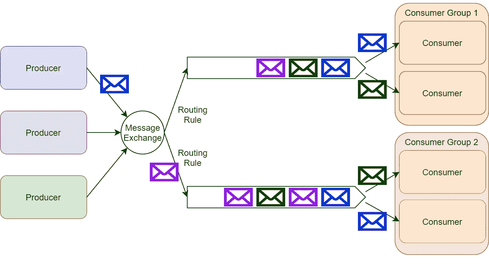
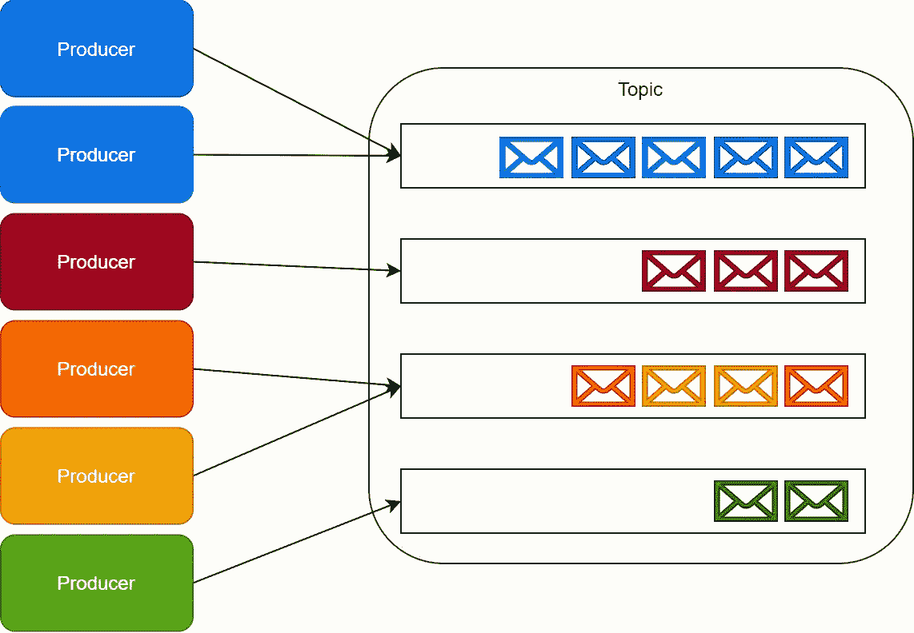

# RabbitMQ vs .卡夫卡

> 原文：<https://betterprogramming.pub/rabbitmq-vs-kafka-1ef22a041793>

## 建筑师的困境

Justin Luebke 在 [Unsplash](https://unsplash.com/s/photos/justin-luebke-coat?utm_source=unsplash&utm_medium=referral&utm_content=creditCopyText) 上的照片

# 介绍

作为一名处理大量基于微服务的系统的软件架构师，我经常遇到一个不断重复的问题，“我应该使用 [RabbitMQ](https://www.rabbitmq.com/) 还是 [Kafka](https://kafka.apache.org/) ？”出于某种原因，许多开发人员认为这些技术是可以互换的。虽然在某些情况下确实如此，但这些平台之间存在各种潜在的差异。

因此，不同的场景需要不同的解决方案，选择错误的解决方案可能会严重影响您设计、开发和维护软件解决方案的能力。

这篇文章的目标是首先介绍基本的异步消息传递模式。然后，它继续介绍 RabbitMQ 和卡夫卡及其内部结构。[第 2 部分](https://medium.com/better-programming/rabbitmq-vs-kafka-1779b5b70c41)强调了这些平台之间的关键差异、它们的各种优势和劣势，以及如何在两者之间做出选择。

# 异步消息传递模式

*异步消息传递*是一种消息传递方案，在这种方案中，生产者的消息生产与消费者的消息处理是分离的。在处理消息传递系统时，我们通常识别两种主要的消息传递模式— *消息队列*和*发布/订阅。*

## 消息排队

在消息队列通信模式中，队列暂时将生产者与消费者分离开来。多个生成器可以向同一个队列发送消息；但是，当使用者处理消息时，它会被锁定或从队列中删除，并且不再可用。只有一个消费者使用特定的消息。

消息队列

顺便提一下，如果消费者未能处理某个消息，消息传递平台通常会将该消息返回到队列中，供其他消费者使用。除了时间解耦，队列还允许我们独立地扩展生产者和消费者，并提供一定程度的对处理错误的容错。

## 发布/订阅

在发布/订阅(或发布/订阅)通信模式中，多个订阅者可以同时接收和处理一条消息。

发布/订阅

例如，该模式允许发布者通知所有订阅者系统中发生了一些事情。很多排队平台经常把 pub/sub 和*话题这个词联系在一起。*在 RabbitMQ 中，主题是一种特定类型的发布/订阅实现(确切地说，是一种交换类型)，但是对于这一部分，我将主题称为发布/订阅的整体表示。

一般来说，有两种类型的订阅:

1.  **短期订阅**，订阅只有在用户启动并运行时才有效。一旦消费者关闭，他们的订阅和待处理的消息就会丢失。
2.  **持久订阅**，只要订阅没有被明确删除，它就会被维护。当消费者关闭时，消息传递平台保持订阅，并且消息处理可以在以后恢复。

# 兔子 q

RabbitMQ 是一个消息代理的实现，通常被称为*服务总线。*它本身支持上述两种消息传递模式。其他流行的消息代理实现还有 [ActiveMQ](https://activemq.apache.org/) 、 [ZeroMQ](https://zeromq.org/) 、 [Azure 服务总线](https://azure.microsoft.com/en-us/services/service-bus/)和[亚马逊简单队列服务(SQS)](https://aws.amazon.com/sqs/) 。所有这些实现都有很多共同点；这篇文章中描述的许多概念适用于它们中的大多数。

## 行列

RabbitMQ 支持开箱即用的经典消息队列。开发人员定义命名队列，然后发布者可以向该命名队列发送消息。反过来，消费者使用相同的队列来检索消息并进行处理。

## 消息交换

RabbitMQ 通过使用消息交换来实现发布/订阅。发布者将其消息发布到消息交换，而不知道这些消息的订阅者是谁。

每个希望订阅交换的消费者创建一个队列；然后，消息交换将生成的消息排队，供消费者使用。它还可以根据各种路由规则为一些订户过滤消息。

RabbitMQ 消息交换

值得注意的是 RabbitMQ 支持短期和长期订阅。消费者可以通过 RabbitMQ 的 API 决定他们想要使用的订阅类型。

由于 RabbitMQ 的架构，我们还可以创建一种混合方法——其中一些订阅者组成消费者组，这些消费者组在特定队列上以竞争消费者的形式共同处理消息。通过这种方式，我们实现了发布/订阅模式，同时还允许一些订阅者扩大规模来处理接收到的消息。

发布/订阅和排队相结合

# 阿帕奇卡夫卡

Apache Kafka 不是消息代理的实现。相反，它是一个分布式流媒体平台。

与基于队列和交换的 RabbitMQ 不同，Kafka 的存储层是使用分区事务日志实现的。Kafka 还提供了实时处理流的 Streams API 和便于与各种数据源集成的 Connectors API 然而，这些超出了本文的范围。

云供应商为 Kafka 的存储层提供了替代解决方案。这些解决方案包括 [Azure 事件中心](https://azure.microsoft.com/en-us/services/event-hubs/)，在某种程度上还有 [AWS Kinesis 数据流](https://aws.amazon.com/kinesis/data-streams/)。Kafka 的流处理能力也有特定于云的开源替代方案，但是，同样，这些超出了本文的范围。

## 主题

卡夫卡没有实现队列的概念。取而代之的是，Kafka 将记录集合存储在名为*主题的类别中。*

对于每个主题，Kafka 维护一个消息的分区日志。每个分区都是一个有序的、不可变的记录序列，其中不断追加消息。

当消息到达时，Kafka 将消息附加到这些分区。默认情况下，它使用循环划分器将消息均匀地分布到各个分区。

生产者可以修改这种行为来创建逻辑消息流。例如，在多租户应用程序中，我们可能希望根据每个消息的租户 ID 创建逻辑消息流。在物联网场景中，我们可能希望让每个生产者的身份不断地映射到特定的分区。确保来自同一个逻辑流的所有消息都映射到同一个分区，可以保证它们按顺序传递给消费者。

卡夫卡制片人

消费者通过维护这些分区的偏移量(或索引)并顺序读取它们来消费消息。

一个消费者可以消费多个主题，并且消费者可以扩展到可用分区的数量。

因此，在创建主题时，应该仔细考虑该主题的预期消息吞吐量。一群共同消费一个话题的消费者被称为*消费者群体。Kafka 的 API 通常处理消费者组中的消费者之间的分区处理的平衡以及消费者的当前分区偏移的存储。*

卡夫卡消费者

## 用 Kafka 实现消息传递模式

Kafka 的实现很好地映射到了发布/订阅模式。

一个生产者可以向一个特定的主题发送消息，多个消费者组可以消费同一个消息。每个用户群都可以单独扩展来处理负载。因为使用者维护他们的分区偏移量，所以他们可以选择拥有一个在重新启动时维护其偏移量的持久订阅，或者拥有一个临时订阅，该订阅在每次启动时丢弃偏移量并从每个分区中的最新记录重新启动。

然而，它并不完全适合消息队列模式。当然，我们可以有一个只有一个消费者群体的主题来模拟经典的消息队列。然而，这有许多缺点[这篇文章的第 2 部分](https://medium.com/better-programming/rabbitmq-vs-kafka-1779b5b70c41)详细讨论。

重要的是要注意 Kafka 在预先配置的时间段内将消息保留在分区中，而不管消费者是否消费了这些消息。这种保留意味着消费者可以自由地重读过去的信息。此外，开发人员还可以使用 Kafka 的存储层来实现事件源和审计日志等机制。

# 结束语

虽然 RabbitMQ 和 Kafka 有时可以互换，但它们的实现却大相径庭。因此，我们不能将它们视为同一类工具的成员；一个是消息代理，另一个是分布式流媒体平台。

作为解决方案架构师，我们应该承认这些差异，并积极考虑对于给定的场景，我们应该使用哪种类型的解决方案。[第 2 部分](https://medium.com/better-programming/rabbitmq-vs-kafka-1779b5b70c41)阐述了这些差异，并提供了何时使用它们的指导。

# 进一步阅读

如果您想了解更多关于 RabbitMQ 和 Kafka 的内部实现，我推荐以下资源:

*   [AMQP 0.9.1 车型讲解— RabbitMQ](https://www.rabbitmq.com/tutorials/amqp-concepts.html)
*   [阿帕奇卡夫卡简介](https://kafka.apache.org/intro)