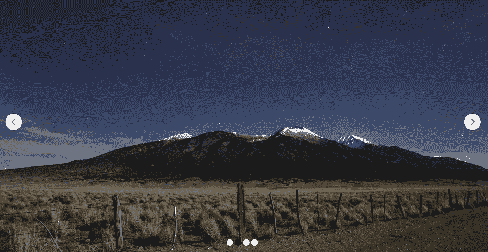

# React Hooks Slider:如何用自动播放构建图像滑块

> 原文：<https://betterprogramming.pub/react-hooks-slider-how-to-build-an-image-slider-with-autoplay-part-2-c94deaf763c4>

## 第二部分

图片来源:作者

在 React Hooks 滑块系列的第二部分中，我们现在将在组件中构建一个自动播放功能。激活后，此功能将隐藏导航箭头，并无限循环地浏览所有图像幻灯片。

我在本文末尾提供了本系列第一部分和第三部分的链接、包含代码和工作示例的资源库以及视频教程。

P.S .如果你喜欢这篇文章，可以看看我在[上传文件的文章，这里用钩子反应](https://dzuz14.medium.com/simple-file-uploading-with-react-hooks-fe89c225db57)。

# 快速回顾

在[第 1 部分](https://medium.com/better-programming/build-an-image-slider-with-react-es6-264368de68e4)的结尾，这是我们在`Slider`组件中结束的代码。

有趣的是，我们实现自动播放功能所需的大部分代码都已经写好了。我们将利用之前构建的`nextSlide`函数，并使用几个 React 钩子和一个`[setInterval](https://developer.mozilla.org/en-US/docs/Web/API/WindowOrWorkerGlobalScope/setInterval)`来完成它。

请记住，我包含的任何片段都是在`**Slider.**`内部编写的，我们不需要接触我们之前创建的任何其他组件。

# useRef 和 useEffect 挂钩

为了开始，我们将使用两个 React 钩子，`[useRef](https://reactjs.org/docs/hooks-reference.html#useref)`和`useEffect`。通过重新渲染，`useRef`钩子将允许我们存储对包含最新状态变量的函数的引用，而`useEffect`钩子将用于确保我们的 ref 具有该功能。

基本上，他们将一前一后地工作。下面的代码片段展示了它们的实际应用。

在每次重新渲染时，我们将 ref 的 current 属性值设置为最新版本的`nextSlide`函数。我们需要做的就是利用另一个`useEffect`调用，我们 100%拥有自动播放功能。很神奇，对吧？

# 在初始滑块渲染上使用效果

如果你熟悉基于类的 React 组件，有一个叫做`[componentDidMount](https://reactjs.org/docs/react-component.html#componentdidmount)`的方法，它将执行你给它的任何代码，只在初始渲染时。有了钩子，只运行一次代码也很容易，这就是我们如何完成我们的自动播放功能。

我们需要设置某种类型的重复计时器来无限执行我们的`nextSlide`。我们可以使用 JavaScript 的内置`setInterval`函数来实现这一点。

下面是我们的第二个`useEffect`调用的样子。

如果你对着你的显示器大喊“WTF 是`props.autoplay`？”别担心，我们会在最后一步添加那个道具，作为我们的锦上添花。

将一个空数组作为第二个参数传递给`useEffect`可以确保它只运行一次。创建一个封装对`autoPlayRef.current`的调用的函数是非常重要的，因为任何在`useEffect`调用中声明的变量(只在初始渲染时装载)将总是存储在初始渲染时观察到的值*。*

通过将调用封装在函数中，`autoPlayRef.current`的初始值永远不会被存储。JavaScript 就是这样工作的；在函数执行之前，函数内部的任何东西都不会被计算。

由于闭包的概念，当这个函数每次在我们的`setInterval`函数中执行时，没有引用`autoPlayRef`是什么。因此，JS 将在调用`useEffect`的范围之外检查它，其中`autoPlayRef.current`总是最新的。

好吧，让我们创造我刚才说的那个道具。

# 设置自动播放道具

在我们的`index.js`文件中，我们将设置一个`autoPlay`属性，并向它传递一个常规整数，该整数代表我们希望在幻灯片切换之间传递的秒数。

由于`setInterval`需要毫秒值，我们在初始渲染调用`useEffect`中将`props.autoPlay`乘以 1000。

Tada！我们完了。

# 图像滑块摘要

在我为图像滑块编写自动播放功能之前，我认为它需要比我们这里多得多的代码。正如您所看到的，React 钩子提供了一种很好的方式来完成这项工作。

请查看下面的视频和链接。这是第 2 部分滑块的最终版本。

# 链接

第一部分。 [React Hooks Slider:如何用 React Hooks 构建图像滑块](https://medium.com/better-programming/build-an-image-slider-with-react-es6-264368de68e4)

第三部分。 [React Hooks Slider:如何构建一个平滑过渡和自动调整大小的图像滑块](https://medium.com/p/8a99859ac471/edit)

[GitHub 资源库](https://github.com/DZuz14/react-hooks-image-slider)