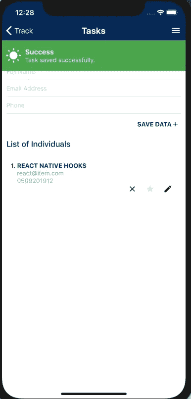

# React Native Hooks:带有 CRUD 操作和异步存储的待办事项应用

> 原文：<https://betterprogramming.pub/react-native-hooks-to-do-app-with-crud-operations-and-asyncstorage-ff20b1c862b8>


格伦·卡斯滕斯-彼得斯在 [Unsplash](https://unsplash.com/search/photos/to-do-list?utm_source=unsplash&utm_medium=referral&utm_content=creditCopyText) 上拍摄的照片

最近 React 引入了钩子，我一点也不赞成功能组件。我是如此习惯于类组件，以至于这种改变也不是我所期待的。此外，最新的版本更新也是一个重大变化。所以我同时用两只手试了试。

这是我想到的。这基本上是用 React Hooks 做一个常规待办 app 的尝试。因此，如果你是一个专业人士，正在寻找不同的东西，这个博客不适合你。我们开始吧。

# 定义

**1。钩子:**钩子是 React 16.8 中新增的。它们允许您使用状态和其他 React 特性，而无需编写类。React 提供了一些内置的钩子，比如`useState`和`useEffect.`

**2。useState:** 它返回一对值:当前状态和更新它的函数。这就是我们写`const [count, setCount] = useState()`的原因。这类似于一个类中的`this.state.count`和`this.setState`，除了它们是成对的。

```
Examples how we can initialise states using useStateconst [count, setCount] = useState(0)      // Number
const [name, setName] = useState('James')  // String
const [data, setData] = useState([])       // Array
```

**3。useEffect:** 通过使用这个钩子，你告诉 React 你的组件在渲染之后需要做一些事情。不要从挂载和更新的角度来考虑，你可能会发现渲染之后产生效果更容易。React 保证 DOM 在运行效果时已经更新。

默认情况下，它会在第一次渲染*和每次更新*后运行。它类似于`componentDidMount`和`componentDidUpdate`，只是更干净，更有逻辑。

```
const App = ( ) => {
  const [count, setCount] = useState(0);
  useEffect(() => {
    document.title = `You clicked ${count} times`;
  });
}
```

# 介绍

我们将使用 AsyncStorage 创建一个普通的待办事项应用程序。

## 要求

使用 React Native 的最新版本创建一个新应用程序。

```
react-native init tasks
cd tasks
```

现在，当你创建了一个新的应用程序，是时候导入更多的组件了。

```
yarn add 'react-native-dropdownalert';
// To show alert messagesyarn add 'react-native-vector-icons';
// To use icons in the appyarn add '@react-native-community/asyncstorage';
// To use local database
```

# 代码参考

现在删除`App.js`文件中的所有内容，并添加下面的[代码。](https://gist.github.com/sudhirkumarojhaa/8d49d2f521f4a4727305483edfd89365)



文件的截图

## 使用状态解释

```
// Initialisation of state:this.state {
name: 'James'
}// Updating state value:this.setState({
 name: 'Sudhir'
});console.log(this.state.name);
output: Sudhir // Now using hooks we can declare this as const [name,setName] = useState('James');
setName('Sudhir');
console.log(name);output: Sudhir
```

相同的过程用于更新字符串、数字或数组。与上面描述的流程没有什么不同。

## UseEffect 解释

```
//before hookscomponentDidMount(){
  AsyncStorage.clear();
  retrieveData();  
});// using hooksuseEffect(() => {    
  AsyncStorage.clear();
  retrieveData();  
});
```

在这里，我使用`useEffect`清除 AsyncStorage，并调用`retrieveData`函数来获取应用程序渲染时的值。有许多其他方法可以做到这一点——请随意阅读 React 文档以了解更多用例。

## 异步存储用例

```
// Save data to AsyncStoragelet user = {
 name,
 email,
 phone, 
 key: Math.random(),
};const arrData = [user];
setData(arrData);
await AsyncStorage.setItem('user', JSON.stringify(arrData));// Get data from AsyncStorageconst retrieveData = async () => {
 try {
  const valueString = await AsyncStorage.getItem('user');
  const value = JSON.parse(valueString);
  setData(value);
 } 
 catch (error) {
  console.log(error);
 }
};
```

# 结论

我希望这些基本的例子能帮助你理解钩子的概念。试试我的代码，如果有任何新的问题，请告诉我。

不断学习和分享。