# 设置 React 原生应用程序以提供应用内购买和订阅

> 原文：<https://betterprogramming.pub/react-native-in-app-purchase-subscription-bb7ad18ec5a0>

## 使用 JavaScript 执行 iOS 和 Android 用户交易的详细设置


迈克尔·泽兹奇在 [Unsplash](https://unsplash.com/s/photos/future?utm_source=unsplash&utm_medium=referral&utm_content=creditCopyText) 上的照片

许多人认为他们的应用程序主要是收入来源。任何进入移动应用程序开发的明智开发者在选择他们的盈利策略时，至少会考虑 ROI(投资回报)。

应用内购买是一种可以帮助你赚钱的模式，我们对此有着复杂的感受。秘密已经暴露了——用应用赚钱并不容易。在我们自己的移动产品上进行货币化实验后，我们知道选择正确的收入来源并维持它有多难。

## 什么是应用内购买？

应用内购买是指从移动设备上的应用购买商品和服务。应用内购买意味着开发者可以免费提供他们的应用，但随后向用户宣传付费升级、功能解锁、特殊商品，甚至其他应用和服务。尽管免费提供基本的应用程序本身，这使得开发者能够获利。

# 应用内购买的类型

应用内购买包括:

*   **消耗品:**比如游戏币，生命值，提示。用户需要重复购买这些物品，每次他们想使用它们时——它们不能在未来免费使用。在重新安装或更换设备时，用户可能会丢失他们的消费品。
*   **非消耗性:**比如将 app 升级到 pro 版本或者移除广告。用户只需购买一次这些物品，就可以免费持续使用。在重新安装或更换设备时，这些产品会被保留下来——如果用户丢失了他们的非消耗品，他们可以通过恢复应用内购买再次免费下载。
*   **非续保:**例如，一个月、三个月或六个月的运动时段通行证。用户可以在一段固定的时间内使用这些项目，并可以选择在期限结束时再次购买。
*   **自动续费订阅:**用户可以在指定的时间段内购买这些项目，当该时间段过后，他们会自动续费。例如，持续服务(网飞、Hulu Plus 等)或杂志订阅。

## 应用内购买产品创建

对于应用内购买，你需要向用户提供产品——订阅或一些硬币——在应用中向用户展示。

把产品想象成不同的包装，展示给用户购买。所以，你应该在 iOS 版的 iTunes Connect 和 Android 版的谷歌 Play 商店控制台中创建一个或两个以上的产品。

*要为您的应用程序启用应用内购买，您应该拥有 iOS 的*[*iTunes Connect*](https://itunesconnect.apple.com/)*帐户和 Android 的* [*谷歌 Play 商店控制台*](https://play.google.com/apps/publish/signup/) *帐户。*

让我们开始在应用程序中实现应用内购买。以下是我们必须遵循的步骤:

*   在谷歌 Play 商店控制台上配置应用内购买。
*   在 React native 中配置`[react-native-iap](https://github.com/dooboolab/react-native-iap#readme)`库。

## 1.在 iTunes Connect 上配置应用内购买(适用于 iOS)

***重要提示:*** *在您创建应用内购买之前，Apple 要求您申请并填写他们的付费应用合同。*

在此处登录您的 App Store Connect 帐户

【https://appstoreconnect.apple.com/】

转到“协议、税务和银行”部分。你会在页面顶部看到申请付费应用合同的链接。

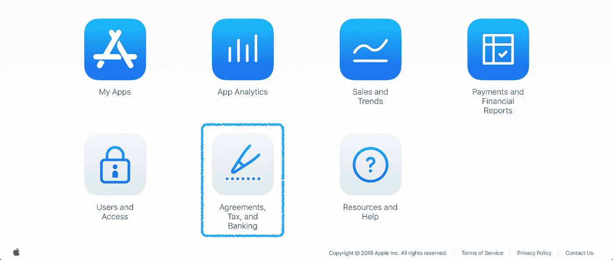

索取并填写付费申请合同。

这是非常重要的。在苹果允许你对应用内购买收费之前，你需要有付费应用合同。确保您填写了所有的联系信息、银行信息和税务信息。如果其中任何一项没有填写，与苹果的合同就没有完成，因此应用内购买将不起作用。

现在，您已经填写了付费应用程序合同，您需要将产品(应用程序内购买)添加到您的应用程序列表中。

前往您的“App Store Connect”帐户的“我的应用程序”部分。


点击你的应用程序进入列表。

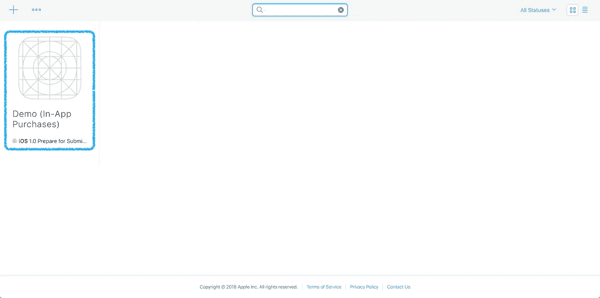

从顶部的菜单中选择“功能”。

确保点击“功能”选项卡后，您进入了左侧菜单的“应用内购买”部分。

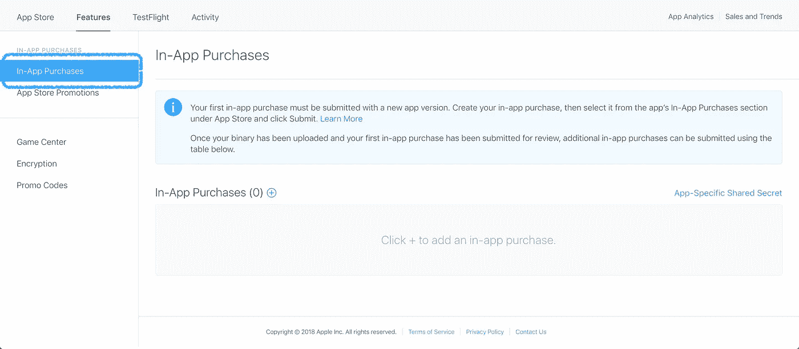

**通过选择(+)按钮添加应用内购买产品。**


选择“非耗材”类型，然后单击“创建”

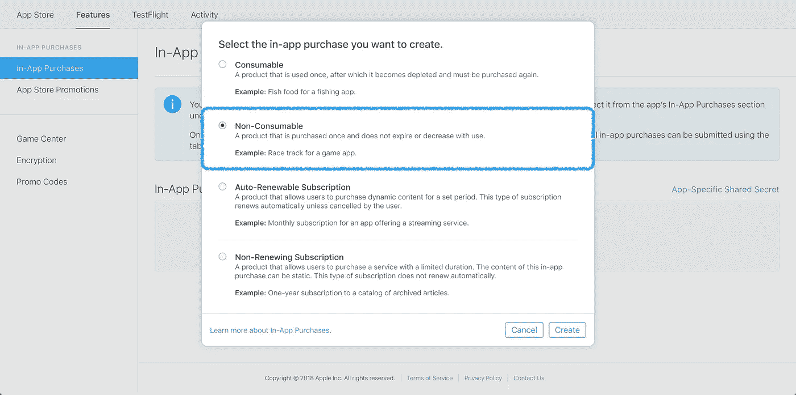

根据您的需求进行选择——这取决于您想要创造的产品类型。

输入参考名称和产品 ID。输入一个参考名称是个好主意，它可以清楚地告诉你这个特定的购买将解锁哪个应用内部分。此外，请记下您输入的产品 ID，因为您还需要在应用程序控制面板上输入产品 ID。


选择您要为此特定购买收取的价格。


输入此次购买的 App Store 信息。这是将在 App Store 上显示的信息。


输入采购的审核信息。截屏(至少需要 640 x 920 像素)和您提供的信息不会显示在 App Store 上——它仅用于 Apple 的审查目的。

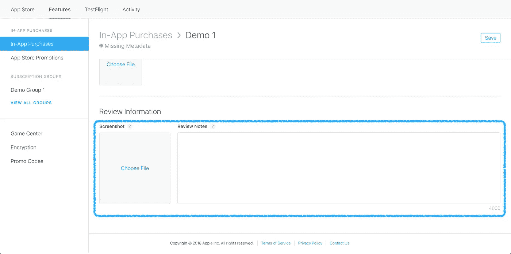

点击右上角的“保存”。

现在，您已经创建了应用内购买，您需要将产品 ID 添加到应用的控制面板。

在你的应用程序控制面板中，从左侧菜单转到“商务”部分。

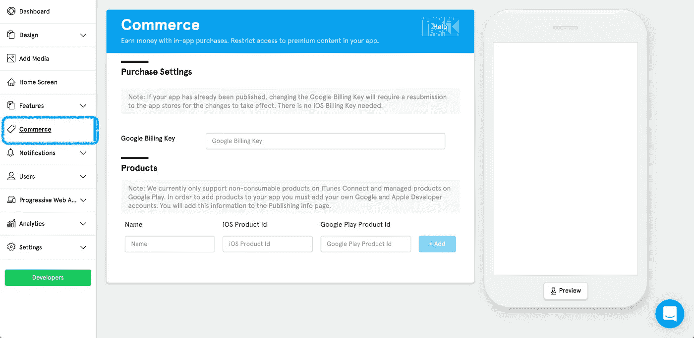

从您添加到 iOS 产品 ID 栏的 App Store Connect 帐户中复制并粘贴产品 ID


输入产品 id 后，单击“添加”按钮进行保存。


*你必须在* ***XCode*** *设置中配置的最后一件事，打开 XCode 并选择项目，转到功能部分，启用* ***InApp 购买*** *按钮。*

## **2。在谷歌 Play 商店控制台上配置应用内购买**

**重要提示:**在您可以在 android 中创建应用内购买之前，您需要在您的 Google 开发者帐户中激活一个商家帐户。

在这里登录你的谷歌开发者账户:[https://play.google.com/apps/publish](https://play.google.com/apps/publish/)

从左侧菜单中单击“设置”选项卡。

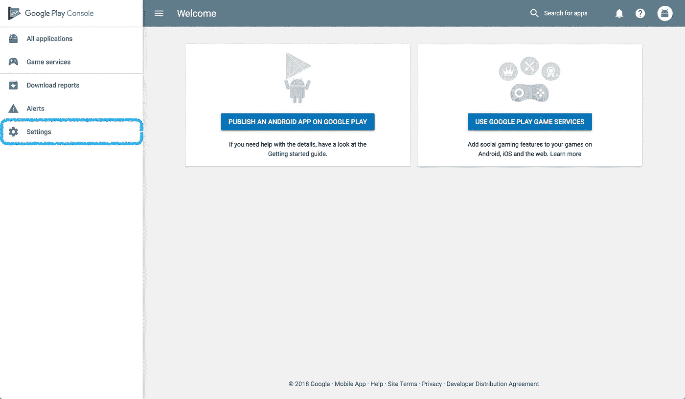

滚动到这一页的底部，你会看到一个链接，激活您的商家帐户。

当您激活您的商家帐户时，它看起来像这样:

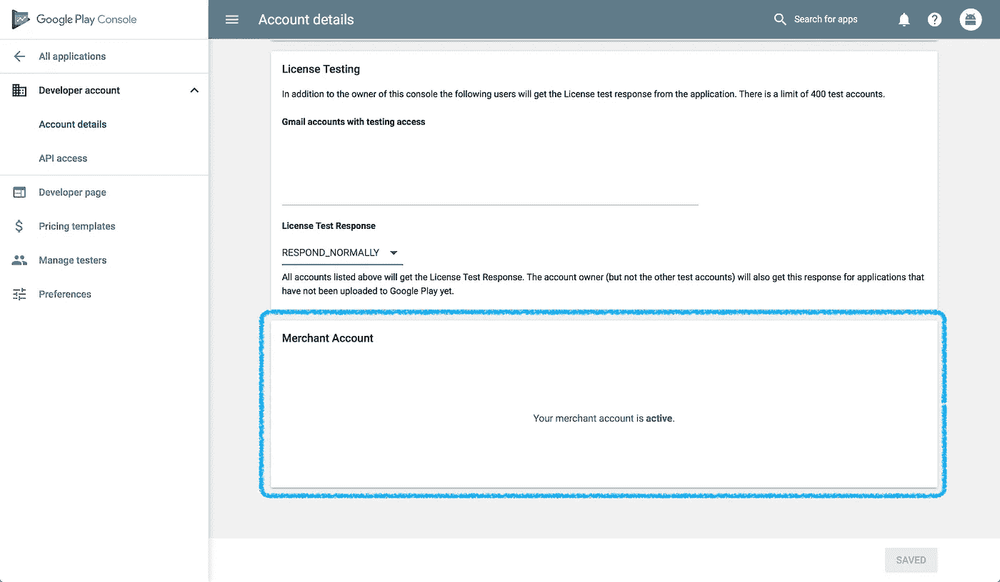

现在您已经激活了您的商业帐户，您需要从您的 Google Developer 帐户获取您的许可证/付费密钥。

从左侧菜单中，选择“所有应用程序”，然后点击您要应用应用内购买的应用程序:


从左侧菜单中选择“开发工具”下的“服务和 API”

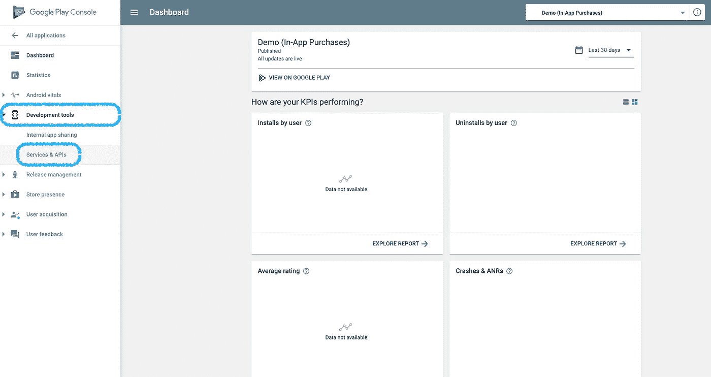

复制标题为“此应用程序的许可密钥”部分中的许可密钥

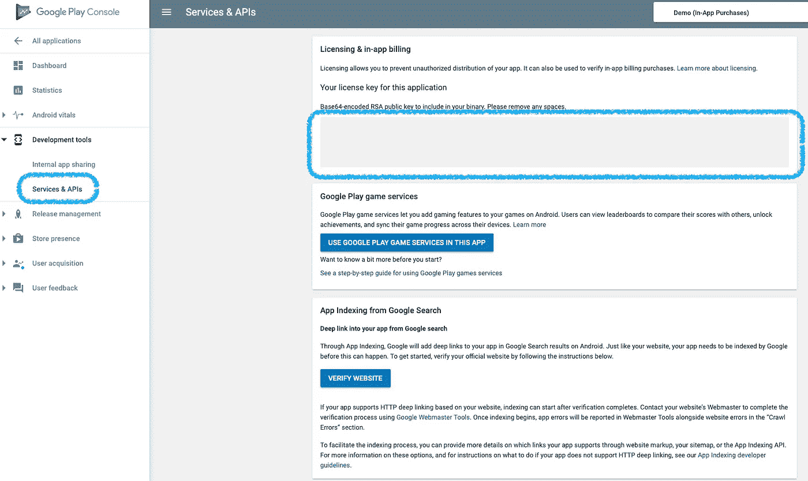

将您的许可证/计费密钥上传到应用程序控制面板的商务部分。


现在，您已经激活了您的商家帐户，并上传了您的许可证/付费密钥。

点击您的应用列表。


从左侧菜单中点击“应用内产品”标签。

如果您的应用程序已经在 Play Store 上发布，并且您刚刚加入了应用程序内购买，则应用程序内产品部分位于应用程序列表的 Store Presence 选项卡下。

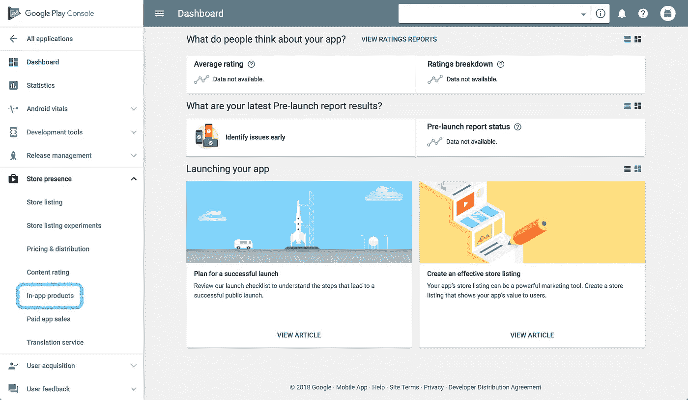

确保选择了“被管理产品”，然后单击“创建被管理产品”

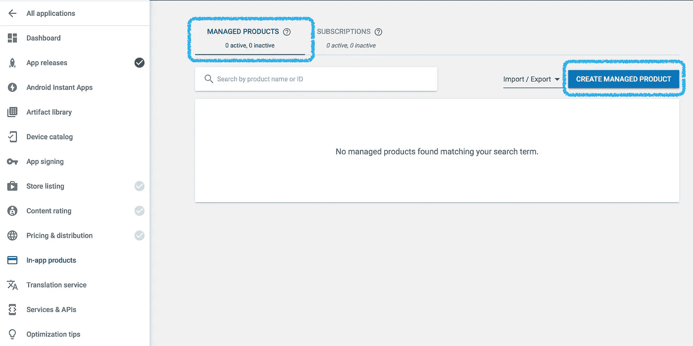

输入您的产品 ID。


输入您的标题和描述，然后将状态更改为活动。

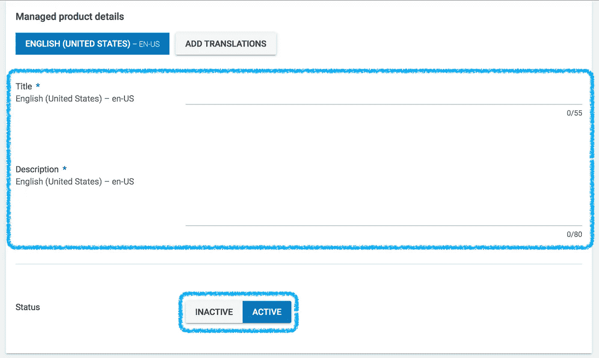

设置价格，然后点击页面底部的“保存”。

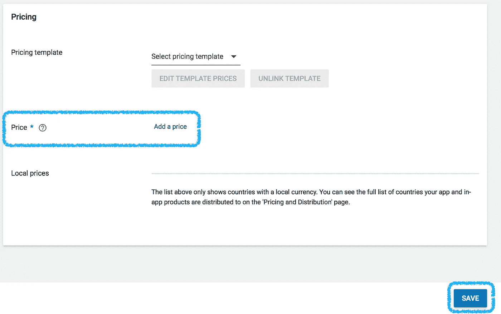

现在，您已经创建了应用内购买，您需要将产品 ID 添加到您的应用控制面板。

在应用程序控制面板中，从左侧菜单转到商务部分。

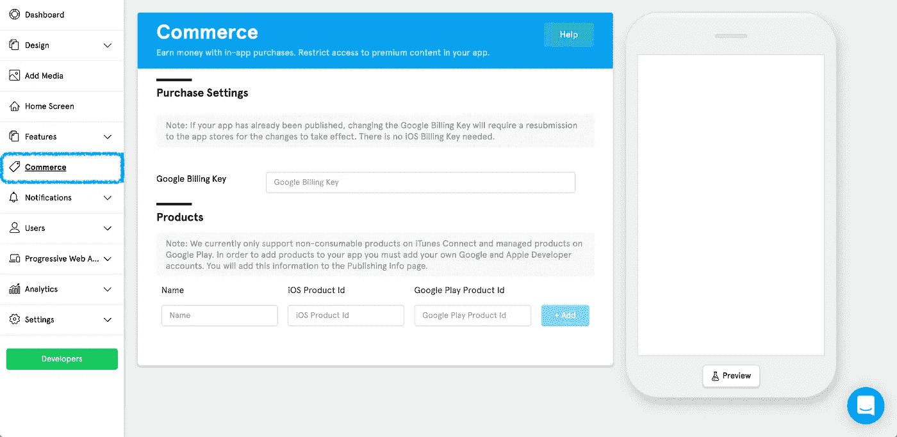

从您之前在 Google Play 产品 ID 字段中输入的 Google 开发者帐户中复制并粘贴产品 ID。

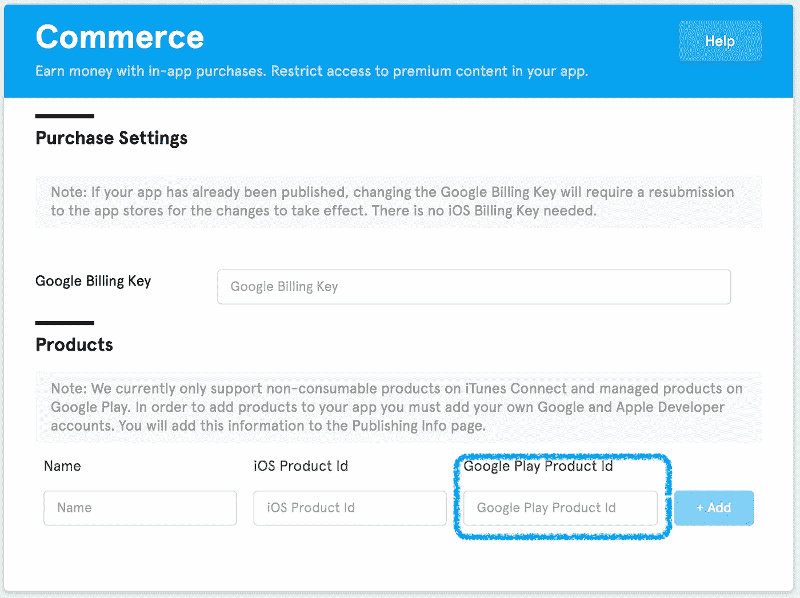

输入产品 id 后，单击“添加”按钮进行保存。

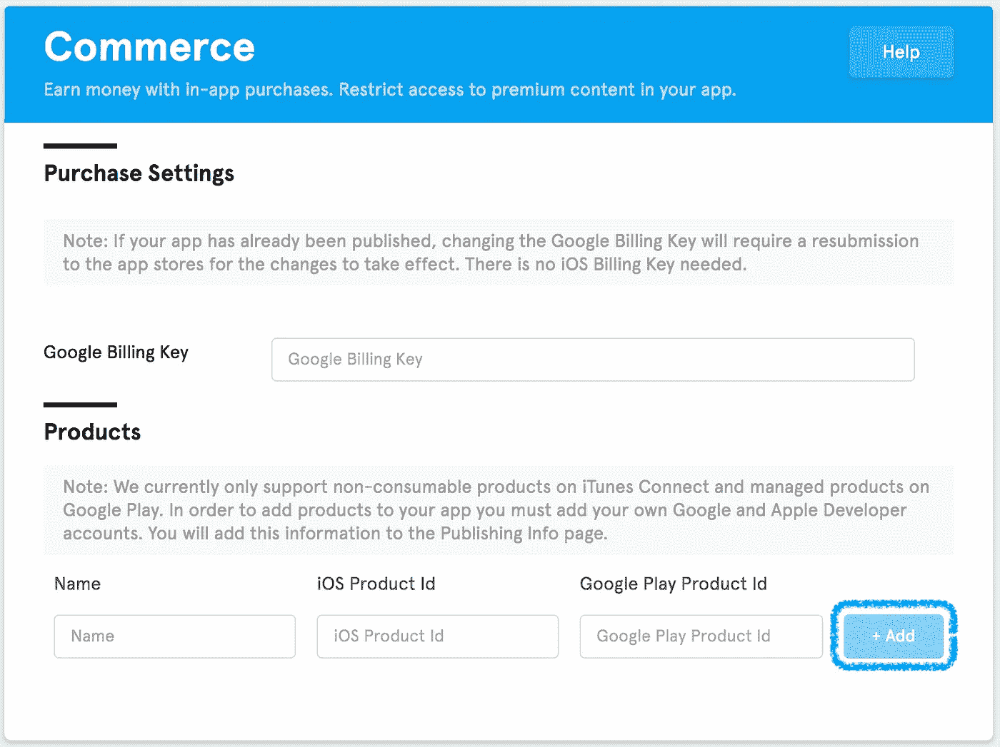

*还有一件事你必须在 Android 中配置:你必须在 Android Manifest.xml 中提交带有以下权限的 alpha 或 beta 版本:*

```
<uses-permission android:name=”com.android.vending.BILLING” />
```

## 3.在 React native 中配置`[react-native-iap](https://github.com/dooboolab/react-native-iap#readme)`库

`react-native-iap`是一个 react 原生模块库，用于 Android 和 iOS 平台的应用内购买。

这个库的目标是在两个平台之间获得应用内购买的体验。

要安装`react-native-iap`，你只需要在项目终端运行以下命令之一:

```
npm i react-native-iap
```

或者

```
yarn add react-native-iap
```

从 React Native 0.60 及更高版本开始，[链接为自动](https://github.com/react-native-community/cli/blob/master/docs/autolinking.md)。所以你*不需要*跑`react-native link`。

如果你在 Mac 上开发 iOS，你需要安装 pods(通过 [Cocoapods](https://cocoapods.org/) )来完成链接:

```
npx pod-install ios
```

现在应用内购买的设置已经完成，我们应该在 React native 中看到代码部分。

首先，我们应该从`react-native-iap`导入 RNIap，就像这样:

```
import RNIap, {
    Product,
    ProductPurchase,
    PurchaseError,
    acknowledgePurchaseAndroid,
    purchaseErrorListener,
    purchaseUpdatedListener,
} from 'react-native-iap';
```

你必须为 iOS 和 Android 分别定义你的产品 SKU:

```
const itemSkus **=** Platform.select({
 ios**:** [
  'com.example.productId'
 ],
 android**:** [
  'com.example.productId'
 ]
});
```

您还必须分别为 iOS 和 Android 定义您的产品订阅:

```
const itemSubs **=** Platform.select({
 ios**:** [
  'test.sub'
 ],
 android**:** [
  'test.sub'
 ]
});
```

现在，您可以使用`itemsSkus`和`itemsSubs`继续获取您的应用内购买产品，如图所示:

# 测试

我们通过让任何用户购买一件产品来检查应用内购买功能。

对于 iOS，我们为此创建了一个沙盒测试器。

转到 iTunes 中的“用户和角色部分”，选择“沙盒测试者”标签，添加一个新用户作为测试者，并提供一些基本信息。有了该用户的凭证，你可以在 iOS 上购买任何产品，而无需支付任何实际费用，并在 iOS 应用程序中测试应用程序购买功能。

要在 Android 中添加测试者帐户，请打开 play store 控制台，转到“设置”部分，然后转到“帐户详细信息”选项卡，向下滚动到**“**许可证测试”并添加您想要添加为测试者的用户的电子邮件。您可以使用这些测试者帐户凭证在 Android 应用程序中测试应用内购买功能。

还有一点要补充:要检查应用内购买，你的 Android 版本必须处于发布模式——你不能在调试版本中测试。

就这样，现在您可以对您的应用内购买进行配置并进行测试。

注意:应用内购买不能在 iOS 模拟器或 Android 模拟器上测试——请使用真实设备。

谢谢大家！