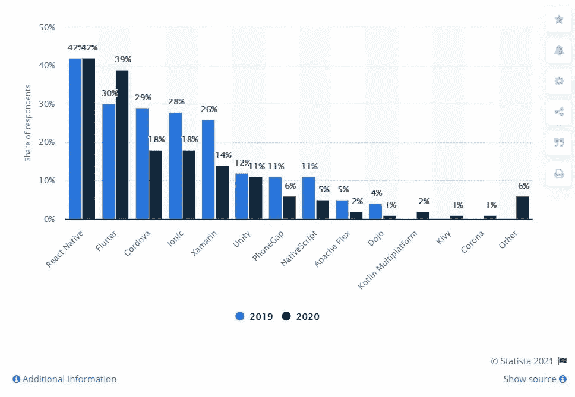

# 反应本土:引擎盖下

> 原文：<https://betterprogramming.pub/react-native-under-the-hood-281df5f548f>

## 深入了解 JavaScript 代码如何在 Android/iOS 设备上运行，如何转换为本机代码，等等

卡斯帕·卡米尔·鲁宾在 [Unsplash](https://unsplash.com?utm_source=medium&utm_medium=referral) 上的照片。

React Native 是一个 JavaScript 库，允许我们创建可以在 Android 和 iOS 上运行的移动应用。正如他们推销的那样，“学一次，随处写。”在过去的两年里，它一直引领着市场，而且似乎没有放缓的趋势。不管我以前有多爱 Flutter(现在仍然如此)，在某些时候，我不得不承认 React Native 非常酷，如果你知道如何使用它，你可以做一些非常好的事情。

来源: [statista](https://www.statista.com/statistics/869224/worldwide-software-developer-working-hours/)

今天，让我们看看这个库是如何在 Android 和 iOS 设备上运行 JavaScript 的。

我们要报道什么？

1.  React 原生应用的 UI 是如何呈现的。
2.  JavaScript 代码是如何捆绑并转化为 Android/iOS 应用程序的。
3.  Android/iOS 设备如何理解 JavaScript。
4.  本机线程如何与 JavaScript 线程通信。
5.  React 原生应用程序的简要性能分析。

# 1.呈现用户界面

首先，让我们弄清楚两件事:

*   是的，React 原生应用将使用原生视图进行渲染。
*   不，JavaScript 代码没有被编译成平台的本地语言。

为什么？这很清楚:您的手机如何能够将 JavaScript 这样的松散类型语言翻译成 Java 或 Objective C 这样的强类型语言？

您将使用组件并遵循 React 特有的单向原则在 React Native 中编写 UI。你会有一个组件树。这些组件之间的通信将通过属性和回调来实现。如果父组件需要某样东西，您将把回调传递给子组件。以同样的方式，如果孩子需要从他的父母那里得到什么，你可以把财产传给孩子。

只要您遵循这个原则，并且不需要将 React 创建组件的本地方式与本地编写的视图混淆，您就不会有太多的开销来设计您漂亮的 UI。然而，如果你真的必须为类似于`MapView`的东西写一些本机代码，库也将[帮助你](https://reactnative.dev/docs/communication-ios)从本机到 RN 的通信，反之亦然。

到目前为止，一切顺利。但是操作系统如何理解 JavaScript 代码呢？

# 2.捆绑过程

将使用特定于该平台的编程语言来开发本地移动应用。当使用 React Native 进行开发时，您几乎可以不用编写任何客观的 C/Java 代码——除非您需要做一些库没有涵盖的事情，例如集成一个只为 Android 和 iOS 提供 SDK 的支付提供商。

然而，任何 React 本地项目都包含一个`ios`目录和一个`android`目录。这些目录充当每个平台的入口点——它们基本上是本地引导反应。它们包含特定于每个平台的代码，这里是每个平台的 JS 代码的桥梁。

为了启动你的应用程序，你通常会运行`yarn android`或`yarn ios`，然后你会等待，直到应用程序神奇地在你想要的设备上打开。但是当你等待的时候会发生什么呢？

一旦你输入其中一个命令(分别是`react-native run-android`和`react native run-ios`，你就启动了打包程序。一个这样的包装商是 [Metro](https://facebook.github.io/metro/) 。打包程序将你所有的 JS 代码放到一个文件中:`main.bundle.js`。当你的应用程序最终在你的手机上打开时，手机会在它熟悉的地方寻找:或者是`android`或者是`ios`目录。这就是我上面提到的本机入口点。这个本地入口点将在一个线程中启动 JavaScript 虚拟机。包含在`main.bundle.js`中的捆绑代码将在这个线程上运行。

现在在这个 JavaScript VM 线程中运行的代码将使用 React 本机桥与本机线程通信。

在跳到 RN 桥，然后分析 RN 应用程序的性能之前，让我们了解一下您的手机是如何运行 JavaScript 代码的。

# 3.JavaScriptCore

例如，JavaScriptCore 是一个允许 JavaScript 代码在移动设备上运行的框架。在 iOS 设备上，这个框架是由 OS 直接提供的。Android 设备没有该框架，因此 React Native 将其与应用程序本身捆绑在一起。这只是增加了一点点应用程序的大小，但最终几乎没有关系。

有一点我想指出，可能会节省你一些调试时间。当应用程序在设备上运行时，JavaScriptCore 用于运行 JS 代码。然而，如果你选择调试你的应用程序，JS 代码将在 Chrome 内部运行。Chrome 使用 V8 引擎，并使用 WebSockets 与本机代码进行通信，因此您将能够看到重要信息，如正确格式化的日志和正在发出的网络请求。请记住，V8 引擎和 JavaScriptCore 之间存在差异——它们是不同的环境，您可能会遇到只有在附加调试器时才会出现的错误，而当您的应用程序在您的设备上正常运行时则不会出现！

除非万不得已，否则我会避免使用调试器。我见过当调试器连接时应用程序行为失常。其中一种情况是当我使用 Wix 的 [react-native-calendar](https://github.com/wix/react-native-calendars) 库创建日历时。这种方法根本不起作用。我不明白我做错了什么！我调查并重读了图书馆的文件。应该是有效的。然而，我连接了调试器，在调试代码时，该方法不起作用。

因此，当您的应用程序在调试时以一种奇怪的方式出错时，只需花一点时间，看看在没有附加调试器的情况下，行为是否相似。

# 4.React 本机桥

RN 桥是用 Java/C++编写的，它允许应用程序的主线程和 JavaScript 线程之间的通信。它使用自定义的消息传递协议来允许这种通信发生。

JavaScript 线程将决定什么必须呈现在屏幕上。它会对主线程说，“嘿，我需要你渲染一个按钮和一个文本。谢谢。”它会用桥来表示这一点。该消息将作为序列化的 JSON 发送。但是除了需要在屏幕上呈现的内容之外，消息还必须说明它将在哪里呈现。这就是影子线发挥作用的地方。shadow 线程与 JavaScript 线程一起启动，它帮助计算视图的位置。结果在前面提到的消息中传递，通过桥发送到主线程。

用户在 UI 上的任何操作都将发生在主线程上。点击按钮、切换开关——任何动作都必须序列化，并通过桥发送到 JavaScript 线程。应用程序的所有逻辑都在这里发生。

# 5.性能如何受到影响

让我们回顾一下到目前为止我们已经讲过的内容。用户点击一个按钮。这个动作被主线程理解，并作为消息传递给 JavaScript 线程。这里处理了一些逻辑，然后 UI 必须相应地改变。影子线程决定这些变化发生在哪里，然后更新作为消息发送回本地线程。由于用户不会太快地点击屏幕，我们在正常的使用场景中一般不会有任何性能问题——桥处理通信相当快。

React Native 的酷之处(与 Cordova 等其他平台相比)在于它不在`WebView`中运行代码。它使用本地视图。这一优势意味着我们将能够开发出流畅而快速的应用程序，能够以 60 FPS 的速度运行。如果你修改了一个在树中很高的组件的状态(并且你没有花费太多的时间来防止无用的重新渲染)，那么整个组件树将被重新渲染。在大多数情况下，用户看不到这一点。然而，如果这些后代计算量很大，那么你会注意到你的应用程序有一点口吃。关于 React 原生应用的性能，我还有很多要说的，所以我们将在另一篇文章中详细讨论。

# 结论

我们无法客观地决定哪种移动开发方法是最好的——每个框架和每个库都有自己的优点和缺点。我们必须根据当前需求、预算、团队可用性和许多其他因素来选择技术。然而，总的来说，React Native 将以一种高性能的方式满足大部分需求。

我希望您现在对 React 原生应用程序中发生的事情更加熟悉，从捆绑过程开始，直到应用程序在您的移动设备上运行。我真的很好奇 React 原生生态系统未来的改进。我们会有一段美好的旅程！

非常感谢你的阅读！你有什么想法？接下来你想读什么话题？

## **消息来源**

 [## React 使原生变得容易

### Edit React Native 是一个允许开发者使用 Javascript 构建本地应用的框架。等等！科尔多瓦已经…

www.reactnative.guide](https://www.reactnative.guide/3-react-native-internals/3.1-react-native-internals.html)  [## React 本机桥如何工作以及它在不久的将来将如何变化

### React 原生应用由两部分组成，JavaScript 端和原生端。原生面可能是…

开发到](https://dev.to/wjimmycook/how-the-react-native-bridge-works-and-how-it-will-change-in-the-near-future-4ekc)  [## 优化平面列表配置反应本机

### virtualized List:flat List 背后的组件(React Native 对虚拟列表概念的实现。)内存…

反应性发展](https://reactnative.dev/docs/optimizing-flatlist-configuration)