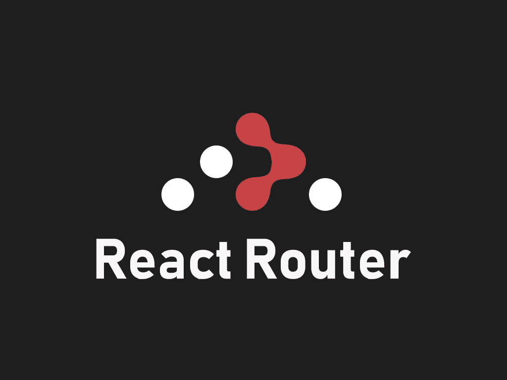

# 反应路由器和客户端路由

> 原文：<https://betterprogramming.pub/react-router-and-client-side-routing-2e483452fbfb>

## 对 React 路由器的服务器端和客户端路由有更深入的了解



如果您一直在使用 React 编程，或者考虑过使用 React，那么很有可能在对话中出现了 React 路由器,作为 React 中处理客户端路由的一种方式。

这篇文章旨在涵盖对服务器和客户端路由的更高层次的理解，以及如果您能够利用 React Router 的强大功能，它将如何成为您的绝佳选择。

# 服务器端路由和客户端路由的区别

## 服务器端路由

处理路由更常见的方法是服务器端路由。服务器端路由不是 React 路由器的一部分，但它仍然是处理路由的最常见形式。

使用服务器端路由，用户单击一个链接，向服务器(另一台计算机)请求新页面或新数据。然后向用户提供新的数据或文档。

让我们再细分一下:

当用户点击网页上的链接时，另一个完整的页面被加载并呈现在屏幕上。URL 路径被更新以匹配用户在网页的当前状态中的位置。

加载和呈现的“整个页面”是通过服务器完成的。服务器端路由是导致整个页面刷新的原因，因为我们向服务器发出了另一个请求，服务器为我们提供了一个全新的页面来显示。

逐步:

1.  用户点击网页上的链接。

2.该链接向服务器(另一台计算机)发送请求。

3.服务器用新内容进行响应。

4.该内容刷新用户屏幕上的信息。

5.URL 被更新以反映用户在网页上的位置。

服务器为浏览器提供内容和文件，以便向用户显示。

使用服务器端路由的主要缺点是内容显示在页面上所需的时间各不相同。如果用户请求的页面仍然有页眉和页脚信息显示在屏幕上，那么我们为什么需要重新加载这些信息呢？

但是服务器不知道我们不需要重新加载那些信息，因为它已经被显示了。服务器将发回需要显示的文件，然后调用完全刷新来显示这个新文件。

随着全面更新，我们现在将互联网速度纳入等式。网速增加了显示在网页上的时间。

但是，我们如何防止这种完全的页面刷新，并可能减缓我们的渲染时间呢？

## 客户端路由

客户端路由是 JS 文件中呈现给前端(或客户端)的路由的内部处理。

客户端路由已经成为越来越多的开发人员在创建他们的应用程序时考虑的事情的原因是因为创建单页面应用程序(spa)的流行。

使用 SPA，当用户单击应用程序中的内部链接时，目标将是在 URL 栏中看到一个变化，以显示页面发生了更新，而没有完全刷新页面。

有了 SPA，我们不需要加载多个页面，只需要来自服务器的带有初始 HTML、CSS 和 JS 文件的原始请求。因此，客户端路由用于创建 SPA 体验，同时使路由更加统一和有组织，便于用户查看。

路由是为了给我们的用户一个更好的整体体验，因为他们能够在应用程序的 URL 栏中找到他们所在的位置，而不需要我们发出多个服务器请求。

## **但是我们为什么要在乎呢？**

我们关心客户端路由有几个原因:

1.  它给用户一个更直观的 URL，让用户能够看到他们当前在应用程序中的位置。
2.  我们想让用户能够使用[历史 API](https://developer.mozilla.org/en-US/docs/Web/API/History_API) 在浏览器中使用“后退”和“前进”按钮。
3.  它使用户能够键入特定的 URL，并能够在应用程序中加载特定的视图。
4.  应用程序在不同链接之间的延迟时间会更短，因为呈现下一个视图所需的信息已经在页面的初始加载之后加载了。

# React 路由器的客户端路由方法

> [*"React Router 是一个导航组件的集合，以声明方式与您的应用程序组合在一起。*](https://reacttraining.com/react-router/)*”—反应训练*

React 路由器对客户端路由采取更动态而非静态的方法。但是这两者有什么区别呢？

## 静态路由

简而言之，对于静态路由，我们预先建立我们希望到达的路由，然后在需要时调用这些路由。这可以通过一个单独的 JavaScript 文件来实现，这个文件可能叫做`routes.js`，它包含了你的应用程序需要到达的所有可能的路径。

现在，每当用户点击一个链接时，它将调用您创建的那个`routes.js`文件，并寻找与被点击的链接相匹配的端点。

这在单击链接后创建了一个额外的步骤，因为现在调用服务器来响应这个请求。这样做的问题是，这些请求需要时间来解决。这个新的请求时间可以根据调用服务器文件的连接强度而变化。

然而，如果你以前用过 React ，你会很快意识到这不是做这件事的“React 方式”。为了进一步证明这一点，在使用 React 的旧应用程序中，您可能不得不创建自己的 API，其功能与您的[组件生命周期方法](https://reactjs.org/docs/react-component.html)相同。

## 动态路由

使用动态路径，路径会随着应用程序的渲染而更新。换句话说，在 URL 栏中看到的路由正在更新以供客户端查看，但是，没有与任何服务器的通信来实现这一点。

反应路由器本质上是一个组件。这意味着向 React 应用程序添加路由器功能的方式与向 React 应用程序添加任何其他功能的方式相同。

让我们深入下面的例子:

```
import React from "react";
import ReactDOM from 'react-dom';**// import your BrowserRouter here just like importing any other functionality**import { BrowserRouter as Router, Route } from 'react-router-dom';const HomePage = () => {
  return (
    <div>
      <h1>Welcome to the Home Page!</h1>
    </div>
  );
};**// now <Route> is being wrapped around <Router> to have the router coordinate displayed instead**ReactDOM.render((
  <Router>
    <Route path='/' render={HomePage} />
  </Router>),
  document.getElementById('root')
);
```

在上面的例子中，我们将`BrowserRouter`导入到我们的应用程序中，并使用`<Router>`功能来匹配`path`。

但是 React 路由器的动态路由的真正优势在于:

```
import React from "react";
import ReactDOM from 'react-dom';
import { BrowserRouter as Router, Route } from 'react-router-dom';const HomePage = () => {
  return (
    <div>
      <h1>Welcome to the Home Page!</h1>
    </div>
  );
};**// Using match to dynamically generate which user is being passed**const User = ({ **match** }) => {
  return (
    <div>
      <h3>{**match**.params.userId}</h3>
    </div>
  );
};ReactDOM.render((
  <Router>
    <Route path='/' render={HomePage} />**// the new path will be the user's id passed into the User component**
    <Route path='/**:userId**' component={**User**} /> </Router>),
  document.getElementById('root')
);
```

我们刚才看到了什么？

当我们将 URL 与一个`UserId`匹配时，将使用`match`属性来呈现为用户显示的路线，以将特定的 URL 与传递给`match.params.userId`的 ID 匹配到`<Route>`中。

React Router 允许我们在保持 React 的动态渲染和路由的同时保持统一的链接，但就像技术中的其他事情一样，使用动态路由肯定有缺点。

一个关键的缺点是对主页的初始请求可能需要更长的时间。由于整个页面需要在初始加载时加载，这可能会导致对主页的初始请求花费更长的时间，如果应用程序的所有内容不需要立即加载的话。

总之，我认为最好了解客户端和服务器端的路由，然后您可以决定您的应用程序更喜欢使用哪一个。服务器端路由仍然是标准，但是客户端引起轰动是有原因的。