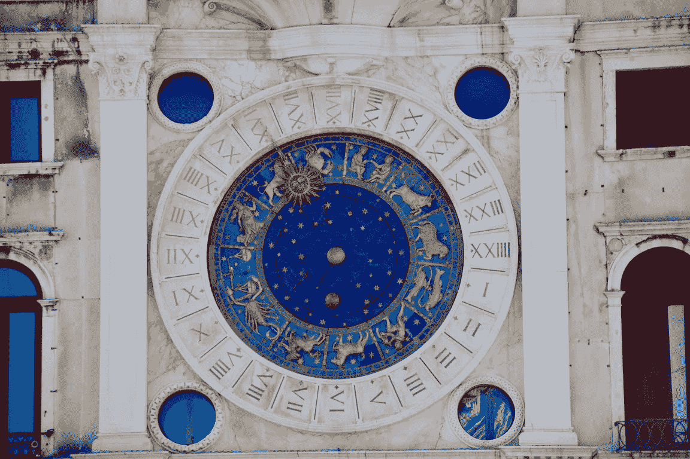

# 如何用 Python 阅读你的星座运势

> 原文：<https://betterprogramming.pub/read-your-horoscope-in-python-91ca561910e1>

## 用 Python 找乐子



乔希·兰格尔在 [Unsplash](https://unsplash.com/) 上的照片。

如果你相信占星术，并且是一个 Python 用户，这篇文章会对你有用。 [Pyaztro](https://github.com/sameerkumar18/pyaztro) ，用 Python 写的 [aztro](https://github.com/sameerkumar18/aztro) 的客户端库，提供了每个星座的星座信息。要安装它，使用`pip install pyaztro`。

例如，让我们来看看今天对金牛座的整体占星预测:

```
import pyaztro
taurus = pyaztro.Aztro(sign='taurus')
taurus.description
```

输出:

```
"Something slides into place today and gets you thinking about the big picture -- it's one of those days when you can suddenly see how it all fits together! Pass the word along to all the key players."
```

除了一般的描述，我们还可以检查这一天的一些更具体的特征:心情、幸运数字、幸运时间、幸运颜色以及与其他标志的兼容性。

```
print(f'Mood:\t\t {taurus.mood}',
      f'\nLucky number:\t {taurus.lucky_number}',
      f'\nLucky time:\t {taurus.lucky_time}',
      f'\nLucky color:\t {taurus.color}',
      f'\nCompatibility:\t {taurus.compatibility}')
```

输出:

```
Mood:          Leading  
Lucky number:  41  
Lucky time:    4am  
Lucky color:   Navy Blue  
Compatibility: Pisces
```

所有这些特征对于每个星座来说每天都在变化。请注意，这里的*兼容性*不是指关系，而是指在这个特殊的日子里事情应该进展顺利的星座。否则，我们每天都得换舞伴！

要获取的其他信息包括星座的名称(如果我们想获得几个星座，这很方便)、星座的日期范围和当前日期。显然，不管日期如何，前两个属性保持不变。

```
print(f'Sign:\t\t {taurus.sign}',
      f'\nDate range:\t {taurus.date_range}',
      f'\nCurrent date:\t {taurus.current_date}')
```

输出:

```
Sign:		 taurus 
Date range:	 [datetime.datetime(2021, 4, 21, 0, 0), datetime.datetime(2021, 5, 20, 0, 0)] 
Current date:	 2021-05-06
```

正如我们所看到的，日期范围是非常不可读的。让我们来解决它:

```
f'Date range: {taurus.date_range[0].strftime("%B %d")} - {taurus.date_range[1].strftime("%B %d")}'
```

输出:

```
**Output:** 'Date range: April 21 - May 20'
```

默认情况下，每个星座都有一个当前日期的星座图。然而，也可以查看昨天或明天的星座:

```
taurus_yesterday = pyaztro.Aztro(sign='taurus', day='yesterday')
taurus_tomorrow = pyaztro.Aztro(sign='taurus', day='tomorrow')
print(f'Today: {taurus.description}',
      f'\n\nYesterday: {taurus_yesterday.description}',
      f'\n\nTomorrow: {taurus_tomorrow.description}')
```

输出:

```
Today: Something slides into place today and gets you thinking about the big picture -- it's one of those days when you can suddenly see how it all fits together! Pass the word along to all the key players. 

Yesterday: You may be just a wee bit too attached to someone or something, but today offers you the perfect chance to shake free, at least a little. What you do after that is entirely up to you! 

Tomorrow: You're feeling pretty restless in at least one part of your life, and it's a really good time for you to see if you can inject some novelty. It's super-easy to find something fun and share it with your people.
```

不幸的是，不可能(至少现在)获得未来或过去某个固定日期的占星信息。

该库考虑到了 12 个经典的太阳星座，它们可以被指定为小写、大写或句子形式。不考虑[恒星学](https://en.wikipedia.org/wiki/Sidereal_and_tropical_astrology)中有时用作第 13 和第 14 星座的替代星座([蛇夫座](https://en.wikipedia.org/wiki/Ophiuchus_(astrology))和[塞特斯](https://en.wikipedia.org/wiki/Cetus))。

# 结论

在这篇文章中，我们看了一个不太知名的用于进行占星预测的库。我希望你觉得这很有趣，并对检查自己的星座感到好奇。

感谢阅读和快乐的预测！

如果你喜欢这篇文章，你也可以发现下面这些有趣的:

[](https://medium.com/geekculture/creating-toyplots-in-python-49de0bb27ec1) [## 在 Python 🧸中创建玩具图

### 高质量的极简交互式可视化，非常适合电子出版

medium.com](https://medium.com/geekculture/creating-toyplots-in-python-49de0bb27ec1) [](https://python.plainenglish.io/the-little-prince-on-a-word-cloud-8c912b9e587e) [## 用 Python 为《小王子》生成单词云

### 文字云上的小王子:我们可以这样解开他的一些谜团吗？

python .平原英语. io](https://python.plainenglish.io/the-little-prince-on-a-word-cloud-8c912b9e587e) [](https://medium.com/geekculture/emojize-your-data-science-projects-8f19d447f03c) [## 你的数据科学项目🎭

### 如何让你的代码和讲故事更生动

medium.com](https://medium.com/geekculture/emojize-your-data-science-projects-8f19d447f03c)