# 实时游戏服务器内部:基本理论，架构，优化，自动缩放

> 原文：<https://betterprogramming.pub/real-time-game-server-internals-basic-theory-architecture-optimization-auto-scaling-b2070aa803d9>

## 了解实时游戏服务器如何在幕后工作——从基本理论到将其部署到 AWS 云中


作者形象

这份材料代表了我的文章[“简单来说就是实时游戏服务器](https://habr.com/ru/post/698986/)”的英文翻译。

# 这篇文章是给谁的

下面的文章是为任何对游戏服务器如何工作感兴趣的人准备的，因为，为了简单起见，除了模式和一般的插图之外，不会有大量的代码。我们将讨论您在设计自己的实时服务器时遇到的特殊问题，您有哪些解决方案，以及我们选择了哪一种。欢迎在评论中对我们的选择或材料提出建设性的批评。

# 为什么它很重要

许多程序员心中都有自己制作游戏的秘密。对他们中的一些人来说，这可能是进入 it 行业的原因之一。但是制作你自己的网络游戏有点复杂，一开始并不明显。然而，和像你这样的真正玩家玩游戏几乎总是比单独玩有趣得多。

如果你和你的朋友一起玩这个游戏，即使是最无聊的项目也可能会开始发光并产生很多积极的情绪。是许多合作 PvE 游戏的粉丝，如*深石银河*、*残迹:从灰烬中重生*、*地狱男爵*等。作为一名开发人员，我一直想知道他们的架构是如何构建的:服务器如何管理游戏会话，他们如何同时处理成千上万的玩家，如何使玩家彼此同步，等等。这成了我研究的目的。

# 为什么它值得一读

在花了将近一年半的时间开发我们的合作实时游戏后，我们(程序员、平面设计师和声音设计师)终于把它带到了试生产状态。这个项目完全是从热情开始的，以此证明我们可以从头开始创建自己的在线合作游戏(在我的例子中，不需要使用现成的解决方案来组织网络上的多人游戏)。

这个项目本身不会在这里提及，因为它还没有向公众发布(如果这篇文章引起了一些兴趣，那么可能会有一些关于其他开发方面的额外材料，比如声音设计、图形设计、团队合作或者 Game Jolt 和 Itch.io 平台的比较)。

在开发过程中，尤其是项目的后端部分(设计服务器体系结构，优化它，并在云中以容错方式部署它)，我不得不搜索互联网的各个角落，这启发了我写这篇文章，在这篇文章中，我以结构化的方式将我解决问题的所有经验放在了一起，这样，您就拥有了从零开始用任何语言编写自己的游戏服务器所需的一切。

# 一点理论:服务器对主机对客户端

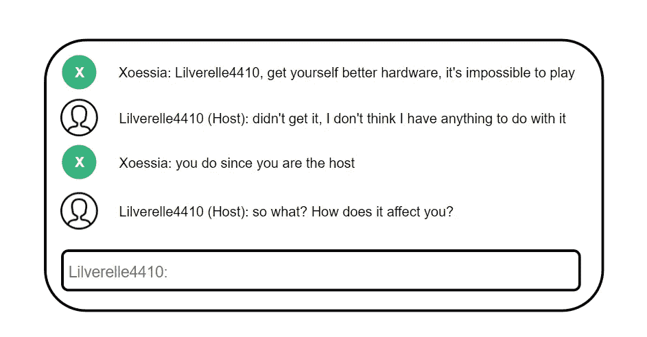

让我们从最基本的开始。假设我们有一个单人游戏，我们扮演一个棍子人。游戏为我们生成敌人，负责提供物体物理。看起来是这样的:


我们想引入双人游戏，因为和某人一起玩游戏总是更有趣，但是我们该怎么做呢？假设我们有了项目的源代码，让我们稍微修改一下。我们将游戏复制到第二台计算机上，复制棍子人，并对我们的计算机进行编程以交换棍子人的坐标，从而使它们在两台计算机上同步:


糟糕，出现了问题。第一台计算机和第二台计算机产生敌人，所以我们总共有六个敌人，而不是三个。此外，由于它们都是在同一个地方繁殖的，它们根据每台计算机单独计算的物理原理而分散开来。

这里我们有两台计算机的“大脑”之间的冲突每个都生成自己的世界，计算自己的物理量，这就是为什么我们在每台电脑上看到不同的画面。

我们怎么解决？我们需要单一的真相来源。只有一台计算机将负责计算物理和生成敌人；这台计算机将在那上面花费它的计算资源，而另一台计算机将在第一台计算机之后重复。这台第二台计算机将只对绘制它们的所有对象的坐标感兴趣:

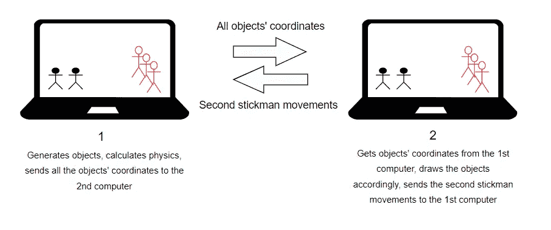

这样，第一台计算机就变成了我们所说的服务器。它为其他玩家(他们的计算机)提供计算资源，并向他们发送游戏状态(所有对象的坐标，可能还有一些其他数据)。其他玩家的计算机，也称为客户端，可以在服务器之后重复(通过绘制相同的游戏状态)并发送用户动作作为回报(例如，键盘或鼠标按下的按钮，如左、右键、右、上等。).

因此，我们看到以前完整的游戏现在分成了两部分:服务器端应用程序和客户端应用程序。运行服务器端应用程序的计算机称为主机。

这是我们玩的在线游戏中使用的通用客户端-服务器架构。

## 所以主机和服务器是一回事？

不完全是。服务器是应用程序的主要部分，客户端会跟随并重复，而主机是运行服务器的机器。谁将成为该主机是一个问题，根据答案，将为我们提供两种根本不同的体系结构，各有利弊:

**1。主机是游戏会话**中一个玩家的计算机

在这种情况下，其计算机充当主机的玩家拥有游戏的真实实例，因为该玩家的计算机进行所有物理计算并生成对象。

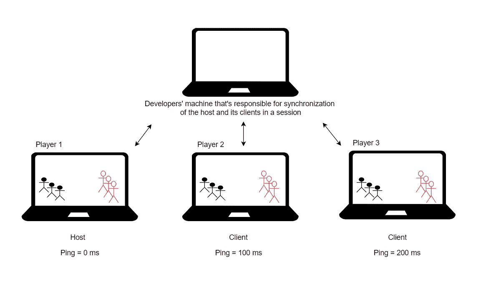

优点:

*   游戏开发者不必花很多钱在强大的服务器上，因为玩家的一台计算机将负责所有的计算。通常，开发者的机器只是同步玩家和收集数据，不需要强大的资源。

缺点:

*   主机玩家将比其他玩家有优势，因为对于主机玩家，ping(延迟)将总是 0 ms，所以这种方法对于 PvP 会话是不公平的，而更适合于合作游戏
*   由于游戏的服务器端部分由其中一个玩家控制，该玩家可以利用它作为作弊的机会
*   如果在游戏会话期间，主机玩家机器不再能够处理计算(这对于具有旧硬件的玩家来说是典型的)或者主机在互联网连接上有一些问题，那么它将影响会话中的每个人。它甚至会导致它的终止

正如我们所看到的，这种方法可以为开发人员节省一些资金，但它也有许多风险，因为应用程序的服务器端部分将由主机控制。

**2。主机是开发者的电脑(权威服务器)**

这种架构意味着在线游戏的开发者将自己为玩家提供游戏会话。他们可以通过多种方式实现这一点，他们可以在数据中心租赁/购买一些机器来为游戏会话提供服务，或者他们可以从 AWS、Google Cloud、Azure 等云提供商那里租赁虚拟机。

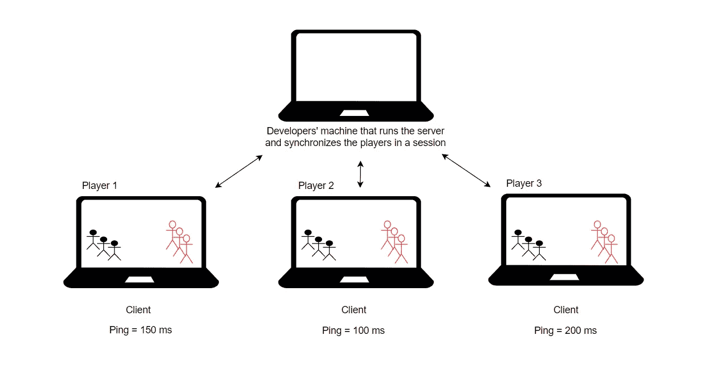

优点:

*   玩家无法获得服务器端应用程序的代码，这使得作弊和寻找漏洞变得更加困难
*   通常，开发者租用稳定的机器来运行他们的服务器，这些服务器具有足够强大的硬件和稳定的网络，以确保所有玩家都能不间断地玩游戏
*   没有一个选手比其他选手有任何优势。每个人都在相同的条件下，每个人都遵循一个权威的服务器，所以这种架构非常适合 PvP 会话

缺点:

*   如果一个游戏涉及复杂的世界、物体的生成，以及物理计算，那么即使是处理一个会话，也需要强大的资源(内存、处理器)，因此购买和租用这样的资源对于开发者来说是相当昂贵的

# 权威游戏服务器实现

## 为什么选择权威服务器

有几个原因:

1.  虽然游戏涉及世界生成和物理计算，但它并不消耗大量的处理器时间(CPU ),因为游戏是 2D，所有的动作都发生在一张不大的地图上
2.  尽管作弊处理和不间断的游戏会话对 PvP 游戏来说比合作 PvE 更重要，但作为一名开发者，当你完全控制你的服务器时，拥有它们还是不错的
3.  服务器是用 Python 写的。不幸的是，使用 Python 很难对玩家隐藏服务器的源代码。Python 是一种解释型语言，这意味着你的程序不会被编译成机器代码。在 Windows 的情况下是 exe 文件),但是表示一些每个人都可以阅读并且 Python 可以执行的文本文件。
    是的，我同意这有一点争议，因为一些技巧使得对 Python 代码进行逆向工程变得更加困难，实际上，甚至机器代码也没有受到逆向工程的保护，但这一点也使得权威服务器看起来像是我们更好的选择

## Python 对于一个有物理的实时游戏有多好

对于那些知道 Python 有多慢的人来说，这种语言选择可能看起来很奇怪。但是这里的技巧是，大多数时候，Python 并不自己计算公式或物理，相反，它将工作委托给在它的引擎盖下工作的 C 库。

例如，对于物理计算，我们使用 pymunk 库，它建立在 2d 物理 chipmunk 库之上，而后者是用 C 编写的，因此性能很好。

Python 在服务器上执行以下操作:

*   无限循环(`while True:`)，任何游戏的典型代码，所以一个游戏会不断更新，不会停止。重要的是游戏每秒至少更新 60 次，相当于 60 FPS)
*   游戏对象创建、事件和玩家连接处理

Python 在足够的级别上处理这些任务。

# 游戏会话架构

每个游戏会话在项目中最多可以有三个玩家。但是对于我们这些服务器开发者来说，什么是玩家呢？这是与我们服务器的连接。播放器向我们发送按下的键盘键(左、右、下、空格等)。)，我们回到当前的游戏状态。

这是我们需要为所有三个玩家并行执行的算法，这还不是全部。除了我们三个玩家(连接)，我们必须和他们并行处理游戏本身。总的来说，我们有四个“计算线程”(第一个玩家、第二个玩家、第三个玩家和游戏本身)，它们都应该并行运行。

我们如何实现这一目标？


## 关于并行编程的几句话:进程和线程

当您运行一个应用程序(无论是游戏、服务器、浏览器还是任何其他应用程序)时，会在您的计算机上为该应用程序创建一个进程。您可以在任务管理器中看到该过程(在 Windows 系统上)。每个进程至少包含一个线程。线程是执行在一个处理器内核上运行的进程的一种方式。

如果您的处理器(CPU)有八个内核，那么一个具有一个线程的进程只能使用该处理器的一个内核(总容量的 12.5%)。因此，如果您希望您的应用程序使用所有处理器容量，您需要在该应用程序的进程中创建八个线程，它将利用所有八个可用的 CPU 内核，这将导致 100%地使用处理器容量。因此，通过增加一个进程中的线程数量，我们实现了并行性，这使我们能够同时做几件事情(多任务处理),并提高我们的应用程序的性能。


在我们的例子中，我们对多任务感兴趣。我们需要并行处理第一个玩家、第二个玩家、第三个玩家以及游戏本身的连接。因此，对于一个游戏进程，我们需要四个线程。但是，仅仅创建四个线程是不够的；我们还应该让他们以某种方式交流，这样他们就可以一起行动，这次有帮助的是一个队列。

又是一点理论。队列是一个容器，它允许我们安排线程之间的通信。当一些线程将一些信息放入队列时，其他线程可以从该队列中读取这些信息。例如，与第一个玩家连接的线程将该玩家按下的鼠标/键盘键放入一个称为“第一个玩家键队列”的队列中然后，游戏中的一个线程以先进先出(FIFO)的顺序读取该队列，并将该玩家按下的键付诸行动，因此第一个玩家控制的角色开始向该玩家指定的方向移动。

## 游戏会话架构:总体情况

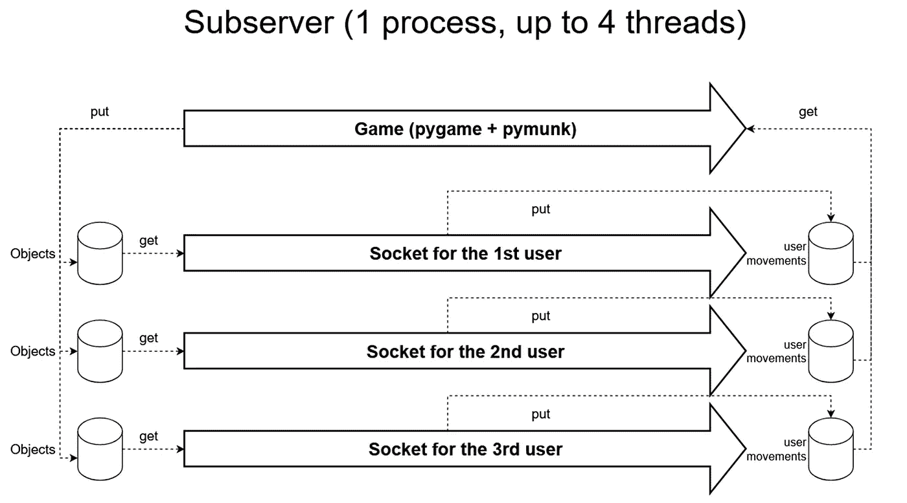

如你所见，我们在`Game`中有一个线程，它读取(`get`操作)三个有用户移动的队列。这个线程成功地并行捕获所有玩家按下的键。在处理这些玩家按下的键(通过移动他们的角色)之后，游戏线程将当前游戏状态(所有对象坐标)放入每个玩家的队列``Objects` ` (` `put``操作)中。

这使得玩家的线程可以从那里读取当前的游戏状态，并将其发送到玩家的计算机，以更新他们的游戏状态，以响应他们按下的键，所有这些应该每秒发生 60 次(60 FPS)。

这样，我们得到了一个非常简单但有效的系统，如下所示:

*   玩家发送他们按下的鼠标/键盘键，游戏处理它，移动他们的角色，并发送当前游戏状态作为回报(所有对象的坐标)。
*   当玩家玩在线游戏时，他们可能甚至没有意识到所有这些过程都发生在幕后。对他们来说，似乎他们按了“左”，字符向左移动只是因为计算机让他们向左移动，但实际上，计算机向远程服务器发送了一个按下的键。
*   这个服务器有一个与用户连接的线程，这个线程将这个按键放入一个特殊的队列中。
*   在此之后，线程从队列中读取按键，将其付诸行动(移动玩家的角色)，并将游戏状态(坐标)发送到另一个特殊队列。
*   最后，与用户连接的线程从那里读取游戏状态，将该状态发送到玩家的 PC，PC 通过新坐标重新绘制所有对象。

这就是全部的魔力。

# 浅谈 Python 及其线程问题

不幸的是，Python 不允许所有四个线程同时活动，这已经不是什么秘密了。由于 Python 程序员中众所周知的[全局解释器锁(GIL)](https://realpython.com/python-gil/) ，一次只能有一个线程处于活动状态。

所以，在 Python 中，我们没有使用四个线程的四个核心，而是只有一个核心，所以我们没有提高性能，因为这四个线程在 Python 中不是并行运行的)。

尽管如此，我们实现了多任务处理，一个 CPU 核心的容量已经足够三个连接和游戏本身。

## 如何管理游戏会话

上面描述的架构只涵盖了游戏会话本身，但是我们仍然需要另一个流程来编排这些游戏会话(或者更准确地说，它们的流程)，比如创建、跟踪和删除。

这是玩家在进入游戏会话之前将与之互动的过程。让我们称这个进程为主服务器。玩家将要求主服务器给他们一个当前会话列表(以连接到他们)或创建一个新的会话。让我们看看这种交流是什么样子的:

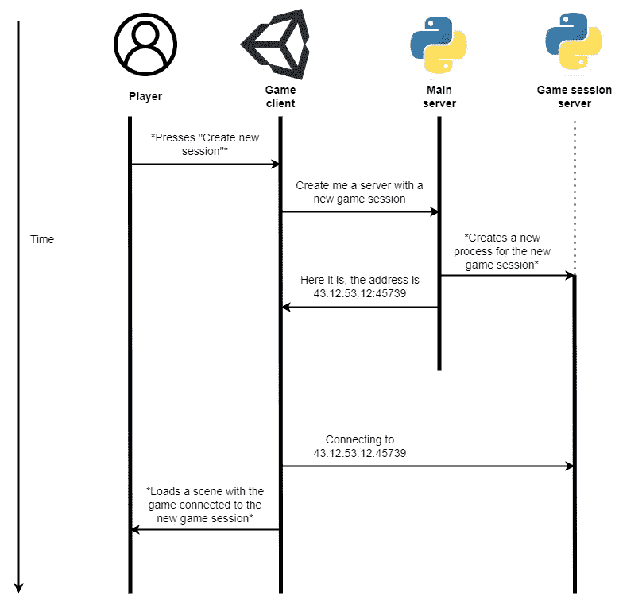

# 优化:为什么要优化

由于该项目首先是实时的(意味着我们应该尽可能减少玩家按下键盘按键和看到结果之间的时间)，我们必须在服务器和客户端上引入一些优化，以实现最佳的性能和稳定性。

# 服务器优化

## 1.数据是如何发送的

服务器和客户端最初都是用 Python 编写的(客户端在一段时间后用 Unity C#重写)，所以我们有机会使用 Python 发送数据的方式，即“pickle”以下是此类数据流量的一个示例(从服务器到客户端):

```
[<network_classes.border.NetworkBorder object at 0x000001A44EF51070>, 
<network_classes.border.NetworkBorder object at 0x000001A44EF51280>, 
<network_classes.border.NetworkBorder object at 0x000001A44EF51040>, 
<network_classes.border.NetworkBorder object at 0x000001A44EF83550>, 
<network_classes.border.NetworkBorder object at 0x000001A44EF83520>, 
<network_classes.border.NetworkBorder object at 0x000001A44EF834F0>, 
<network_classes.border.NetworkBorder object at 0x000001A44EEAF790>, 
<network_classes.player_ball.PlayerNetworkBall object at 0x000001A44EEAF6D0> ……..]
```

使用 Pickle 在服务器和客户机之间交换数据的利与弊:

优点:

*   易于在 Python 上实现

缺点:

*   实时项目的重物
*   不跨平台(服务器和客户端都必须用 Python 编写)
*   安全问题([)恶意 pickle 数据可能会在拆包过程中执行任意代码。](https://docs.python.org/3/library/pickle.html)因此，这种方法更适合您可以信任发送者的私有网络)

对 pickle 相关问题的认识使我们转向了另一种更通用的数据发送方式——JSON，这种数据流量的一个例子:

```
[
  {x: 12, y: 10, id: 30, radius: 80, color: “red”, cls: “ball”}, 
  {a_x: 22, a_y: 45, b_x: 122, b_y: 145, id: 45, color: “blue”, cls: “border”},
  ...
]
```

优点:

*   仍然易于实现
*   没有安全风险
*   跨平台

缺点:

*   对于实时项目来说仍然是沉重的对象(JSON 数据由键和值组成。虽然值不断变化，值得在每个游戏帧发送，但密钥保持不变，代表冗余的字节数。另外，我们应该总是在发送时序列化 JSON，在接收时反序列化，这会花费一些处理器时间)

为了实现最佳优化，已经决定切换到通常的值字符串，并使用值本身的顺序而不是键。以下是此类数据流量的一个示例:

```
1.2.0.0.800.0.10.20.0.5;1.3.1200.0.2000.0.10.20.0.5;1.4.0.1200.2000.1200.10.20.0.5;1.5.0.0.0.640.10.20.0.5;1.6.0.960.0.1200.10.20.0.5;1.7.2000.0.2000.640.10.40.0.5;1.8.2000.960.2000.1200.10.40.0.5;3.11.400.100.90;3.12.1500.1100.90;3.13.1900.1000.120;3.14.300.1100.160;3.15.1200.600.50;3.16.700.1000.80;3.17.1600.700.170;3.18.800.900.170;2.1.832.1130.60.0.5.1.0.0;4.22.1832.1495.140;4.23.288.948.150;5.25.1855.531.60.7;5.26.1290.1130.60.7….
```

现在我们没有多余的数据；我们有纯值和分隔符。

我们为客户做同样的事情。例如，以前，它以 JSON 格式发送按键数据。看起来像这样:

```
{“up”: true, “right”: true, “left”: false, “down”: false, “attack”: false, “accelerate”: false}
```

现在，它只发送一串纯值，其中包含相同的数据，但长度缩短了约 10 倍:

```
110000
```

优点:

*   没有安全风险
*   轻质物体
*   跨平台(唯一的事情是我们必须在客户机和服务器上实现打包和解包逻辑，这是一对`split`操作符)

缺点:

*   难以实施和维护

但是对我来说利大于弊，所以我坚持这个方法。

## 2.密切关注阻塞操作

如果你的程序包含几个线程和连接，重要的是要注意不要出现一个线程停止，其他线程也停止的情况，因为它们在等待它的输入。

例如，在我们处理游戏会话的过程中，我们有一个带有玩家连接的线程，它将玩家按下的键放入一个特殊的队列中，供游戏读取。这里很重要的一点是，如果游戏线程读取了这个队列，却没有得到任何数据(因为队列还是空的，比如某个玩家连接不好，无法发送其数据)，那么游戏线程就更进一步，不会因为这个玩家而停止，不会等待他们。在 Python 中，您需要明确指定线程不应该等待队列给出信息，因为默认情况下`get`操作是阻塞的。

所以这段代码:

```
player_move = player.move_queue.get()
player.move(player_move)
```

应该这样重构:

```
try:
	player_move = player.move_queue.get(block=False)
except Empty:
	player_move = previous_player_move
player.move(player_move)
```

如果我们没有收到玩家按下的按键，我们可能会认为他们仍然在按下之前的按键，所以让我们再次分配这个数据，并进一步。

## 3.关闭套接字(连接)的缓冲

默认情况下，套接字在到达某个缓冲区时发送数据(从客户端到服务器，反之亦然)。为了立即发送数据，我们需要在服务器和客户机上都关闭 Nagle 的算法:

```
s = socket.socket(socket.AF_INET, socket.SOCK_STREAM) 
s.setsockopt(socket.IPPROTO_TCP, socket.TCP_NODELAY, 1)
```

## 4.使用 TCP 协议，而不是 UDP

说到数据流，我们会立即想到 UDP，因为它发送数据时不进行任何其他处理。一些网络数据包可能会丢失，一些可能会重复，但它比 TCP 快得多，确保所有网络数据包有序和完整。

如果我们有糟糕的网络和连接问题，TCP 可能会带来一些延迟，但现在，几乎每个人都有良好的互联网连接，所以 TCP 不必带着相同的数据包来回运行。如前所述，它保证了数据的顺序。如果我们使用 UDP，那么在处理之前，我们应该确保通过一些验证过程获得可靠的未被破坏的数据，这导致实现 TCP 已经为我们做的一些事情。

**注**:这有点争议，因为并不是所有地区都有很好的连接(尤其是移动数据)，所以有时候我们不得不坚持 UDP 协议，至少对于人物的移动来说是这样。

## 5.在服务器消息之间添加分隔符

然而，TCP 协议没有解决一个问题。尽管它保证了数据的顺序，但它不保证这些数据会出现在一个数据包中。

例如，如果我们要发送`Hello world`和`Hi all`，它们可能会以下列方式出现:`Hell`、`o wor`、`ldHi all`。因此，在消息之间添加一些分隔符非常重要。

假设`?`是消息的开始，而`!`是消息的结束，那么如果我们发送`?Hello world!`和`?Hi all!`并获得`?Hell`、`o wor`、`ld!?Hi all!`，我们可以很容易地使用分隔符将这些消息连接起来，并获得我们的原始消息，即`Hello world`和`Hi all`。

# 客户端优化

## 预测算法

有时，网络会不稳定 0.5-2 秒。当它发生时，客户端没有从服务器获得任何数据，所以游戏为客户端而停止。如果经常发生，玩家会看到抽搐的物体，这会破坏游戏体验。

我们该如何处理？通常，在 0.5-2 秒内，没有什么特别的事情发生。向特定方向移动的对象仍然在那里移动，所以如果我们没有来自服务器的数据，我们可以根据它们最后的坐标保持所有对象以它们最后计算的速度移动。例如:

取以前的坐标:`(500, -403)`

取当前坐标:`(503, -410)`

计算理论速度:

`speed_x = 503–500 = 3 pixels`

`speed_y = -410 + 403 = -7 pixels`

请注意，这个理论速度应该由服务器计算，而不是由客户端计算，并与其他数据一起发送到客户端。因为客户端可能会因为数据包丢失而误算这个理论速度。

因此，只要我们没有来自服务器的数据，下一个理论坐标将是:`(506, -417)`，然后是`(509, -424)`，等等。

# 部署

现在我们有了一个可行的优化解决方案，我们可以开始讨论部署它了。

## 什么是动态自动缩放

动态自动扩展是一种根据工作负载自动更改多种资源的方式。

在我们的例子中，这意味着拥有尽可能多的虚拟机(=运行服务器的主机)来为玩家处理所有游戏会话，并根据玩家的需求自动增加/减少它们的数量。

## 为什么小型独立项目需要具有动态自动扩展功能的基础设施

让我们看一个简单的方法来部署我们的权威游戏服务器:

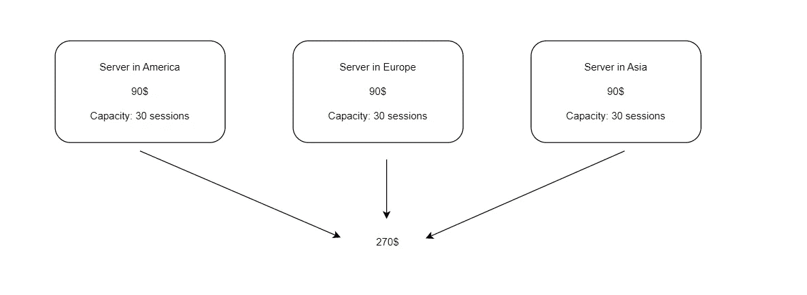

如果我们想以较低的 ping 频率覆盖地球上的大部分地区，我们可以租用三台或多或少功能强大的机器，每台机器位于不同的区域。在我的例子中，一台 CPU 优化的虚拟机可以处理多达 30 个游戏会话，在 DigitalOcean(一家云提供商，允许你租用虚拟机等远程资源来运行你的服务器)中的价格是 90 美元。

这种做法很好理解。三台机器在各自的区域，每台都有自己的游戏时段，你为每台机器支付固定的价格(总共约 300 美元)。

虽然这个解决方案对独立开发者来说似乎很简单，但它非常昂贵，例如，我们的项目根本不是商业项目，所以如果可能的话，削减成本会很好。显而易见，我们可以想到的是采用功能较弱的机器，但我们马上就会有很多“如果”:

*   如果游戏引起了兴趣，而服务器无法处理高工作负载，该怎么办？
*   如果服务器出现故障，无法处理任何玩家，除非我们手动重启，怎么办？
*   就算我们拿一个强大的服务器，万一它遭遇了 DDoS 攻击呢？
*   如果我们所有的担心都是徒劳的呢？这个项目不会引起任何兴趣，300 块钱就没了。

要是有一种方法可以在生产中动态地解决这个问题就好了。如果我们的服务器中有 1-2 个游戏会话，那么就让一个弱的虚拟机托管服务器并处理它们。我们可以临时增加虚拟机的数量来处理所有的游戏会话，然后在我们不需要它们时释放它们。

在 AWS 等大型云提供商的帮助下，我们可以实现这一场景:

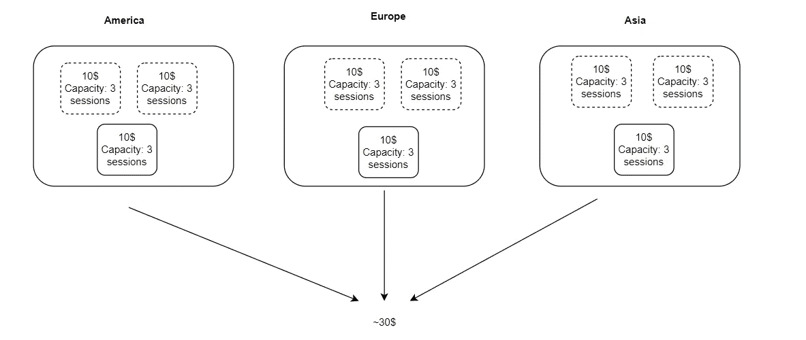

现在，在每个地区，我们有一组资源，而不只是一个大型虚拟机，这些资源总是包含至少一个虚拟机，在我们的情况下，这是 AWS 中的一个`t2.micro`机器，它能够处理三个游戏会话，如果全天候运行，每月费用为 10 美元。

在三个地区部署这种基础设施每个月会产生大约 30 美元(如果没有人在我们的游戏服务器上玩，这对独立项目来说是很现实的，但在这种情况下，我们只会损失 30 美元，而不是上面描述的 300 美元)。

# 为什么选择 AWS

AWS 拥有该基础设施所需的一切。当然，可以使用其他大型云提供商来构建类似的基础设施，但 AWS 有大量的文档和大型社区，所以解决每个小问题并不需要花费太多时间。但是，如果我们忽略这种动态扩展，由于其简单的虚拟机配置和定价政策，DigitalOcean 看起来是一个更好的选择。

## AWS 中的所有外观

对于我们希望部署基础架构的每个地区，我们都有以下图片:

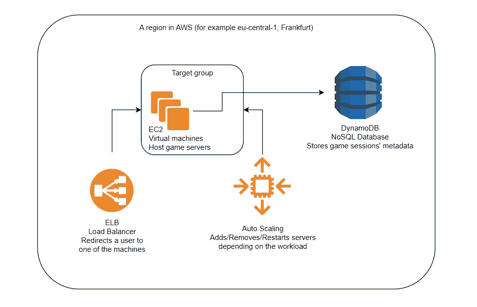

我们这里有什么，为什么:

## 目标群

代表一组托管游戏服务器的虚拟机。这是它在 AWS 中的样子:

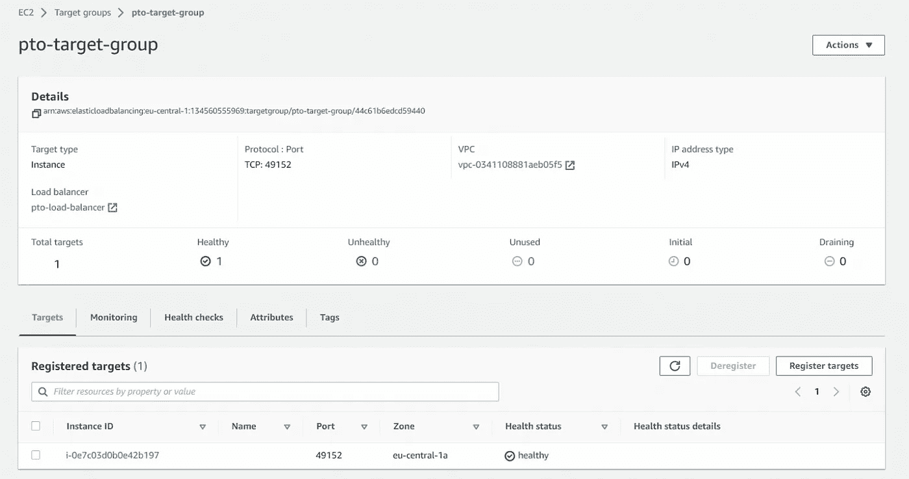

我们可以看到，目前这个目标组只有一台机器(在注册的目标中)，并且它被标记为健康。AWS 如何检查这一点？负载平衡器(如下所述)检查服务器运行的端口，它在几秒钟内检查一次(我们指定这个数字)，如果它得到任何响应，它将我们的机器标记为安全和完好。

一点理论:我们的服务器在一个与其进程相关联的特定端口上工作(在我们的例子中是 T1 );它需要创建一个虚拟点，这样我们就可以开始和结束玩家的连接。

# 弹性负载平衡器

表示一个负载平衡器，它接受来自播放器的连接，并以循环方式(循环顺序)将其重定向到目标组中的一台计算机。不幸的是，弹性负载平衡器(ELB)不跟踪诸如 CPU(处理器)利用率之类的虚拟机特征，所以它不考虑哪些虚拟机已加载，哪些未加载。

在下面的截图中，你可以看到 ELB 的主要组成部分，那就是`Listener`。它定义了等待玩家的端口，以及当玩家尝试连接时将玩家重定向到哪个目标组:


# 自动缩放

进行自动缩放。它监控目标组中虚拟机的指标，并设置:

*   最小容量—(目标组中虚拟机的最小数量)。这是从一开始就将运行的机器数量
*   所需容量—(所需的虚拟机数量)。该数值将根据负载自动变化
*   最大容量—这是我们允许自动扩展服务运行的最大虚拟机数量(因为每个虚拟机毕竟都要花钱)

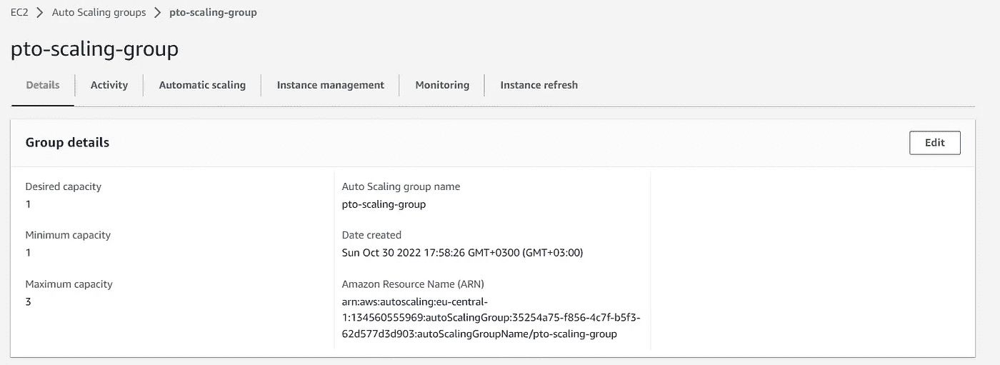

此外，自动缩放包含一个启动模板；它是一个指令，告诉 it 部门如何运行一个新的虚拟机，选择什么硬件和操作系统，以及运行什么命令:


此外，自动扩展包含一个动态扩展策略，我们在该策略中告知何时应该添加或删除装有服务器的虚拟机:

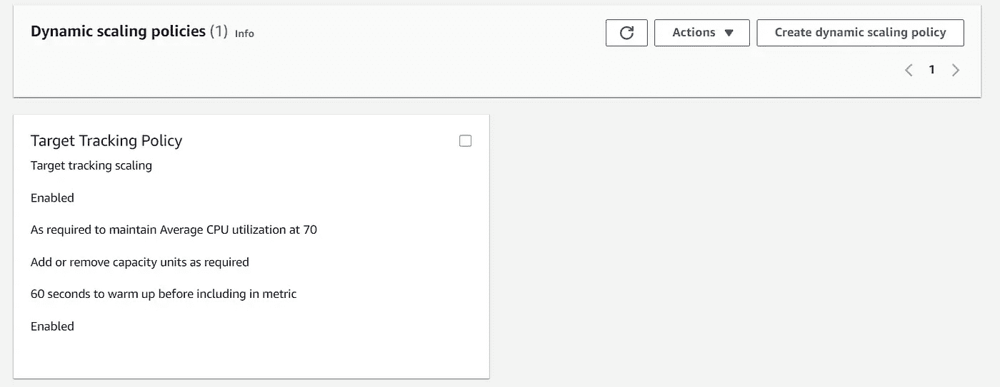

在我们的例子中，据说，“每台机器上的平均 CPU 利用率不应该超过 70%。根据需要添加/删除虚拟机，并在启动后给每个虚拟机 60 秒的时间，然后再考虑其指标”。

# DynamoDB

该服务代表一个 NoSQL 数据库，并作为游戏会话元数据的临时存储。我们为什么需要它？问题是，我们的目标组中的每个虚拟机都是独立的机器，每个都有自己的游戏会话，并且不知道其他机器。

让我们设想一种情况，你和你的朋友在一个地区玩游戏，你想连接到他们的会话，但结果是你在该地区内的两个不同的虚拟机上玩游戏，所以你需要连接到你的朋友正在玩游戏的虚拟机。你是怎么做到的？这就是 DynamoDB 可以帮助你的地方。

目标组中的所有虚拟机都将其游戏会话的元数据发送到 DynamoDB (IP 地址+端口+会话中有多少玩家+任何其他有用的元数据)，无论您连接到什么虚拟机，如果您向该虚拟机请求当前会话的列表，它都会通过从 DynamoDB 获取所有虚拟机的所有游戏会话的列表。

因此，游戏客户端(玩家用来玩游戏的)从服务器接收所有会话，看到它寻找的会话位于不同的 IP 地址，并连接到该地址，当然它是自动连接的，所以玩家不会注意到这些过程。

通过这种方式，一组独立的虚拟机可以作为单个机制工作。

游戏会话在该数据库中的外观:

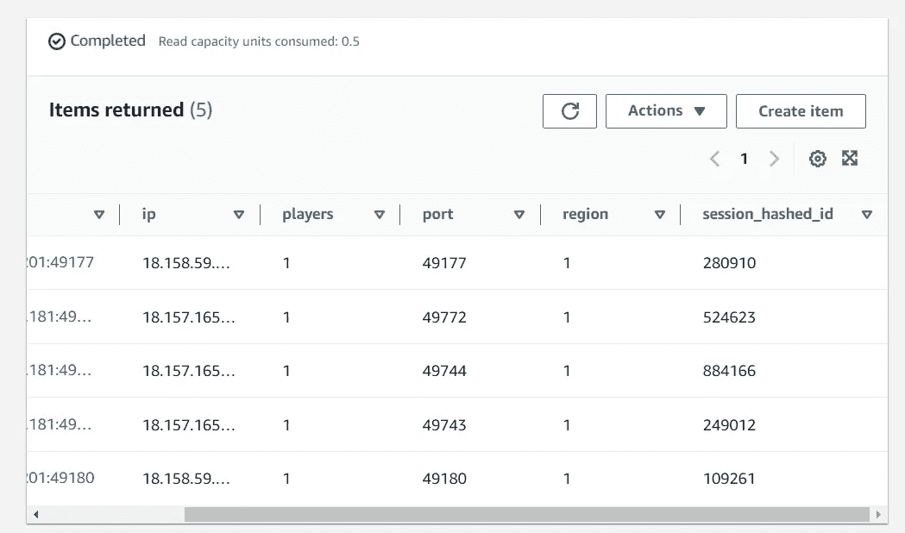

## 游戏的客户端部分现在与谁对话，直接与负载平衡器还是虚拟机对话？

都是。我们可以要求自动扩展为它启动的每个虚拟机分配一个公共 IP:

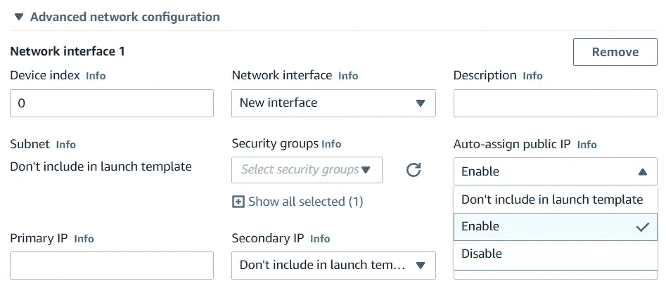

这样，我们使用负载平衡器做两件事，我们连接到一个随机的虚拟机，它要么为我们创建一个新的游戏会话，要么给我们一个当前游戏会话的列表。一旦我们有一个会话，我们使用它的元数据(IP +端口)直接连接到它，而不需要负载平衡器的参与。

## 这个基础设施有多有效

AWS 为虚拟机提供基本或详细的监控(需额外付费)。基本监控(CPU/磁盘/网络使用情况等。)每五分钟向 cloud watch(AWS 中的云监控服务)发送其指标。因此，它会影响自动伸缩性能，因为它会根据这些指标做出决策，以五分钟的延迟采取措施。

这里我们有两个解决方案:启用详细监控以每分钟而不是五分钟发送指标，或者降低阈值以启动新的虚拟机。例如，如果您计划在平均 CPU 利用率为 70%时启动一个新的虚拟机，则将其设为 50%，以便自动扩展可以提前做出反应。

让我们看一个例子。我们将通过三个游戏会话使目标组中当前虚拟机的 CPU 过载:


自动缩放将所需容量设置为 1 至 2:


我们在目标群体中看到了这一点:


等等，现在我们有两个工作的虚拟机:


## 该基础设施中的容错能力

容错是系统即使在某些组件出现故障时仍能继续工作的能力。

如果负载平衡器无法通过指定端口连接到服务器，它会将该虚拟机标记为不健康。自动缩放服务看到它，并用新机器替换该机器:


## DDoS 保护

正如 AWS 文档所说，[它为所有用户提供 AWS Shield 标准，不收取额外费用。](https://docs.aws.amazon.com/waf/latest/developerguide/ddos-standard-summary.html)它保护用户免受网络和传输层最常见的 DDoS 攻击。但问题是，你看不到它是如何工作的。它在后台运行，你无法确定它什么时候保护你。没有报告。

另外，从官方声明 [AWS Shield 标准在你使用弹性负载均衡、应用负载均衡器、CloudFront 和 Route 53](https://aws.amazon.com/shield/pricing/) 时自动启用来看，你不能确定这种保护对你的虚拟机(是 EC2 服务)是否有效。还有另一项服务，AWS Shield Advanced，[，它明确保护 EC2 虚拟机](https://aws.amazon.com/shield/pricing/)，并将其活动发送到 CloudWatch，但这是一项付费服务，每月费用为 3000 美元。

尽管如此，即使我们的虚拟机遭受 DDoS 攻击并失败，负载平衡器也会将它们标记为不健康，并且自动扩展服务会在没有我们参与的情况下在新的 IP 地址上重新启动它们。所以我们不能说这个系统免受 DDoS 攻击，但它会在攻击后自动恢复，所以我们不必手动修复服务器。唯一的问题是玩家可能会因为游戏被打断而心烦意乱。

## 这种基础设施的缺陷

当 Auto Scaling 服务开始减少虚拟机的数量时(因为负载已经减少)，则该服务不关心玩家在即将被删除的机器上是否仍有游戏会话。因此，这会导致他们的会话中断并破坏游戏体验。

幸运的是，AWS 允许我们暂停和恢复一些自动缩放过程。我们对删除虚拟机的终止过程特别感兴趣。我们所做的是，当自动扩展创建虚拟机时，我们授予该虚拟机权限(通过 AWS 中的角色)以执行自动扩展服务中的命令:


目标组中的每台计算机都会定期检查 DynamoDB 中的会话列表，如果发现至少有一个会话，它会通过暂停来阻止自动扩展终止进程删除虚拟机，如果发现没有会话，它会允许自动扩展终止进程通过恢复来删除虚拟机:

```
# block the Auto Scaling Terminate process from deleting the virtual machines
aws autoscaling suspend-processes --auto-scaling-group-name <scaling-group-name> --scaling-processes Terminate
# unblock the Auto Scaling Terminate process from deleting the virtual machines
aws autoscaling resume-processes --auto-scaling-group-name <scaling-group-name> --scaling-processes Terminate
```

因此，如果我们至少有一个会话，那么对于自动缩放服务，终止进程将被标记为挂起:


## 它值多少钱

价格会根据玩家的消费和你想要部署这个基础设施的地区数量而变化。就我而言，由于游戏还没有发布，我没有可靠的统计数据，只能粗略计算一下:

*   虚拟机 EC2 —在所有三个区域的目标组中，至少有一台虚拟机正在运行。一个`t2.micro`类型的虚拟机每月花费 10 美元，AWS 每月免费给你一个这样的机器，所以我们总共有 20 美元(如果没有人玩我们的游戏，实际上，这个数字肯定会更大)
*   DynamoDB——免费的，AWS 在免费层中为 dynamo db 服务提供了 25 GB 的存储空间，对于我们的用例来说，这已经足够了
*   弹性负载平衡器——每 GB 流量每小时收费，但玩家不会使用这项服务直接连接到游戏会话，因此这项服务不太可能收费
*   自动缩放—免费
*   收集指标的 CloudWatch 和分配给虚拟机的几个公共 IP 可能会产生一些额外的小额费用

总体而言，具有动态自动扩展功能的基础架构使我们能够实现容错，并大幅削减虚拟机租赁成本。我认为这是独立开发者的理想解决方案。

# 结论

在过去的一年半时间里，深入游戏服务器的世界，它们的架构，有什么技巧可以优化它们，以及如何在云中部署它们，已经成为我的一大爱好。我很高兴我能够把游戏的服务器端部分带到这种状态，我希望我的经历也能帮助每个对此感兴趣的人。

感谢每一个坚持到最后的人！