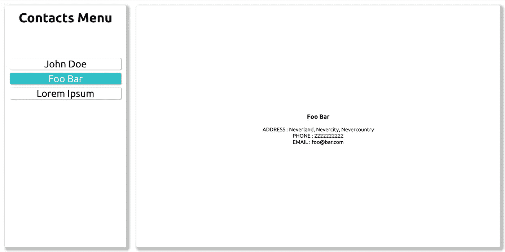
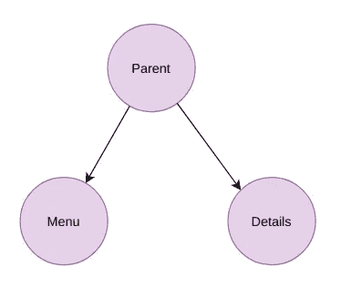
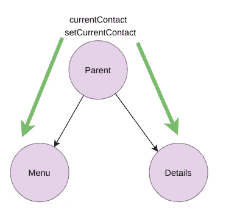

# 反冲. js——React 的新的、更好的状态管理库

> 原文：<https://betterprogramming.pub/recoil-js-the-new-better-state-management-library-for-react-1095947b5191>

## 为什么反冲比现有的库更好，你如何使用它？

克里斯蒂娜@ wocintechchat.com 在 [Unsplash](https://unsplash.com/s/photos/black-tech?utm_source=unsplash&utm_medium=referral&utm_content=creditCopyText) 上的照片

js 是 React 的一个非常新的状态管理库，由脸书开源。尽管还处于起步阶段，但对于 React 开发人员来说，它似乎有希望简化全局状态管理。它提供了现有状态管理库的所有特性，我认为，这是一种更好的方式。它还兼容其他几个功能。

这篇文章将帮助你理解为什么我们首先需要一个全球状态管理系统，以及为什么它应该被反冲。回答完这些问题后，我们将进入一个简短的教程，看看反冲的作用。不，这不是另一个你可以在互联网上找到的教程，他们告诉你如何更新一个计数器值，并增加和减少它。相反，我们将创建一个简单的应用程序来说明在现实应用程序中实际使用的东西，比如从服务器获取数据。

*   [教程中使用的全部代码](https://github.com/GunaShekar02/recoil-contacts-app)
*   [要查看我们将要构建的内容，请前往这个沙箱](https://codesandbox.io/s/github/GunaShekar02/recoil-contacts-app)

最终的应用程序看起来会像这样:

为了从整体上理解这篇文章，读者应该对 [React](https://reactjs.org/) 和 [React 钩子](https://reactjs.org/docs/hooks-intro.html)有相当的了解。

React 中的状态管理是谈论最多的话题之一。在继续之前，我们先回答一个基本问题。我们到底为什么需要一个状态管理库？尽管 React 在状态方面是自给自足的，但当涉及到在多个组件之间共享数据、异步数据获取等时，它就变得复杂了。

## 在多个组件之间共享数据

假设你有一个联系人应用程序。它会向您显示联系人列表，当您选择一个联系人时，其详细信息会显示在一张卡片上，就像这样:

为了保持模块性，我们将菜单(在左边)和细节卡(在右边)分为两个不同的组件。大概是这样的:

我们希望实现以下功能:当我们单击一个联系人的名字时，我们获取他们的详细信息并将其呈现在右侧。因为它们不在同一个组件中，所以不能有一个状态来指导细节的显示。如果我们按照 React 的方式来做，我们最好将状态“提升”到它们的父组件——即，将菜单和细节组件作为子组件的组件——然后我们将状态“向下”传递到子组件。

简单地说，我们在父组件中有一个名为`currentContact`的状态，将`currentContact`状态传递给菜单和细节组件。您还必须将状态的设置器传递给菜单组件，因为该组件必须能够更改联系人。这种情况在下面的树中表示:

这个很好用。我们再深入一层(字面意思)。假设联系人列表(显示联系人姓名的列表)在一个单独的组件中，并且是`Menu`组件的子组件，结果得到一个 React DOM 树，如下所示:

现在，你必须将状态向下传递两级，从`Parent`到`Menu`，从`Menu`到`List`。也许现在你明白为什么我们需要一个全球国家管理系统来避免这种情况。

在进入反冲之前，让我们解决另一个问题。当`currentContact`改变时，我们如何更新细节组件？对于其他(大多数)状态管理库，您可能必须通知库状态已经更新。现在，我们希望根据新的状态获得一些新的数据——您可能会使用 React 的`useEffect`钩子(类似于`componentDidUpdate`)来实现这一点。

如果库自动知道一个状态已经被更新，并根据改变后的状态获取新数据，这不是很好吗？当然，会的！反冲通过维护数据图来实现这一点。请看下面的图:

这是一个依赖关系图，显示联系人的详细信息依赖于菜单中当前选定的联系人。`contactDetails`状态订阅`currentContact`状态，并且每当`currentContact`状态被更新时，`contactDetails`被自动重新计算——即，新联系人的细节被从服务器获取。

你知道什么会更好吗？如果库自动通知 UI 正在从服务器获取数据，告诉它呈现一个“后退”(加载)UI，这样用户就知道发生了什么。你可能已经猜到了，反冲也能做到这一点(甚至更多)。

除了共享状态、维护数据图和以真正平滑的方式实现异步操作之外，反冲还提供了其他几个特性。这些特性中最有前途的一个，也是区别于现有库的一个，是它与[并发模式](https://reactjs.org/docs/concurrent-mode-intro.html)的兼容性。

到目前为止，我希望你明白为什么使用反冲是有益的。在继续本教程之前，我很乐意让你看看 [Dave McCabe 在](https://www.youtube.com/watch?v=_ISAA_Jt9kI) [React Europe 2020 会议](https://www.react-europe.org/)上的演讲，在那里我们第一次了解了这个令人敬畏的图书馆。正如他在演讲中所说，反冲是管理状态的最“反应式”的方式，使 React 开发人员能够无缝地使用它，而无需花费太多精力学习新的 API。

您可能还想查看一下[官方文档](https://recoiljs.org/docs/introduction/motivation)中对这个库和 API 的简要介绍。

# **教程**

如上所述，我们将构建一个简单的联系人应用程序，首先在侧边栏上呈现所有联系人的姓名，当我们单击其中一个姓名时，该联系人的详细信息将被异步获取和呈现。

在继续之前，让我们先了解一些基础知识。

如果用 React 的方式来做，你最好用一个`useState`钩子来存储`currentContact`并使用`setCurrentContact`(状态的 setter 函数)在我们点击另一个名字时更新当前的联系人。你可以使用所谓的“原子”在反冲中实现类似的功能

顾名思义，原子是能够存储任何有效形式的数据(对象、数组、数字、字符串等)的单一状态单元。)，除了可以在应用程序中的任何地方使用原子之外，与 React 状态完全一样。正如我们在 React 中有`useState`钩子，我们在反冲中有`useRecoilState`钩子，它与`useState`钩子有相同的接口。它将一个原子或选择器(我们很快就会看到什么是选择器)作为输入，并返回一个包含两个值的数组——值本身和这个状态的 setter 函数。几乎不需要你付出额外的努力，你就可以从`useState`迁移到`useRecoilState`。如果你还没有明白，不要担心——继续读下去，完成教程，一切都会变得清晰。

有时候，您可能需要修改一个现有的状态，或者使用一个现有的状态来产生一些其他有用的输出。例如，在我们的应用程序中，我们必须使用`currentContact`状态来获取联系人的详细信息，并生成一个包含当前所选联系人详细信息的新状态。为此，为了获得“派生状态”，我们使用了所谓的“选择器”。

选择器选择一个现有的状态(可以是一个原子或另一个选择器)，“获取”状态的值，使用它来执行一些动作(从服务器获取相关数据，从现有状态计算一些值，等等)。)并返回一个我们可以使用的修改后的状态。在我们的应用程序中，我们需要一个选择器来首先获取所有姓名的列表(这个选择器不依赖于任何其他状态)，然后另一个选择器来获取当前所选联系人的详细信息(这个选择器依赖于`currentContact`状态)。

如上图所示，由于`currentContactDetails`选择器依赖于`currentContact`状态。每当`currentContact`状态更新时，就会重新计算`currentContactDetails`，即根据新设置的`currentContact`获取新数据。担心重复获取相同的数据，因为我们可能会选择相同的名称？别再担心了。反冲提供的“选择器”包装器(我们将在下面看到如何实现)充当“记忆器”，即它缓存对应于某个输入的值，因此如果您再次请求相同的联系人详细信息，它将直接从缓存中获取，而不是从服务器中获取。继续阅读[纯函数](https://www.tutorialspoint.com/what-is-a-pure-function-in-javascript)和[记忆](https://www.sitepoint.com/implementing-memoization-in-javascript/)以获得更好的理解。

当我谈到原子时，我说状态可以用在“应用程序的任何地方”反冲是如何帮助我们做到这一点的？它提供了`RecoilRoot`组件，该组件必须是我们想要在其中访问状态的所有组件的父组件。理想情况下，这将是`index.js`或`App.js`文件——即您的顶层组件。

最后，让我们进入代码，看看如何实现所有这些。下面是我在这个项目中使用的目录结构:

如您所见，我们有父组件`App`，根据上面的描述，它有两个子组件`Sidebar`和`Details`。这个组件被包装在`RecoilRoot`中，因为我们希望`App`的所有子组件都使用`Recoil`状态。

`Sidebar`组件:

侧边栏组件有一个标题，一个`ContactsList`组件呈现我们的联系人列表。如您所见，`ContactsList`组件被包装在一个`Suspense`中。这允许我们在从服务器异步获取应用程序的数据时显示一个后退(加载)UI。

在我们看`ContactsList`组件之前，让我们看看如何定义原子和选择器，使我们能够使用全局的状态变量。

反冲/atoms.js:

就这么简单！Atom 只不过是一个使我们能够存储状态的函数。它需要一个键和一个默认值。关键属性*对于应用程序中的每个*原子和选择器*必须是唯一的——这就是数据图知道一个“节点”(或状态)与另一个不同的方式。默认值与您最初传递给`useState`钩子的值完全一样。*

反冲/选择器. js:

这里使用的 `getContacts`和`getDetails`函数模拟服务器的动作——也就是说，它们暂停两秒钟，然后分别异步返回联系人和详细信息。

选择器类似于 atom，只是它允许您拥有一个派生的状态，而不是固定的状态(如果您熟悉 Redux，可以把它想象成类似于 Redux thunk 中间件，您可以在更新状态之前执行函数和操作)。同样，选择器是一个接受具有两个(或者可选地三个)属性的对象的函数:一个`key`，一个`get`函数(如果您想要修改状态，还可以选择一个`set`函数)。如上所述，这个键是这个选择器的唯一标识符。`get`函数允许您获取存储在选择器中的值。正如我们接下来将看到的，我们将使用`useRecoilValue`钩子来获取选择器的值。

第一个选择器`contactsList`的`get`函数简单地向服务器发出查询，以获取所有联系人的姓名。从函数返回的响应将在我们的 React 组件中可用。

第二个选择器稍微复杂一些。`currentContactDetails`选择器的`get`功能依赖于我们之前定义的`currentContact`原子。这就是我们将这个选择器“订阅”给那个原子的地方，这样每当原子更新时，选择器就可以从服务器获取一个新值，而不需要我们的干预。

选择器的`get`函数在其参数中接收一个对象，该对象具有一个属性，该属性也被命名为`get`，这个参数 guy `get`是一个函数，您可以使用它来获取应用程序中其他原子和选择器的值。因此，我们将使用它来获取`currentContact`原子的值，并获取适当的细节。如果你使用`get`函数来获取任何反冲状态，你的选择器会自动订阅该反冲状态，并在它的任何依赖状态改变时重新计算。

现在，我们如何在我们的`ContactsList`组件中使用这些原子和选择器呢？

`ContactsList`组件:

在前几行中，我们将导入`useRecoilState`和`useRecoilValue`钩子以及我们刚刚定义的原子和选择器。在组件中，我们首先使用`useState`钩子初始化 React 状态，以同样的方式初始化 atom。`useRecoilState`钩子将一个原子作为输入，并返回一个数组，该数组包含状态本身和修改状态的 setter 函数。

如上所述，为了读取选择器的值，我们使用了`useRecoilValue`钩子(您也可以将`useRecoilState`用于选择器)。该组件返回联系人数组中存在的所有联系人的列表。`classNames`只是为了区分当前选择的名称和未选择的名称。为了知道哪个被选中，我们使用原子的值——即`currentContact`状态——并在我们单击它时将这个`currentContact`更新为新名称。

但是有一个问题:选择器没有默认值，正如我所说的，我们的`getContacts()`函数需要两秒钟来获取数据。在获取数据的两秒钟内会发生什么？

输入 React `Suspense`。

正如我已经提到的，我们将`ContactsList`组件包装在`Suspense`中，因此任何未解决的承诺(如果您不知道这是什么意思，请将其想象为当前正在获取的数据)都将导致我们的回退 UI 的呈现，即“加载联系人…”。

`Details`组件:

类似于`Sidebar`组件，`Details`组件呈现一张卡片，显示所选联系人的详细信息。

`Card`组件:

如您所见，我们从前面定义的`currentContactDetails`选择器中获得了当前联系人的详细信息。

将所有这些放在一起:当我们在侧边栏组件上选择一个名字时，atom `currentContact`被更新，这又导致选择器`currentContactDetails`被更新，这又导致卡片 UI 用新联系人的详细信息更新。

# 摘要

我们首先看到了为什么我们需要一个全局状态，然后看了看反冲的很酷的特性，然后我们实现了一个简单的应用程序，就像你在现实世界中使用的那样。如果你已经读完了，我衷心感谢你！

我希望您已经理解了反冲的概念以及如何在您的应用程序中实现它。

*注意:我不建议你在生产应用中使用反冲 API 目前还不稳定(截至 2020 年 5 月 30 日),还在开发中。尽管它是一个几周前才发布的图书馆，但它已经开始受到欢迎，这说明了后坐力的力量和效用。*