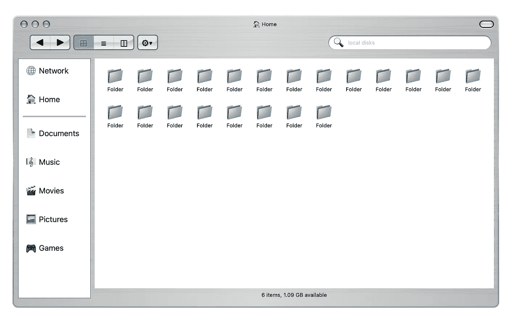

# 使用 SwiftUI 重新创建旧的 Mac OS X 黑豹探测器

> 原文：<https://betterprogramming.pub/recreate-the-old-mac-os-x-panther-finder-using-swiftui-d08a8afb6357>

## 看起来像糖果的拉丝金属效果和浅绿色按钮又回来了

作者照片。

最初的 Mac OS X(版本 10.0)引入了一个名为 Aqua 的新用户界面。史蒂夫·乔布斯自信它看起来足够好去舔。这可能是因为按钮泡泡上的灯光让它们看起来像糖果。

这是一个关于重新创建上面的 Finder 窗口的教程，它更类似于 OS X 10.2(也称为 Panther)。这个版本和以前版本的主要区别是拉丝金属背景和内容后面没有细条纹。

我用三层实现了这个效果:

*   纯浅灰色
*   画水平线的路径
*   提供照明的渐变

在我们开始之前，我们应该设置一些`Color`常量。这些是你重建整个窗户所需的唯一颜色。以这种方式创建常量是很有用的，因为接受类型为`Color`的参数的修饰符允许您像传递现有系统颜色的`.red`一样传递类似`.aquaRed`的值。

SwiftUI 颜色的扩展

首先，我们创建一个包含水平线路径的形状。

如果你仔细观察[最初的金属拉丝效果](https://guidebookgallery.org/pics/gui/system/managers/filemanager/macosx103-1-1.png)，你会发现线条并不完全笔直。我们的线是二次曲线，这意味着它们有一个控制点，使它们向上或向下弯曲。为了使效果缩放到任意大小，我决定使用一个循环，将窗口的高度分成五个点的步长。如果窗口高度为 500 磅，循环将绘制 100 条线。每条曲线的垂直位置以及弯曲它的控制点仍然是随机计算的。

如果线条不是随机绘制的，它看起来就太像条纹图案了。

拉丝金属窗户背景

接下来，我们需要制作一个圆形按钮，用于窗口左上角的关闭、最小化和全屏按钮。我们从制作一个简单的`View`开始，它创建一个带有渐变的任意形状的轮廓。这有助于在顶部添加高光，在底部添加阴影，这在 OS X 浅绿色设计中很常见。我们把它用于圆形按钮，也用于窗口本身的轮廓。在`ZStack`的背面，我们有一个高光，它是一个向左偏移的非常浅的灰色圆圈。

红色关闭、黄色最小化和绿色全屏 3D 浅绿色按钮

在这之前，我们有一个没有指定`foregroundColor`的圆，这很重要，因为这将呈现我们希望按钮呈现的颜色。圆圈的下半部分有一个亮点，这是通过模糊一个白色的圆圈并向下移动来实现的。我使用了一个`GeometryReader`来计算应该应用多少偏移量，以及确定顶部高光的大小。最后，我们添加轮廓，然后将整个按钮剪成圆形，纵横比设置为方形。

现在我们将为 Finder 窗口创建内容。我们将从搜索字段开始，它并不复杂。背景是一个白色胶囊，前面有一个偏移轮廓。前景是一个带有放大镜图标的`HStack`和一个普通的 SwiftUI `TextField`，它实际上没有自己的背景。

圆形搜索区域

在[这个 Finder](https://guidebookgallery.org/pics/gui/system/managers/filemanager/macosx103-1-1.png) 截图的右上角有一个按钮，是切换工具栏按钮。这在现代版本的 macOS 中已经不存在了，在 OS X 黑豹的所有应用程序的所有窗口中也不可用。它和我的 [3D Aqua buttons 教程](https://typesafely.substack.com/p/recreate-the-3d-aqua-buttons-from)中的按钮非常相似，有一些细微的变化。它不需要标题，所以我们不需要将配置传递给按钮。这与圆形按钮的主要区别在于使用了`Capsule`形状而不是`Circle`，允许按钮向任何方向伸展。长宽比没有锁定，所以可以更高或更宽，而不会破坏我们期望的外观。

右上角的灰色切换工具栏 3D Aqua 按钮

现在我们已经完成了顶行，我们可以将红色、黄色和绿色按钮与灰色工具栏按钮结合起来。窗口的标题将在两者之间居中。如你所见，按钮是由我们之前创建的`Color`的扩展赋予颜色的。因为它们的纵横比被锁定为正方形，所以圆形按钮不需要给定宽度。切换工具栏按钮的宽度为 30，而`HStack`高度设置了所有子按钮的高度，因此它们不需要单独设置。

标题栏包括所有四个按钮和居中的窗口标题。

窗口顶部的最后一个接触点是控件。如果你看一下 Finder 的截图，你会看到后退和前进按钮，三个查看模式选项，以及一个操作按钮。我们实际上可以从同一个控件中制作所有这些，我称之为`AquaSegmentedControlView`。这需要一个特定的波形作为背景，所以我先做一个。

该形状从左下方到右上方弯曲两次。

波浪形状是用来掩盖一个非常浅的灰色，几乎是白色，揭示其背后的线性梯度。现在我们有了按钮的背景，我们可以继续创建它们了。我定义了一个名为`ButtonData`的类型，它允许我们将所有按钮的配置作为一个数组传递。这个数组在一个`ForEach`中使用，它显示每个按钮标题并在它们之间放置分隔线。

一记重击

像我们创建的其他按钮一样，大多数按钮的 action 闭包都是空的，但是显然您可以在闭包中做您想做的事情。这种情况的例外是视图模式，它实际上在左端有一个突出显示的部分。为了实现这一点，我添加了一个`viewModeIndex State<Int>`属性来跟踪哪个片段被选中。点击线段会改变此属性，当前选定的线段会以蓝色突出显示。

这结合了后退、前进、查看模式和动作按钮。

所以现在我们有了所有我们想要的控件和空闭包，如果我们想增加功能，可以把代码放入其中。我们需要做的最后一件事是创建显示 Finder 内容的 scrollviews。出于本教程的目的，它将是硬编码的字符串。在下面的例子中，我对图标使用了表情符号:

Finder 窗口中左侧的小面板

如果你想使用这些或添加你自己的图像，这取决于你。重要的是，这是一条竖线`ScrollView`，在前两项之后加了一条横线。我们将对主要内容区域做一些类似的事情，除了这将使用一个`VGrid`来代替。网格使用表情符号📁作为文件夹的图标，这是我节省时间的另一种方式，而不必复制每个图标。

FInder 窗口中文件夹图标的主网格

最后，我们可以将所有东西放在一起，创建一个完整的窗口。我们将`AquaWindowControlsView`放在后面，因为它会延伸到窗口的大小，以便将自己放在顶部而不受其他任何东西的影响。顶部控件和内容在此之上的一个`VStack`中，背景插入在`ZStack`的后面。`AquaHighAndLowlightView`被添加到其他所有东西的顶部。

因为窗口添加了一个`cornerRadius`修改器，所以使用了一个覆盖图。

这实际上是用一个圆角矩形对它进行了屏蔽，如果轮廓不在被屏蔽视图的顶部，它就有被屏蔽的风险。

完整的 Finder 窗口代码

我用了🏠在`AquaWindowControlsView`中的单词`Home`旁边有表情符号，但是你也可以尝试复制这个图标。