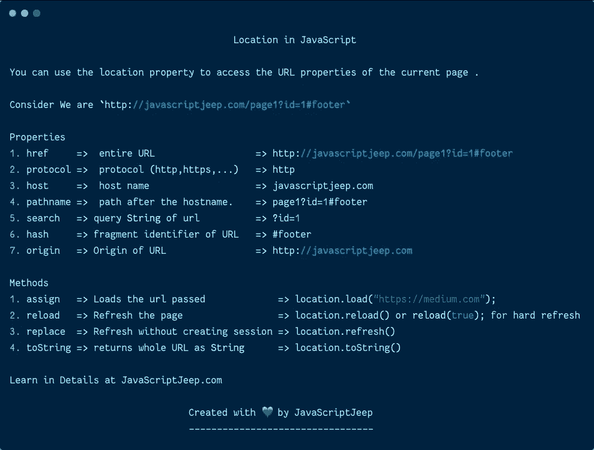

# 在 JavaScript 中重定向、刷新和访问当前页面的 URL

> 原文：<https://betterprogramming.pub/redirect-refresh-and-access-the-url-of-the-current-page-in-javascript-3d9160e8317e>

## JavaScript 的位置对象



位置备忘单。

您可以使用`window.location`属性来访问当前页面的 URL。

如果你想去一个新的页面，你可以改变`history`对象的`href`属性，或者用新的 url 作为参数调用`assign`方法。

```
location.href = "new url";// or we can use location.assign("new url");
```

对于不存储在历史记录中的重定向:

```
location.replace("new url"); 
```

要重新加载页面:

```
window.location.reload()
```

## 强制刷新

我们可以通过`true`来强制重载的页面来自服务器(而不是缓存)。或者，我们可以使用`false`从缓存中重新加载页面。

```
//from cache
window.location.reload(); 
window.location.reload(false);// from server
window.location.reload(true);
```

# 位置对象的属性

## 1.Href

包含页面的完整 URL。

```
location.href; // current page url addresss
```

当我们给属性分配一个新值时，它会将`url`值集重定向到属性。

```
location.href = "[https://google.com](https://google.com)"; 
```

务必添加 *http/https* 。否则，它会在同一页面上发出请求。

## 2.草案

包含页面的协议(`http,https,...`)。

```
location.protocol; // https:
```

## **3。主持人**

带有端口号的网站主机名。

```
location.host; // medium.com // with port number var anchor = document.createElement("a");
anchor.href = "https://medium.com:4097
anchor.host // "medium:4097"
```

## 4.主机名

网站主机名。

```
location.host; // medium.com
```

## 5.港口

包含端口号。如果 URL 不包含显式端口号，它将被设置为`''`。

```
var anchor = document.createElement("a");
anchor.href = "https://medium.com:4097
anchor.port // "4097"
```

## 6.路径名

包含主机名后的路径。

```
location.href; //[https://medium.com/@jagathishsaravanan](https://medium.com/@jagathishsaravanan)location.pathname; // "/@jagathishsaravanan"
```

## 7.搜索

返回 URL 的搜索部分。

```
I am on page [https://medium.com/search?q=javascriptjeep](https://medium.com/search?q=javascriptjeep);location.search; // ?q=javascriptjeep
```

## 8.混杂

包含字符串`'#'`，后跟 URL 的片段标识符。这将是有用的，当我们在同一个页面内的链接。

MDN Web 文档示例:

```
<a id="myAnchor" href="/en-US/docs/HTMLHyperlinkElementUtils.href#Examples">Examples</a> <script>
  var anchor = document.getElementById("myAnchor");
  console.log(anchor.hash); // Returns '#Examples'
</script>
```

## 9.起源

特定位置的原点。

```
consider we are at page : [https://medium.com/search?q=javascriptjeep](https://medium.com/search?q=javascriptjeep)location.origin; // [https://medium.com](https://medium.com)
```

# 方法

## 1.分配

加载参数中提供的 URL 处的资源。

```
location.assign("[https://medium.com](https://medium.com)");
```

这将重定向到`medium.com`。

## 2.再装

`**Location.reload()**`方法重新加载当前 URL，就像*刷新*按钮一样。

```
**location.reload();**
```

它有一个可选参数`forceReload` **，**，当`forceReload`为`true`时默认为`false`。然后，它从服务器加载页面，而不是从浏览器缓存加载。

```
location.reload(true);
```

## 3.替换

用提供的 URL 处的资源替换当前资源。

```
// consider we are google.com// when we run this line location.replace("htts://medium.com")// it will replace the current page and redirect to medium page
```

与`assign()`方法不同的是，使用`replace()`后，当前页面将不会保存在会话`History`中，这意味着用户将无法使用*后退*按钮导航到当前页面。

## 4.toString

以字符串形式返回整个 URL。

```
location.toString();// [https://medium.com/search?q=javascriptjeep](https://medium.com/search?q=javascriptjeep)
```

参考: [MDN Web Docs](https://developer.mozilla.org/en-US/docs/Web/API/Location) 。

跟随 [Javascript 吉普🚙💨](https://medium.com/u/f9ffc26e7e69?source=post_page-----3d9160e8317e--------------------------------)

[](https://sitepoint.tapfiliate.com/p/payout-methods/new/) [## 登录|站点点

### 不支持的浏览器虽然我们的跟踪技术支持旧的浏览器，不幸的是我们的网站不支持…

sitepoint.tapfiliate.com](https://sitepoint.tapfiliate.com/p/payout-methods/new/)