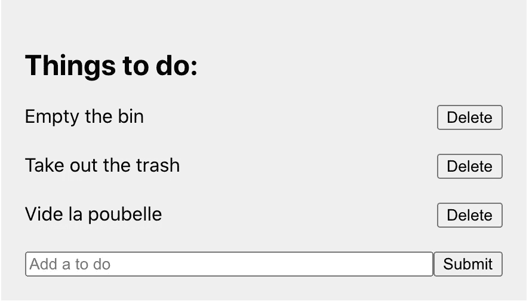

# Redux、Context 或反冲:哪一个最适合您的现代 Web 应用程序？

> 原文：<https://betterprogramming.pub/redux-context-or-recoil-which-one-is-best-for-your-modern-web-app-db41be99b448>

## 全球国家管理中三个竞争者的比较


由[约书亚·阿拉贡](https://unsplash.com/@goshua13?utm_source=medium&utm_medium=referral)在 [Unsplash](https://unsplash.com?utm_source=medium&utm_medium=referral) 拍摄

随着全球国家管理的不断变化，很难知道该选择哪个选项。很长一段时间以来，Redux 一直是首选库，但是随着 React 本身内置了提供状态管理的[上下文 API](https://reactjs.org/docs/context.html) ，许多人已经宣布 Redux 已死。现在，随着脸书支持的早期项目[反冲](https://recoiljs.org/)的发布，我们有了一个 React 专用的库，可以轻松地与 React 的最新功能集成。

但是哪个最适合你的项目呢？在本文中，我将为每个库集成一个简单的应用程序，并提供一些比较和观察。这些只是我的观点——我绝对没有把我的发现作为事实，最终每个人都会有个人偏好。但我会尽可能客观地展示一些关于性能的实证比较。

**TL；DR**——你可以在这里看到最终的代码(每个集成在不同的分支中):[https://github.com/jogilvyt/redux-context-recoil](https://github.com/jogilvyt/redux-context-recoil)

# 应用程序

我构建了一个简单的待办事项应用程序，它呈现了一个可以删除的项目列表和一个添加新项目的表单。它调用一个带有`setTimeout`的模拟 API 来获取结果，创建一个新项目，并从列表中删除一个项目:



基本待办事项应用程序

为了获得性能的基线度量，我从根本没有全局状态管理开始。加载 app 时总共有三次渲染:加载屏幕的初始渲染用了 **5.3ms** ，项目加载后的重新渲染用了 **7ms** :


提取结果后进行渲染

这是一个非常简单的应用程序，所以性能上的差异不会很大，而在更复杂的应用程序中，情况可能会有所不同。但是这应该让我们对每个库的性能含义有一个非常高层次的了解。

# 在开始之前

对于一个新项目，确保您使用正确的工具来完成工作总是很重要的——所以现在是问自己是否真的需要全局状态管理的好时机。许多简单的应用程序将运行得非常好，并且更容易维护，而不会引入外部库的所有开销，甚至不会引入上下文 API。作为 UI 工程师，我们有点鲁莽地使用每一个闪亮的新工具的名声。不要落入陷阱——在努力集成之前，确保您确实需要一个全局状态管理系统。

# Redux

Redux 可能是最成熟的全局状态管理工具。它是框架不可知的，这意味着它在整个前端世界都很流行，有一段时间，当你需要超越本地状态时，它确实是唯一的选择。然而，随着最近 Context API 的加入和新的 challenger 反冲，Redux 还能在一个现代的 React app 中独领风骚吗？

## 表演

先说性能。在初始加载时，只有两次渲染，而基线有三次渲染。但是，总的呈现时间稍长一些，呈现加载状态需要**6 毫秒**，获取项目后呈现列表需要**10.6 毫秒**:


Redux:获取结果后进行渲染

添加新项目后的重新渲染花费了 **2.9ms** 、，删除一个项目后花费了 **2ms** 。总而言之，除了加载应用程序时的初始开销，性能还是相当不错的。

## 开发者体验

对我来说，这一直是 Redux 的一大缺点。总感觉需要很多样板文件来让它工作，并且当在一个应用中使用多个 reducers 时很容易陷入重复。在这个实例中，我们有一个 store、一个 reducer 和三个 actions，对于这样一个基本的东西来说，这看起来有很多代码。

也就是说，Redux 擅长于实施开发人员的最佳实践，为您提供了一个易于遵循的模式，这样您就不必在构建特性时做出太多关于实现的决定。我还喜欢它让你把 API 请求抽象成动作，这样一切都在一个地方处理。当您知道去哪里更新 API 调用时，比在组件中查找哪个组件发出请求要容易得多。

## 用户体验

用 Redux 管理加载和错误状态需要一些定制的实现。在我的例子中，我跟踪 reducer 中的一个全局`isLoading`变量，然后管理每个组件中添加和删除项目的加载状态。这是非常标准的东西，并不难构建，但它是反冲真正发挥作用的领域之一——稍后将详细介绍！

# 上下文 API

新的上下文 API 是在 16.3 版本中引入的，旨在提供一种在组件之间共享状态的方式，而不必将其“提升”到一个公共父级。现在，它已被广泛用作存储全局状态的一种方式，尤其是对于更静态的数据，如用户信息或主题首选项。我们来看看它和 Redux 相比如何。

## 表演

据说上下文在性能方面不是很好，因为当状态在提供者中更新时，每个使用上下文的组件都将重新呈现，即使与该组件相关的状态没有改变。

对于我们的应用程序，加载时有三个呈现:初始加载状态花费了**5.9 毫秒**，在获取数据后有一个**2.9 毫秒**呈现，最后，花费了**7.6 毫秒**来呈现待办事项。


上下文:获取结果后的渲染

这看起来与 Redux 的渲染时间非常相似。但是，当添加或删除一个项目时，时间会更长:添加一个项目后， **4.9ms** 重新渲染，删除一个项目后， **4.5ms** (相比之下，Redux 分别为 **2.9ms** 和 **2ms** )。

## 开发者体验

对我来说，这是上下文 API 真正闪光的地方。它内置在 React 中，所以如果您发现自己需要全局状态管理，而不需要任何主要的架构更改或添加一个全新的库，可以将它增量地引入到项目中。我也很喜欢与 hooks 集成的简单性。在这个应用程序中，我创建了一个`useToDos`钩子，它将状态从上下文中分离出来，然后可以在任何使用它的组件中调用:

```
const { toDos } = useToDos();
```

您甚至可以将它与 React 的`useReducer`钩子集成在一起，以管理复杂的状态。我发现这是一种非常有用的方法，可以管理具有大量子组件和复杂功能的组件的共享状态。

## 用户体验

处理加载和错误状态的方式与 Redux 非常相似:我们需要编写一些自定义代码来处理每个加载状态，任何错误处理都需要围绕 API 调用本身来完成。这就是在 Redux 操作中使用 API 请求的用处。对于上下文，我们必须在调用 API 的任何地方添加错误处理，这意味着一些重复或重构。

# 报应

反冲是一个新的产品，自从去年宣布以来，它已经引起了一些轰动。它得到了脸书的支持，他的团队也维护 React，它很好地集成了许多最新的 React 功能，如并发模式。它仍处于早期开发阶段，还不建议在生产应用程序中使用。但就其目前的雏形而言，它与我们拥有的其他选择相比如何？

## 表演

后坐力的初始载荷是三个选项中最慢的。总共有五次渲染，第一次花费了**11.2 毫秒**，接下来是两次稍微快一点的重新渲染(**1.1 毫秒**和**0.2 毫秒**)，然后是一次**5 毫秒**重新渲染，一旦待办事项被加载，接着是最后的**1.9 毫秒**以将项目渲染到屏幕上。


反冲:仅渲染加载屏幕就花了 11.2 毫秒

然而，添加和删除一个项目要快得多:添加一个项目后需要 2.4 毫秒**重新渲染，删除一个项目后需要 3.7 毫秒**。这似乎与 Redux 大体一致。

这里还值得指出的是，反冲包的大小是 **45.1K** (根据我的[导入成本](https://marketplace.visualstudio.com/items?itemName=wix.vscode-import-cost) VS 代码插件)，相比之下 redux 的大小是 **11.7K** (合并了 Redux 和 react-redux 包)，对上下文没有任何影响，因为它是 react 的一部分。随着库工作的继续，这种情况可能会改变，但这是需要记住的事情。

## 开发者体验

虽然这是我第一次使用反冲，但在了解了原子和选择器之后，我发现它很容易使用。我喜欢你如何在选择器中发出异步请求来初始化 API 请求的状态:

在组件中使用状态也非常容易。它的工作方式与`useState`类似:

```
const [toDos, setToDos] = useRecoilState(toDosAtom);
```

我发现一个有点令人困惑的地方是在添加或删除一个项目后更新状态。对于异步选择器，我认为能够有一个类似的 setter 函数来更新基于 API 请求响应的状态会很酷。这可能是后来添加的东西；现在，我只是在组件中进行 API 调用，并将状态设置为响应:

## 用户体验

对我来说，这是反冲真正发光的地方。它集成了 React 的并发模式，允许您用`Suspense`处理加载状态，用`ErrorBoundary`处理错误。这意味着你可以用一种更加声明性的方式来构建你的应用。我能够将我的应用程序包装在一个带有后备的`Suspense`组件中，它会自然地呈现加载屏幕，直到 API 请求完成并且待办事项加载完毕。

这样做的一个副作用是，它确实会迫使您做出一些架构决策。可能很难将反冲集成到一个成熟的应用程序中，如果您偏爱以某种方式做事，您可能会在库的约束下努力工作。不过感觉肯定比 Redux 更 React-y。

# 结论

Redux 已经成为全球状态管理的领导者有一段时间了，它肯定不会很快消失。然而，背景和后坐力正在成为严重的竞争者，而且肯定感觉他们和 React 一起玩得更好。

我倾向于将上下文用于较小的应用程序，在这些应用程序中，轻微的性能影响不会成为问题。至于更大的项目，反冲仍然感觉有一些初期问题，我肯定不会建议在生产应用程序中使用它。但是，假以时日，它似乎可以提供更好的开发人员体验，并最终提供更好的用户体验。看到反冲与 React 的新功能集成得如此之好令人兴奋，随着我们开始在应用程序中使用这些功能，我认为反冲将成为全局状态管理的自然选择。

感谢您的阅读，如果您不确定哪个全局状态管理库适合您，我希望您会觉得这很有帮助。