# 在铁锈中制造 Redux

> 原文：<https://betterprogramming.pub/redux-in-rust-d622822085fe>

## 在 Rust 中重建 GitHub 最受欢迎的库之一

菲利克斯·布伦德勒在 [Unsplash](https://unsplash.com?utm_source=medium&utm_medium=referral) 上的照片

[Rust](https://www.rust-lang.org/) 是一种令人惊叹的语言，号称速度堪比 C，抽象性堪比 C#或 TypeScript 等高级语言。几年前，它激起了我的兴趣——但这是我目前为止所做的(仅仅是感兴趣)。我有一个相当坚实(和狂热的功能)的 JavaScript 背景，但我总是觉得我只是默认的前端开发人员。在我搜索的指尖上有如此高可用性的经典 web 技术指南！我最近做了一点程序性的自我反省，试图找到我的定位，并真正建立一些东西。而且由于铁锈几乎可以到任何地方(？)学什么语言比较好？

因此，我将继续在 Rust 上学习。我仍然可以夸耀一些很棒的 JS 技能，这些技能可能在未来几年都需要，但我认为 Rust 在不久的将来会成为主要玩家。

总之。我的假设是，我的读者，你也处于类似的境地。你来自 JS，热爱网络技术；你听说过铁锈，并渴望更多。好了，我已经帮你准备好了，因为今天我要写一些和大多数 JS 开发者相关的东西 Rust 中的 Redux！

如果你不熟悉 [Redux](https://redux.js.org/) ，那也没关系。Redux 是一个简单的状态管理机器，它

1.  持有某种状态，
2.  基于称为*reducer*的纯函数更新该状态。

反正那是最基础的版本。这是一个由脸书人推广的消息系统的实现，被称为 [Flux](https://facebook.github.io/flux/docs/overview) 。Redux 可能是 Flux 最简单的实现。不过，在我们的示例中，我们要做的不仅仅是保存状态并更新它。除了纯粹的功能状态缩减器，我们还将引入处理副作用的能力，并提供回溯状态历史的方法。

旁注:一个*纯函数*是不执行任何副作用的函数。也就是说，如果你给它同样的输入，它将永远产生同样的输出，永远不会改变外部状态。

首先，我们需要一些状态来操作:

从基础开始。

这几乎是我们能够管理的最简单的状态。不过，对于我们的例子来说，这应该足够了。因为我们希望我们的状态变化是不可变的步骤，我们可能还应该在这里派生一些特征:

用`derive`添加一些免费功能。

`Copy`和`Clone`让我们通过堆栈上的值来传递我们的结构。让我们在没有新函数的情况下初始化我们的类型。`PartialEq`允许我们用`==`和`!=`来比较我们的结构。当我们实现我们的状态存储时，我们将享受这些特征的特性。

接下来我们需要做的是为我们的状态定义一个包装器。这个包装器就是所谓的商店。您可以将存储视为对其包含的状态的唯一引用。在存储区中，您的状态只存在一个当前副本。

定义一个简单的状态缩减存储。

…这很快变得复杂起来。这需要一些解释。Store 是具有几个字段的通用类型。

1.  它包装了我们的状态`T`，它可以是实例化时的任何类型。
2.  它将一个 trait 对象作为它的`reducer`字段。这个字段允许我们传递一个函数作为`reducer`的值。`Box`仅仅是一个指向堆分配项的指针，我们的函数必须是这样的，因为它的大小在编译时是未知的。我们期望这个函数采用`Fn(T, Msg) -> T`的形式。

但是打住，什么是`Msg`？

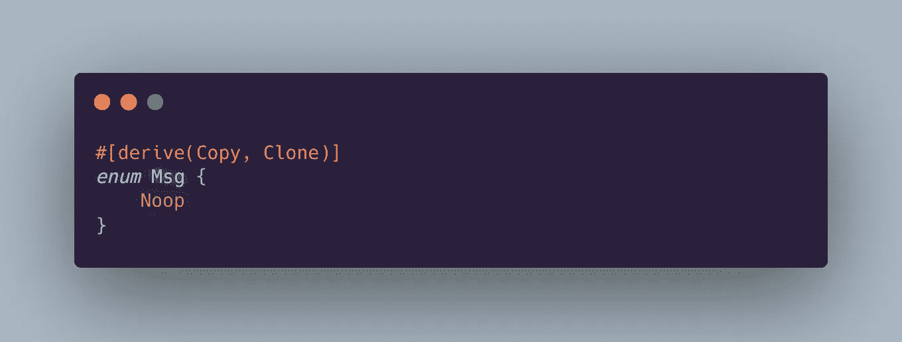

这将保存我们的消息类型。

目前，那是`Msg`。如果你熟悉 JavaScript 的 Redux 库，这就是你通常所说的*动作*。`Msg`最终将扩展到覆盖我们的应用程序的所有可能的动作——或者至少是我们将为这一个状态执行的所有动作。现在我们已经有了一些东西，让我们开始实现吧。我们将实现存储结构的功能:

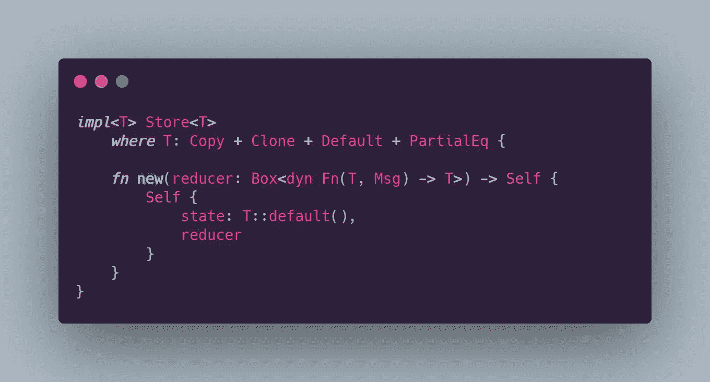

用惯用的 new 构建商店。

我们已经在我们的`impl`块中添加了一些*特征界限*。`where`指定以下类型参数必须实现所提供的特征。除了格式之外，还列出了必须在我们的数据结构上实现的特征。还记得我们从我们的国家结构`MyState`中得到的特征吗？这些特征界限允许我们利用已经提供给状态的特征，这样编译器就知道我们正在做的事情有先决条件，只要满足那些 PRs 就可以了。这让我们可以做一些事情，比如调用通用参数`T`的`default()`函数——编译器知道`T`必须实现`Default`特征。让我们暂时忽略构造函数的 reducer 参数。我们刚才已经讨论了堆分配的 trait 对象的情况，随着我们向前推进并利用这些字段，这将比讨论它在内存中如何工作更有意义。

让我们添加更多的功能。流量模式的核心是调度程序的概念。虽然我可以(在更高级的场景中，可能会)让 dispatcher 有自己的结构，但我会选择 Redux 路线，只让`dispatch`成为 Store 的一个方法。

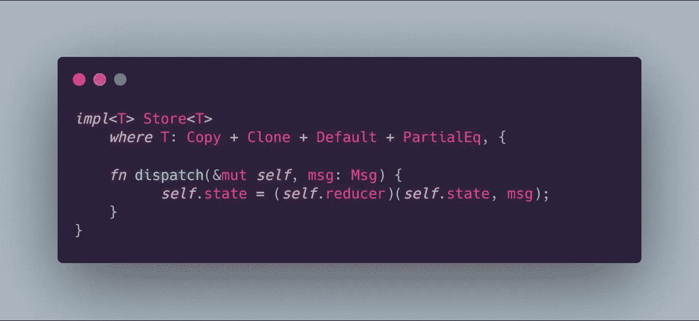

更新我们状态的唯一方法是通过调度。

这是一个愚蠢的简单且非常幼稚的解决方案，但是现在让我们先用它运行一下——不管怎样，它应该可以编译。`dispatch`函数接受一个`Msg`类型的对象。我们所做的就是获取当前状态，并将其重新分配给 reducer 函数的结果，传入当前状态和调度的`Msg`参数。好的，但是减速器呢？我们仍未尝试构建商店，但当我们这样做时，我们将需要一个符合我们`new`签名的 reducer。首先，让我们定义一个表示状态更改请求的操作:

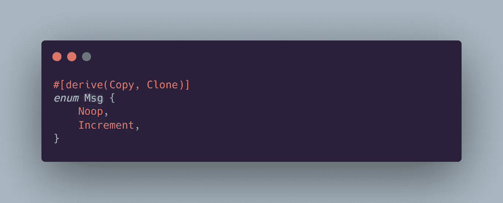

一个实际的行动。

我们已经为我们的`Msg`类型添加了一个变体。现在，我们可以在状态缩减器中使用一些东西:

减压器的基本功能。

它是一个非常简单的减速器，伴随着我们非常简单的状态结构。reducer 通常是这样工作的:它匹配收到的消息，然后根据收到的消息中的数据返回一个全新的状态对象。我们当前的消息非常简单，它们没有任何有效载荷数据，它们仅仅是标志。我们的减速器现在只需要匹配一个案例；在所有其他情况下，我们传递回原始状态。现在我们可以试用我们的机器了:

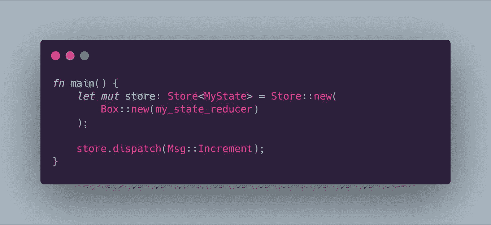

一个什么都不做的商店。还没有。

太好了…但是，嗯…我能用它做什么呢？没什么！我不能记录我的状态，查看我的状态，或者做任何事情，除了发送我的增量消息到众所周知的空处，希望它们产生正确的状态对象！

这将我们引向通量模式的另一个重要部分:隔离副作用。计算机科学世界的一个副作用是，你几乎想用一个应用程序做任何事情。登录？副作用。保存数据？副作用。Web 请求？又有副作用了。唯一没有副作用的是一个纯函数——给定相同的输入，每次都会产生相同的输出。副作用是必须控制的必要的混乱！

由于副作用不是我们的纯状态缩减器的一部分，并且可能改变所提供的参数之外的变量，所以最好将它们从纯代码中分离出来，以便可以轻松地改变或删除它们。因此，为了处理这些副作用，我选择了为中间件提供一个钩子的方法——作为调度机制的一部分，函数执行副作用。首先，我们必须添加一个指向函数的指针向量，其形式为`Fn(Msg) -> Msg`。

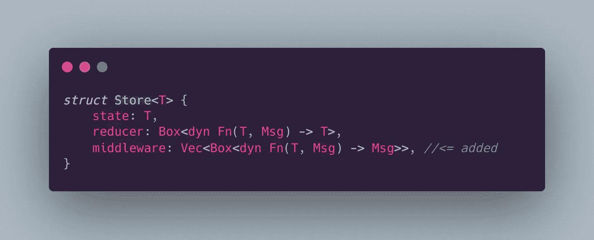

为我们的商店增加一个新领域。

我使用了一个函数向量，因为我想允许在商店中使用多个中间件函数。这将允许我们稍后编写我们的侧面影响函数。现在我们需要添加一些实现来利用我们的新字段:

支持中间件。

有两个新函数要添加到我们的`impl`存储块中。`use_middleware`向我们的中间件管道注册一个函数。`middleware_strategy`是一个助手，我们将在`dispatch`内部调用它(我稍后会描述)。由于我们不能在第一个 for 循环中再次可变地借用`self`，我们的策略将结果(类型为`Msg`)收集到一个`Vec`中，然后遍历这些结果，允许我们再次借用`self`来调度每个`Msg`。现在我们只需要将这个中间件钩子插入到我们的`dispatch`函数中:

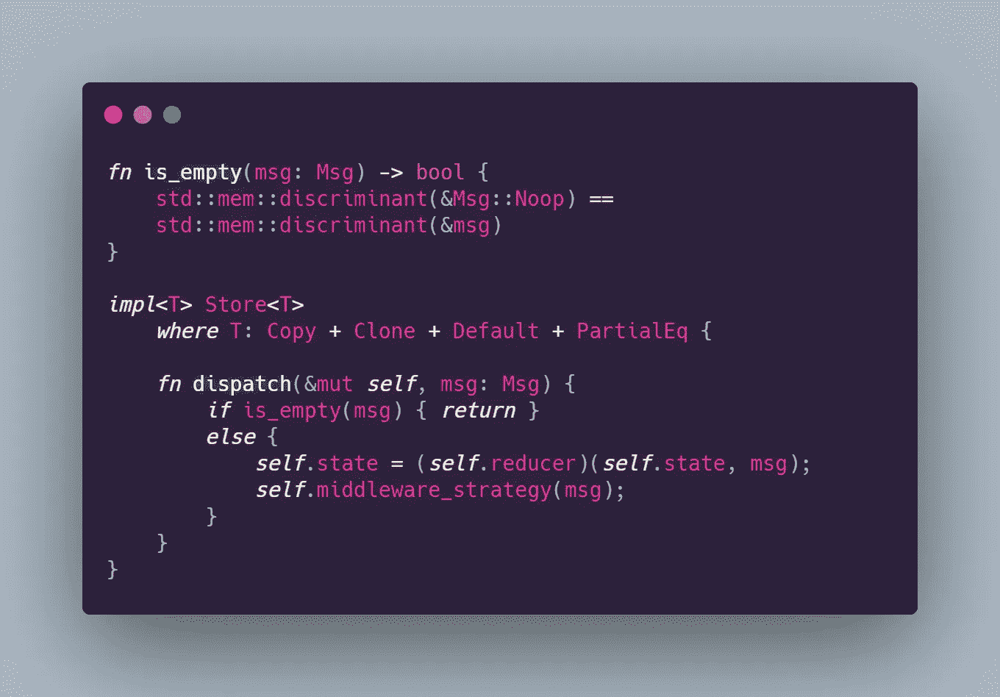

noop-终止调度程序。

我添加了一个助手函数，`is_empty`，它接收一条消息并确定它是否是`Msg`的`Noop`变体。我将通过一系列步骤解释它的重要性:

*   当我们的`dispatch`触发时，我们立即启动中间件循环。
*   每个中间件返回一个新消息，然后分发该消息。
*   `dispatch`触发，我们开始中间件循环。
*   现在我们无限循环。

因此，为了避免无限循环，我们必须有某种非传播动作，通过不触发新的`dispatch`来终止中间件循环。这就是我们的`Noop`变体在这里最有用的地方。让我们编写一个中间件来记录商店收到的消息。

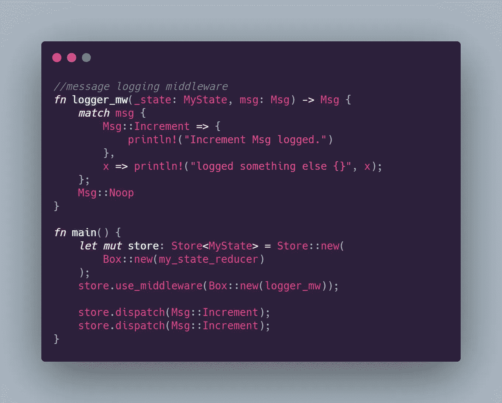

最后，一些见解。

那现在应该记录我们的`Increment`消息两次。好吧！我们正在用我们的 Flux 实现做一些“有用”的事情。注意我们必须如何在`logger_mw`中返回`Noop`消息来停止分派过程。

现在我们已经了解了中间件的工作原理，让我们编写一个在现实生活中更有用的中间件。我将通过改变一些东西来引入一个条件消息拆分器。首先，我们应该把最初的`dispatch`消息看作是一个请求，它可能产生成功或失败:

拆分消息，第 1 部分。

现在我们发送`TryIncrement`消息，我们将有一个中间件来处理这个情况。现在让我们编写我们的拆分器中间件:

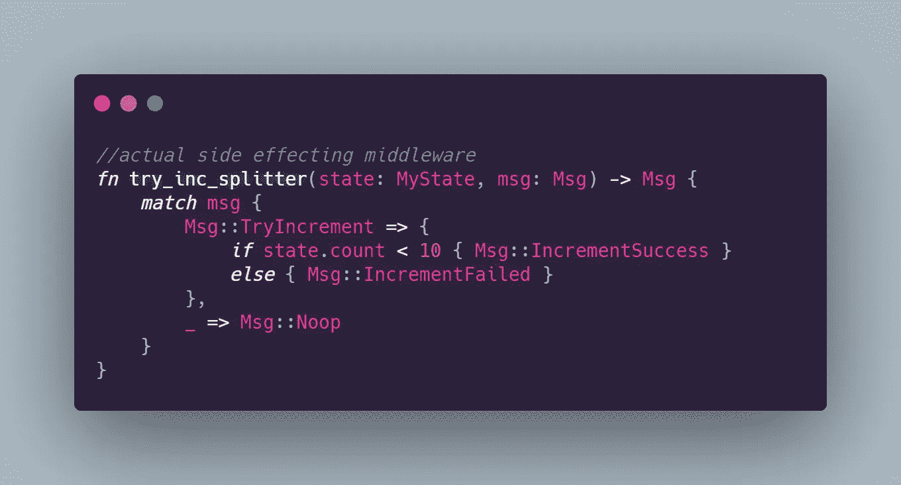

拆分消息，第 2 部分。

我们引入了一些任意的规则——如果我们调用状态`Increment`超过十次，那么`Increment`就会失败。现在，如果我们用`use_middleware`把它插上，它应该可以拆分消息。如果我们更新我们的日志:

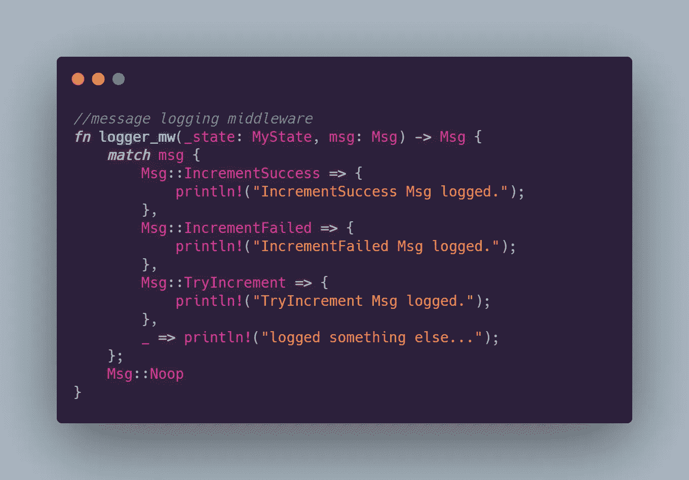

记录我们的新信息。

…然后它还应该告诉我们发送了什么消息。如果我们调用它超过十次，它应该记录`IncrementFailed`消息，

在我们称这个实验完成之前，我们应该实现一种方法来查看状态的历史。让我们添加一些片段:

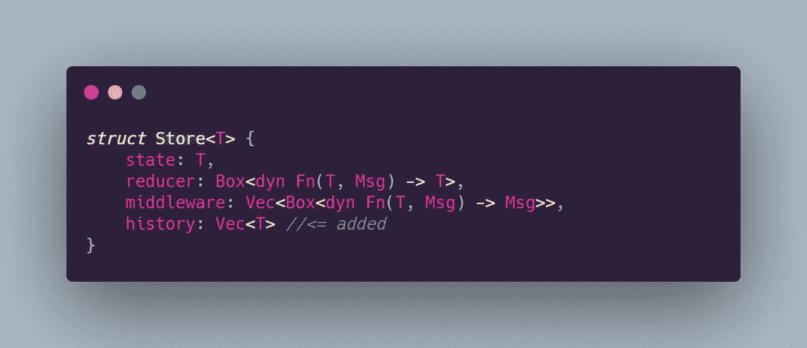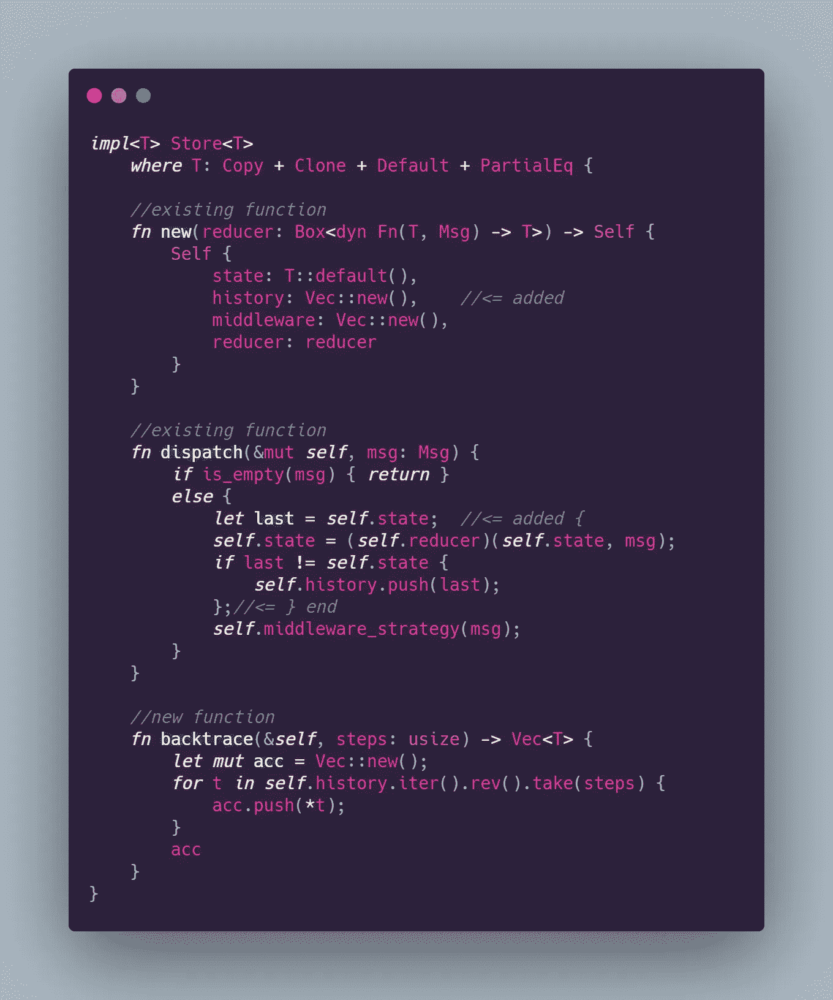

这里发生了一些事情:

1.  我们已经添加了字段来将历史表示为所提供类型`T`的`Vec`。
2.  我们修改了我们的非终结分派分支，以包括捕获先前的状态并将其存储在我们的`history` `Vec`中。最后，这是我们将`PartialEq`添加到我们的特征界限的原因——它允许我们使用一个简单的`!=`操作符来比较前一个和下一个状态。基于该比较的结果，我们可以确定状态是相等的并且不添加到状态改变历史中，或者我们确定状态是不相等的，随后将先前的状态添加到历史中。
3.  我们还需要一个函数来检索历史。`bactrace`根据请求回顾尽可能多的步骤，返回一个包含最多`steps`个状态变化的`Vec`，前提是已经发生了足够多的变化。

我想这就差不多结束了。我们已经了解了 Redux/Flux 实现如何分离纯代码和不纯代码。我们学习了如何制作模块化的功能中间件来执行副作用。我们实现了简单的日志记录和状态回溯。我们都是在铁锈中完成的！

[这是铁锈游乐场的链接。](https://play.rust-lang.org/?version=stable&mode=debug&edition=2018&gist=f06cbe4d78b239f2faeebeb8f2e39cc6)

直到下一集我的 Rust 之旅，FP 上乡亲们！