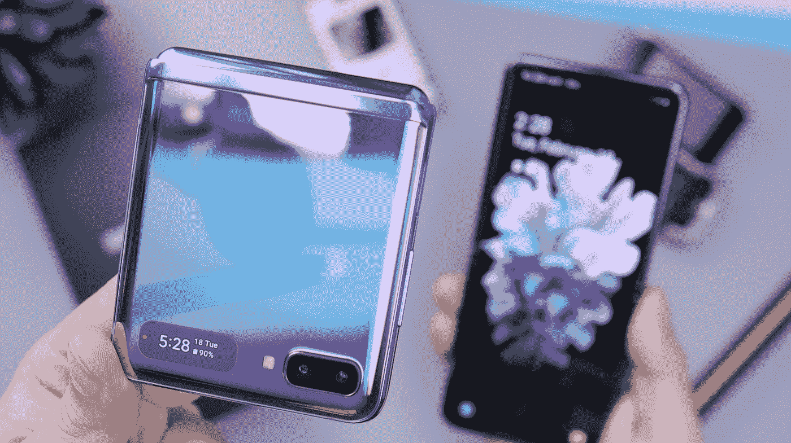

# Android 应用程序的 Redux 风格状态管理

> 原文：<https://betterprogramming.pub/redux-style-state-management-for-android-apps-62da15dc7578>

## 在您的 Android 应用中使用最佳架构实践

丹尼尔·罗梅罗在 [Unsplash](https://unsplash.com?utm_source=medium&utm_medium=referral) 上的照片

这篇文章说的是 Redux 风格的状态管理，但是说实话，下面的想法不一定是 Redux 风格的，它们是受它的启发，所以如果你不熟悉 Redux 也没关系。此外，该上下文中的“特征”用于描述用户与之交互的屏幕或 UI。

# 状态和状态管理

状态管理是一种通过集中各种 UI 控件的所有状态来处理应用程序中的数据流，从而促进组件之间的通信和数据传输的方法。这是单一真值源范例的一种可能的表现形式，也就是说，状态存储在单个对象中，并且该单个对象充当我们的应用程序的唯一真实的状态源。

用最简单的术语来说，状态就是触发 UI 变化的任何数据。对于社交媒体应用程序，状态的一个例子是帖子，它强制 UI 更新。

在这个帖子中，我们可能有图像、标题、时间和喜欢等属性。如果我们假设图像和标题是不可变的，那么在“发布级别”上，这两个不会被认为是一个状态，因为一旦设置，它们就不会真正改变。时间和喜欢将是我们的“后水平”状态，因为它们是可变的和变化的，它们迫使用户界面刷新或更新。因此，在这种感知状态下，不局限于对象或用户定义的数据结构，如社交媒体帖子，而是扩展到原始类型，如帖子的点赞数(整数)。

# 状态管理和架构

状态管理并不独立于应用程序架构。事实上，状态管理是因为 app 架构。根据坚实的原则，一个异常的体系结构是一个模块关闭修改和开放扩展的体系结构。这意味着当一个新功能被添加到一个应用程序中时，不应该修改模块来适应新功能，而是应该将代码添加到实现新功能的模块中，并且添加的代码应该保持不变，即模块对于修改是封闭的，对于扩展是开放的。

如果用户可以与新功能交互，那么它就是有状态的。拥有集中式状态管理意味着应用程序的其他部分不会被修改以适应新功能的状态，但该状态将被添加为中心状态的一部分，新功能将从该中心状态访问其状态。

可视化上面的场景并不容易，但它指出的一点是，随着应用程序复杂性的增长(随着新功能的增加)，状态管理的需求变得显而易见。这就是为什么考虑状态管理以及如何以可伸缩的方式进行状态管理是必要的第一步。在深入任何细节之前，让我们首先考虑状态的属性以及如何在 Android 中抽象它们。

如果你的 Android 应用程序中的每个屏幕都代表一个特性，那么避免不同特性之间的数据共享或通信就是架构上的最佳实践。这可以通过将特性分成独立的模块来进一步加强。与 web 应用程序中的状态管理不同，在 web 应用程序中，我们有一个与应用程序中每个组件通信的中央状态存储库，在这里，我们为每个功能都有多个状态存储库。

以视图模型为例。Ut 通常有意义的是为你的应用程序中的所有特性建立单独的视图模型，而不是一个负责你的应用程序中所有特性的中央视图模型。这样，如果状态被定义为某个特性的属性，那么没有两个特性相互依赖，因为每个特性都有自己单独的状态和状态管理。

下面的处理假设了上述情况，即每个特性都是独立的，并且有自己的状态管理。

假设我们正在建立一个像脸书这样的社交媒体应用程序，我们的任务是建立用户资料功能，用户可以看到他们的个人资料的细节，如他们的个人资料照片，用户名，简历，朋友和以前的帖子列表。

在这一点上，我们不关心后端和来自 API 的信息检索，而是更感兴趣的是如何处理这个特定的配置文件特性，它是如何呈现的，以及它如何响应用户的操作。

# 关键组件

再次假设独立于所有其他特性，下面是实现这一点所需的 4 个主要组件。

我们将需要:

*   主配置文件视图—这是配置文件的主屏幕或功能，用于呈现所有与配置文件相关的数据。我们的主要前端组件。
*   概要视图模型——它从我们的存储库和数据源以及数据存储中获取所有数据[共享首选项],并提供一个将由我们的概要视图使用的状态对象。
*   剖面视图状态——表示状态的不可变数据类，该数据类映射由视图模型接收的所有数据，并将其转换成单个状态对象，其中该对象的属性是数据。因为它是不可变的，当一个数据改变时，一个新的状态对象和相关的更新被创建并返回，而不是修改现有的状态，这是从 REDUX 借用的特性。
*   配置文件操作—这包括用户在配置文件视图范围内可以执行的所有可能操作的抽象签名。这些操作可以是，编辑个人资料照片，更新用户名，删除帖子，取消好友，导航到设置，等等。对于登录屏幕，一些操作可能是登录和忘记密码。

下面是实现所有这些组件的方法。

# 行动

首先，定义可以从配置文件特征中进行的所有操作。这些操作将取决于您正在开发的功能的类型。对于这个例子，我们可能有这样的东西:

要编辑个人资料，`EditProfile`动作首先需要用户进行编辑，同样，要取消关注，该动作需要用户的 id。

我们为此使用数据类，对于不需要特殊数据的动作，我们使用对象。`ProfileAction`内的所有动作都必须显式地扩展它，原因很快就会变得明显。

# 纵断面图状态

这是保存用户配置文件功能使用的所有状态的对象。它是不可变的，因此对它所保存的任何数据的更改都将强制创建包含已修改数据的视图状态的新实例。这里有一个实现的方法。

我们将`ProfileViewState`的所有属性初始化为一些默认值，这些默认值本质上代表一个空状态。

# 概要视图模型

`ViewModel`仅将状态暴露给视图(配置文件屏幕)。`ProfileViewModel`的实现相当复杂，所以让我们先从实现开始，然后简单解释一下。

一个好奇的读者会对我将要介绍的一些概念做进一步的阅读，因为我无法在不迷惑您的情况下深入任何细节——假设您不熟悉 Kotlin 协程和流。

如果你真的很好奇，那么你一定要看看我的应用程序，GitHub。玩玩它，然后检查代码，这将是非常有用的。

哇哦。那太多了。这里要理解的关键是`ProfileViewModel`负责创建状态并执行从概要视图中分派的任何动作。

它通过使用已经在应用程序的数据层中实现的交互器和观察器来实现这一点。再往前走就不方便了。

# 剖面图

这是使用 Jetpack compose 实现的配置文件功能的主要 UI 组件。

配置文件视图使用一个状态对象，该对象包含描述它所需的所有数据。使用处理动作的调度员将动作发送回`ProfileViewModel`。这样，Profile 视图只负责描述数据是如何布局的，动作和状态是如何被`ViewModel`处理的。如果你问我，那很酷。

随着应用程序复杂性的增加，状态管理变得非常方便，所以考虑如何在项目开始时处理状态是一个必要的步骤。这是一个方法的例子，你不需要理解这里的一切，只需要核心思想就足够了。

这是一篇很长的文章，如果你做得这么好。谢谢你能来。保持警惕！