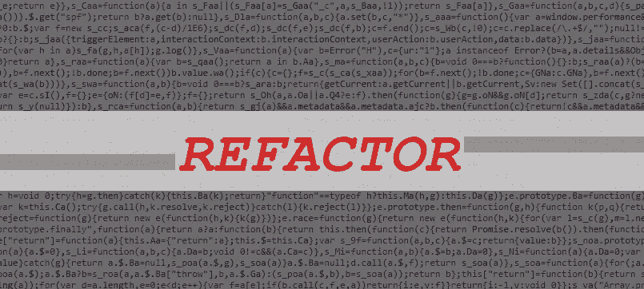
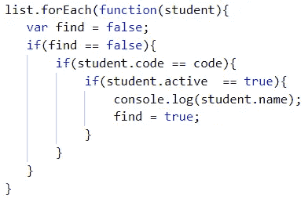

# 重构——为人类编码

> 原文：<https://betterprogramming.pub/refactoring-coding-for-humans-f0bf911234fa>

## 从马丁·福勒的重构目录中的例子看应用重构技术的好处

T 开发人员的日常工作被包裹在“如果”、“其他”和“我昨天就需要它”的纠结中

但现实是，我们想了这么多逻辑，写了这么多代码来实现它们，我们经常最终创建了一种我们自己的方言，只有我们自己和编译器才能理解。现实中，他们甚至不明白，但他们不在乎。毕竟，他们不必在这段代码中应用维护。这种方言变得越来越高级和复杂，令人惊讶的是，随着项目的最后期限挤压我们的脖子，我们是如何获得口音和俚语的。方言的问题在于，不亲近的人很难理解它们。

稍微思考一下下面这句美丽的引言。

> 饭做 naidheachd！DH ' fhaodadh tu eadar-theangchadh。一个搜索引擎优化？

保持冷静！你没有上错文章。这真的是关于重构。你看苏格兰盖尔语的文本是多么复杂，难以阅读和解释？当开发人员需要维护只有创建者和编译器能够理解的代码时，这正是他的感受。

想看看吗？试着找出下面的代码片段在做什么…

明白了吗？很难吗？想象一下，必须用至少 1500 行这样的代码维护一个项目！

创建的所有代码和开发的每个程序和系统都需要在其生命周期的不同阶段进行维护。这是自然的。正是在这一点上，这段代码的编写方式将决定直观的维护和安静的维护之间的差异，以及几天来试图理解发生了什么。事实上，如果在几十个其他开发项目之后，这些代码的创建者需要再次更改它，他们自己也会有问题。

那么，如果没有这种问题，你怎么能为世界做贡献呢？有什么蛋糕食谱吗？

让我们来看看这篇文章的目的:重构技术。它们是旨在重构代码而不改变其输入和输出的技术。如果一个函数接收一个整数类型的参数并返回一个字符串，那么在这个重构之后，它应该会继续正常发生。基本上，您的工作将在函数体中，始终保留您的签名。

# 重构代码的好处是什么？

在可能的好处中，我们可以强调以下几点:

*   有利阅读(人类需要)；
*   有利于重复使用；
*   有利于性能；
*   有利于低耦合；
*   有利于单一责任。

## **使用重构技术有什么好处？**

首先，你不需要重新发明轮子。用在你喜欢的地方。

举一个技术的好例子，最好是由非常了解他们在做什么并且有谈论它的可信度的人创造的。

我吗？不，一点也不！

我说的是马丁·福勒，他无疑非常了解我们的主题。在本文中，我们将使用他在《重构》一书中描述的技术。包含所描述的所有技术的完整目录在 web 上公开发布，所以开始工作吧！

# 分析代码片段并应用重构技术

让我们在两个场景中分析一些代码片段:在应用重构技术之前(识别问题点)和之后，突出该技术的改进。我们将使用一些用 JavaScript 编写的代码片段。因为它是一种非强“类型化”的语言，所以对于那些没有编写代码的人来说，它很容易变成难以理解的代码。当然，java 或 C#类型的语言也不能避免这个问题，这里展示的所有技术都可以应用。

让我们以下面的代码片段作为案例研究:

当分析这个小函数时，立即会产生一些疑问。其中一些是:

*   “列表”的内容是什么？
*   这个*代号*指的是什么？
*   什么是 *x* ？
*   “查找”功能定位什么？

通过应用 Martin Fowler 的 *Refactoring* 图书目录中的一些重构技术，我们可以通过保持代码更加直观来消除这些疑虑，并且不需要猜测或使用臭名昭著的 CTRL + F。

因此，让我们一步一步地应用每种技术，查看第一个案例研究中每一行的前后。

我们先从神秘变量 *x* 说起。

应用**重命名变量**技术后:

在应用重命名变量技术之后，我们能够在任何时候识别出被操纵的对象是“Student”类型，它包含与这个类相关的数据。

因此，我们将相同的技术应用于引用该变量的代码部分:

到目前为止，我们已经排除了“x 是什么？”问题，指定一个描述该变量的类型和可能内容的名称。但我们仍有需要改进的地方，所以让我们继续前进。

现在我们知道了属于函数内部被操作的集合的对象的类型，我们可以消除另一个疑问:“list 的内容是什么？”让它的内容清晰，这样阅读就足够了。

目前，我们的函数接收一个名为“list”的参数。

我们再次应用了**重命名变量**技术:

我们能改进这个“代码”变量吗？

现在更容易知道这个列表的内容了吧？但是函数的名字呢？当你调用它时，你能立即知道它做什么吗？到目前为止我们只知道它“定位”。我们可以改变这一点，消除疑虑:“查找”功能定位什么？”因为我们知道它将对学生类型对象的搜索封装在一个列表中。

目前，我们的函数说它“定位”某个东西…我们来改变它？

应用**变更功能声明**后

到目前为止，我们已经改进了函数的读取。让我们看看目前为止情况如何。

我们已经大大改进了代码，但仍有一些需要改进的地方。这个函数的结构有些问题。我们来辨认一下。

*   我们的条件结构不好，我们可以优化它；

*   我们使用的标志增加了代码的复杂性。它不会停止列表中的迭代，迭代将继续，直到遍历完最后一个元素。这将影响性能；

*   我们的功能是负责一个以上的责任(除了在集合中查找一个学生，还在控制台中写入)，使得它无法在系统的其他点使用。如果没有这个，额外的行为会自动执行。如果它只是从列表中返回学生，以便客户端函数可以决定如何处理该返回，不是更好吗？所以我们倾向于重用这些代码。

我们将再次使用目录的技术来重新构建我们的代码，从而纠正这些问题。

在应用了**合并条件表达式**技术之后:

显然，这个条件仍然有效。“active”属性显然是一个布尔值，所以我们可以进一步简化代码。

现在让我们应用技术**用中断替换控制标志:**

通过应用另一种重构技术，我们用 break 替换标志，这是整理循环最合适的语句。这反过来通过防止集合中的所有项目被遍历来“中断”迭代，即使在定位记录之后(如果我们将标志与 if 一起保存，就会发生这种情况)。

现在让我们来解决我们发现的最后一个问题。这在用强“类型化”语言编写的代码和不像我们在例子中使用的 JavaScript 的语言中很常见。

当我们将不同的职责赋予一个功能时，就会出现这个问题。对名为“查找学生”的功能有什么期望？我们当然不希望它打印值，更不用说发送电子邮件了。我们希望它除了找到一个学生之外什么也不做。让我们纠正代码的这一点。

应用**提取功能后:**

请注意，现在我们将学生对象返回给客户端函数。我们不再需要使用 break 语句“return”，它已经以我们想要的方式中断了迭代。这样，客户可以定义他将如何处理返回的数据。

下面是一个协调过程的函数示例，在该过程中，通过代码获得一个学生，并将其姓名打印在控制台上:

现在，这里有一个客户端函数，它将使用我们重构的函数向一个新的班级添加一个学生。

很明显，客户端可以按照它需要的方式协调这个过程，因为使用“findStudent”函数不会有任何超出预期的行为。

我们已经能够使用 Martin Fowler 在他的书 *Refactoring* 的目录中提出的重构技术来重构我们的小函数的许多点。当然，与目录中可用的技术相比，我们只应用了一些技术，但是您已经对使用这些技术的有效性和好处有了清晰的概念。

现在让我们比较一下我们的函数，这样我们可以看到重构前后的改进。

## **在**之前

## **在**之后

## **结论**

现在，我们的代码是可重用的，性能得到了提高，并鼓励通过阅读理解其内容和责任。我们还能够将代码行的数量减少近一半，但尽管这对许多人来说很重要，重构的好处远远不止减少代码行。

易读性、性能、可重用性和责任性要重要得多。有时，我们甚至需要增加代码行数来实现这些理想。是一个需要一直考虑的尺度。

## 所以不管怎样，只要编写程序，然后应用重构技术就行了？

绝不！您需要重构的事实已经表明，您从一开始就知道这段代码应该如何编写。在保持这种结构的同时进行编程是非常重要的，并且可以减少需要重构的点的数量。

当然，我们知道日复一日，随着紧张的截止日期和它的领导者的充电，你最终会创建一个非常容易需要良好重构的代码。你需要向自己承诺，你会在交付后很快审查这段代码，并且…永远忘记它。

重要的是知道这些技术在你需要的时候就可以使用，这样你就知道如何避免将来需要使用它们。

那又怎样？让我们重构你留在代码中的那块石头，让它给你一张难看的脸。我们应用的这些技术和其他许多技术是马丁·福勒所著的《重构》一书目录的一部分，可以在官方网站上[获得。](https://refactoring.com/catalog)

顺便问一下，你还记得我们开始这篇文章的第一个超级奇怪的函数吗？

这个功能只在屏幕上写“Hello World”。

请记住，除了作为一名开发者，你还是一名作家，你的读者需要从阅读你写的东西中获得乐趣。

对单一责任的偏好。

感谢阅读这篇文章。