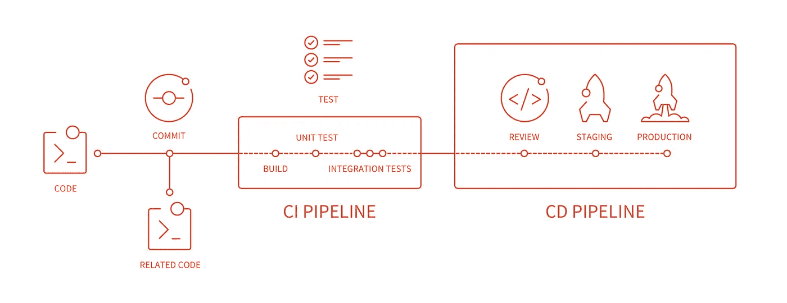

# 可重复和可维护的开发环境

> 原文：<https://betterprogramming.pub/repeatable-maintainable-development-environments-45f4589c824>

## 随着一个可回答的，流动的，持续的整合


[RawFilm](https://unsplash.com/@rawfilm?utm_source=unsplash&utm_medium=referral&utm_content=creditCopyText) 在 [Unsplash](https://unsplash.com/search/photos/environment?utm_source=unsplash&utm_medium=referral&utm_content=creditCopyText) 上拍摄的照片

# **问题**

开发人员需要一套特定的软件工具来完成工作。

您的团队中可能有新成员，或者您可能需要以某种方式从根本上改变您当前团队使用的软件环境——也许迁移到不同的操作系统？

我们都需要的软件工具的列表可能相当广泛。虽然这些软件工具中的一部分可以从包管理器中获得(例如 Aptitude、Snap、Homebrew 等。)，它们仍然可能有相当复杂的安装步骤(可能会随机更改和中断)。

这些步骤可能会被记录下来——但也可能不会。还有一个问题是，让开发人员维护他们自己的基础软件环境可能意味着不同开发机器之间的巨大不一致性，随着时间的推移，这种不一致性会变得更糟。

解决这个问题会对生产力造成巨大的打击。对于新入职的人来说，这可能意味着在接下来的 x 天内要花费大量的精力在您的团队中安排知识渊博的人来支持您的新入门者，或者如果您的问题需要改变开发团队现有的软件环境，这可能意味着一个漫长的迁移计划。

# 一个解决方案

*   利用 [Ansible](https://www.ansible.com/) 的强大功能，将您的开发环境(及其所有工具和依赖项)编写成剧本
*   使用[流浪者](https://www.vagrantup.com/)来启动一个 [VirtualBox](https://www.vagrantup.com/docs/virtualbox/) 你的基本机器镜像(你正在使用的操作系统/发行版)
*   在构建虚拟机的过程中运行 Ansible 作为供应器，并使用您编写的剧本
*   输出供应步骤的成功或失败，并在持续集成(CI)工具中运行
*   向您的团队传达本行动手册的更新和发布，并要求他们获取和运行更新

你得到了什么？一个在你的团队中保持一致的基础开发环境，你知道它将拥有开发人员入门所需的一切，并且每次安装时你都可以依赖它(假设它得到了积极的维护)。

# 什么是可能的？


Ansible 是一款 IT 自动化工具，可用于许多不同的任务和 IT 需求。它使用用 YAML 语言编写的声明性 DSL，可以在本地运行，在虚拟机、云环境的配置中运行，或者通过安全外壳(SSH)针对一系列已知主机运行。

# 写剧本

为了本文简洁起见，我将假设一些 Ansible 知识——下面有一个奇妙的零到英雄教程，它将带你了解 Ansible 语法和它使用的一些内置插件:

[](https://serversforhackers.com/c/an-ansible2-tutorial) [## Ansible2 教程

### 针对 Ansible2 更新！Ansible 是最简单的服务器供应和配置管理工具之一。这是一个…

serversforhackers.com](https://serversforhackers.com/c/an-ansible2-tutorial) 

我们将从一个基本剧本文件开始，它将引用我们创建开发环境所需的角色和任务:

这为我们的环境定义了变量，以及我们需要运行的三种不同类型的任务

然后，我们将构建我们需要的角色/任务和 var。我将只描述其中的第一个——如果您想了解其余步骤是如何实现的，以及项目应该如何构建，您可以[查阅剧本](https://github.com/AndyMacDroo/ubuntu-development-environment-playbook)。

## **包任务**

在这里，我们根据 vars 文件中的一个 var 中的包列表来安装和删除 aptitude 包

## **包任务的变量文件**

上述任务的附带变量文件

## **运行行动手册**

```
ansible-playbook -i "localhost," -c local configure.yml[00:00:30] 
[00:00:30] PLAY [all] *********************************************************************
[00:00:30] 
[00:00:30] TASK [Gathering Facts] *********************************************************
[00:00:31] ok: [localhost]
[00:00:31] 
[00:00:54] TASK [packages : Install required apt packages] ********************************
[00:02:59] changed: [localhost]
[00:02:59] 
[00:02:59] TASK [packages : Remove unrequired apt packages] *******************************
[00:02:59] ok: [localhost]
```

如果任何步骤失败，剧本将失败并返回退出代码 0(失败)。

# 将它们缝合在一起(并进行测试)

很好，我们现在有了一个剧本，可以用来安装和删除各种 aptitude 包——但是当我们扩展它时，我们应该如何运行和测试它以确保它不会阻塞我们的机器呢？

如果可以的话，我们真的不想冒险破坏我们当前的环境。这就是流浪者派上用场的地方。

# 流浪汉是什么鬼东西？


[vagger](https://www.vagrantup.com/intro/index.html)是一款用于初始化和配置虚拟环境的开源工具。vagger 提供了一个命令行界面来管理虚拟环境，并使用一个名为`Vagrantfile`的文件来提供需要构建的环境的定义。

这里有一个非常简单的`Vagrantfile`创建一个包含 Ubuntu 操作系统的虚拟机:

一旦我们选择的虚拟机启动，我们可以配置一个`Vagrantfile`来运行我们的 Ansible 剧本:

## **启动我们的开发机器**

[HashiCorp](https://www.vagrantup.com/intro/index.html) 引以为豪的是培养一个流浪机器是多么简单——简单:`vagrant up`

```
Bringing machine 'dev' up with 'virtualbox' provider...
==> dev: Checking if box 'bento/ubuntu-18.04' is up to date...
==> dev: Running provisioner: ansible...dev: Running ansible-playbook...
PYTHONUNBUFFERED=1 ANSIBLE_FORCE_COLOR=true ANSIBLE_HOST_KEY_CHECKING=false ANSIBLE_SSH_ARGS='-o UserKnownHostsFile=/dev/null -o IdentitiesOnly=yes -o ControlMaster=auto -o ControlPersist=60s' ansible-playbook --connection=ssh --timeout=30 --limit="dev" --inventory-file=/home/andy/Projects/development-environment-playbook/.vagrant/provisioners/ansible/inventory -v configure.yml
Using /home/andy/Projects/development-environment-playbook/ansible.cfg as config filePLAY [all] *********************************************************************TASK [Gathering Facts] *********************************************************
ok: [dev]
```

**注意:**如果这是你第一次这么做，如果你的机器上还没有合适的虚拟机镜像，你会看到大量的输出。

# 将剧本构建集成到 CI 渠道中



如果您熟悉[持续集成](https://medium.com/@nilanyasiru/introduction-to-continuous-integration-continuous-deployment-38c3ebc07221)的概念和可用的工具，您可能会猜到这里会出现什么。根据您使用的 CI 解决方案，这里将有许多选项和差异。

在这个例子中，我将简要介绍如何在一个更受欢迎的解决方案中实现这一点:[Jenkins](https://jenkins.io/)——我也将假定这是一个实用的知识——这里有一个关于 Jenkins 管道的[良好知识库](https://medium.com/@mightywomble/jenkins-pipeline-beginners-guide-f3868f715ed9)。

# 安装/配置 Jenkins

我假设已经安装了 Jenkins——如果没有，这里有 Docker 的官方图片，您可以尝试一下:

[](https://github.com/jenkinsci/docker) [## 詹金斯/码头工人

### 码头工人官方詹金斯回购。在 GitHub 上创建一个帐户，为 jenkinsci/docker 的开发做出贡献。

github.com](https://github.com/jenkinsci/docker) 

这里唯一的特殊考虑是确保 Jenkins CI 服务器、容器或虚拟机具有通过 Vagrant 运行虚拟机所需的所有依赖关系。

这显然会因基本操作系统和版本而异。[这里有一个在 Centos 7 上安装流浪者的例子。](https://www.tecmint.com/how-to-install-vagrant-on-centos-7/)

# 简单的管道

假设你真的想知道你的构建什么时候失败了，在 Jenkins 的 [Slack 插件的帮助下，](https://github.com/jenkinsci/slack-plugin)你的`Jenkinsfile`可以简单到:

```
pipeline {
  stages {
    stage ('Start') {
      steps {
        sh 'vagrant up'
      }
    }
  }
  post {
    success {
      slackSend (color: '#00FF00', message: "A new version of the development environment is available!")
    }failure {
      slackSend (color: '#FF0000', message: "The latest build of the development environment FAILED: Job '${env.JOB_NAME} [${env.BUILD_NUMBER}]' (${env.BUILD_URL})")
    }
  }
}
```

如果一切顺利呢？瞧:


# 铺开它

如果您致力于这种方法并将其融入到您的团队中，您将会看到以下好处:

*   您现在已经有了团队正在使用的大部分软件的完整列表
*   你可以更快地让新员工加入进来，因为他们所需要做的就是运行一个自动化的剧本来拥有一个工作环境
*   当开发人员发生意外，机器不可挽回地损坏时，一个新的干净的状态就不远了
*   您可以通过创建行动手册的新发布版本来推出标准开发环境的更新
*   如果安装步骤更改或过时，构建将会失败，您将会提前看到您需要更新您的步骤，以免在不方便的时候成为需要解决的问题

# 其他 OS？

我已经在基于 Linux 的环境(特别是 Ubuntu)中实现这种策略的细节上花了很多精力，但是这种策略实际上可以应用于任何操作系统(原则上，任何可以获得 VM 镜像的操作系统)。

如果您在自己喜欢的环境中具有良好的脚本编写技能，那么您可以很容易地定制这个策略来满足您的需求。

# 最后的想法(和一个例子)

显然有很多方法可以达到同样的效果，但是希望这篇文章可以帮助那些需要解决这个问题的人，以及那些可能受到限制而无法采用其他方法的人。

这里有一个完整的例子，是我在过去使用的开发设置中总结出来的。这绝不是完美的。

[](https://github.com/AndyMacDroo/ubuntu-development-environment-playbook) [## AndyMacDroo/Ubuntu-开发-环境-行动手册

### ubuntu 开发环境的 Ansible playbook。-AndyMacDroo/Ubuntu-开发-环境-剧本

github.com](https://github.com/AndyMacDroo/ubuntu-development-environment-playbook) 

**注意:**我在这里用来构建项目的基于云的 CI 集成，不幸的是没有使用 VirtualBox/vagger，这是由于该领域的一些[已知限制](https://stackoverflow.com/questions/31828555/using-vagrant-on-cloud-ci-services)(简而言之，这相当于在云 CI 管道中初始化的虚拟化工作者内部运行和部署虚拟机的问题)。我在这里应用的配置只是在 AppVeyor 提供的 Ubuntu Bionic VM 上运行 playbook。

**想法和进一步建议:**

*   添加对`.bashrc`的替换，以包含开发人员可能需要的任何定制脚本或实用程序，或者将节省他们的时间添加到您的行动手册中
*   添加额外的测试运行状况检查，以确认重要软件和工具已正确安装，并且功能正常，从而提高 CI 构建的可靠性
*   创建 CI 构建步骤以运行构建，在该构建中，您的新的、闪亮的开发环境行动手册的每个连续版本都在测试中累积应用到您的虚拟机上(开发机器很少长时间都是干净的—确保您的行动手册可以用于现有环境的更新以及干净的构建)
*   将您的行动手册分为基础行动手册和特定于开发环境的行动手册——如果您想使用 Ansible 来提供您的生产环境，为什么不确保您团队的开发机器也与您的生产环境共享一些东西呢？
*   使用类似于 [Packer](https://medium.com/the-andela-way/building-custom-machine-images-with-packer-a21c6d932bf6) 的技术来创建开发环境的映像，并围绕运行映像而不是生成虚拟机来构建 CI 流程

感谢阅读。希望你喜欢。