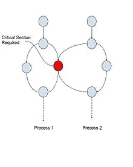

# 追溯编程 20 世纪 70 年代，第 2 部分—关键代码部分

> 原文：<https://betterprogramming.pub/retro-programming-1970s-part-2-critical-code-section-9924ad9a09fd>

## 沿着记忆的小路

保罗·基亚布兰多在 [Unsplash](https://unsplash.com?utm_source=medium&utm_medium=referral) 上的照片

在[的上一篇](https://medium.com/@graeme.t.bentley/software-engineering-1970s-retro-part-1-4951e1afa08c)中，我介绍了我在 1970 年继承的一个生化实验室自动化系统的背景，以记录、调试系统崩溃并扩展其处理能力。

# 亲身体验钻头

像这样的系统，内存这么小，没有系统或调试工具，实际上是在位级工作。

系统崩溃后，人们必须使用控制台的拨动开关来检查内存中的单词。我稍微修改了程序代码，留下了“面包屑”,记录了程序各部分的执行顺序。

通过拨动开关，我查看了每个子程序中记录的返回地址。

# “关键代码段”问题

**说明“临界区”的流程图。图片来自'******'****

**很快就发现崩溃与打印程序有关。现在我不记得是先想到“鸡”还是先想到“蛋”，但它们几乎是同时出现的。**

**除了操作员启动的打印之外，还打印了实时日志，因此它们之间存在潜在的冲突。这看起来像是一个经典的“[关键代码段](https://en.wikipedia.org/wiki/Critical_section)”问题(谢天谢地，我在去年学过操作系统原理)。**

# **压断骆驼背的稻草**

**但是像 PDP-8 这样的老式计算机体系结构的怪癖使诊断变得老套了。在面向堆栈的计算机体系结构之前，子例程调用在入口点存储与子例程代码一致的返回地址。**

**因此，如果中断发生时执行在子例程内部，并且中断代码调用相同的子例程，则先前的返回地址被覆盖，并且当中断完成后执行返回时，相同的子例程继续执行，但是返回到错误的地址。QED！**

# **受保护的代码段解决方案**

**我们做了一些尝试来修补一个信号量/标志，以尝试序列化对共享例程的访问，但是它们导致了实时日志打印的问题。我对中断处理和打印机功能的设计研究得越多，我发现基本的操作设计原则并没有被遵循。**

# **类似操作系统的打印处理程序**

**根据上述诊断以及未来将打印扩展到第三台(或更多)打印机的需求，对打印处理代码进行了重大重写。每台打印机都在一个控制表中定义，包括指向单个缓冲区的指针，在该缓冲区中存储来自打印请求的文本行。中断例程只是从缓冲区中为中断打印机设备检索下一个要输出的字符。**

**当容量扩展发生变化时(如第 3 部分所述)，添加了一个具有并行接口的 Centronics 打印机，上面的表驱动打印驱动程序很容易修改来处理它。**

# **一些杂项增强**

**二进制代码纸带的大小和它通过机械阅读器所花费的时间，产生了偶尔堵塞和错误的问题。因此交叉汇编器被修改为输出 1K 块的二进制代码，并带有校验和。因此，在读取错误后，磁带可以简单地重新定位在前面的块间隙中，并重新开始以继续。**

**在开发过程中，经常将修复程序切换到内存中，因此实现了修改部分的磁带转储，因此如果重新加载了以前的主磁带，则可以在其上加载后续的补丁。**

**有时候，我甚至通过手工穿孔磁带的某些部分来恢复次要的代码修正补丁(二进制)(啊，那是‘动手’编程的时代)！**

**在本系列的[最后一篇文章中，我将描述支持并发数据输入和报告的多处理的主要重写。为了给多批数据释放内存，操作员程序代码段被移动到鼓/盘上进行覆盖加载。](https://medium.com/@graeme.t.bentley/retro-programming-1970s-part-3-message-passing-data-processing-e07a5ba2ce8a)**