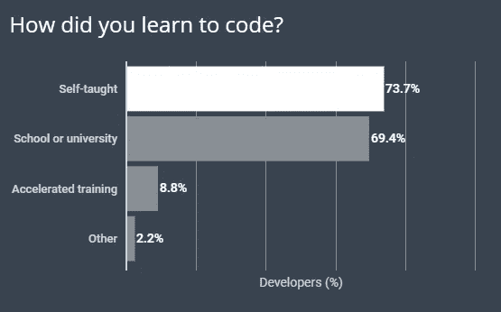

# 管理开发人员冒名顶替综合症的规则

> 原文：<https://betterprogramming.pub/rules-for-managing-developer-impostor-syndrome-4499ede9fd81>

## 有时候觉得有点力不从心是正常的

照片由[斯密特·帕特尔](https://unsplash.com/@mesmitpatel?utm_source=unsplash&utm_medium=referral&utm_content=creditCopyText)在 [Unsplash](https://unsplash.com/s/photos/head-in-hands?utm_source=unsplash&utm_medium=referral&utm_content=creditCopyText) 上拍摄

“我做开发商之前，在<insert_industry>工作。”</insert_industry>

这听起来熟悉吗？也许你从一个做了多年开发的同事那里听说过。也许你会追随某个爱唠叨的 YouTube 明星，他会向你展示“他们不想让你知道的秘密”，并告诉你他们闯入软件世界的故事。

借鉴别人的历程固然很棒，但是对于转行做软件开发的心理问题，有时候他们并没有把握住很多答案。你看到的是开始，然后是成品。

中间在哪里？苦在哪里？

我也经历过同样的情况。直到最近，我才终于开始有效地对抗困扰当今许多自学成才的独立开发人员的典型的冒名顶替综合症。一开始，我会试着称自己为“开发人员”或“工程师”，这感觉不太对。我会变得胆怯，觉得自己是一个藏在众目睽睽之下的间谍。

"当然，有人犯了一个严重的错误，我很快就会被解雇。"你有过这种想法吗？我有。这让你觉得自己的工作糟透了。这种想法会让你重新审视自己，认为你之前所做的一切都是理所当然的。

不要有这种想法。

我知道，说起来容易做起来难。每当我在代码审查中收到基本的、常识性的反馈时，这种想法就会突然出现在我的大脑中，然后恐慌就会出现。一个猜测和怀疑的螺旋将会出现，我会觉得有必要减少曝光率，保护我的工作。

不一定要这样。

让我们来看看我在这个过程中总结出的一些规则，它们可以帮助你摆脱那种不舒服的冒充综合征的感觉。

# 统计背景

等等，不如我们多看看行业背景？

来点统计数据怎么样？人人都爱数据。

2018 年， [HackerRank 汇总了一项关于开发者技能](https://research.hackerrank.com/developer-skills/2018)和兴趣的研究，发现超过 73%的开发者是自学的。

资料来源:hackerrank.com

73.7%.那就是**巨大的**。你的大多数同事都自学了这样或那样的编码方法。更好的是，这些同事通过多种方式自学了编码技能。一些人参加了在线课程，一些人参加了面对面的“新兵训练营”，还有一些人只是自学，看书和修修补补。

我建议通读 HackerRank 研究的其余部分( [2019 可在此处获得](https://research.hackerrank.com/developer-skills/2019))，因为它揭示了软件行业的一些有趣趋势。现在，有了这些统计数据，我们来谈谈我的第一条规则。

# 互相交谈

你越活在自己的脑袋里，越怀疑自己的能力，事情就会变得越糟。你将构建自己的职业焦虑世界，在其中编织恐惧的织锦。

没有人喜欢恐惧的挂毯。

与您的开发伙伴交流！如果你是团队中的新手，请其他人共进午餐，或者试着安排时间向高级工程师请教一些事情(当然，要尊重他们的时间)。

当你和其他开发人员交谈时，你不仅学到了新的技术知识，还学到了关于他们生活的东西。询问他们的过去，他们是如何学习编码的，在哪里学的，为什么要这么做。也许不能一下子问完，但无论如何都要问这些问题。

有可能你会发现你的同事有和你相似的经历。*真是松了一口气。你不是唯一一个。*

我记得当我获得初级工程师的第一份工作时，我正处于一个小型的 freakout 会议中，认为我搞砸了，世界正在崩溃，因为我不知道一些模糊的接口。我走到一个同样和我一起工作的亲密(自学)朋友面前，开始向他们发泄。我说了些大致如下的话:

“我觉得每个受过正规计算机科学教育的人都在嘲笑我们，或者认为我们很蠢。”

我的朋友站起来，陪我走到房间中央，开始一个一个地指出我们的其他同事:

"她去学校学习海洋生物学。"

"他是一名参加过编码训练营的运营助理."

我的朋友去了，指着同事给我讲他们的一些故事。我开始感到有一种重量被举起来了。我觉得抱怨和认为每个人都在攻击我是愚蠢的。在同一个 s̶i̶t̶u̶a̶t̶i̶o̶n̶.还有其他人

*情况*甚至用这个词都不恰当，因为将自己从一种职业中拔出来并在另一种职业中站稳脚跟需要极大的努力，这需要勇气和决心。

记住，你属于这里。现在去和人们聊聊。

# 可见

这个很难。这违背了冒名顶替综合症告诉你的一切。

当你觉得所有的目光都集中在你的工作上时，你的焦虑会飙升，你会认为每个人都在把所有的东西都撕成碎片，但这并不完全正确。

是的，会有一些混蛋只想指出你是如何违背他们的喜好命名一个变量的。但是也会有其他开发人员在同一条船上，甚至可能在处理相同类型的问题，他们会感谢你的勇气和可见性。

很长一段时间以来，我只把我的代码交给一小群亲密的同事审阅。我以为这样更安全。我的小圈子了解我，会对我手下留情。

这是个坏主意。

让你的代码和你自己更加清晰可见！将您的评论发送给更广泛的开发人员。

把你的代码发给角落里那个已经在公司工作了 12 年的黑帽黑客(如果你真的可以的话)。看看是否有必要购买 CR 来获得不同角度的反馈。人们以不同的方式学习语言，并以独特的风格实现功能。

有很多次，我从给新认识的人发简历中学到了一种有趣、高效的新写作方式。

这是双向的:你也应该愿意和开放地审查许多不同的 CRs。写作风格、语言、代码库等越多。你接触的越多越好。主动帮助新同事检查他们的代码。你甚至可以在这里杀两只鸟，一边和它们说话一边查看它们的代码。什么概念。

# 不断学习

这是显而易见的，但值得重复。我怎么强调都不为过。不断学习。不要因为已经习惯了一种语言或框架就停下来。

走出自己的舒适区，鞭策自己。做一些有趣的事情。

*你主要是前端开发人员吗？尝试写一些 C 语言来改变一下。*

*嵌入式系统人？*去学习如何对笑声做出反应。

*后端开发者？COBOL 可能适合你(开个玩笑……可能)。*

你越是坚持学习，保持一个开放的、海绵般的头脑，这些事情就会越多:

*   你将能够更快地掌握新的语言。
*   您将了解其他开发人员角色及其挑战。
*   你会拓宽你的职业机会。
*   你会对多种语言或框架更有信心。

这最后一项是关键，因为这是一个减少了冒名顶替综合症的感觉。你越熟练，学得越多，你就越少怀疑自己。

请记住，自信不应转化为傲慢。不要让你对学习新事物的贪得无厌的需求将冒名顶替综合症转变为狂妄自大。

# 结论

冒名顶替综合症在某个时候困扰着许多开发人员，并以各种方式表现出来，但请放心，还有其他人也有同样的情况。我在这里列出的规则并不是包罗万象的，但它们会减少冒名顶替综合症的影响。

记住**沟通**，**可见**和**永不停止学习**。

如果你不熟悉冒名顶替综合症，这是一种焦虑的倾向，困扰着许多自学成才的开发人员和多个行业的熟练工人。更多信息请查看 [*扬·穆隆达*](https://medium.com/u/32bbe8f2608c?source=post_page-----4499ede9fd81--------------------------------)*[*的作品《冒名顶替综合症背后的感觉*](https://medium.com/@yannmjl/the-feeling-behind-the-impostor-syndrome-ab3f7524a071) *。**