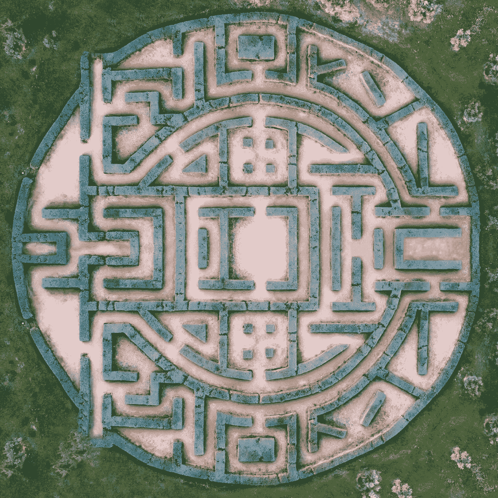

# SwiftUI 中带有深度链接的可扩展导航

> 原文：<https://betterprogramming.pub/scalable-navigation-with-deep-links-in-swiftui-96cea1764994>

## 在复杂的应用程序中，使用深层链接导航到正确的屏幕

[维克多](https://unsplash.com/@victor_g?utm_source=medium&utm_medium=referral)在 [Unsplash](https://unsplash.com?utm_source=medium&utm_medium=referral) 上的照片

当我们浏览网页时，有时我们点击一个产品，我们会看到亚马逊应用程序正好在该产品的页面上打开。其他时候，在 Messenger 上回复一个朋友后，我们会查看他们的个人资料，然后脸书的应用程序会直接在上面打开。

这些是使用深层链接从一个应用程序导航到另一个应用程序的例子。这项技术让我们将用户与应用程序的一些内部屏幕联系起来。这些屏幕在导航树的深处，但是深层链接让我们无需要求用户手动导航到那个屏幕就可以到达它们。

今天，我想向你展示如何在你的应用程序中建立深层链接，以及如何以可扩展的方式处理它们。

# 建立深层链接

让我们从创建一个新的 Xcode 项目开始。我们可以选择 Swift 作为编程语言，SwiftUI 作为用户界面框架。然后，我们可以按照提示操作，直到 Xcode 为我们打开一个标准的 SwiftUI 项目。

要配置深层链接，我们需要:

1.  在项目导航器(⌘+1)中选择我们的项目
2.  在目标面板中选择我们的应用程序
3.  选择信息选项卡
4.  展开最后一个选项，URL 类型
5.  点击面板底部的小`+`按钮
6.  填写出现的表格。

如何设置深层链接的 URL

在表单中，我们可以填写四个字段，外加另一个用于类型属性的部分。唯一需要设置的重要参数是右上角的 URL 方案。此参数控制应用程序必须如何识别 URL。

因此，例如，如果我们将它设置为`deeplinkapp`，每当用户点击 Safari 上具有`deeplinkapp://`形状的链接时，iOS 将询问用户是否要在我们的应用程序中打开该 URL。每当另一个 app 尝试`UIApplication.shared.openURL("deeplinkapp://")`时，iOS 都会询问用户是否要打开我们的中的网址。

一个应用程序可以响应多个 URL 方案。这有助于将用户引导至应用程序的不同标签或不同子部分。如果我们的应用程序有不同的名称，我们也可以支持不同的方案。要添加更多的 URL 方案，点击底部的小`+`按钮并进行配置。

# 回应深层链接

SwiftUI 让很多事情变得非常简单。回应深层链接就是其中之一。为了响应深层链接，我们需要将`onOpenURL`修饰符添加到应用程序启动时加载的任何`View`中。代码可能是这样的:

深层链接的基本处理

注意，我们也可以在复杂视图中添加多个`onOpenURL`修改器。当这种情况发生时，理解如何处理它们是很有趣的。考虑这样一种情况:

具有一个视图的 VStack 和具有两个视图的 HStack。

当一个深层链接被传递到应用程序时，我们可以观察到这样的输出:

链接如何传播没有明显的逻辑:系统首先询问`ContentView1`，然后询问`ContentView2`(包含在不同的容器中)。之后，它不是询问`ContentView2`的兄弟，而是询问外部容器，然后是内部容器，最后是最后一个视图。

> 我们不能对深层链接如何传递给渲染视图做任何假设。

# 可扩展的深层链接

当应用程序增长时，试图在一个地方处理所有可能的导航路径是不可行的。如果我们试图这样做，我们将违反许多软件工程原则，我们的代码可能很快变成意大利面代码:我们的深度链接管理器必须知道我们可以通过深度链接到达的所有可能的屏幕，访问不同的数据源，并为所有屏幕创建数据。

这不是好的架构，它会很快变得复杂。有一个更好的方法:我们可以使用[责任链](https://refactoring.guru/design-patterns/chain-of-responsibility)模式，将任务划分给不同的对象。

## 责任链模式

该模式允许我们在解决一个特定的问题时层次化地构建多个对象。所有这些对象共享同一个接口，它们必须执行类似的任务:例如，它们必须决定它们是否能处理深层链接以及如何处理它。

可以从两个方向查询层次结构:自下而上，从子节点到根节点，或者自上而下，从根节点到子节点。

在自下而上的方法中，叶子是第一个被查询的元素。它首先检查它是否能执行任务。如果是，任务就完成了。如果没有，它会要求其父节点执行所需的任务。父进程遵循相同的过程:检查它是否能完成任务，如果不能，它询问它的父进程，等等，直到它们找到能够执行任务的东西或者系统报告不可能执行它。

我们可以在软件工程的许多领域找到这种模式。我们的视图中的触摸是以这种方式管理的。使用这种模式抛出异常。当我们构建复杂的 SwiftUI 视图时，我们将子视图的呈现委托给它们的`body`属性。

## 如何大规模实施

我们正在考虑一个复杂的应用程序的情况，它被分成几个模块，只有一个`CompositionRoot`元素知道整个应用程序。正是`CompositionRoot`创造了`DeepLinkParsers`的层级。

作为第一步，让我们为`DeepLinkParsers`定义一个协议:

协议定义一个`DeepLinkParser`应该有两个方法:一个检查它是否能处理深层链接，另一个实际处理它。

然后，我们可以实现如何具体处理每个模块中的部分深层链接，而不会泄露其他模块的任何信息。

例如，`TabDeepLinkParser`可以是一个解析深层链接的初始部分并在不同标签之间切换的对象。

它的实现如下所示:

用一个标签数组、一个其他的`DeepLinkPasers`数组和一个深层链接可以处理时要执行的动作来初始化`TabDeepLinkParser`。

然后，我们实现协议的第一个方法:`canHandleDeepLink`。如果这个方法可以处理链接，它将返回`true`。当 URL 的`host`是其中一个选项卡时，如果至少有一个解析器的子解析器可以正确处理链接，那么`TabBar`可以处理链接。

假设我们正在查询所有的子节点，检查处理深层链接的可能性不需要大量的工作或密集的操作。我们想知道我们是否能尽快处理链接。

最后，我们通过执行动作来实现`handleDeepLink`，然后要求能够处理深层链接的子节点实际处理它。

> **注意:**这是可能的实现之一。根据您的应用程序逻辑，您可能不想遍历所有可能的处理程序。例如，你可以寻找第一个或最后一个。根据深层链接的结构，您还可以实现某种优先级队列。

然后，我们可以在不同的模块中重复这个模式，处理深层链接的不同部分。例如，一个`ProductList`视图可以实现一个深度链接解析器，该解析器检查一个`id`参数的存在，如果该参数存在，就做一些事情:

这个解析器没有子解析器，这意味着它是我们链中的一个叶解析器。它知道如何处理与`id`参数的深层链接，并且知道它必须对它提取的`id`执行一个动作。

最后，`CompositionRoot`可以把解析器组装起来。所有的解析器都是纯逻辑的，没有任何对 UI 的引用。在一天结束时，我们希望使用它们来导航到正确的屏幕。`CompositionRoot`通过创建深度链接解析器的层次结构并为它们提供适当的动作，将解析器的逻辑与 UI 联系起来。

一个示例实现如下:

`DeepLinkApp`作为`CompositionRoot`工作。它声明了两个`@State`变量来跟踪当前的选择。然后，它定义了我们希望在应用程序中使用的选项卡。

`body`属性包含带有选项卡的`MainTabView`，它使用`onOpenURL`修饰符来处理深层链接。

当接收到深度链接时，它会创建适当的解析器层次结构:带有一个`ProductDeepLinkParser`孩子的`TabDeepLinkParser`。第一个解析器中使用的动作改变了`selectedTab`属性。第二个解析器中使用的操作选择合适的产品。

# 结论

在今天的文章中，我们学习了什么是深层链接，以及如何构建一个应用程序来处理它们。我们还学习了如何保持解析器的逻辑相互分离。这提高了解决方案的可组合性，并且简化了我们必须在每个解析器中编写的逻辑。

我们学习了[责任链](https://refactoring.guru/design-patterns/chain-of-responsibility)模式，以及如何使用它将解析器组合在一起。

今天讨论的所有内容都可以在这个 [GitHub 资源库](https://github.com/cipolleschi/DLA/)中找到。它不仅仅包含我们在本文中看到的代码。它还包含其他有趣的东西，比如如何在不使用`AnyView`的情况下实现这个相同的系统，例如，如果我们接受预先知道我们将需要创建哪些选项卡。

深层链接非常强大，本文只是触及了它们的表面。它们可以用来实现许多其他复杂的功能——从测试到跟踪等等。