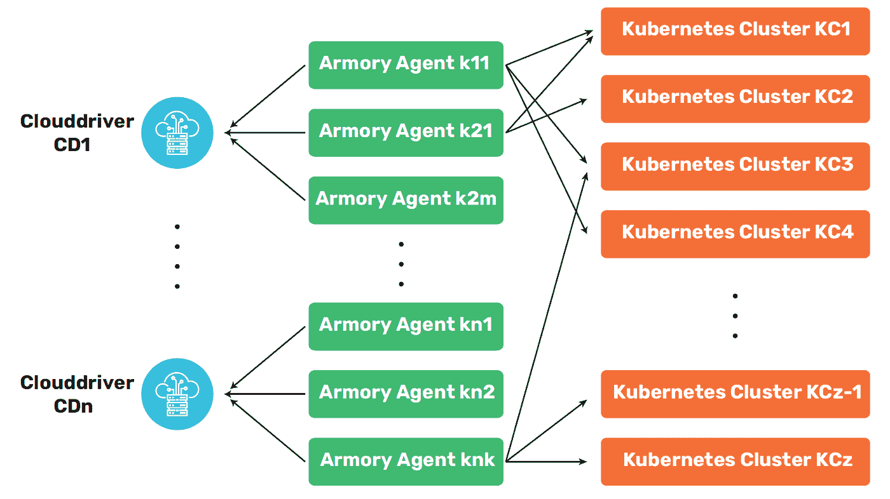

# 用军械库扩展 Kubernetes 集群

> 原文：<https://betterprogramming.pub/scaling-kubernetes-clusters-with-armory-d8902576fbe6>

## 大规模管理 Kubernetes

在 [Unsplash](https://unsplash.com?utm_source=medium&utm_medium=referral) 上由 [Cameron Venti](https://unsplash.com/@ventiviews?utm_source=medium&utm_medium=referral) 拍摄的照片

# 概观

想象一下，如果亚马逊每年只有一天不可用。在这种情况下，他们将拥有 99.7%的可用性，这在表面上看起来相当合理。然而，在 2020 年，亚马逊的收入接近 4000 亿美元。保持 99.7%的可用性而不是 100%的可用性将花费亚马逊超过 10 亿美元。停机时间—即使只是一小会儿—也会让您的企业付出代价。

我们通过冗余最大限度地减少停机时间。用不可靠的组件构建可靠的系统需要有备用组件来替换有故障的组件。尽管如此，更换有故障的部件需要时间。

现在，让我们把它带到软件领域。您有一个企业级系统，包含数万(或更多)服务器和应用程序。这些遍布全球。您需要将您的应用程序和服务部署到您的服务器，管理您的基础架构，升级、修补和支持开发。万一发生事故，您需要能够安全地回滚更改或故障转移到备用系统。您需要保护所有这些系统并管理访问。

Kubernetes 在过去几年中声名鹊起，因为它为构建这种大规模系统提供了一个坚实而可扩展的基础。对于大规模系统的连续交付(CD ),包括那些构建在 Kubernetes 上的系统，首选的平台是 Spinnaker。

但是，如果您单独使用 Spinnaker，那么在这种规模上管理 Kubernetes 部署是不可行的。我们需要一个强大的工具来处理变更管理、管道配置和安全性。最终，需要的是 Armory 的 Spinnaker 企业级发行版。

在本文中，我们将考虑大规模管理 Kubernetes 的挑战以及处理运营环境和升级 Kubernetes 的障碍。然后，我们将看看 Spinnaker 作为 Kubernetes 的 CD 平台的作用。最后，我们将看看使用[军械库 Spinnaker](https://www.armory.io/) 来管理这种大规模 Kubernetes 系统的简单性和安全性。

# 大规模管理 Kubernetes

Kubernetes 很棒，但是，它是在集群级别上运行的。库伯内特星团是有极限的。Kubernetes 1.21 支持每个集群最多 5，000 个节点，每个节点最多 110 个 pod，最多总共 150，000 个 pod，总共 300，000 个容器。这是一个很大的数字，但是大多数企业甚至超过这些限制几个数量级。

这些集群限制不太可能很快改变。对于较大的系统，解决方案是运行多个 Kubernetes 集群。但是，如果没有良好工具的支持，多集群管理的可持续性如何？此外，我们还面临着管理用户和服务的访问控制、协调多种环境以及处理可能破坏系统的 Kubernetes 升级的挑战。在我们考虑的规模水平上，以及对于无法接受停机时间的企业来说，任务是艰巨的。让我们详细看一下这些挑战。

# 多集群管理

首先，我们来看多集群土地。如果您有少量的集群(假设少于 10 个)，您可以尝试直接管理它们。人们将按照操作手册来执行任务，如配置集群、部署基本软件、升级和打补丁。

这种手动操作很快就会失效。Kubernetes 提倡把你的服务器当成牛，而不是宠物。在规模上，您也需要将这一概念带到您的集群中。这是什么意思？这意味着集群是一次性的。运行某些工作负载(包括关键工作负载)的集群可以进行扩展(让更多相似的集群运行相同的工作负载)、删除和/或清空，并将其工作负载转移到另一个集群。

这种级别的大规模控制需要大量专用集群管理软件，这是管理集群中最有用的模式之一。管理集群是一个 Kubernetes 集群，其任务是管理其他 Kubernetes 集群。这种方法的一个很好的起点是 Kubernetes 集群 API，它是 Kubernetes 的一个子项目，专门处理这个问题。

# 用户、服务帐户和权限

接下来，在大规模管理大量资源时，管理和控制访问的问题。Kubernetes 支持用户(人类)和服务账户(机器)等概念，以及基于角色的访问控制模型(RBAC)。凭证和机密需要安全地管理和轮换。需要提供和删除用户和服务帐户，并且需要加入和停用应用程序。

这种类型的管理——即使对于单个集群来说——也不是微不足道的。当考虑到数十个、数百个甚至数千个转瞬即逝的集群时，管理问题可能会让人不知所措。

这里有几个利害攸关的问题，我们将简要地谈一谈。

# 用户体验

用户体验包括在每个集群上请求正确的访问级别。如果没有适当的支持，用户就不容易知道每个集群需要什么访问级别。通常，用户试图通过用户界面访问某些资源，会遇到一个模糊的“拒绝访问”错误。

# 操作员体验

操作员体验包括管理复杂的资源和用户图。通常，这些是以资源组和用户组的层次结构来组织的。操作员需要能够管理每个用户/组的正确权限以及组内的用户成员资格。每当新用户加入组织、离开组织或改变角色时，这些权限都需要调整。所有这些都需要开发人员、运营商和 IT 之间的集成。

# 爆炸半径

漏洞的爆炸半径通常与权限管理的粒度有关。如果每个开发人员都有完全的管理权限，那么一台被入侵的笔记本电脑就可能导致全面的危机。另一方面，定制每个用户的权限会导致大量的无用功。错误会使人们无法获得完成工作所需的资源。

# 安全性

安全问题密切相关。如果资源没有得到正确保护，那么敏感信息可能会泄露。攻击者可以控制关键系统。

一旦加上应用程序和自动化系统也需要它们自己的权限这一简单事实，问题就复杂了。

底线是，这种规模的管理是不可能通过点击某些 web 控制台上的按钮来实现的。整个过程必须是动态的，在整个企业中具有自动发现和一致的指导原则。

# 操作环境

现在让我们更详细地研究一个全球性的大规模系统的一个方面。每个工作负载并不存在于单个环境中。在开发、部署和维护的生命周期中，工作负载将在不同的环境中使用。例如，一个常见的模型是拥有多个部署环境，如开发、试运行和生产。当处理多个 Kubernetes 集群时，管理每个环境变得更加困难。

当然，生产环境是最重要的。但通常，试运行环境必须遵循非常高的可用性标准，模拟生产环境，因为它充当生产部署的把关者。

前面，我们提到了冗余和故障转移。系统架构和拓扑可能会决定您的 Kubernetes 集群是部署为多区域、多区域，还是部署为多云，以保护您免受不同故障模式的影响。冗余是昂贵的；管理故障转移也不简单。

如果您的集群运行在云提供商和私有数据中心的混合平台上，这又增加了另一方面的复杂性。

最后，您的开发人员将会喜欢本地开发体验，他们可以在将更改部署到共享开发环境之前测试它们。

# 升级 Kubernetes

好吧。您的 Kubernetes 集群已经启动并运行。大家都很开心。然而，即使是现在，你的工作还没有完成。Kubernetes 一年发布三次新版本(以前，他们一年发布四次新版本)。你应该经常升级。如果您使用托管的 Kubernetes 产品，如 GKE、EKS 或 AKS，情况尤其如此。不管你喜不喜欢，你的云提供商都会升级你的 Kubernetes 集群。

Kubernetes 有一个非常有序的弃用和移除过程。每个资源都有一个组、版本和种类(GVK)。首先，某个特定版本将被弃用。这意味着该版本仍然受支持，但每个人都知道它在砧板上，要在以后完全删除。如果您升级到 Kubernetes 的新版本，并尝试创建或更新已删除的对象，这将会失败。您的群集现在包含损坏的资源。

为了防止这种情况发生，您必须保持警惕，不断地将您所有的 Kubernetes 资源更新到受支持的版本。一个好的做法是尽早更新甚至不推荐使用的资源。您不希望将更新推迟到最后一刻，就在您升级到不再支持这些资源的 Kubernetes 版本之前。

你如何着手此事？首先，您应该阅读 Kubernetes 发行说明，了解哪些资源将被弃用或删除。然后，扫描所有集群中受影响的资源。确定这些资源后，与风险承担者一起将他们的资源更新到受支持的版本。

在规模上，您将需要工具来评估兼容性。我写了两个工具，可能很快就会开源:一个工具接受一个不推荐使用/删除的资源版本列表，并扫描一个使用这些版本的资源的集群列表。另一个工具获取一个集群列表和一个目标集群，并将所有原始资源模拟导入到目标集群。

例如，如果您想从 Kubernetes 1.18 升级到 Kubernetes 1.19，那么您将创建一个 1.19 空集群，并使用所有 1.18 集群的列表运行该工具。该工具将尝试在 1.19 集群中创建 1.18 集群的所有资源(在模拟运行模式下)。任何不兼容都会导致将被报告的错误。

一旦您为升级做好准备，并且您的所有工作负载都使用受支持的版本，就该执行实际升级了。升级过程分为两个部分:升级控制平面和升级数据平面(工作节点)。数据平面版本是指安装在每个节点上的 Kubernetes 组件的版本(kubelet、容器运行时、kube-proxy)。不同的节点可能有不同的版本，但它们不能比控制平面的两个次要版本旧，也不能比控制平面版本新。

这意味着当您升级您的集群时，首先您必须将控制平面升级到比您最早的节点版本最多提前两个次要版本的版本。例如，如果您的节点在 Kubernetes 1.18 上，您可以将控制平面升级到 1.19 或 1.20。然后，您可以跟进并将您的节点升级到相同的版本。

最佳实践是保持一切一致——您的控制平面和所有节点都应该在 Kubernetes 的同一个次要版本上。唯一的例外是在升级过程中；旧版本上暂时会有一些组件，新版本上会有一些组件。

所有这些都需要大量的协调工作，特别是如果您在云提供商和本地的组合上运行 Kubernetes 集群。也许不是所有的云提供商都支持相同版本的 Kubernetes。您需要找到一个共同点，或者偏离最佳实践，在不同的提供商上运行不同版本的 Kubernetes。

大规模管理 Kubernetes 是一项重要的任务，这一点已经变得很清楚了吗？做好这件事需要大量的支持软件，其中大部分不是现成的。您将需要构建自己的工具，改进它们，并支持高级部署场景。

除了管理 Kubernetes 集群的任务之外，还有部署和扩展的巨大任务，这就是 Spinnaker 的用武之地。

# Spinnaker 作为 Kubernetes 的 CD 平台

虽然 Kubernetes 有几个强大而流行的连续交付解决方案，但 Spinnaker 有一些独特的功能，特别是对于需要处理大量 Kubernetes 集群的企业。

首先，Spinnaker 经过了大规模的实战检验。它最初是由网飞开发的，后来被谷歌扩展。其次，Spinnaker 支持多个提供者，而不仅仅是 Kubernetes。不特定于 Kubernetes 可能看起来是一个缺点，但是，没有一个拥有数千个 Kubernetes 集群的公司只有这些集群。

这种规模的公司在 Kubernetes 出现之前很久就已经存在了(仅仅是六年前)。他们通常在非 Kubernetes 环境中部署了大量系统。Spinnaker 支持他们的 Kubernetes 环境和非 Kubernetes 环境。

此外，Spinnaker 在技术上非常强大，支持多种部署模型，这是管理各种服务和应用程序所必需的。

最后，Spinnaker——虽然是一个开源项目——也享有像[军械库](https://www.armory.io/)这样的公司的强大商业支持。

# 军械库三角帆的简单性和安全性

虽然 Spinnaker 在大规模部署方面迈出了第一步，但对于企业而言，这仅仅是个开始。在运行这种规模的系统的企业中，并不是只有一个 DevOps 专家在管理 Spinnaker 的所有事情。整个 DevOps 团队(复数)都在同时接触 Spinnaker 管道。

单靠 Spinnaker 无法承担这些企业所需的策略管理和管道变更管理。为了满足这种需求，Armory 开发了 Spinnaker 的企业级发行版。军械库以非常重要的方式扩展了 Spinnaker，使它成为一个更好的 Kubernetes 公民，尤其是在规模上。

首先，Armory 使用 Spinnaker 自己的插件构建在 Vanilla Spinnaker 之上。这对可持续融合至关重要。大约十年前，我在一家公司工作，该公司开发了一款基于 Chromium 的社交浏览器。这个项目非常有创意，也非常成功，但是它涉及到 Chromium 的深度定制。每当 Chromium 发布一个新版本，我们都必须在它上面重新应用我们所有的定制。每当一个安全补丁被公开，我们就很容易受到攻击，直到我们完成集成，这需要几天(在某些情况下，几周)。

在这点上，Armory 采取了更好的方式，使用标准机制为开源 Spinnaker 贡献插件框架。简而言之，[军械库建立在开源的 Spinnaker](https://www.armory.io/learn/how-armory-builds-on-oss-spinnaker/) 之上。

其次，Armory 也致力于 Kubernetes，专注于让 Spinnaker 成为更好的 Kubernetes 公民。这要从 Kubernetes 的[军械库代理说起。该代理允许分布式部署到数千个集群和分散的帐户管理。此外，Armory 提供了一个](https://www.armory.io/armory-enterprise-spinnaker/armory-agent-for-kubernetes/)[策略引擎](https://www.armory.io/armory-enterprise-spinnaker/policy-engine/)，允许设置组织策略，提高安全性和合规性。

作者图片

如果这足够了，军械库还提供了一些其他的好东西，比如地形整合和秘密管理。但是，可以说，大规模管理 Kubernetes 最重要的功能是[军械库的“管道代码”功能](https://www.armory.io/armory-enterprise-spinnaker/pipelines-as-code-gitops/)。Spinnaker 管道的 GitOps 是一个重要特性。将您的 Spinnaker 管道作为源代码控制中的代码，并使用您的标准审查和变更管理，会产生巨大的差异。

# 结论

Kubernetes 为现代基于容器的分布式应用程序解决了许多问题。当您将企业级系统迁移到 Kubernetes 时，您最终可能会管理大量的 Kubernetes 集群。为了做好这一点，您需要一个可靠的解决方案来将您的工作负载部署到所有这些集群，并管理集群本身。

三角帆和军械库可以很好的为你服务。如果您管理大量的 Kubernetes 集群或者计划将大型现有系统迁移到 Kubernetes，您可能会发现 Spinnaker 和 Armory 是您首选的持续部署解决方案。