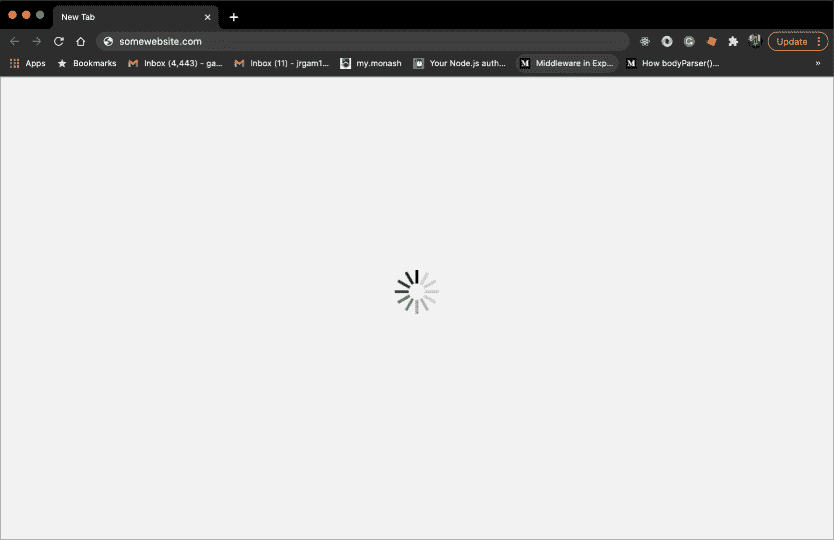
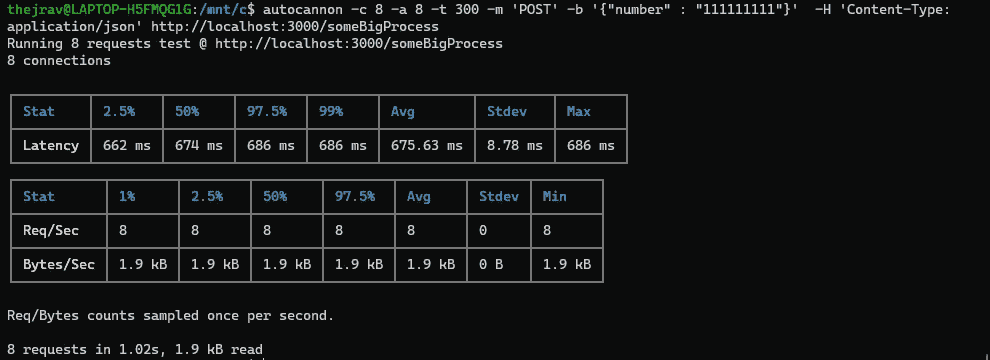
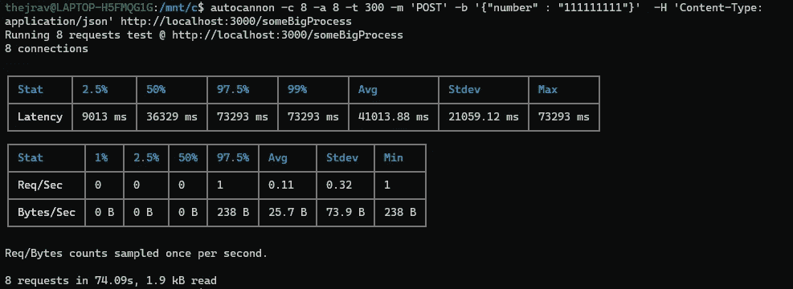
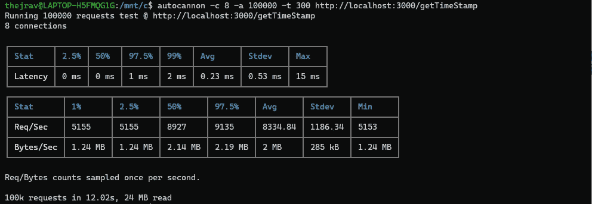

# 使用多处理扩展 Node.js 应用程序

> 原文：<https://betterprogramming.pub/scaling-node-js-applications-with-multiprocessing-b0c25511832a>

## 您可能没有充分利用您的多核服务器环境，甚至不知道

赫克托·j·里瓦斯在 [Unsplash](https://unsplash.com?utm_source=medium&utm_medium=referral) 上拍摄的照片

Node 是一个单线程 JavaScript 运行时环境。单线程有很多好处，它使 Node 成为许多人的首选后端开发环境。然而，单线程也有它自己的缺点。有了 Node，你只有一个线程，主线程*，*，你必须确保它总是可用于服务传入的请求。这并不像听起来那么简单，尤其是如果您的应用程序必须服务于大量的请求，或者如果您的应用程序在某些时候必须执行 CPU 密集型任务。让我们看看如何用多重处理来解决这个问题。

# 什么是多重处理？

多处理是 Node 中的一种服务器端扩展技术，允许您运行多个节点实例，理想情况下每个处理器内核运行一个节点实例。对于多个节点实例，您有多个主线程，因此即使其中一个线程被占用或崩溃，您仍然有其他线程来处理传入的请求。这样，您的应用程序就不会像下面这样。

没人喜欢没反应的应用。

您可以使用节点的内置集群模块或其 child_process 模块来实现多处理。

# 处理 CPU 密集型任务

如果您使用 Node 已经有一段时间了，那么您一定听说过，如果您的应用程序有 CPU 密集型任务，Node 不是一个好的选择。这是因为，如果您运行一个 CPU 密集型任务，并且需要相当长的时间来完成，那么 Node 的单个主线程将被阻塞，并且在任务完成之前，它将无法接受新的请求。

节点 child_process 模块是这个问题的一个很好的解决方法。当您希望让多个节点实例遵循不同的执行流来完成一个共同的任务时，这是非常理想的。它允许您派生一个新的节点实例(子进程)，最好是在另一个 CPU 内核中，并将繁重的任务卸载给新派生的子进程。这使得父进程的主线程可以释放新的请求，并且一旦任务完成，卸载的任务的结果可以被传送回父进程。

让我们看看如何用一些代码来演示这一点。首先，我写了一个算法，以最低效的方式(模仿 CPU 密集型任务)检查一个给定的数是否是质数。

接下来，我编写了一个简单的节点服务器，一旦调用了相关的 API 端点，就使用一个新派生的子流程来执行上述功能。

然后，我通过使用八个并发连接发送八个请求，使用[autocanon](https://github.com/mcollina/autocannon)对服务器进行了基准测试。

多处理基准测试

如您所见，服务器只花了 1.02 秒来处理请求。最后，我编写了另一个没有使用多处理的服务器，并在上面运行了相同的基准测试。

不带多重处理的基准测试

这一次，服务器花了 74 秒来处理相同数量的请求。与之前的多处理实现相比，这是一个巨大的性能下降。

存在某些耗时的任务，例如 I/O 操作、网络操作和加密功能，节点设法以异步非阻塞方式执行这些任务，而不需要手动实现多处理。要了解更多关于 Node 如何处理异步任务的信息，请查看我的[上一篇文章](https://medium.com/better-programming/single-threaded-and-asynchronous-how-does-node-do-it-d964100766a)。

# 处理大量的请求

当处理大量请求时，单线程可能会成为一种限制。随着请求数量的增长，服务器的响应时间会变长，因为所有的请求都只使用一个线程来处理。

节点集群模块是这个问题的解决方案。它允许多个节点实例遵循同一个执行流，监听同一个端口，这在处理大量请求时非常理想。让我们写一些代码，看看它是如何工作的。

在集群中，有一个名为*主进程*的主进程，它在这个应用程序中所做的就是派生其余的*工作进程*，每个可用的 CPU 内核一个。这些工作进程在同一个端口上侦听请求，当工作进程处于高负载状态时，集群模块的嵌入式负载平衡器会在它们之间分配请求。

我执行了上面的代码，为了衡量集群是否能带来任何性能提升，我在服务器上运行了一个基准测试，模拟来自 8 个并发连接的 100，000 个请求。

集群基准测试

服务器用 6.02 秒处理 100，000 个集群请求。然后，我实现了另一个类似的服务器，但没有集群，并在其上运行相同的基准测试。

不带聚类的基准测试

这一次，服务器花了 12 秒多的时间来处理相同数量的请求。与之前的集群实现相比，这是一个显著的性能下降，并且在真实的用例中可能会变得更加显著。

# 多重处理的缺点

多重处理的性能提升是有代价的。实现多处理意味着运行多个节点实例，这会消耗大量内存。因此，您应该始终确保您的服务器环境能够承受多处理可能出现的内存使用高峰。

无论您使用哪个节点模块，多处理都可能需要在某些应用程序中进行进程间通信，从长远来看，维护起来可能会有点复杂。

# 结论

使用 Node 的内置模块可以很容易地实现多处理，它允许您充分利用可用的服务器环境。借助多处理技术，您可以在执行 CPU 密集型任务或处理大量请求时提升服务器性能，并提高服务器可用性。

感谢阅读！

# 资源

[Node.js 子进程:你需要知道的一切](https://www.freecodecamp.org/news/node-js-child-processes-everything-you-need-to-know-e69498fe970a/)

[技术演讲:Node.js 中的服务器扩展](https://www.youtube.com/watch?v=w1IzRF6AkuI)

[构建无阻塞多进程 Web 服务器(Node JS fork 示例)](https://www.youtube.com/watch?v=hmTl5Y4ee_Y)