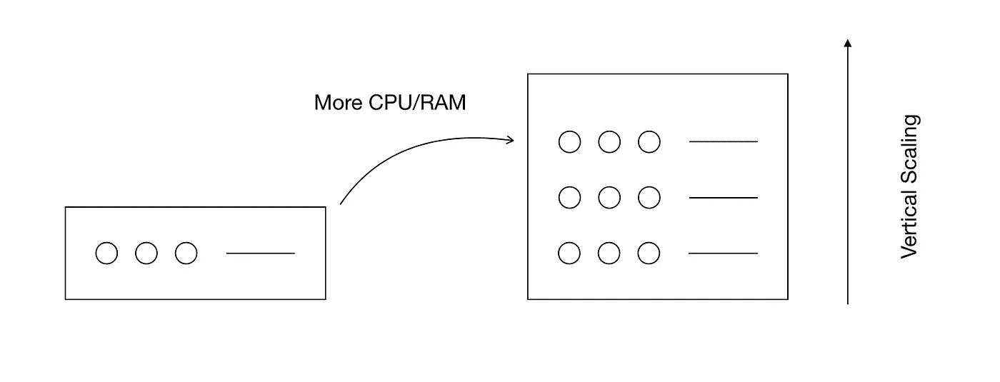
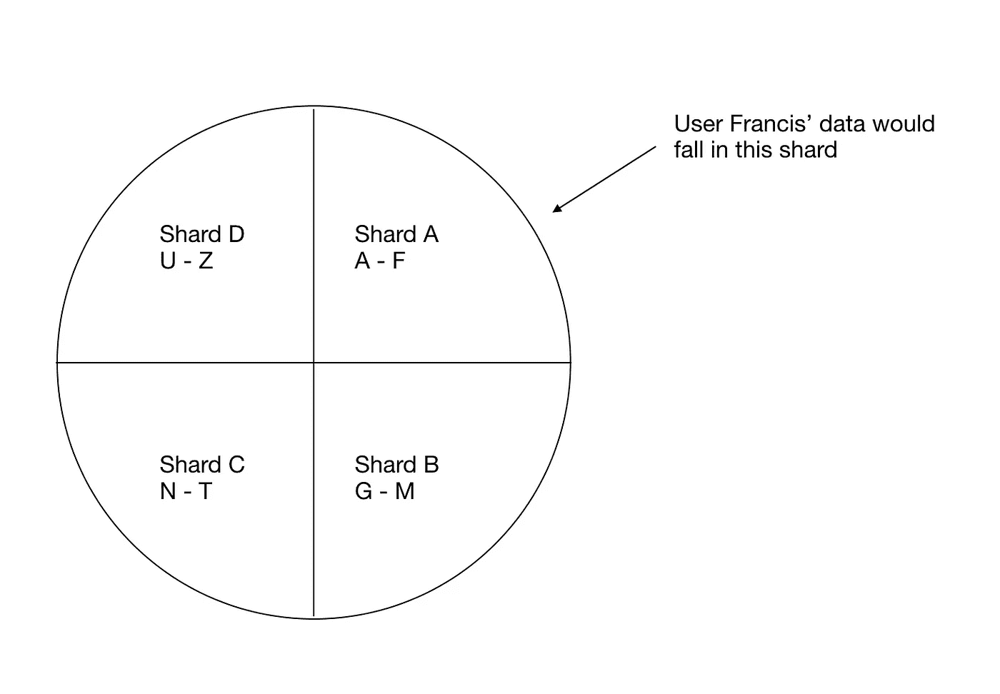
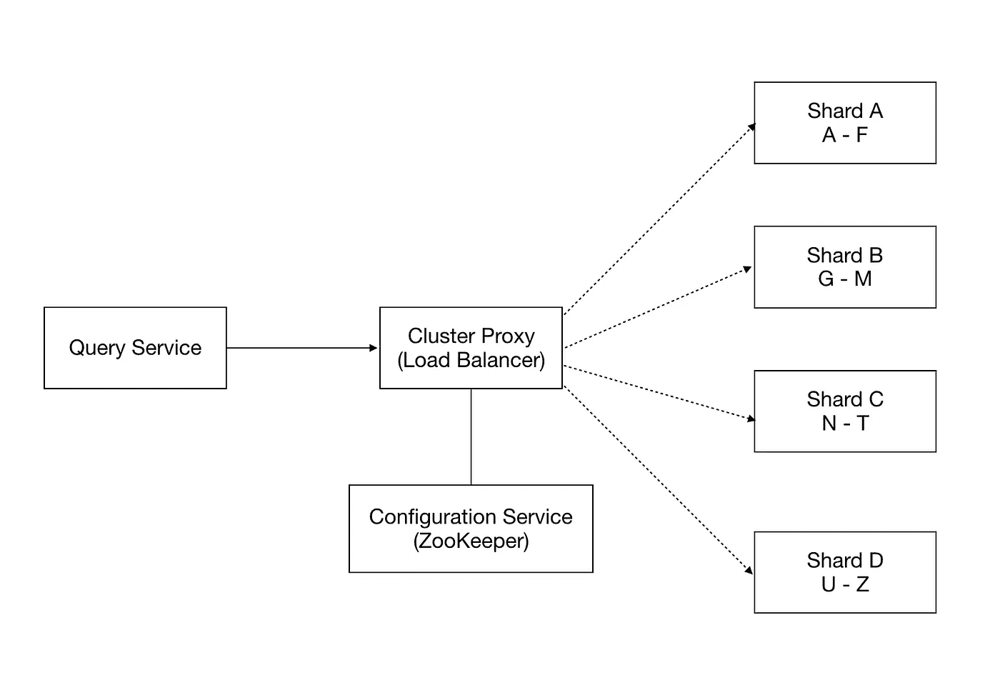
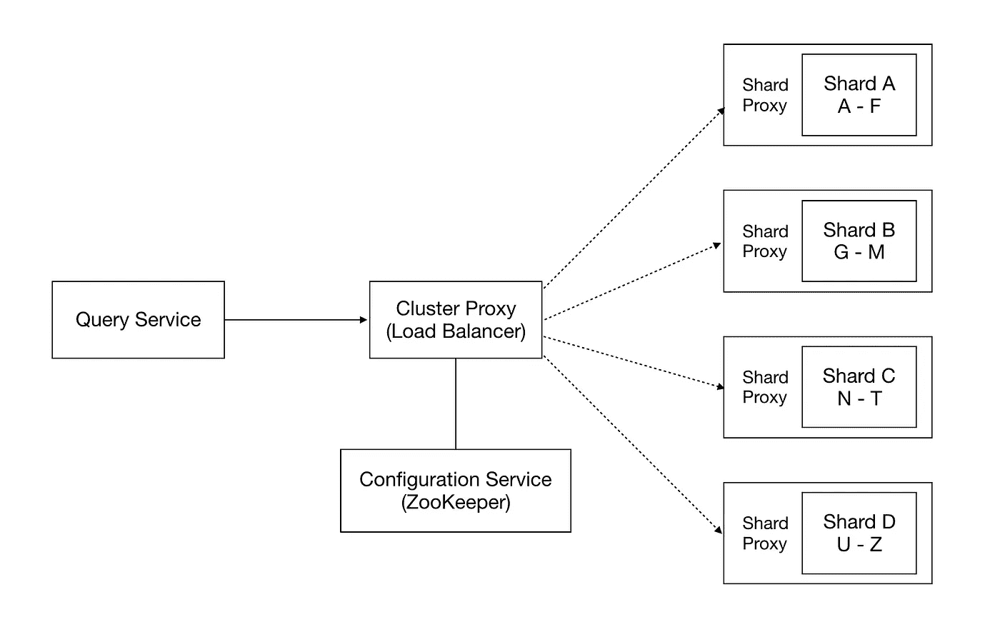
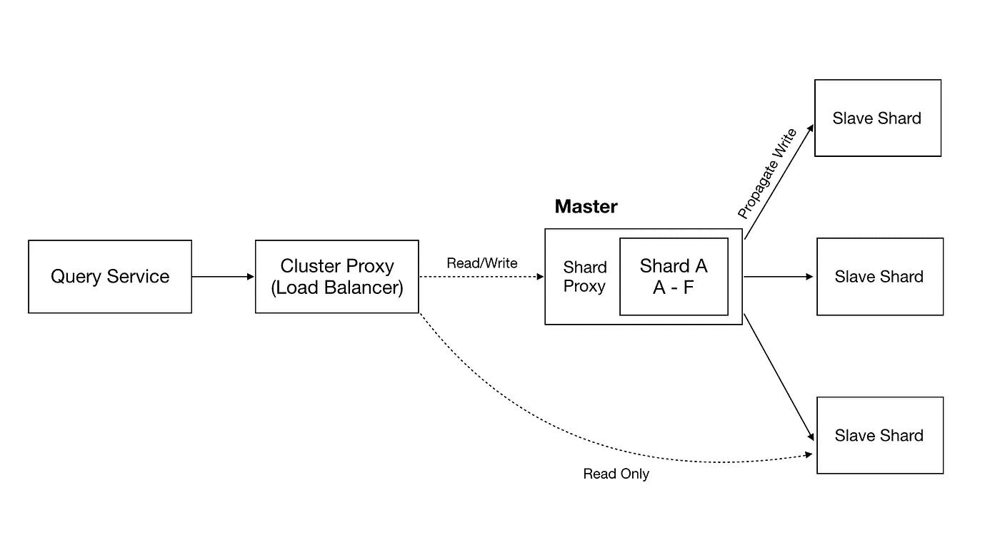
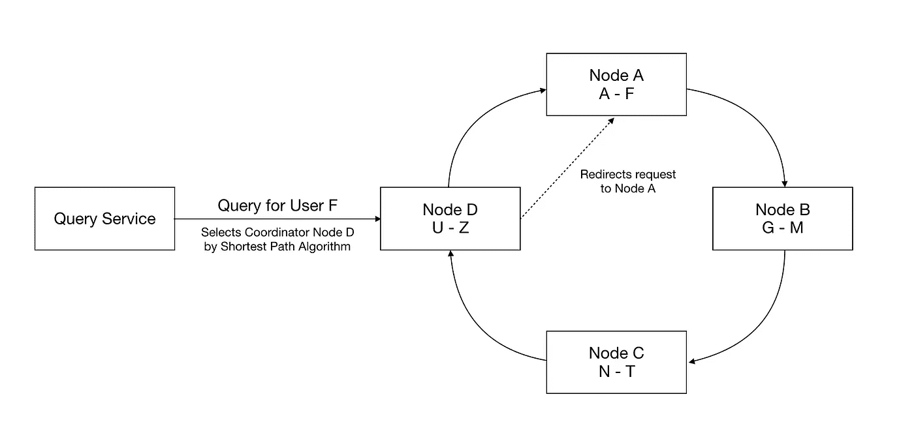

# 如何扩展 SQL 和 NoSQL 数据库

> 原文：<https://betterprogramming.pub/scaling-sql-nosql-databases-1121b24506df>

## 分布式数据库的数据库分片和管理 CAP 定理权衡

泰勒·维克在 [Unsplash](https://unsplash.com?utm_source=medium&utm_medium=referral) 上的照片

当数据量对于我们的数据库来说变得太大时，我们自然会考虑对它们进行扩展以应对增加的负载。然而，根据是 SQL 数据库还是 NoSQL 数据库，伸缩背后的技术和原理是不同的。我们将探讨这两个数据库的可伸缩性背后的主要思想。因为这篇文章假设了一些关于数据库及其属性的基础知识，所以回顾一下 [SQL/NoSQL 数据库](https://medium.com/better-programming/introduction-to-nosql-databases-7f6ed6e055c5)会很有帮助。

# 内容概述

*   垂直与水平比例
*   数据库分片
*   缩放 SQL 数据库
*   缩放 NoSQL 数据库

# 垂直与水平比例

在我们开始之前，让我们了解一下这两种缩放类型之间的区别。

## 垂直缩放

垂直扩展是通过增加硬件容量(例如 CPU、RAM)来提高服务器处理能力的过程。虽然这可能是一个合理的选择，但硬件改进有一个阈值，即当前可用的上限。此外，在某个点之后，垂直扩展变得过于昂贵，不再是可行的选择。

增加服务器的容量

## 水平缩放

另一方面，水平扩展通过增加服务器数量来实现规模。理论上，您可以扩展到拥有任意多的并行服务器，这就是为什么当数据库必须扩展时，水平扩展是首选。由于服务器是分布式的，我们获得了能够存储更多数据的好处，但是我们也继承了分布式系统的问题。我们将探讨扩展的潜在限制，以及如何解决这些限制。

向池中添加服务器

# 数据库分片

## 什么是分片？

数据库分片的概念是伸缩的关键，它适用于 SQL 和 NoSQL 数据库。顾名思义，我们将数据库分割成多个部分(碎片)。每个碎片都有一个唯一的索引，对应于它存储的数据类型。例如，如果我们选择按名称索引数据库，那么 shard A 可以存储名称以 A–F 开头的用户的数据，shard B 可以存储年龄从 G 到 M 的用户的数据，等等。当一个搜索查询进来时，数据库可以快速引用索引并快速定位我们应该查看的碎片，而不是扫描整个数据库。

按名称索引的数据库

## 分片成本

然而，需要注意的是，数据库分片是有代价的，尤其是对于 SQL 数据库。Oracle、MySQL、PostgreSQL 等单体数据库不支持自动分片，工程师必须手动编写逻辑来处理分片。通常，由于可维护性的高成本，改变模式(例如，数据库如何分片)变得具有挑战性。

# 扩展 SQL 数据库

## 集群代理

假设我们已经将分片逻辑应用于 SQL 数据库，您可能会问，查询服务如何知道与哪个分片通信来检索数据？如果你想找一个中间人，那你就找对了。一个解决方案是在查询服务和数据库前面放置一个代理，比如负载平衡器。在底层，负载平衡器依赖于 ZooKeeper 等配置服务来跟踪碎片及其索引。通过处理查询，负载平衡器将确切地知道将请求定向到哪个碎片。

查询服务如何与碎片通信的示意图

## 碎片代理

到目前为止，通过查看特定的碎片而不是扫描整个数据库，我们在加快查询速度方面做得相当不错——但是我们还可以做得更好。类似于我们之前所做的，我们可以引入另一个位于负载平衡器和碎片之间的代理，我们称之为碎片代理。如果分片足够大，我们可以再次分片代理来加速查询。这个重复分片的过程叫做*层次分片*。

除了重定向到特定的索引之外，shard 代理还可以通过缓存经常使用的数据、监控数据库健康状况、存储和发布有关数据的指标以及在请求时间过长时终止查询等操作来进一步改进查询。

位于集群代理和分片之间的分片代理

## 有效性

既然我们不再处理单一数据库，我们需要确保当一个实例关闭时数据仍然可用。在分布式系统中，确保可用性的解决方案几乎总是引入复制，这样就不会出现单一的故障瓶颈，并且会有可用的备份副本。

回到碎片，我们可以使用主从架构来确保可用性。这个想法是有一个读/写的主碎片和一个只读的从碎片，以确保真实的单一来源。每当有写操作时，它将被直接应用到主碎片，而主碎片又将把更改传播到从碎片。读取查询可以指向从碎片，以便减少主碎片上的负载。在主碎片变得不可用的情况下，碎片代理可以选择单个从碎片来替换主碎片。

复制到从属碎片

在数据中心级别，我们可以复制数据库，以确保在数据中心出现故障时有备份。

## 一致性

SQL 数据库在设计时没有考虑可伸缩性，而是考虑了 ACID 属性(原子性、一致性、隔离性和持久性)。因此，SQL 数据库的单个实例保证是一致的。然而，一旦您使用 SQL 数据库探索分布式系统并确保数据的可用性，您就必然会遇到一致性问题，这在分布式系统中是不可避免的。

一个简单的类比就是一个工厂老板在没有扩音器的情况下发布公告。如果只有几个工人，他们每个人都可以立即收到他的信息。相反，当有数千名工人时，消息可能需要一段时间才能到达后面的人，因为每个工人都必须依靠他们前面的人来传达消息。

回到主从架构，数据从主机传播到从机需要一些时间。因此，它存在于主设备和从设备可以具有不同状态的时间窗口。在扩展 SQL 数据库时，我们为了最终的一致性而牺牲了一致性。

# 缩放 NoSQL 数据库

## Cassandra 宽列数据库

与 SQL 数据库相反，NoSQL 数据库在设计时考虑了规模。因此，最终用户基本上看不到扩展过程，因为它是自动完成的。尽管如此，我们仍将探索幕后发生的事情。虽然有许多不同类型的 NoSQL 数据库和不同的扩展方式，但我将使用 Cassandra 的宽列数据库作为参考。

## 碎片/节点相等

类似于我们如何分片 SQL 数据库，NoSQL 也有对应于不同索引的数据库分片。然而，一个关键的区别是，不同于主从架构，每个碎片都是平等的。此外，由于会涉及到图的概念，我将把碎片称为向前移动的节点，因为这是一个更直观的标签。

节点能够相互通信和交换信息——如果数据不包含在自身中，它们知道特定数据存储在哪里。通常，每个节点与固定数量的节点进行通信。我认为这是为了防止 O(V)时间复杂度，其中 V 是节点的数量，并将其限制在 O(1)时间。

当一个查询进来时，一个初始的*协调器节点*在集群中被挑选出来，通过一个算法为请求提供服务。这种算法包括循环法，或最短距离(从请求到节点)。如果协调器节点没有数据，它将把请求转发给另一个有数据的节点，或者知道另一个节点有数据。

将查询重定向到包含数据的节点

例如，用户 F 的数据存储在节点 A 上。节点 D(协调节点)可以简单地与节点 A 通信，并且知道数据存储在节点 A 上。因此，节点 D 可以简单地将请求重定向到节点 A。

类似地，当一个写请求到达一个协调器节点时，它将使用 [*一致散列*](https://medium.com/better-programming/load-balancers-and-consistent-hashing-in-6-minutes-b5fc460aea4e) 来确定数据应该存储在哪个节点中。

## 八卦协议

通过节点共享信息的整个想法通常被称为八卦协议，信息在节点之间传递。术语*流行病协议*是一个替代术语，因为信息的传播方式类似于病毒在社区中的传播方式。最近的新冠肺炎·疫情应该提供一些隐喻来理解这个协议有多有效！

## 有效性

如前所述，复制数据是为了防止单点故障并保持可用性。

在 Cassandra 中，因为节点被认为是平等的，所以节点可以简单地在其他节点中复制其数据，而不是采用主从架构。正如我们已经知道的，当我们有一个分布式系统时，数据复制是异步发生的，并且需要很长时间。因此，协调器节点只需等待 *x* 个节点响应，而不是等待所有节点响应协调器节点发出复制成功的信号。这种等待 *x* 次成功写入响应以使复制成功的方法称为*法定写入*。

除了集群级别的复制，整个集群的多个副本也存储在不同的数据中心，以防止数据中心级别的单点故障。

## 一致性

在大多数 NoSQL 数据库中，可用性优先于一致性，因为它们具有基本(基本可用、软状态、最终一致)属性。换句话说，显示陈旧数据比什么都不显示要好。毕竟，正如之前在 gossip 协议中解释的那样，节点之间最终会保持一致。鉴于这些属性，要求高精度数据的金融系统应该使用 SQL 数据库，而不太“重要”的数据(如视图计数)可以依赖 NoSQL 数据库。

当读取查询发送到协调器节点时，协调器节点随后向副本节点发起并行读取请求，可能会返回不同的响应。这种差异可能是由于在复制过程中某些复制副本节点不可用，或者数据尚未传播到某些节点。正如我们有定额写入一样，我们也有*定额读取*，其中返回了 *x* 数量的节点同意的响应。

# 最后的话

希望这篇文章对不同数据库的伸缩有所启发。您现在应该明白，对于分布式数据库，您可能会牺牲某些属性来获得其他属性。数据复制几乎总是确保可用性的关键。使用异步复制，您的数据库起初不会完全一致，但最终会一致。

像往常一样，我仍然在学习这些话题。如果有什么可以解释得更好的，请随意发表评论或解释。

如果你做到了这一步，感谢你的阅读！

# 资源

*   [系统设计基础:水平与垂直缩放](https://youtu.be/xpDnVSmNFX0)
*   [系统设计面试—逐步指南](https://youtu.be/bUHFg8CZFws)