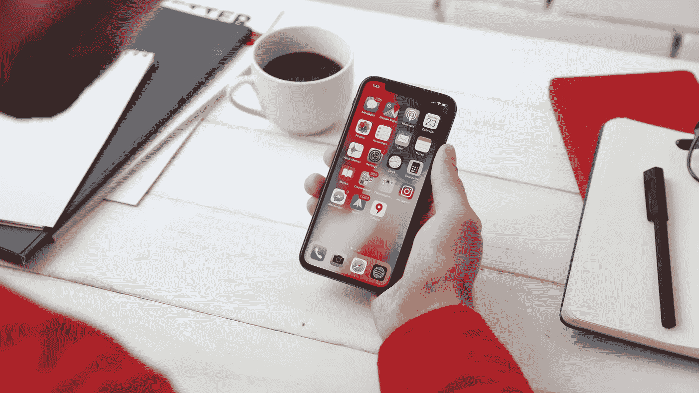

# 如何在 SwiftUI 中安排通知和添加徽章

> 原文：<https://betterprogramming.pub/scheduling-notifications-and-badges-in-swiftui-9edf8574b893>

## 使用苹果新的通知 API，并在你的应用程序图标中设置你的徽章



[尤拉鲜](https://unsplash.com/@mr_fresh?utm_source=unsplash&utm_medium=referral&utm_content=creditCopyText)在 [Unsplash](https://unsplash.com/?utm_source=unsplash&utm_medium=referral&utm_content=creditCopyText) 上拍照。

阅读完本文后，您应该能够快速地将本地通知添加到您的应用程序中。让我们对标题中的每个术语多了解一点。

# 斯威夫特伊

> “SwiftUI 是一种创新的、极其简单的方式，利用 Swift 的力量在所有苹果平台上构建用户界面。只需使用一套工具和 API，就能为任何苹果设备构建用户界面。”— [苹果官方文档](https://developer.apple.com/xcode/swiftui/)

最棒的是，您可以将视图与 UIKit、AppKit 和 WatchKit 框架中的组件集成在一起。简而言之，SwiftUI 使得构建用户界面变得简单明了。

# 本地通知

> "使用本地通知来引起用户的注意。您可以显示提醒、播放声音或标记您的应用程序图标。例如，后台应用程序可以要求系统在特定任务完成时显示警告。总是使用本地通知来传达用户想要的重要信息。
> 
> 通知的传递由系统根据您指定的时间或位置来处理。如果通知的发送发生在您的应用程序未运行或处于后台时，系统会为您与用户进行交互。如果您的应用程序在前台，系统会将通知发送到您的应用程序进行处理。“— [苹果官方文档](https://developer.apple.com/documentation/usernotifications/scheduling_a_notification_locally_from_your_app)

# 徽章

每个 iOS 应用程序都有一个`UIApplication`实例，它提供控制来管理应用程序的图标。您可以在应用程序图标的右上角添加一个数字，设置一个备用图标(更改应用程序的图标)等。

这是我们开始前需要知道的全部内容。让我们深入了解一下通知。

# 通知

要将通知推送到锁定屏幕，我们需要做两件事:

1.  请求用户允许发送通知。
2.  触发通知。

我们将从使用[用户通知](https://developer.apple.com/documentation/usernotifications)框架开始。要请求用户许可以便将通知推送到锁定屏幕，您可以简单地写:

既然我们被授权发送通知，让我们开始研究触发机制。

首先，我们将创建内容:

```
let content = UNMutableNotificationContent()
content.title = "Daily Notification"
content.body = "Daily Notification is Ready"
content.sound = UNNotificationSound.default //you can play with it
```

下一步是创建一个时间表。现在你可以每天、每周、每月或者每五分钟安排一次。所有这些参数都很容易操纵。例如:

## **当地时间每天下午 2 点推送通知**

```
var dateComponents = DateComponents()
dateComponents.hour = 11
dateComponents.minute = 59
let trigger = UNCalendarNotificationTrigger(dateMatching: dateComponents, repeats: true)
```

## **每 10 秒推送一条通知**

```
let trigger = UNTimeIntervalNotificationTrigger(timeInterval: 5, repeats: false)
```

*注意:在* `*timeInterval*` *设置为至少 60°之前，不能将重复次数设置为* `*true*` *。*

现在我们已经设置了一个时间表，我们需要设置一个请求来触发通知:

```
let request = UNNotificationRequest(identifier: UUID().uuidString, content: content, trigger: trigger)
```

最后，添加请求:

```
UNUserNotificationCenter.current().add(request)
```

需要注意的一件非常重要的事情是，如果你每次加载应用程序时都测试或执行这段代码，你将会有多个请求被添加到`UNUserNotificationCenter`。因此，您将会一次又一次地收到多个通知。为避免这种情况，在添加请求之前删除所有已计划的待处理通知请求非常重要。为此:

```
UNUserNotificationCenter.current().removeAllPendingNotificationRequests()
```

就是这样！你的应用程序有通知功能。即使你关闭应用程序，锁定手机，或者只是将应用程序移动到后台，你也会收到通知。

# 徽章号码

一旦你有通知工作，显示一个徽章号码是小菜一碟。我将假设您的应用程序用户已经授权您发送通知。这样，你就可以在你的应用程序中的任何地方添加下面一行:

```
UIApplication.shared.applicationIconBadgeNumber = badgeNumber //Integer
```

以下是干将的完整代码:

计划通知。swift

这就对了。现在，您已经安排了通知，并在应用程序图标上添加了徽章号码。

感谢阅读！