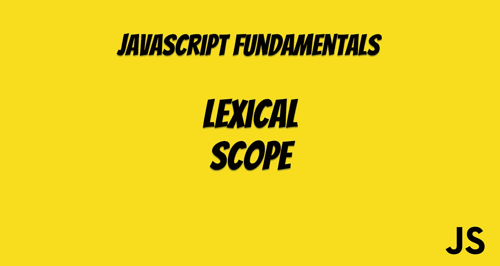

# JavaScript 作用域和闭包——看看词法作用域

> 原文：<https://betterprogramming.pub/scope-closure-lexical-scope-9a18d0579d66>

## 理解 JavaScript 基础知识

你可以回顾这篇博客来深入研究 Javascript 中的 [***作用域。你也可以阅读***](/a-look-at-javascript-scopes-acb0f5e9cd77)***[***‘看看 Javascript 闭包’***](/a-look-at-javascript-closures-6de9b9ac4f8b)博客来回顾闭包。***

变量定义是编程中最重要的基础之一。使用任何编程语言的程序员在定义变量时都不会考虑背后的机制是如何工作的。

了解这种机制的工作原理有助于开发人员改进和开发 bug 更少的程序。

为了更详细地学习如何在 JavaScript 中定义变量，第一步是掌握作用域和闭包这两个主题。让我们先看看这篇博客中的主题，然后再深入探讨作用域和闭包。

# **内嵌主题**

*   什么是词法范围？
*   块范围
*   功能范围
*   什么是吊装？
*   吊装是如何工作的？
*   遮蔽

# 词汇范围

作用域如何工作取决于何时编译。因此，为了更好地理解作用域，有必要很好地了解编译器过程。根据计算机科学中的描述，编译过程基本上分为三个不同的部分。

1.  标记化|词法
2.  从语法上分析
3.  代码生成

如果你想更深入地了解编译器进程检查:[剖析一个编译器](http://www.cs.man.ac.uk/~pjj/farrell/comp3.html)。

词法范围是在编译时决定范围创建的范围类型。它的名字来源于 Lexing，这是上面提到的编译过程的第一步。

所以词法作用域的目的是定义变量或在哪里放置块，并管理它们之间的关系。

词法范围示例

在第一个`changeValue`方法中，我们在 if 块中声明了变量值。

在正常情况下，开发人员的预期行为是不能在第二行的`if`块之外访问这个变量。

但是在编译时，它采用在词法作用域`if`块中看到的用`var`关键字定义的值变量，并在函数的顶部定义一个值变量，也就是在第 2 行。

因此，在`changeValue`函数的块级的每一行中，变量值变得可访问。在这里，移动到词法范围所做的函数的顶部被称为提升。用`var`变量创建的作用域也称为函数作用域。

被定义为第二个函数的`changeValue2`函数的唯一区别是，值变量是用`let`关键字定义的，而不是用`var`关键字定义的。用 let 定义值时出现的作用域称为**块作用域。**

# 遮蔽

一个作用域不能包含两个或更多具有相同变量名的值，一个变量只能包含一个值。但是同一个变量名在不同的范围内可以保存不同的值。

变量隐藏是指创建一个与不同范围内的变量同名的变量。和上面的例子一样，第一行中定义的`name`变量在`sayMyName`函数中被重新定义，以同样的方式，一个名为`name`的变量。让我们看看词法范围的行为，以便更深入地理解这个问题。

1.  将写在第一行的`name`变量赋给范围 A
2.  将第 3 行函数参数中的变量名赋给范围 B
3.  第 4 行和第 5 行的命名操作是在作用域 b 中执行的。

从上面的操作可以看出，作用域 A 包括作用域 B，按照 JavaScript 的术语，作用域 A 是外作用域，作用域 B 是内作用域。

第 8 行调用函数时，写入控制台的名字是`Caner Karaman`。控制台日志写在第 9 行的返回值是`Hasan`。那叫遮蔽，是词法作用域的行为。如果内部作用域中有操作，它不会在该作用域中执行该操作，而是将它移到外部作用域中。