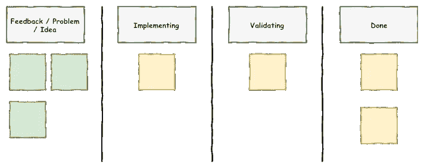

# Scrum vs. Kanban 以及如何停止争论

> 原文：<https://betterprogramming.pub/scrum-vs-kanban-it-doesnt-matter-68eb9040edf3>

## 真正的敏捷性来自于倾听客户的意见，并通过实验来找到产品与市场的契合度

在 [Unsplash](https://unsplash.com?utm_source=medium&utm_medium=referral) 上[空中聚焦](https://unsplash.com/@airfocus?utm_source=medium&utm_medium=referral)拍摄的照片

让我们从描绘场景开始。这是开发团队的回顾会，团队成员疯狂地在便利贴上写下他们的贡献，主题是熟悉的“疯狂、悲伤和高兴”或“保持、改进、停止、开始”等。我们都经历过，对吧？

一旦随意涂写的时间结束，回顾主持人就有了将笔记按主题分组的任务。然后，团队通常会就他们希望在会议的剩余时间里更深入讨论的特定主题进行投票。

这是许多敏捷回顾会议的常见形式。如果这听起来太熟悉了，你想稍微充实一下，我邀请你去读读[趣味回顾](http://www.funretrospectives.com)——当然是在读完之后！

在我过去三年工作过的每一个团队中，我可以坦率地说，至少有一个，甚至更多的会议像我描述的那样，出现了“我们应该做 Scrum 还是看板”的问题。接下来通常是长时间的争论，很少能达成共识。这是我试图避免的争论，我已经足够老了，也足够傻了，知道这两个过程在软件开发中都有作用。两者都为不同的人提供不同的东西，并且都可以应用于项目生命周期的不同阶段。

# 那么，为什么这种对话会不断发生呢？

反思为什么这种对话会反复出现，让我对根本原因一无所知。然而，我认为可能有多种因素在起作用，我现在将讨论这些因素。

**项目年龄:**我已经参与了按照常规发布周期运行了多年的项目，也就是所谓的 Scrum 风格。除此之外，我还参与过处于发布特设阶段的项目——看板。双方已经就哪种方法更合适进行了多次辩论。所以在我看来，项目的年龄并没有真正进入其中。然而，正如您将看到的那样，有时一个过程比另一个过程更适合。

团队组成:我见过经验丰富的工程师团队和经验水平参差不齐的团队争论 Scrum 和看板。最近，我加入了一个新成立的团队，这个团队主要由年轻的工程师组成，他们正在探索哪种流程适合他们。我发现通常是开发人员/工程师对这个话题最感兴趣。偶尔会有不同角色的人参与进来。但更多的时候，这是开发商强加的问题。

那么为什么开发者对这个问题的感受如此强烈呢？我的一个朋友最近注意到，Scrum，以其限时交付和与敏捷方法的紧密联系，可以(错误地)用来给开发团队施加压力——本质上，让他们对他们的交付速度感到自我意识，并把焦点放在工程上。这会导致一种错误或被监视的感觉。因此，创造力和质量开始取代速度下滑。你*能*两者兼得吗。

**团队领导:**根据我朋友对压力的观察，我觉得我们可以在这里找到一些答案。团队的领导(我指的是负责设置优先级的角色)往往对所使用的过程有更大的影响。在我之前的工作中，有两个分析师和一个项目经理。这些都是团队中的资深成员，具有很大的影响力。工程师们经常没有勇气去反对他们，或者不愿意被打扰？该团队最终被强制使用 Scrum，尽管工程师们围着咖啡机抱怨他们更喜欢使用看板。

我也是一个团队的成员，这个团队的领导层包括技术主管、项目经理和产品经理。我们使用 Scrum 没有任何内部冲突。我相信这是由于每个人都相信的共同使命，这意味着交付过程退居二线。每个人都想交付持续的客户价值，并且有比争论过程更紧迫的问题要解决。

**组织文化和报告关系:**沿着领导线索往上走，你开始看到谁是开发团队的关键影响者。这些是项目涉众——输出报告接收端的涉众。通常，这些是中层管理类型，他们在职业生涯的某个阶段在采煤工作面做技术工作，但很久以前就已经毕业于电子表格、路线图、幻灯片和图表的世界——就像我曾经做过的那样。

这些人在很大程度上间接影响了工程团队。我指的是交付/项目经理、规划者、产品经理、工程主管，甚至可能是你的 CTO。这些角色在软件交付*中扮演着不可或缺的角色，而不是在开发*中。我在这里说的是经验之谈，所以请多包涵。

## 我的理论是 SCRUM 给这些涉众提供了一种安全感

Scrum 易于理解，提供了一定程度的可预测性，并且可以很容易地翻译给高层人员或开发团队之外的人员。

以下面的概念为例:每隔几周向一个有保证的交付目标冲刺。跟踪工作交付的燃尽图。任何人都可以参加的每日站立会议，以及诸如计划和回顾性反思之类的仪式——有什么不喜欢的呢？这是一个简单的销售，听起来像是可以很容易地应用到生产结果。从表面上看，它与大多数人默认的命令控制型领导的旧理念松散地结合在一起。

相比之下，看板显得更加不可控和不可预测。没有冲刺——当有能力的时候，你就把工作拉进来，经常让团队成员有空闲时间去帮助别人、整理或学习新东西。您*限制正在进行的工作*以在您的开发管道中创建流程。尽可能消除浪费。没有强调评估或故事点的工作。使用周期时间([天，不是虚构的数字](https://medium.com/@devdoneuk/your-story-points-are-b7396757f1d7))追溯跟踪工作，并且小批量交付。

最终，没有每隔几周就大张旗鼓地发布一个新版本——没有营销时刻。发布在需要的时候发生。这为工程师提供了更大程度的灵活性，因为他们不会急于达到 sprint 目标，也不会在 sprint 结束前感到发布的压力——这意味着工作可以在准备好的时候发布。

# 其他促成因素

从字里行间可以看出，Scrum 不仅提供了安全，还提供了控制。有足够的时间谨慎行事，以避免潜在的草率决定，因为通常工作会在其生命周期的一英寸内进行规划。

在发布之前，在预生产环境中，在完成的工作等待之前，积压工作将被构建、改进和删除。这提供了充分的机会，以绝对肯定的工作是高质量的，不构成任何风险的客户或品牌。发布前的停顿是一张安全网，人们不愿冒险，蜂拥而至。

虽然您可能会有看板系统的变更积压，但是这些变更往往会在准备好的时候发布。如果做得正确，每天都应该有一个稳定的小变化流进入生产，并不断关注高价值项目的优先级。

如果 bug 进入生产阶段，团队应该停下来，在发布更多变更之前优先解决问题。众所周知，脸书遵循“下一个版本将修复这个错误”的口头禅这强调了速度和质量——代价是风险略有增加。这可能不会让利益相关者满意，他们觉得任何生产问题都有损害品牌的风险。

品牌化:当谈到 Scrum 时，我觉得人们变得有偏见，因为他们喜欢品牌化。试想一下，如果你不是经验丰富的软件工匠，而某个顾问说:

> “我们需要放慢速度，以便通过限制我们正在进行的工作来加快速度”

你的反应会是什么？我不骗你——我曾经被一位首席执行官嘲笑过这种逻辑。

另一方面，如果我们的顾问声称，通过在 Scrum 大师的专业指导下进行精心计划的冲刺，我们可以每两周可靠地发货，这听起来是不是比这些慢速教练看板倡导者更有吸引力？想想我之前提到的强制交付的心态，很容易理解为什么这种推销听起来很有吸引力。

**项目适合度**:经验也告诉我，有些情况下 SCRUM 可能比看板更适合你的需求。

我发现，当一个产品处于婴儿期时，冲刺或计时工作的概念非常合适。在构建新产品时，快速收集反馈并展示进展是很重要的，因此在早期阶段冲刺可以让团队在与利益相关者进行评审之前交付足够的成果——本质上，这是在最需要度量进展的时候。也就是说，看板在这里也工作得很好，但是如果没有像冲刺这样的强制功能，团队就只能随波逐流了。

发布后的 Scrum 往往会导致许多变更一次批量发布。如果你的团队每个月出货一两次，那可能会有很大的变化。这可能被认为是有风险的，无论是从所有工作的变化来看，还是从你的客户实际上欣赏他们心爱产品的大量变化来看。在我看来，变化应该被忽视。

与此相反，我曾在每两周发布一批变更的团队中工作得非常好。这个行业的每个人都在两周一次的展示、讲述、回顾，然后计划。主要的区别是我们有共同的目标和对我们交付的工作的热情。团队中的每个人都使用了该产品，领导也很鼓舞人心——这种组合很难找到！

您的交付过程决策中的另一个因素可能是您的基础设施。每周或每天部署多个版本可能不可行。因此，较慢的交付频率可能在您的团队中工作得很好。您的部署可能需要一些手动干预。您可能需要一个操作团队来部署您的更改，因此将它们分批进行是有意义的。

在之前的角色中，我们有维护窗口的概念，即通知客户在此时间段内可能会出现问题。我也见过在无人使用系统的几小时之外大批量发布的更改。同样，这里的权衡是部署可能影响业务功能的业务风险。这是 Scrum 工作得很好的地方。

我发现，当已经有一个既定的产品，团队已经切换到实验模式，尝试改变，看看什么给客户增加价值时，看板往往工作得最好——当没有任何硬性的截止日期，积压的工作主要是充满想法和支持票。这是每个开发任务可以被拉入、交付，然后被单独验证的地方。这个阶段通常跟在一个主要的发布版本之后，在这个版本中，产品的增量被添加。没有大爆炸的发布计划，客户将不得不努力寻找注意到正在进行的增量变化。

发布前，看板也可以工作。它确保工程师有时间和空间来完成任务，并决定某个特定的设计是否能在生产中存活下来。然而，在预发布阶段，衡量进度和按时完成工作的需求是最高的，这种需求压倒了不可预测性。我觉得正是这种需求驱使很多团队在项目的初期采用 Scrum，因为它关注团队交付。

# 那么，如果我发现自己陷入了 Scrum 或看板的争论，我该怎么办呢？

引用 Rock 的话:“团队使用 Scrum 还是看板作为项目交付的框架并不重要。”(我敢肯定他在《SmackDown》或《RAW》上至少说过一次？)

重要的是团队及时地向他们的客户交付有价值的工作。怎么做并不重要。

正如我在其他文章中讨论的，在开发团队之外，这些决策对客户几乎没有影响。这就是为什么我赞同顾客至上的亚马逊原则。团队所做的一切都应该让客户受益。我觉得开发团队经常看不到他们的客户，因为他们被业务分析师和产品所有者等角色所抽象。取代顾客的位置。

团队可能会陷入这样的思维陷阱:仅仅因为他们提供的是内部 API，他们就没有客户——这是错误的！你的同事变成了你的顾客。这些 API 虽然不是面向公众的，但在设计时应该考虑到外部化。为什么要给同事提供蹩脚的服务，给客户提供更好的服务？把一切都变得棒极了，对吧？

如果产品面向公众，让顾客参与到每一个决策或实验中来。确保整个团队与客户交流，无论是通过反馈会议、UX 研究，还是至少通过调查。

我觉得这里有一点很关键——我觉得说出来很老套——那就是:这些争论经常发生在声称自己是敏捷的团队和组织中。但是，如果团队在争论使用哪个过程来管理和跟踪工作，你就违背了敏捷的首要原则，即…

> "人和交互胜过过程和工具."

当然，如果你是一个敏捷的组织或团队。你不应该有这些对话。进入团队的工作应该源于客户协作。你应该经常与你的客户联系，定期演示你的工作软件。团队如何跟踪这项工作不值得仔细研究。不应该有几周的冲刺计划和里程碑。你应该对顾客的需求做出回应。

Scrum 和看板是过程。真正的敏捷性来自于倾听客户的意见，并进行实验来发现产品与市场的契合度——而不是每两周进行一次三小时的规划会议和回顾。

有一天，我想看到一面由下列柱子组成的作品墙:

我并不是建议我们明天走进办公室，愤怒地撕掉墙上所有的便利贴——而是建议我们应该努力将我们的注意力从这些内部争论中转移出来，将精力转向我们客户的需求。

让整个团队与客户对话，而不仅仅是 UX 团队。产品负责人可以通过观察客户与他们正在构建的产品的互动，在他们的思维中产生真正的突破——所以试着多做这些，少为过程争吵！

*我很感激这些非常简短的概述和非常个人化的我的经历——更多信息请见:*

*   [争抢](https://www.scrum.org/resources/what-is-scrum)
*   [什么是看板](https://www.atlassian.com/agile/kanban)？