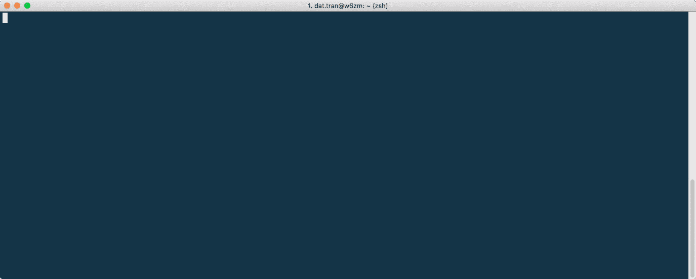
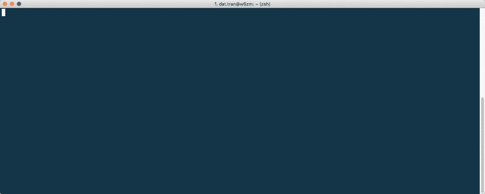
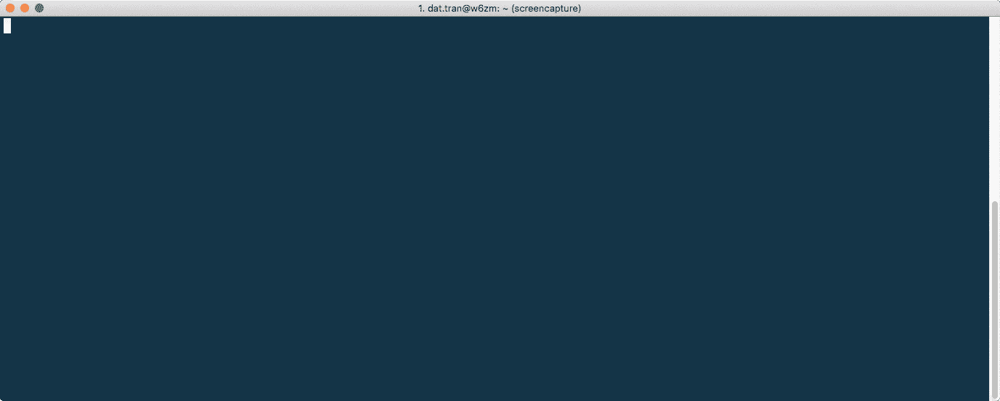

# 秘密管理很糟糕，使用一些标准操作程序！

> 原文：<https://betterprogramming.pub/secrets-management-stinks-use-some-sops-43a92b7b8d54>

## 通过使用 GPG 在 YAML 使用 sop 加密/解密凭证


伊利斯·圣克莱尔在 [Unsplash](https://unsplash.com/search/photos/vista?utm_source=unsplash&utm_medium=referral&utm_content=creditCopyText) 上拍摄的照片

# 动机

假设您正在进行一个软件项目，需要处理凭证。例如:

*   您需要从应用程序中访问数据库
*   您需要向 AWS 或 Google Cloud 等云服务提供凭证
*   您需要将凭证传递给 CI/CD 工具来构建您的应用程序

凭证很重要的例子还有很多。通常，您会将凭证存储在 YAML 或 JSON 文件中，然后将其放入项目文件夹中。

## 项目结构

```
.
├── src/
│   └── ...
├── app.py
├── credentials.yml
├── ...
```

我经常看到的一个不好的做法是，用明文凭证对项目进行版本控制。因此，有权访问项目存储库的每个人都能够查看凭证。通常，您只希望参与项目的人员能够访问。这篇文章强调了我们如何使用[秘密操作或者短 sops](https://github.com/mozilla/sops) 和 [GPG](https://en.wikipedia.org/wiki/GNU_Privacy_Guard) 来解决这个问题。

# SOPS ftw

我最近发现 sop 可以使用在 [AWS KMS](https://aws.amazon.com/kms/) 、 [GCP KMS](https://cloud.google.com/kms/) 、 [Azure Key Vault](https://docs.microsoft.com/en-us/azure/key-vault/) 或 [PGP](https://en.wikipedia.org/wiki/Pretty_Good_Privacy) 中生成的加密密钥来加密/解密 YAML、JSON 和二进制格式的文件(我们实际上为此使用了 [GPG](https://en.wikipedia.org/wiki/GNU_Privacy_Guard) )。在 Python 的 Go 中已经重写了。Python 分支依然存在，并被积极维护；但是，我们推荐 Go 版本。

使用 brew 在 Mac 上安装 sop(确保你已经预装了 Go 和 GPG)。

```
brew install sops
```

接下来，用 GPG 生成一个加密密钥。



您将能够看到密钥是否创建正确。



使用创建的加密密钥的指纹来生成加密的 YAML 文件。



在项目文件夹中使用 sop 创建 YAML 文件。


最后，创建了 YAML 文件。您应该能够看到文件被正确加密(例如，使用 Vim 而不进行任何解密)。

重复这些步骤来解密文件。


您还可以导出加密密钥供其他团队成员导入。

```
# export encryption key / get fingerprint via 'gpg --fingerprint'
gpg --export-secret-keys --armor 'fingerprint' > private.rsa# import encryption key
gpg --import private.rsa
```

# 加密快乐！