# 使用 Auth0 设置 Dgraph 以保护您的 GraphQL 端点

> 原文：<https://betterprogramming.pub/securing-your-graphql-endpoint-with-dgraph-and-auth0-4b5b3b837bae>

## 第三部分:新娘

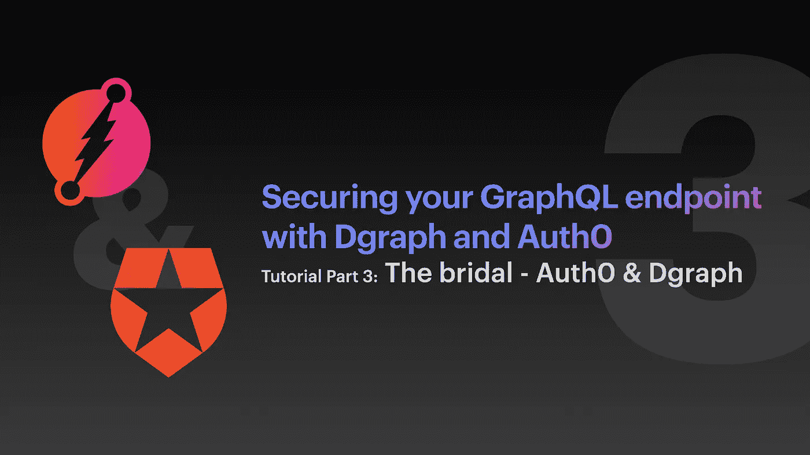

> *这是本系列的第三篇文章，解释了如何为我们的演示项目用 Auth0 设置 Dgraph。如果你既没有设置 Dgraph 也没有设置 Auth0，你可能想要阅读本系列的* [*Part 1*](https://medium.com/@flo_80930/securing-your-graphql-endpoint-with-dgraph-and-auth0-eb94b935f795) *和/或*[*Part 2*](https://medium.com/@flo_80930/securing-your-graphql-endpoint-with-dgraph-and-auth0-1bf9acedc0c8)*。但是，如果您只对 GraphQL 端点的适当保护感兴趣，您可以安全地跳过这一部分。*

# 介绍

在本系列的最后两部分中，我们为报价演示应用程序设置了云 API (Dgraph)和身份验证服务(Auth0)。尽管我们有一个 auth 服务，但是我们的 GraphQL 端点仍然没有得到保护，因为 Dgraph 还不知道任何关于 Auth0 的信息。在这些服务之间建立连接是本文的目标。

# 概述

到目前为止，我们已经创建了一个 Dgraph 帐户，并为我们的报价应用程序设置了模式，如下所示

```
// Quote
type Quote {
 id: ID!
 text: String!
 author: Author!
}// Author
type Author {
 id: ID!
 name: String!
}
```

我们还创建了一个 Auth0 帐户并设置了一个

*   报价申请
*   用户 admin@quoteapp.com

因为 Dgraph 需要知道我们想要通过 Auth0 保护我们的 GraphQL 端点，所以我们需要将我们的应用程序密钥(用于对我们将从 Auth0 获得的所有 JWT 令牌进行签名的密钥)分配给我们的模式。

## 从报价应用程序的歌唱证书构建验证密钥

让我们登录到我们的 Auth0 仪表板，操纵到`Applications > Quote App`并一直向下滚动到高级设置。打开下拉菜单，选择证书选项卡，单击下载证书并选择 PEM。


将签名证书下载为 PEM 文件。

现在，您的下载文件夹中应该已经有了带有`*.pem`的文件。[隐私增强邮件](https://en.wikipedia.org/wiki/Privacy-enhanced_Electronic_Mail)文件包含我们在下一步需要提取的公钥。我正在使用 MacOS(对于 Linux 系统，以下是相同的)——对于 Windows 可能有不同的命令。

打开控制台，导航到包含 PEM 文件的下载文件夹。进入

```
openssl x509 -pubkey -noout -in <your-file-name>.pem | awk '{printf "%s\\n", $0}'
```

并将结果字符串复制到最后的`\n%`。

> *注意字符串中的* `*\n*` *！它们很重要，因为 Dgraph 在其 JSON 数据包中请求单个字符串。*

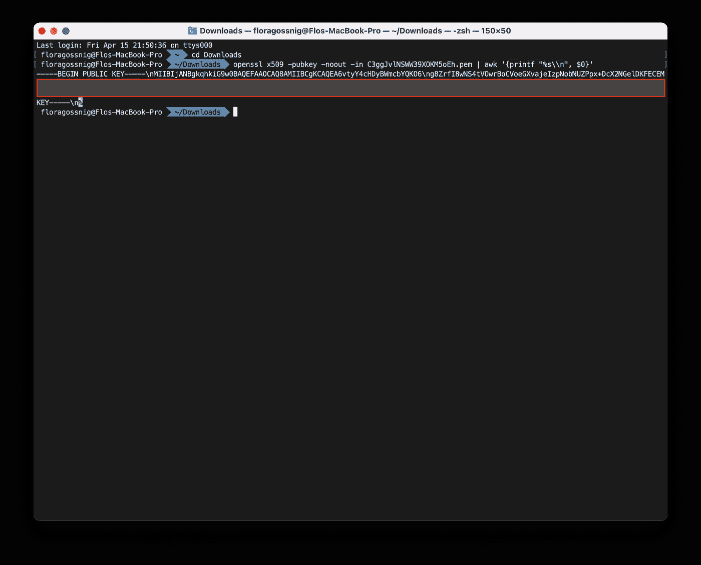

通过控制台从 PEM 文件获取公钥。

## 将 Auth0 公钥应用于数据图授权报头

我们快完成了！

在下一步中，我们必须设置我们的 Dgraph Authorisation 头，它将被附加到我们发送到我们的 GraphQL 端点的每个请求中。标题必须包含以下内容

*   验证密钥→这是我们刚刚创建的公钥
*   Header →这个可以是你想要的任何东西。对于我们的应用程序，让我们将其设置为`Quote-Auth`
*   名称空间→对于所有特定于 Dgraph 的请求，这可以是任何东西，所以让我们将它设置为`[https://quote-app-claims](https://quote-app-claims)`(只是确保您在这里有一个有效的 URL！)
*   Algo →用来签署密钥的算法。因为我们使用的是公钥，所以它被设置为`RS256`。
*   观众→这其实是一个观众数组。目前，这是我们的报价应用程序客户端 ID，稍后，当我们进行*机器对机器呼叫*时，我们将在此添加额外的受众。

那我们现在怎么把这些东西放进 Dgraph 呢？Dgraph 让我们变得非常简单。Dgraph 接受以下形式的简单字符串

```
# Dgraph.Authorization {"VerificationKey":"<AUTH0-PUBLIC-KEY>","Header":"Quote-Auth","Namespace":"https://quote-app-claims","Algo":"RS256","Audience":["<AUTH0-QUOTE-APP-CLIENT-ID>"]}
```

我们只需要将这个字符串添加到模式的底部。因此，登录到您的 Dgraph 仪表板，点击`Schema`并复制&粘贴字符串。

> 不要忘记用你的钥匙/ID 替换`<AUTH0-PUBLIC-KEY>`和`<AUTH0-QUOTE-APP-CLIENT-ID>`。


将授权字符串添加到 Dgraph 模式的底部。

报价应用客户 ID 可在您的 Auth0 控制面板中的`Applications > Quote App`下找到

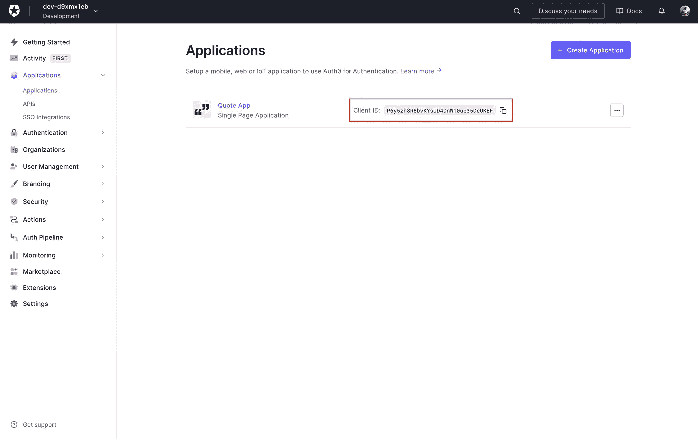

您需要报价应用程序客户 ID 作为您的 Dgraph 授权字符串中的受众字段。

部署模式，我们就完成了！

## 测试端点保护

你可能会问自己，我们现在有什么样的保护？嗯，目前什么都没有…我们所有的节点都是可公开查询的，没有真正的保护到位。为了看到我们实现的效果，我们必须从外部源查询我们的端点。

出于这个原因，我个人使用了 Altair GraphQL 客户端(它也是免费的🙌)但是您也可以使用 [Postman](https://www.postman.com) 或任何您喜欢的工具来模拟对您的端点的 GraphQL 请求。

首先，让我们查询已经存储在数据库中的内容。如果您正在阅读本系列的第 1 部分，那么您的数据库中应该已经存储了报价和作者。我们首先必须输入我们的 GraphQL 端点(在您的 Dgraph 仪表板的 Overview 选项卡上提供)并运行自检。Altair 现在将从 Dgraph 中获取您的模式以及向您的端点发送请求所需的所有信息。然后，我们可以在查询字段中输入报价查询

```
query QueryQuotes {
  queryQuote {
    id
    text
    author {
      name
    }
  }
}
```


Altair 是一个非常易于使用的测试 GraphQL 端点的工具。输入端点的 URL 并点击 reload 按钮来运行模式自检。

在结果窗口中，您应该会看到我们添加的第一个报价，包括作者。让我们从我们的 GraphQL 客户端添加第二个引用:

> 没有需求或设计，编程就是给一个空文本文件添加 bug 的艺术。—路易·斯利格雷

那么突变就是:

```
mutation AddQuoteWithAuthor {
  addQuote(
    input: {
      text: "Without requirements or design, programming is the art of adding bugs to an empty text file."
      author: {
        name: "Louis Srygley"
      }
    }
  ) {
    numUids
  }
}
```

因此，将这个变异添加到 GraphQL 客户端的查询字段中，并运行这个变异。如果一切顺利，您应该在响应对象的数据部分看到一个`numUids: 2`。

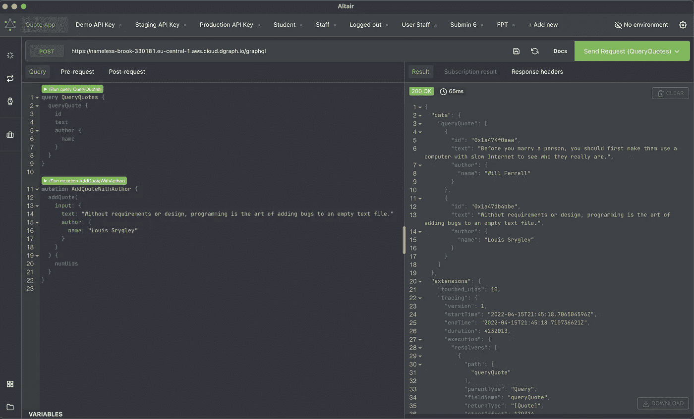

运行变异应该在响应对象中产生 numUids: 2。

如果重新运行报价查询，我们现在应该会看到两个报价:


现在我们的数据库中应该有两个报价。

到目前为止一切顺利。因此，目前每个人都可以查询报价，也可以向我们的应用程序添加报价！这实际上是不可接受的——我们最终可能会在应用程序中看到我们不希望看到的引用。我们希望我们的应用程序用户查询报价，但只有管理员应该有权实际添加报价。

幸运的是，通过使用 Dgraph 内置的 [@auth 指令](https://dgraph.io/docs/graphql/authorization/directive/)，Dgraph 让这一切变得非常简单。因此，我们转到`Schema`选项卡中的 Dgraph 仪表板，将以下几行添加到我们的报价类型中

```
type Quote [@auth](http://twitter.com/auth)(
  add: { rule:  "{$isAdmin: { eq: \"true\" } }"}
  update: { rule:  "{$isAdmin: { eq: \"true\" } }"}
  delete: { rule:  "{$isAdmin: { eq: \"true\" } }"}
)
{
  id: ID!
  text: String!
  author: Author!
}
```

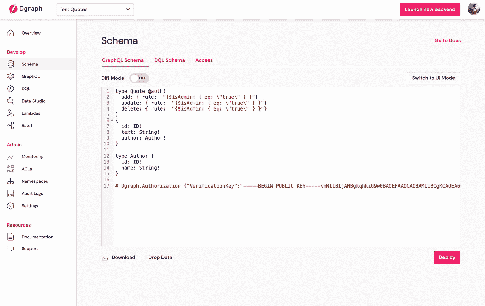

这意味着只有令牌声明中包含字段`isAdmin: “true”`的用户才能在我们的报价应用程序中添加、更新或删除报价。部署模式后，尝试重新运行`AddQuoteWithAuthor`变异——您应该在结果对象的数据体中看到`addQuote: null`。


太好了！然而，用户仍然可以通过添加作者来扰乱您的数据库。因为我们真的不想在没有引用的情况下添加作者，我们可以简单地停用所有公共访问并删除查询。

再次回到您的 Dgraph 仪表板，将它添加到 GraphQL Schema 选项卡中的 Author 类型，并添加`@generate`指令:

```
type Author 
[@generate](http://twitter.com/generate)(
  query: { query: false, get: false, aggregate: false }
  mutation: { add: false, update: false, delete: true }
)
[@auth](http://twitter.com/auth) (
  delete: { rule:  "{$isAdmin: { eq: \"true\" } }"}
)
{
  id: ID!
  name: String!
}
```

因为我们离开了`delete: true`(如果作者的所有引用都被删除，我们仍然希望能够删除作者)，我们还向作者类型添加了另一个`@auth`规则。

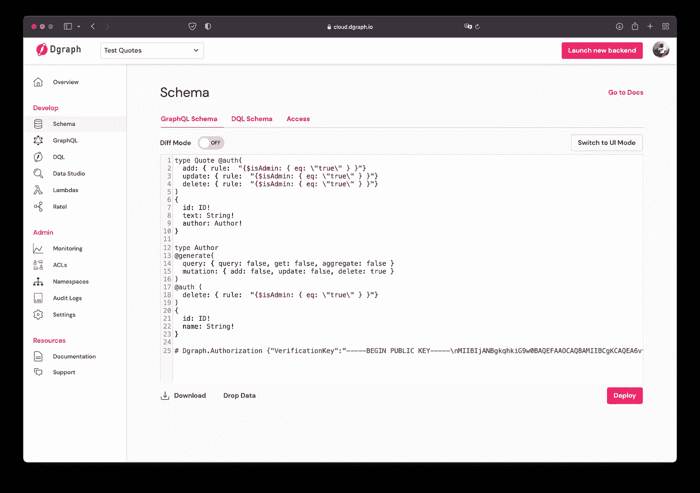

删除不必要的查询和变异，并添加一个@auth 规则来保护节点。

此外，移动到`Access > Edit Permissions`并删除作者类型的读写权限。

杰拉特。如果您正在阅读本系列的第 2 部分，那么您已经在 Auth0 仪表板中创建了一个 admin 用户。我们现在需要创建用户声明，该声明需要为通过 Auth0 登录到我们的应用程序的用户包含字段`isAdmin: “true"`。

因此，打开你的 Auth0 仪表盘，进入`User Management > Users`，选择你想在报价应用中使用的管理员用户(对我来说是 admin@quoteapp.com)。向下滚动到`Metadata`部分并输入

```
{
 "isAdmin": "true"
}
```


将应该出现在声明中的字段添加到用户的元数据中。

> 注意`isAdmin`标注为字符串。这是因为 Dgraph 只能验证令牌声明中字段的字符串。

接下来，转到`Actions > Flows`并选择一个登录流程。单击“添加操作”旁边的➕图标，然后选择“构建自定义”。

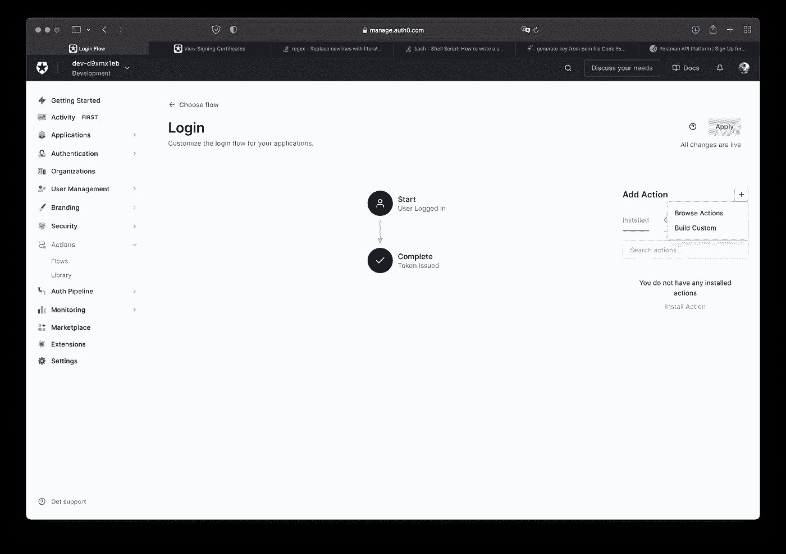

构建登录后流程，向您的 JWT 添加自定义声明。

给你的动作起一个吸引人的名字——我已经使用了`Create User Claim`并点击创建。

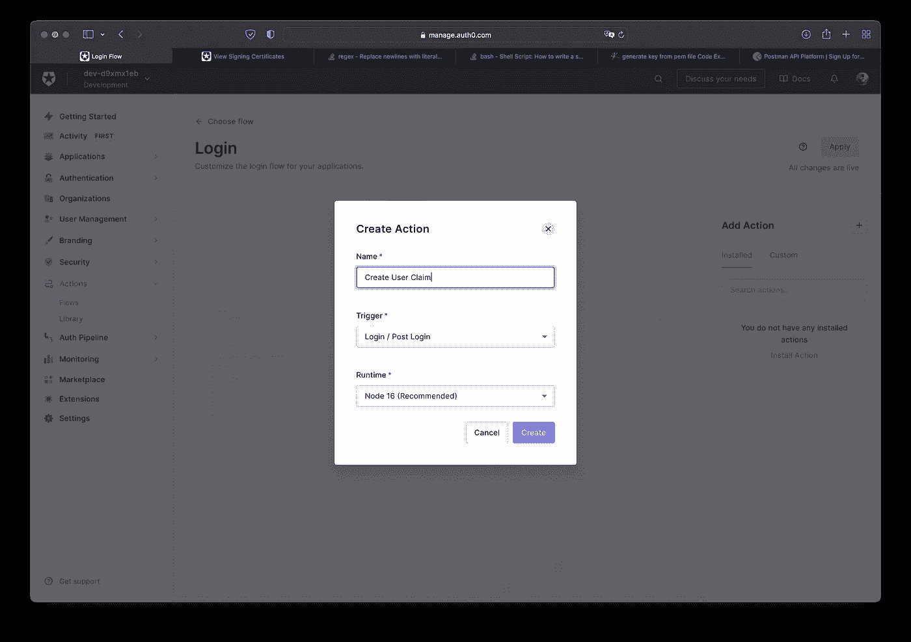

为您的登录流操作选择一个名称。

我们现在需要告诉 Auth0，一旦用户成功登录，就将用户的元数据作为自定义声明添加到我们的 JWT 中。您可以做很多事情，但是现在添加这些行就可以完成工作了

```
// refactoring
const appMeta = event.user.app_metadata;// set custom claim
api.idToken.setCustomClaim("https://quote-app-claims", {
  "isAdmin": appMeta.isAdmin
});
```

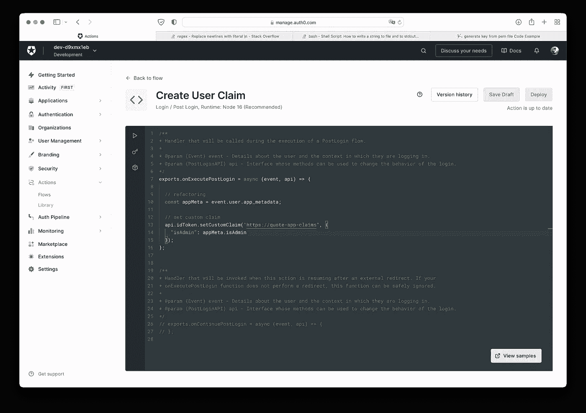

将 isAdmin 字段添加到自定义声明中。

部署您的行动，点击左上角的 Back to flow，在`Custom`选项卡下找到您的自定义行动，只需在开始和完成之间拖动&放下行动。点击应用，你就完成了！👌


将您的自定义操作挂接到登录流中。

让我们测试一下我们在这里创建了什么。在本系列的第 2 部分中，我创建了一个 CodeSandbox 例子来测试我们的 Auth0 设置。我们现在想扩展这个例子，在登录后提取我们的原始 JWT 令牌，并检查我们的自定义声明是否设置正确。

> 这里有一个我的 [CodeSandox](https://codesandbox.io/s/headless-browser-diuudf?file=/src/App.js) 例子的链接——可以随意使用它作为开始！

Auth0 SDK 提供了一个简洁的小特性，可以让你提取原始的 JWT——`getIdTokenClaims`方法。一旦我们成功登录到我们的应用程序，我们就可以复制我们的 JWT，并在例如 [jwt.io](https://jwt.io) 检查里面有什么。

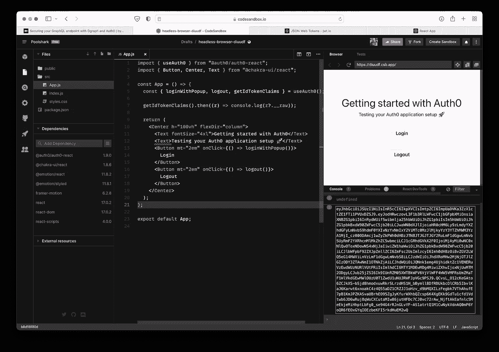

从控制台复制 JWT。


将 JWT 粘贴到“编码”字段。您应该会立即看到带有 isAdmin 字段的自定义声明。

为了看看我们的新令牌是否真的能工作，我们现在想用它对我们的 Dgraph GraphQL 端点发出请求。

因此，复制 JWT，打开你的 GraphQL 客户端(对我来说是 Altair)，点击标题图标，添加带有 JWT 值的`Quote-Auth`标题。

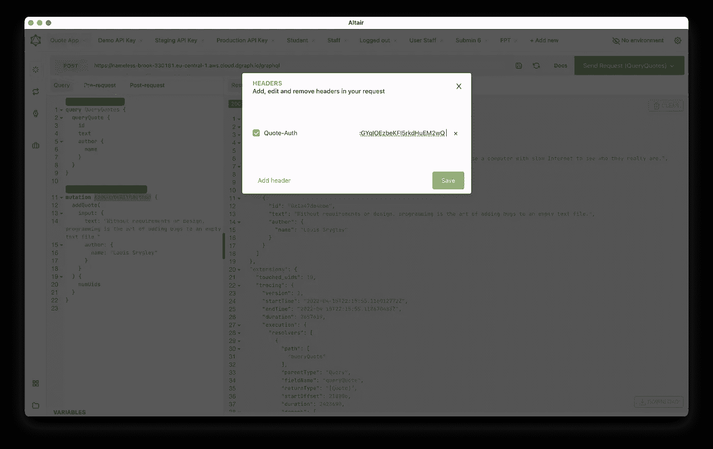

在您的 GraphQL 客户端中设置“Quote-Auth”头。

有了这个设置，您可以重新运行变异(让我们添加第三个引用)并查看它是否全部工作。

```
mutation AddQuoteWithAuthor {
  addQuote(
    input: {
      text: "There are two ways to write error-free programs; only the third one works."
      author: {
        name: "Alan J. Perlis"
      }
    }
  ) {
    numUids
  }
}
```

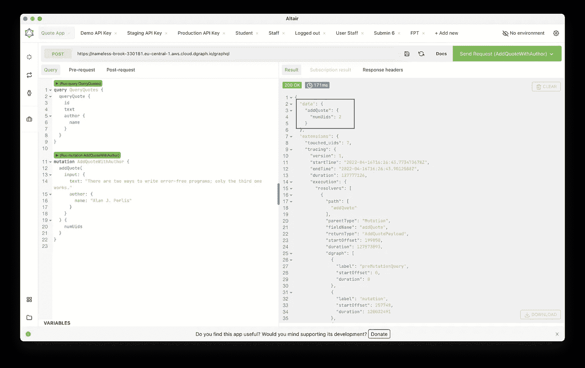

您的端点现在受到保护，不会受到来自公众的突变👌

快乐的日子！您的端点现在受到保护，不会受到公共用户的攻击。未经授权的用户仍然有权查询您的报价，包括相应的作者，但不能添加、更新或删除报价或作者。

感谢阅读。