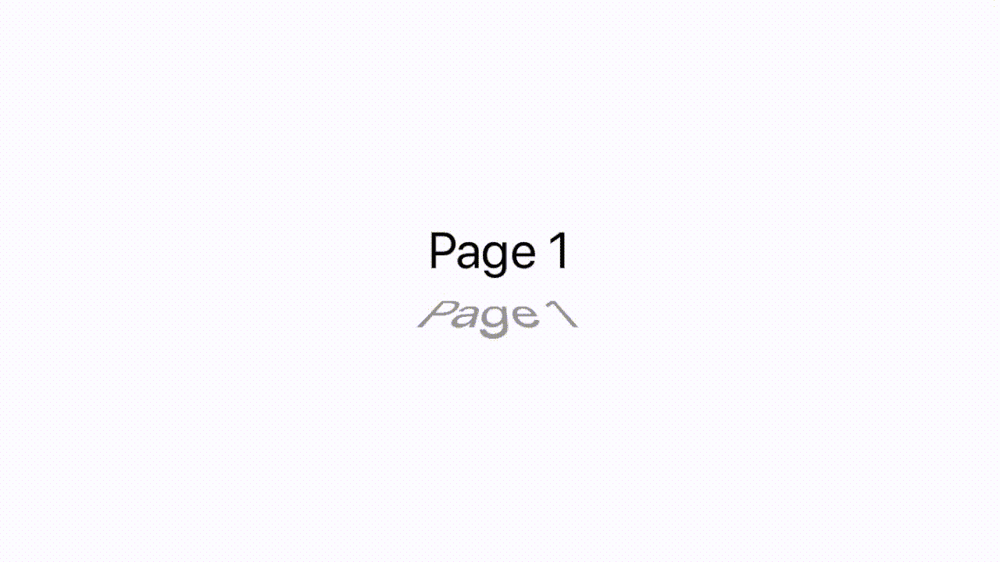

# SwiftUI 的 Segue 恶作剧

> 原文：<https://betterprogramming.pub/segue-shenanigans-with-swiftui-237f73370f51>

## 使用 SwiftUI 和 Combine 更改视图的不同方式


[Shashank Sahay](https://unsplash.com/@shashanksahay?utm_source=medium&utm_medium=referral) 在 [Unsplash](https://unsplash.com?utm_source=medium&utm_medium=referral) 上拍摄的照片。

很多关于 SwiftUI 开发的文章都在探索动画、转换等等，但是很少有文章涉及到当你需要一个新的视图时该怎么做。有了 UIKit，我们有了那些忠实的 segues 和许多友好的方法，比如`prepareForSegue`、`unwindToThisViewController`等等。

但那是过去，这是现在。

我想把这篇文章的重点放在技术上可行和商业上可接受的东西上。你肯定能理解这两种状态有时不会在中间相遇。

SwiftUI 重写了 segues 的规则书。让我们浏览一下 Swift 1.0 中的一些选项。

# 选项 1

这是经典的`if`子句改变了一个`@State`变量。你肯定已经用过这个了。当声明的状态变量改变时，SwiftUI 重新加载它的 UI。你可以用经典的`if`语句来控制窗口——这是一个简单的方法:

事实上，它是任何/所有 segues 现在在 SwiftUI 中工作的基础，状态发生了变化。但是改变状态变量对于它们所在的当前结构来说是局部的。状态变量类似于私有局部变量。

你可以在其他地方用`Binding`来引用它们，但这是技术上可行和商业上可接受之间差异的一个很好的例子。尝试用`Bindings`引用半打变量，你的代码将很快变得不可读。幸运的是，有很多本地和远程访问 SwiftUI `@State`的替代方法。请继续阅读。

# 选项 2

一个更具扩展性的方法是使用`.id`视图修改器。当您在 SwiftUI 中更改视图的 ID 时，这类似于在 UIKit 中使用`setNeedsDisplay`。它强制视图重新加载自己。在那里添加一些偷偷摸摸的代码，以便在页面看不到的时候更改页面，这样您就有了一个外部资源来为您提供更多的选项:

我们在这里使用了一个 Bool，但是没有什么可以阻止你使用一个整数并且链接更多的视图。但是等等，我们正在改变这边的状态，没有 SwiftUI 的合作。从技术上来说，我们处于不稳定的状态，因为我们在 SwiftUI 检查和平衡的范围之外改变了运行时的状态变量。我觉得我应该像编译器一样警告你:这可能会导致运行时崩溃。具有讽刺意味的是，它可能会通过商业测试(即使技术上不应该)。但它也可能在你面前爆炸。

不，这可能不是最好的方法。

# 选项 3

一个在技术上和商业上都很好的选择是在 SwiftUI 中使用观察到的和发布的对象。首先，我们需要定义一个模型，为它创建一个单独的视图，并发布它的状态:

然后，我们可以用一些观察到的变量来参考我们新发布的模型，以监控它们的变化并根据需要做出反应:

注意:我故意从核心视图翻转页面，然后翻转它的一个子视图，以显示它的灵活性。我不需要`Page2View`中的`ObservedObject`。事实上，它不应该在那里。使用这种方法，我们可以从任何视图切换到任何页面，假设我们看到的是正确的模型。它是超级可扩展的。

# 选项 4

好的。只剩一个了。环境变量是在整个应用程序中共享数据的一种手段。但是如果前两种方法是红灯，第三种是绿灯，这感觉就像一个橘子。它是橙色的，因为环境变量本质上是全局变量。在软件工程的世界里，全局变量是不受欢迎的。他们肯定被认为是大灰狼和万恶之源，所以这次我们在商业上可能会岌岌可危。

但是不管怎样，让我们看看。首先，我们再次定义一个类来检查所有的环境变量。这看起来很像最后一个——可能不太安全，因为它不是单例的。这次不会是独生子了。

接下来，我们需要在我们的`SceneDelegate`中引用这个(这是 Swift 1.0)。添加/更改的行如下所示。粗体的行已经在那里了。我添加它们是为了帮助您找到添加代码的正确位置。请注意，我们在这里只是注释掉了其中的两个:

```
**var window: UIWindow?** var views = SwiftUIViewDModel()...**//    let contentView = ContentView()**...
**//        window.rootViewController = UIHostingController(rootView: contentView)**window.rootViewController = UIHostingController(rootView: ContentView().environmentObject(views))
```

接下来，您在 SwiftUI 文件中再次使用它，非常类似于前面的示例:

选择哪种方法取决于您的应用程序。没有什么可以阻止你将它们混合搭配。

# 多个视图和更多并发视图

我们还没有完全完成。你看，这里有一个我们还没有触及的需求——一个非常真实的需求:需要同时改变不止一个视图。事实上，当您改变视图时，需要启动其他进程。是的，您可以将所有需要显示的视图包含在同一个视图中，但是我们会很快遇到可伸缩性的障碍。

显然，您可以扩展我刚刚提到的任何方法。SwiftUI observed 和 environmental 对象对我来说都是最具可伸缩性的，所以我现在只关注它们。让我们来看一个观察对象的例子，并向第一页/第二页视图添加第二个视图，这是一个阴影视图，当我们改变第一个视图时，它也会改变:


最简单的解决方案是添加第二个状态变量或被观察对象或环境变量，同时简单地改变它。这是可行的，但这是最佳解决方案吗？它是最具可扩展性的还是我们可以用不同的方式来做？让我们以此为先导，看看别的东西。

与 SwiftUI 一起，苹果在 WWDC2019 上宣布了一个名为[联合](https://developer.apple.com/documentation/combine)的对等框架。这是一个框架，它将 Swift 与一种称为函数式反应式编程(或简称为 FRP)的范式紧密联系在一起。将作品与两个参与者结合起来:一个出版商和一个消费者。它们的实现与您需要完成的工作密切相关。让我们用它来解决同步视图的问题，而不必在标题代码中这么做。

先说订阅。这个想法是为我们的阴影视图创建一个订阅，它将与我们的第一个视图并行加载。这是一个很好的解决方案，因为您可以在后台实现它。让我们将它与基于`ObservedObjects`的模型一起使用。大多数更改都是针对模型类的，我在其中声明了相关方。您可以在这里看到，我已经声明了第二个模型和一个将它映射到第一个模型的方法。我实现了一些代码来设置订阅，以便将所有内容整合在一起:

这个想法很简单:当你把第一页换成第二页时，订阅会触发影子跟着做。显然，我们需要在`SwiftView`代码中增加一点内容来使其工作。现在看起来是这样的:

这很好地工作，但也是一个很好的例子，这些教程在现实世界中有所欠缺。你看，这会立即改变。从一个视图到另一个视图的简短调用是很棒的。但是内裤很少这样做。它们通常要求你的视图在转换到下一个屏幕之前绕着屏幕跳一段欢快的舞蹈，如此微妙以至于用户几乎注意不到这种变化。

具有讽刺意味的是，我们又回到了我在开头提到的那些动画和转换文章。让我们首先来看看我们通过向第 1 页/第 2 页翻转添加过渡而设置的订阅的缺点:

```
.onTapGesture {
  withAnimation(.linear(duration: 4)) {
    self.model.state = .page1
  }
}.transition(AnyTransition.opacity)
```

我给你看问题。当您将第 1 页更改为第 2 页时，它会按预期淡出，但阴影会翻转，因为它是由订阅触发的:



我们如何解决这个问题？一个快速的解决方法是在代码体中添加阴影动画的状态变化——这是订阅的基本原理。

我们现在需要做的是引入更多的州来实现这一点。我们需要每个视图的进入状态和退出状态。然后，我们可以实现我们的代码，在视图之间进行转换。模型代码如下所示:

主`SwiftUIView`代码现在看起来像这样:

如果您一直在跟进，您会意识到这不是一个小跳跃。这是否是一个商业上可接受的解决方案还没有定论。当然，它是超级可伸缩的，但是对于这样一个小细节来说，它需要大量的代码。也许这不是并发显示视图的最佳解决方案。

我们能做得更好吗？在 Combine 框架中，有另一个版本的发布者和消费者。这不是订阅，但会以同样的方式工作。让我们看看那个。首先，这里是模型文件。如您所见，没有订阅代码，它要短得多。我们又回到了两种状态:

这是使用替代发布者/消费者机制的主要 SwiftUI 代码:

它的行数相当少(不到动画订阅/修复代码的一半)。显然，在某些方面，这是一个更好的解决方案。

# 结论

这就把我们带到了文章的结尾。我希望你在阅读的时候学到了一些东西。我确实写了它。

保持冷静，继续编码。