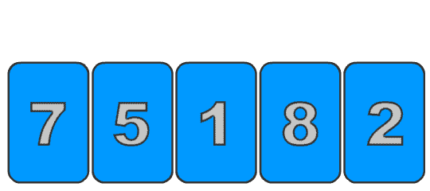

# 算法:JavaScript 中的选择排序

> 原文：<https://betterprogramming.pub/selection-sort-algorithm-in-javascript-f876c3c0af73>

## 如何为选择排序建立循环不变量，并使用测试驱动开发来实现算法


# 练习

最近，我一直在温习[科尔曼的《算法导论》](https://mitpress.mit.edu/books/introduction-algorithms-third-edition)这本书，努力在工作中更好地面试工程候选人。在第 2 章，这是所有关于如何设计和分析算法，这本书提出了以下练习:

> 考虑对数组 A 中存储的 n 个数进行排序，首先找到 A 的最小元素，并与 A[1]中的元素进行交换。然后求 A 的第二小元素，和 A 交换[2]。以这种方式继续 a 的前 n-1 个元素。为这个算法写伪代码，这就是所谓的**选择排序**。这个算法保持什么样的循环不变量？为什么它只需要运行前 n-1 个元素，而不是所有的 n 个元素？给出在ɵ-notation.选择排序的最好和最坏情况下的运行时间

我认为这是一个很好的问题，因为它涵盖了设计算法时的整个思维过程。我们知道它应该如何工作的基本思想(为每个索引寻找并交换最小的元素)，但是我们如何知道我们的实现是正确的呢？我们可以建立什么条件来确保每次迭代都执行正确的操作？最后，算法的效率如何？它的运行时间是多少？

这些都是我们在选择排序中要涉及的问题。实际上，我刚刚发布了一篇非常类似的关于 JavaScript 插入排序的文章，您可以在这里找到:

[](https://medium.com/@jimrottinger/insertion-sort-in-javascript-9c077844717a) [## JavaScript 中的插入排序

### 简要介绍用 JavaScript 编写的插入排序，包括检查循环不变量和分析运行时。

medium.com](https://medium.com/@jimrottinger/insertion-sort-in-javascript-9c077844717a) 

在那篇文章中，我首先介绍了算法实现，然后介绍了正确性和运行时分析。然而，这一次，**我将从建立循环不变量开始，然后用它来通知我的 JavaScript 代码实现。**那样的话，我们将基本上做[测试驱动开发(TDD)](https://en.wikipedia.org/wiki/Test-driven_development) 来实现算法。一旦我们完成了这些，我们将结束对我们实现的运行时分析。

# 选择排序循环不变量

如练习中所述，选择排序的工作方式是迭代输入，找到剩余的最小元素，并将其交换到当前索引中。相当简单！—但这里有一张我做的很好看的 gif，可以帮你形象化:)。



选择排序，动画

那么这个算法的循环不变量是什么呢？提醒一下，**循环不变量**是算法在开始、结束和每次迭代执行时维护的一个或一组条件。在进一步阅读之前，花一两分钟时间思考一下！我们可以检查哪些属性来确保我们的算法正确运行？

现在就一起想出来吧。基于我们对算法工作原理的描述，我们知道最小的剩余元素总是会被首先找到并排序。因此，在一次迭代之后，最小的元素将位于 0 索引处，在两次迭代之后，两个最小的元素将被排序，以此类推。这个属性给了我们一个很好的条件去检查。

> T **对于选择排序的循环不变量是，新排序的数组的元素到当前索引为止，** `**A[0..i]**` **将包含我们最初输入的** `**i**` **最小元素，** `**A[0..n-1]**` **。它们也将按顺序排列。**

如果这个条件在我们的算法执行之前、期间和结束时都成立，那么我们可以确定它正在正确地执行。

这是我们刚刚建立的循环不变量的代码。它需要正在排序的数组、原始输入数组和当前索引。

我们将使用这个函数来帮助我们实现选择排序函数。

**注意** —我稍微作弊了一下，使用 JavaScript 数组上内置的排序函数来寻找原始输入中的`i`最小值。有其他方法可以做到这一点，但我们只是将这个函数作为一个单元测试来使用。

# 实现选择排序

现在我们有了循环不变函数，我们可以采用测试驱动开发(TDD)的方法来实现算法。让我们使用上图中使用的相同输入。

```
const input = [7, 5, 1, 8, 2]
```

然后，我们可以为选择排序创建一个框架函数，并调用我们的循环不变测试函数。

我们只需要迭代到`nums.length — 1`,因为，如果你考虑一下，我们不断地用数组中右边剩余的最小元素交换每个索引处的元素。当我们到达最后一个索引时，它肯定是最大的一个，所以我们不必处理它。

现在，如果我们运行`console.log(selectionSort(input))`，我们会在控制台中得到以下输出:

```
Error! 7 not one of the 1 smallest elements
Error! 7 not one of the 2 smallest elements
Error! New Array is not properly sorted
Error! 5 not one of the 2 smallest elements
Error! 7 not one of the 3 smallest elements
Error! New Array is not properly sorted
Error! New Array is not properly sorted
Error! New Array is not properly sorted
Error! New Array is not properly sorted
Error! 8 not one of the 4 smallest elements
Error! New Array is not properly sorted
Error! New Array is not properly sorted
Error! New Array is not properly sorted
[ 7, 5, 1, 8, 2 ]
```

这实际上是一件好事，因为这是我们 TDD 方法的开始！我们希望实现该算法，直到所有的错误都消失了，并且最终返回的数组是有序的。

循环的内部实际上非常简单。我们获取当前索引处的元素，`i`，然后检查数组的剩余部分是否有比它小的元素。一旦找到了最小的元素，如果它不在当前的索引中，就用最小的元素替换它。

如果您将这段代码放在上面带有循环不变量检查的框架代码中，您会看到我们所有的错误都消失了，它只是输出最终结果！

```
[1 2 5 7 8]
```

除去循环不变量检查，我们的最终算法是:

# 选择排序的运行时分析

我们将用选择排序算法的运行时分析来结束这篇文章。

正如我们在上一节中了解到的，选择排序算法只需要运行到`n-1`元素。考虑到这一点，外环可以表示为从`i=1`到`n-1`的总和。对于我们的内部循环，我们只需迭代数组中尚未排序的部分。换句话说，如果我们已经排序了`i`元素，那么我们只需要执行内部循环的`n-i`次迭代。这给出了我们的求和公式:


选择排序的最佳情况和最坏情况运行时

巧合的是，这与最坏情况插入排序得到的结果完全相同，并且是ɵ(n)。然而，选择排序和插入排序的一个巨大区别是，选择排序在最好和最坏的情况下都有相同的运行时间。不存在可能使内部回路短路的情况。它总是必须遍历整个数组，以检查是否有更小的元素剩余。**这意味着，平均而言，插入排序永远是一种性能更高的算法。**

虽然这意味着使用选择排序是不切实际的，因为有更高性能的算法来做同样的工作，但我仍然发现在与候选人和同事讨论不同的算法方法时，这个练习是有教育意义和有帮助的。