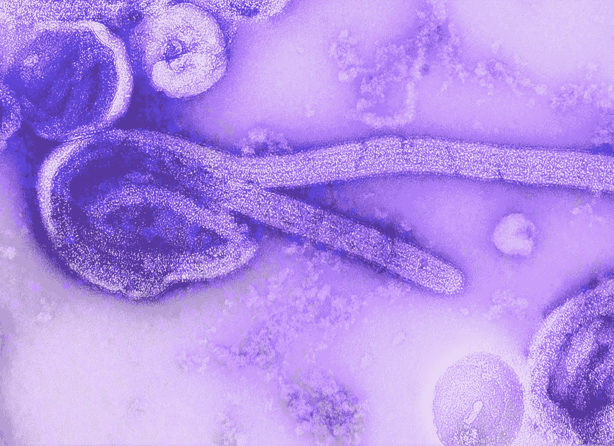

# Rust 中的自我修改恶意软件

> 原文：<https://betterprogramming.pub/self-modify-malware-in-rust-b8b669dc2e93>

## 在本教程中，我们将深入研究 Rust 为我们提供的执行操作的工具，这些操作在 C/C++中是乏味且难以测试的，就像恶意软件可以安全地修改自己一样。



[疾控中心](https://unsplash.com/@cdc?utm_source=medium&utm_medium=referral)在 [Unsplash](https://unsplash.com?utm_source=medium&utm_medium=referral) 拍摄的照片

首先，当恶意软件修改自身时，它所做的只是对其可执行文件进行更改，从而导致哈希签名完全改变。

对可执行文件进行更改很简单。你以书面形式打开文件，选择一个位置并改变字节。复杂的事情在于知道在哪里进行所述的改变，以便它不影响功能。

后者以`corewars`为例，这是一种饥饿游戏竞赛，其中小块代码修改了所有人共享的一部分内存，并且在其中它们相遇使其余部分变得不可用。

# 程序概要

为了避免使可执行文件不可用，我们必须找出哪些区域包含程序不使用的数据:

*   未使用的文本字符串
*   数字变量
*   可执行部分
*   …

在这种情况下，为了简单起见，我们将选择修改程序中名为。“rsrc ”,通常包含程序使用的资源:图标、图像和对话框。

图标是一个只显示的资源，可以在不影响程序本身的情况下轻松编辑。我们只需要确保图标标题保持不变。因此，在这个图标中，我们将存储一个程序已经执行了多少次的计数器。

接下来的步骤是:

1.  将可执行文件复制到一个新的临时文件中。
2.  以读写方式打开新文件。
3.  定位到”。rsrc”部分。
4.  解析该部分并定位图标资源。
5.  从文件开始处获取 256 字节的计数器。
6.  修改计数器。
7.  保存文件。
8.  用新的可执行文件替换原来的可执行文件。

# 该编码了！

首先导入库:

```
[package]
name = "privacy"
version = "0.1.0"
edition = "2021"[dependencies]
memmap2 = "0.5"
object = "0.28"
anyhow = "1.0"[profile.dev]
panic = "abort"[profile.release]
panic = "abort"
rpath = false
split-debuginfo = "off"
strip = true[target.'cfg(windows)'.build-dependencies]
winres = "0.1"
static_vcruntime = "2.0"
```

在可执行文件中添加图标资源的构建脚本:

```
use std::io;
#[cfg(windows)] use winres::WindowsResource;
#[cfg(windows)] use static_vcruntime;fn main() -> io::Result<()> {
    #[cfg(windows)] {
        static_vcruntime::metabuild();
        WindowsResource::new()
            .set_icon("icon.ico")
            .compile()?;
    }
    Ok(())
}
```

和代码本身。首先，让我们编写一个函数，通过名称获取一个部分的位置:

```
fn get_section(file: &File, name: &str) -> Option<(u64, u64)> {
    for section in file.sections() {
        match section.name() {
            Ok(n) if n == name => {
                return section.file_range();
            }
            _ => {}
        }
    }
    None
}
```

一个简单的主要功能:

```
fn main() -> Result<(), Box<dyn Error>> {
    let run_count = run_count()?;
    println!("Previous run count: {}", run_count);
    let exe = env::current_exe()?;
    let tmp = exe.with_extension("tmp");
    fs::copy(&exe, &tmp)?;
    edit_run_count(&tmp, run_count + 1)?;
    let perms = fs::metadata(&exe)?.permissions();
    fs::set_permissions(&tmp, perms)?;
    fs::rename(&tmp, &exe)?;
    Ok(())
}
```

获取计数器的函数:

```
fn run_count() -> Result<u64> {
    let exe = env::current_exe()?;
    let file = OpenOptions::new().read(true).write(true).open(&exe)?;
    let buf = unsafe { MmapOptions::new().map_mut(&file)? };
    let file = File::parse(&*buf)?;

    match get_section(&file, ".rsrc") {
        Some(range) => {
            let section_size = range.1 as usize;
            let section_base = range.0 as usize;
            let base_buff = &buf[section_base..(section_base +section_size)];
            let counter_position = localize_counter_section(&buf,section_size, section_base )?;
            let counter = &base_buff[counter_position..counter_position + 8];
            let counter = u64::from_le_bytes(counter.try_into()?);
            return Ok(counter)
        },
        None => Err(anyhow!("Resource section is missing!"))
    }
}
```

编辑它的人:

```
fn edit_run_count(exe : &PathBuf, counter : u64) -> Result<()> {
    let file = OpenOptions::new().read(true).write(true).open(&exe)?;
    let mut buf = unsafe { MmapOptions::new().map_mut(&file)? };
    let file = File::parse(&*buf)?;

    match get_section(&file, ".rsrc") {
        Some(range) => {
            let section_size = range.1 as usize;
            let section_base = range.0 as usize;
            let counter_position = localize_counter_section(&buf,section_size, section_base )?;
            buf[(section_base + counter_position)..(section_base + counter_position + 8)].copy_from_slice(&(counter).to_ne_bytes());
            return Ok(())
        },
        None => Err(anyhow!("Resource section is missing!"))
    }
}
```

定位计数器的功能需要澄清。

首先，“的格式。rsrc”部分就像一棵有分支和叶子的树，所以我们需要遍历它来找到我们正在寻找的资源。

一旦我们找到它，图标的偏移量位置是一个虚拟内存偏移量，所以它不同于文件在磁盘上的偏移量，这就是为什么我们将所有的资源信息存储在一个列表中，以找到虚拟内存和磁盘上的偏移量之间的差异。

这个差值是这样计算的:

```
first_resource_offset - offset_of_last_entry -16 (size of last entry data) -8 (size of last entry header)
```

这是在这部分代码中完成的:

```
section_contents.sort_by(|a,b|  (a.1).cmp(&b.1));
let file_reposition = section_contents.get(0).unwrap().1 - (max_offset + 16 + 8);
for section in &section_contents {
  if section.3 == 3 { //RT_ICON
    return Ok(section.1 - file_reposition + ICON_COUNTER_POSITION)
  }
}
return Err(anyhow!("Icon is missing!"))
```

”的分析。rsrc”部分不在讨论范围内，因为在本文中解释起来很复杂。

整个项目可在以下位置找到:

[](https://github.com/SecSamDev/self-modifying-malware) [## GitHub-SecSamDev/自我修改-恶意软件:Rust 中的自我修改恶意软件

### Rust 中的自我修改恶意软件。通过在…上创建帐户来促进 SecSamDev/自我修改恶意软件的开发

github.com](https://github.com/SecSamDev/self-modifying-malware) 

感谢阅读。